# 2026年AI行业技术指南：从Token到Agent，普通人也能读懂的AI全貌

**版本**：V1.0
**日期**：2026年4月27日
**定位**：面向普通读者但专业准确的AI行业全景指南

---

## 目录

- [前言 / 执行摘要](#前言--执行摘要)
- [第1章：AI的"原子"——Token到底是什么？](#第1章ai的原子token到底是什么)
  - [1.1 开篇：你每天用ChatGPT，但你真的知道它在"算"什么吗？](#11-开篇你每天用chatgpt但你真的知道它在算什么吗)
  - [1.2 Token不是字数，是算力单位](#12-token不是字数是算力单位)
  - [1.3 BPE分词算法：AI如何"读"文字](#13-bpe分词算法ai如何读文字)
  - [1.4 Token的经济账](#14-token的经济账)
  - [1.5 代码示例：用Python的tiktoken库展示Token化过程](#15-代码示例用python的tiktoken库展示token化过程)
  - [1.6 常见误区纠偏表](#16-常见误区纠偏表)
  - [1.7 Token处理流程图](#17-token处理流程图)
  - [1.8 小结](#18-小结)
- [第2章：AI的"大脑"——大模型是怎么训练出来的？](#第2章ai的大脑大模型是怎么训练出来的)
  - [2.1 开篇：训练一个大模型到底要花多少钱？](#21-开篇训练一个大模型到底要花多少钱)
  - [2.2 预训练（Pre-training）：读遍互联网的"通识教育"](#22-预训练pre-training读遍互联网的通识教育)
  - [2.3 监督微调（SFT）：从通才到专家的"岗前培训"](#23-监督微调sft从通才到专家的岗前培训)
  - [2.4 RLHF：人类反馈强化学习——"价值观塑造"](#24-rlhf人类反馈强化学习价值观塑造)
  - [2.5 知识蒸馏：大模型"教"小模型](#25-知识蒸馏大模型教小模型)
  - [2.6 INT8量化：让大模型跑在手机上](#26-int8量化让大模型跑在手机上)
  - [2.7 垂直领域大模型四层架构](#27-垂直领域大模型四层架构)
  - [2.8 代码示例：PyTorch BERT训练最小示例](#28-代码示例pytorch-bert训练最小示例)
  - [2.9 训练三阶段流程图](#29-训练三阶段流程图)
  - [2.10 小结](#210-小结)
- [第3章：AI的"语言"——Prompt与上下文](#第3章ai的语言prompt与上下文)
  - [3.1 Prompt不是聊天，是"编程指令"——关键纠偏](#31-prompt不是聊天是编程指令关键纠偏)
  - [3.2 Prompt Engineering的核心技巧](#32-prompt-engineering的核心技巧)
  - [3.3 上下文窗口：AI的"短期记忆"容量](#33-上下文窗口ai的短期记忆容量)
  - [3.4 上下文管理策略：当记忆不够用时怎么办？](#34-上下文管理策略当记忆不够用时怎么办)
  - [3.5 完整的API调用示例](#35-完整的api调用示例)
  - [3.6 Prompt处理全流程](#36-prompt处理全流程)
- [第4章：AI的"手脚"——从Tools到MCP协议](#第4章ai的手脚从tools到mcp协议)
  - [4.1 Tools：AI的"原生手"](#41-toolsai的原生手)
  - [4.2 MCP协议：AI界的"USB接口"](#42-mcp协议ai界的usb接口)
  - [4.3 Skills：Tools的"标准化封装"](#43-skillstools的标准化封装)
  - [4.4 一个最简单的MCP Server示例](#44-一个最简单的mcp-server示例)
  - [4.5 Tools → MCP → Skills：完整关系图](#45-tools--mcp--skills完整关系图)
- [第5章：AI的"执行者"——Agent智能体](#第5章ai的执行者agent智能体)
  - [5.1 开篇：90%的人都搞错了Agent是什么](#51-开篇90的人都搞错了agent是什么)
  - [5.2 Agent ≠ 大模型：最关键的纠偏](#52-agent--大模型最关键的纠偏)
  - [5.3 Agent的核心能力](#53-agent的核心能力)
  - [5.4 全链路执行流程：11步闭环](#54-全链路执行流程11步闭环)
  - [5.5 Agent vs 传统软件：本质区别](#55-agent-vs-传统软件本质区别)
  - [5.6 市面上的Agent产品格局](#56-市面上的agent产品格局)
  - [5.7 小结](#57-小结)
- [第6章：AI的"缰绳"——Harness调度管控](#第6章ai的缰绳harness调度管控)
  - [6.1 开篇：当AI可以自主执行，谁来拉住缰绳？](#61-开篇当ai可以自主执行谁来拉住缰绳)
  - [6.2 Harness ≠ Agent：最关键的纠偏](#62-harness--agent最关键的纠偏)
  - [6.3 Harness的核心功能](#63-harness的核心功能)
  - [6.4 OpenClaw vs Hermes：两大Harness平台对比](#64-openclaw-vs-hermes两大harness平台对比)
  - [6.5 企业级部署建议](#65-企业级部署建议)
  - [6.6 Harness六层治理架构](#66-harness六层治理架构)
  - [6.7 小结](#67-小结)
- [第7章：AI的"记忆"——从遗忘到长期记忆](#第7章ai的记忆从遗忘到长期记忆)
  - [7.1 开篇：你有没有发现，ChatGPT聊着聊着就"忘了"前面说过的话？](#71-开篇你有没有发现chatgpt聊着聊着就忘了前面说过的话)
  - [7.2 AI为什么"记不住"？](#72-ai为什么记不住)
  - [7.3 RAG：给AI装一个"外挂知识库"](#73-rag给ai装一个外挂知识库)
  - [7.4 Agent记忆四层架构：类比人类记忆](#74-agent记忆四层架构类比人类记忆)
  - [7.5 MemPalace：AI的"记忆宫殿"](#75-mempalaceai的记忆宫殿)
  - [7.6 LLM Wiki v2：知识生命周期管理](#76-llm-wiki-v2知识生命周期管理)
  - [7.7 字节跳动RAG实践案例](#77-字节跳动rag实践案例)
  - [7.8 代码示例：一个简单的RAG检索流程](#78-代码示例一个简单的rag检索流程)
  - [7.9 本章小结](#79-本章小结)
- [第8章：AI的"团队"——多智能体协作](#第8章ai的团队多智能体协作)
  - [8.1 开篇：一个人能干的事有限，一群AI协作能干到什么程度？](#81-开篇一个人能干的事有限一群ai协作能干到什么程度)
  - [8.2 单Agent的局限](#82-单agent的局限)
  - [8.3 多智能体三层协作架构](#83-多智能体三层协作架构)
  - [8.4 典型协作流程](#84-典型协作流程)
  - [8.5 字节跳动数据中心运维案例](#85-字节跳动数据中心运维案例)
  - [8.6 微软Copilot Researcher案例](#86-微软copilot-researcher案例)
  - [8.7 多Agent的挑战](#87-多agent的挑战)
  - [8.8 代码示例：一个简单的多Agent协作框架](#88-代码示例一个简单的多agent协作框架)
  - [8.9 本章小结](#89-本章小结)
- [第9章：AI的"现实"——行业落地全景](#第9章ai的现实行业落地全景)
  - [9.1 制造业：从"质检员"到"智能生产管家"](#91-制造业从质检员到智能生产管家)
  - [9.2 医疗：从"辅助诊断"到"个性化治疗"](#92-医疗从辅助诊断到个性化治疗)
  - [9.3 金融：从"风控"到"智能投顾"](#93-金融从风控到智能投顾)
  - [9.4 农业：从"靠天吃饭"到"精准种植"](#94-农业从靠天吃饭到精准种植)
  - [9.5 内容创作：Vibe Coding与智能写作](#95-内容创作vibe-coding与智能写作)
  - [9.6 城市治理：从"经验管理"到"数据驱动"](#96-城市治理从经验管理到数据驱动)
  - [9.7 九层架构在各行业的映射](#97-九层架构在各行业的映射)
  - [9.8 五大行业应用效果对比](#98-五大行业应用效果对比)
  - [9.9 本章小结](#99-本章小结)
- [第10章：AI的"未来"——趋势与挑战](#第10章ai的未来趋势与挑战)
  - [10.1 具身智能：让AI"拥有"身体](#101-具身智能让ai拥有身体)
  - [10.2 AI幻觉治理：让AI"不说谎"](#102-ai幻觉治理让ai不说谎)
  - [10.3 神经符号系统：连接"深度学习"与"符号推理"](#103-神经符号系统连接深度学习与符号推理)
  - [10.4 AI Harness的进化](#104-ai-harness的进化)
  - [10.5 机遇与挑战：天平的两端](#105-机遇与挑战天平的两端)
  - [10.6 Gartner预测：AI Agent的爆发](#106-gartner预测ai-agent的爆发)
  - [10.7 前瞻总结：从"兴奋期"到"基础设施期"](#107-前瞻总结从兴奋期到基础设施期)
- [附录A：核心概念速查表](#附录a核心概念速查表)
- [附录B：常见误区纠正](#附录b常见误区纠正)
- [参考文献](#参考文献)

---

## 前言 / 执行摘要

2026年，AI已经成为我们生活中无处不在的基础设施。然而，一个令人不安的事实是：绝大多数人——包括许多科技从业者在内——对AI的理解仍然停留在"会聊天的机器人"这个层面。当人们讨论"大模型""Agent""RAG""MCP"这些术语时，往往是在用模糊的直觉替代精确的认知。概念混杂、定义模糊、层级不清，已经成为阻碍普通人理解AI行业的最大障碍。

本指南的诞生，正是为了解决这一痛点。

我们提出了一套**九层架构框架**来系统性地理解AI技术栈：从最底层的**Token**（AI世界的"原子"，最小运算颗粒），到**LLM**（大语言模型，AI的"大脑"），到**Prompt**（提示词，AI的"语言"），到**Context**（上下文，AI的"记忆"），到**Tools**（工具，AI的"手脚"），到**MCP**（模型上下文协议，AI界的"USB接口"），到**Skills**（技能，Tools的标准化封装），到**Agent**（智能体，AI的"执行者"），再到**Harness**（调度管控，AI的"缰绳"）。这九个层级从底层到顶层、从原子到系统，构成了一个完整的AI技术认知体系。

本指南共分为10个章节。第1-2章从Token和模型训练讲起，帮你建立对AI底层运作机制的直觉理解；第3-4章深入Prompt工程和工具协议，揭示AI从"能说"到"能做"的技术进化路径；第5-6章聚焦Agent和Harness，这是2026年AI行业最核心的两大概念；第7-8章探讨AI记忆系统和多智能体协作，展示AI从"个体"到"团队"的跃迁；第9-10章则将视角拉升至行业落地和未来趋势，用真实案例和数据描绘AI的全景图。

**谁应该读这本指南？** 如果你是一位普通读者，希望"搞懂AI到底在干什么"，本指南用通俗的比喻和清晰的逻辑帮你建立完整的认知框架；如果你是一位科技爱好者，本指南提供了大量一手数据和代码示例，满足你的技术好奇心；如果你是一位行业专业人士，本指南的九层架构框架和行业案例可以作为你向团队和客户解释AI的标准化语言。

从Token到Agent，从基础原理到前沿趋势，让我们开始这段AI认知之旅。

---

## 第1章：AI的"原子"——Token到底是什么？

### 1.1 开篇：你每天用ChatGPT，但你真的知道它在"算"什么吗？

想象一下，你走进一家自助餐厅。你不会直接把整盘菜塞进嘴里——你会一口一口地吃。AI处理语言的方式也类似：它不会一口吞下整篇文章，而是把文字切成一口大小的"碎片"，逐块消化。这些碎片，就是**Token**。

2026年，全球大模型日均处理Token量已超过30万亿（豆包大模型公开数据）。每当你向ChatGPT提问、让DeepSeek写代码、用Claude分析文档，背后运转的核心计量单位都是Token。它是AI世界的"原子"——最小的、不可再分的运算单元。

但如果你问大多数人"Token是什么"，最常见的回答是"就是字数吧"。这个回答，错得离谱。

### 1.2 Token不是字数，是算力单位

> **白皮书定义**：Token是大模型基于Transformer架构进行神经网络前向推理与反向计算时的最小离散运算颗粒。

让我们用一个更直观的比喻来理解。

**比喻：Token就像超市的计价单位**

你去超市买东西，结账时不是按"件"收费，而是按"克"称重。同样，AI不是按"字"或"词"来计算成本，而是按"Token"来计量。一个汉字可能等于1个Token，也可能等于2个Token；一个英文单词可能等于1个Token，也可能被拆成3个Token。就像不同商品的重量不同，不同文字的Token消耗也不同。

**关键区别：字数 ≠ Token数**

| 文本 | 字符数 | Token数（GPT-4 cl100k_base） | 比率 |
|------|--------|-------------------------------|------|
| "你好世界" | 4个字符 | 约3-4个Token | ~1:1 |
| "Hello World" | 11个字符 | 约2个Token | ~5.5:1 |
| "Artificial Intelligence" | 23个字符 | 约3个Token | ~7.7:1 |
| "🤖🔥" | 2个字符 | 约6个Token | 1:3 |

> **经验法则**：中文1-2个汉字约等于1个Token；英文4-5个字符约等于1个Token；Emoji和特殊符号消耗Token最多，单个Emoji可能需要3-6个Token。

这意味着什么？一段1000字的中文文章大约消耗500-1000个Token，而同样语义的英文可能只需要300-500个Token。**中文用户的Token消耗量天然更高**——这也是为什么国产大模型在中文分词优化上投入巨大。

### 1.3 BPE分词算法：AI如何"读"文字

AI并不像人类一样"认字"。在Transformer架构中，所有文本在进入模型之前，都必须先经过一个"翻译"步骤：把人类可读的文字，转换成模型可处理的数字序列。这个过程叫做**分词（Tokenization）**。

目前主流的分词算法是**BPE（Byte Pair Encoding，字节对编码）**及其变体（WordPiece、SentencePiece）。

**比喻：BPE就像学习缩写**

想象你在做笔记。一开始你逐字母记录："A-R-T-I-F-I-C-I-A-L"。但写着写着，你发现"ARTI"这个词反复出现，于是你发明了一个缩写符号"★"来代替它。下次再看到"ARTI"，直接写"★"就行。BPE算法做的就是这件事——它统计训练语料中所有字节对的频率，把最高频的字节对合并成一个新的Token，反复迭代，直到词表达到预设大小（通常是32000到128000个Token）。

**分词示例："AI正在改变我们的生活方式"**

使用类似WordPiece的分词器，这句话的分词过程大致如下：

```
原始文本：AI正在改变我们的生活方式

Step 1 - 字符级别拆分：
A | I | 正 | 在 | 改 | 变 | 我 | 们 | 的 | 生 | 活 | 方 | 式

Step 2 - 高频字节对合并（基于训练语料统计）：
"AI" → 单个Token（英文常见词，合并）
"正在" → 单个Token（中文高频双字词，合并）
"改变" → 单个Token（中文高频双字词，合并）
"我们" → 单个Token（中文高频双字词，合并）
"的" → 单个Token（中文最高频单字，保留）
"生活" → 单个Token（中文高频双字词，合并）
"方式" → 单个Token（中文高频双字词，合并）

最终Token序列：
[AI] [正在] [改变] [我们] [的] [生活] [方式]
→ 共7个Token
```

对比一下英文的例子：

```
原始文本：AI is changing our way of life

Token序列：
[AI] [ is] [ changing] [ our] [ way] [ of] [ life]
→ 共7个Token
```

可以看到，中英文在语义相同的情况下，Token消耗量大致相当。但如果是更专业的中文术语（如"量子纠缠态"），由于训练语料中出现频率低，可能被拆分为更多Token。

### 1.4 Token的经济账

Token不仅是技术概念，更是真金白银。2026年的大模型API市场，Token就是"货币"。

**DeepSeek V4 定价（2026年4月最新）**：

| 模型 | 输入价格（缓存命中） | 输入价格（缓存未命中） | 输出价格 |
|------|---------------------|----------------------|---------|
| V4-Flash | 0.02元/百万Token | 2元/百万Token | 8元/百万Token |
| V4-Pro | 0.025元/百万Token | 3元/百万Token（限时） | 6元/百万Token（限时） |

> **注意**：以上为2026年4月底DeepSeek降价后的价格。V4-Pro原价为输入12元/百万Token、输出24元/百万Token，降价幅度达75%。

**为什么输出比输入贵这么多？**

这是一个非常关键的问题。以DeepSeek V4-Pro原价为例，输出价格（24元/百万Token）是输入价格（12元/百万Token）的**2倍**；而在GPT-4o等模型上，这个差距更大，输出价格通常是输入价格的**3-6倍**。

**比喻：输入是"阅读理解"，输出是"写作文"**

- **输入Token（Prompt）**：模型只需要"读一遍"你的问题，做一次前向传播（Forward Pass），就像学生读一道题。
- **输出Token（Completion）**：模型需要逐字"生成"回答，每生成一个Token都要做一次完整的前向传播，就像学生逐字写作文。生成1000个Token，就要做1000次前向传播。

更深层的原因在于**自回归生成的本质**：模型生成第N个Token时，必须先看到前N-1个Token的输出。这是一个串行过程，无法像输入处理那样批量并行计算。因此，输出计算量远大于输入。

**实际成本计算示例**：

假设你开发了一个AI客服机器人，每天处理1000次对话：
- 每次对话平均输入500 Token（用户问题+系统提示词）
- 每次对话平均输出800 Token（AI回答）
- 使用DeepSeek V4-Flash

```
每日输入Token：1000 × 500 = 50万Token = 0.5百万Token
每日输出Token：1000 × 800 = 80万Token = 0.8百万Token

每日成本（缓存未命中）：
  输入：0.5 × 2元 = 1元
  输出：0.8 × 8元 = 6.4元
  合计：7.4元/天

每月成本：7.4 × 30 = 222元/月
```

如果启用缓存优化（重复的系统提示词命中缓存），成本还可以进一步降低80%以上。

### 1.5 代码示例：用Python的tiktoken库展示Token化过程

下面这段代码可以让你亲眼看到Token是如何被切分的：

```python
"""
Token化演示：使用tiktoken库查看文本如何被切分为Token
安装依赖：pip install tiktoken
"""
import tiktoken

# 使用GPT-4的分词器（cl100k_base）
enc = tiktoken.get_encoding("cl100k_base")

# 测试文本
texts = [
    "AI正在改变我们的生活方式",
    "Artificial Intelligence is changing our way of life",
    "大语言模型（LLM）是2026年最重要的技术趋势之一",
    "Hello 🌍 World 🤖"
]

for text in texts:
    # 编码为Token ID序列
    token_ids = enc.encode(text)
    # 解码每个Token，查看具体切分结果
    tokens = [enc.decode([t]) for t in token_ids]

    print(f"原文：{text}")
    print(f"字符数：{len(text)}")
    print(f"Token数：{len(token_ids)}")
    print(f"Token序列：{tokens}")
    print(f"Token IDs：{token_ids}")
    print("-" * 60)

# 计算Token消耗成本（以DeepSeek V4-Flash为例）
def estimate_cost(text: str, model: str = "v4-flash") -> dict:
    """估算单次API调用的Token成本"""
    token_count = len(enc.encode(text))
    # 假设输出长度为输入的1.5倍
    output_tokens = int(token_count * 1.5)

    if model == "v4-flash":
        input_price = 2.0   # 元/百万Token（缓存未命中）
        output_price = 8.0  # 元/百万Token
    elif model == "v4-pro":
        input_price = 3.0   # 元/百万Token（限时价）
        output_price = 6.0  # 元/百万Token（限时价）

    input_cost = (token_count / 1_000_000) * input_price
    output_cost = (output_tokens / 1_000_000) * output_price

    return {
        "input_tokens": token_count,
        "estimated_output_tokens": output_tokens,
        "input_cost_yuan": input_cost,
        "output_cost_yuan": output_cost,
        "total_cost_yuan": input_cost + output_cost
    }

# 示例：估算处理一篇5000字文章的成本
article = "这是一篇约5000字的长文章..." * 500  # 模拟长文本
cost = estimate_cost(article)
print(f"\n成本估算（5000字文章）：")
print(f"  输入Token：{cost['input_tokens']:,}")
print(f"  预计输出Token：{cost['estimated_output_tokens']:,}")
print(f"  输入成本：¥{cost['input_cost_yuan']:.4f}")
print(f"  输出成本：¥{cost['output_cost_yuan']:.4f}")
print(f"  总成本：¥{cost['total_cost_yuan']:.4f}")
```

运行这段代码，你会直观地看到：中文文本的Token数量远超同等语义的英文文本，而Emoji字符的Token消耗更是惊人。

### 1.6 常见误区纠偏表

| 误区 | 真相 |
|------|------|
| "Token就是字数" | Token是AI模型的最小运算颗粒，与字数没有固定换算关系。中文1-2字≈1 Token，英文4-5字符≈1 Token |
| "中英文Token消耗差不多" | 中文Token消耗通常是英文的1.5-2倍。一个中文句子可能需要更多Token来表达同等语义 |
| "Token越少越好" | Token数量影响语义完整性。过度压缩Token可能导致信息丢失，影响模型理解精度 |
| "所有模型的Token计算方式一样" | 不同模型使用不同的分词器（BPE、WordPiece、SentencePiece），同一文本在不同模型下的Token数可能差异30%以上 |
| "输出Token和输入Token价格一样" | 输出Token通常比输入Token贵2-6倍，因为自回归生成需要串行计算 |
| "Emoji不费Token" | 单个Emoji可能消耗3-6个Token，是普通中文字符的3-6倍 |
| "Token只是计费单位，不影响性能" | Token数量直接影响模型的上下文窗口利用率、推理速度和内存占用 |
| "缓存命中只是营销噱头" | 缓存命中可降低80%-92%的输入成本，对于有固定系统提示词的应用至关重要 |

### 1.7 Token处理流程图

下面这张图展示了从用户输入文本到模型处理Token的完整流程：

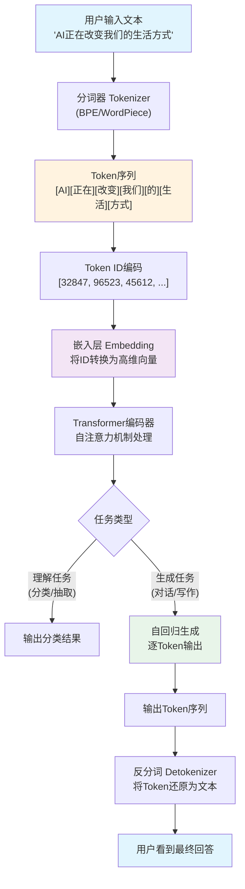

### 1.8 小结

Token是AI世界的"原子"——它不仅是计费单位，更是理解大模型运作机制的关键入口。掌握Token的概念，意味着你能：

1. **精确估算成本**：知道每行代码、每段对话的真实花费
2. **优化应用性能**：通过控制Token数量提升响应速度
3. **选择合适的模型**：根据Token性价比选择最适合的模型
4. **理解技术本质**：从"使用者"升级为"理解者"

在接下来的章节中，我们将深入AI的"大脑"，看看这些Token是如何被训练出来的。

---

## 第2章：AI的"大脑"——大模型是怎么训练出来的？

### 2.1 开篇：训练一个大模型到底要花多少钱？

想象你要培养一个"万事通"——这个人要读过人类所有的书籍、网页、论文，能写诗、能编程、能翻译、能做数学题。培养这样一个人需要多少成本？在AI世界，答案是：**至少1亿美元**。

根据斯坦福大学2025年AI指数报告和Epoch AI的数据，GPT-4的训练成本超过1亿美元（Sam Altman本人确认），Google Gemini Ultra约为1.91亿美元，Meta Llama 3.1 405B约为1.7亿美元。而到了2026年，下一代前沿模型的训练成本预计将突破**10亿美元**，甚至有行业估算已经到了30亿美元的量级。

**比喻：训练大模型就像建一座超级图书馆**

训练一个大模型不是"写一个程序"那么简单，它更像是在建一座图书馆——只不过这座图书馆的"藏书"是整个互联网的文本数据，"图书管理员"是一个由数千块GPU组成的超级计算集群，而"编目规则"是一套复杂的数学优化算法。

整个过程分为三个核心阶段：**预训练（Pre-training）**、**监督微调（SFT）**、**人类反馈强化学习（RLHF）**。让我们逐一拆解。

### 2.2 预训练（Pre-training）：读遍互联网的"通识教育"

预训练是大模型训练中**最耗时、最昂贵**的阶段，通常占总训练成本的90%以上。

**比喻：预训练就像让一个婴儿读遍全世界所有的书**

想象一个婴儿从出生起就不停地阅读——网页、书籍、论文、代码、新闻、社交媒体帖子……它不理解这些文字的含义，但它发现了一个规律：在"今天天气很"后面，最可能出现的字是"好"。这就是预训练的核心原理——**自监督学习**，也叫**下一个词预测（Next Token Prediction）**。

**技术原理：下一个词预测**

模型接收一段文本，尝试预测下一个词。例如：

```
输入：人工智能正在___
候选词及概率：
  "改变" → 35%
  "发展" → 25%
  "影响" → 15%
  "革命" → 10%
  其他   → 15%
```

模型通过数十亿次的预测练习，逐渐"学会"了语言的规律、世界的知识和逻辑的推理。这就像一个学生通过做大量的"填空题"来学习——虽然从来没有人告诉他答案，但通过海量的练习，他自己总结出了规律。

**数据规模：天文数字**

| 模型 | 训练数据量 | 训练Token数 | 训练时间 | 估算成本 |
|------|-----------|------------|---------|---------|
| GPT-4 | 约13万亿Token | ~13T | 90-100天 | ~$100M+ |
| 豆包大模型 | ~500TB | ~9T | 数周到数月 | 未公开 |
| Llama 3.1 405B | 15万亿Token | ~15T | 数月 | ~$170M |
| Gemini Ultra | 未公开 | 未公开 | 数月 | ~$191M |

> 豆包大模型的预训练数据量约为500TB，涵盖全网文本、书籍、百科、新闻、代码库、学术论文以及多模态数据（图片/视频/音频）。这些数据需要经过严格的清洗流程：去重、去广告、去低质内容、去敏感信息、去错误数据。

**算力消耗：烧钱的速度**

GPT-4的训练使用了约25000块A100 GPU，持续运行90-100天，总算力消耗约为2.15×10²⁵ FLOPS（浮点运算次数）。即使按A100的云服务价格计算，仅GPU租赁成本就超过6000万美元。再加上电力、存储、网络、人力等开销，总成本轻松突破1亿美元。

**比喻：如果1美元等于1秒钟，1亿美元等于多少？**

答案是约**3.17年**。也就是说，GPT-4的训练成本相当于一个人不吃不喝不睡连续工作三年多的时间价值。

### 2.3 监督微调（SFT）：从通才到专家的"岗前培训"

预训练完成后的模型是一个"通才"——它知道很多，但不知道怎么"好好说话"。它可能会输出不完整的句子、不相关的回答，甚至有害的内容。这时候就需要**监督微调（Supervised Fine-Tuning，SFT）**。

**比喻：SFT就像大学毕业后的"岗前培训"**

一个大学毕业生（预训练模型）拥有丰富的知识，但他不知道如何在职场中得体地沟通。岗前培训（SFT）教他如何写正式邮件、如何回答客户问题、如何在会议上发言。培训的核心是**示范+模仿**——导师（人类标注员）给出标准答案，学员（模型）学习模仿。

**什么叫"对齐"？**

对齐（Alignment）是SFT的核心目标。它指的是让模型的行为与人类的期望、价值观和需求保持一致。没有对齐的模型就像一个知识渊博但不懂社交的人——他知道答案，但不知道该怎么表达。

**微调数据从哪来？**

SFT数据主要来自三个渠道：

1. **人工标注**：专业标注员撰写高质量的问答对。例如，给模型一个问题"解释量子计算"，标注员会写出一个结构清晰、语言流畅的标准答案。OpenAI reportedly雇佣了数千名标注员，每人每天撰写数百条高质量的问答对。

2. **合成数据**：用更强的模型（如GPT-4）生成训练数据，再用人工筛选和修正。这种方法可以大幅降低标注成本，同时保证数据质量。2026年，合成数据已成为SFT数据的主要来源，占比超过60%。

3. **真实用户反馈**：从实际使用中收集高质量的对话数据（需用户授权），经过脱敏处理后用于微调。

**SFT的规模远小于预训练**：通常只需要数万到数十万条高质量的问答对，训练时间从数小时到数天不等，成本约为预训练的1%-5%。

### 2.4 RLHF：人类反馈强化学习——"价值观塑造"

SFT让模型学会了"好好说话"，但RLHF让模型学会了"说正确的话"。

**比喻：RLHF就像给AI装上"道德指南针"**

如果说SFT是教AI"怎么说"，那RLHF就是教AI"什么该说、什么不该说"。就像一个孩子学会了说话之后，父母还会教他礼貌、诚实、善良——这些价值观的塑造，就是RLHF在做的事。

**PPO算法简介（通俗版）**

RLHF的核心算法是**PPO（Proximal Policy Optimization，近端策略优化）**。让我们用一个通俗的比喻来理解：

想象你在训练一只狗：
1. **策略模型（Policy Model）**：就是那只狗，它需要学会什么行为会得到奖励
2. **奖励模型（Reward Model）**：就像训练师，它根据狗的表现打分
3. **PPO**：一种训练策略，确保狗不会"走极端"——既不会为了得到奖励而过度表演，也不会因为害怕惩罚而什么都不做

具体到AI训练中：

```
Step 1: 训练奖励模型
  - 人类标注员对模型的多个回答进行排序
  - 用这些排序数据训练一个"打分器"（奖励模型）
  - 奖励模型学会了"什么样的回答是好的"

Step 2: 用PPO优化策略模型
  - 策略模型（即我们要训练的大模型）生成多个回答
  - 奖励模型对每个回答打分
  - PPO算法根据分数调整策略模型的参数
  - 关键约束：每次调整的幅度不能太大（"近端"的含义）
```

**奖励模型：谁来给AI"打分"？**

奖励模型的训练数据来自人类偏好标注。具体流程是：

1. 给模型同一个问题，让它生成4-8个不同的回答
2. 人类标注员按照质量对这些回答进行排序（不是打分，是排序）
3. 用这些排序数据训练奖励模型，让它学会预测"人类更偏好哪个回答"

> **数据说话**：训练一个高质量的奖励模型通常需要约5万-10万条人类偏好排序数据。每条数据的标注成本约为0.5-2美元（取决于复杂度），仅奖励模型的数据标注成本就可能达到5万-20万美元。

### 2.5 知识蒸馏：大模型"教"小模型

不是所有场景都需要一个"超级大脑"。在手机端、嵌入式设备、实时翻译等场景中，我们需要一个"小而精"的模型。这时候就轮到**知识蒸馏（Knowledge Distillation）**出场了。

**比喻：知识蒸馏就像"名师出高徒"**

想象一位诺贝尔奖得主（教师模型）教一个高中生（学生模型）。教师不需要把所有的知识都教给学生，而是教学生"思考的方式"——教师模型输出的不是简单的"正确答案"，而是一个"概率分布"（软标签），告诉学生"这个答案有70%的概率正确，那个答案有20%的概率正确"。学生通过学习这些概率分布，能比单纯学习正确答案获得更深刻的理解。

**DistilBERT：经典的蒸馏案例**

DistilBERT是知识蒸馏的标杆案例。它以BERT-base为教师模型，通过知识蒸馏训练了一个更小的学生模型：

| 指标 | BERT-base（教师） | DistilBERT（学生） | 变化 |
|------|-------------------|-------------------|------|
| 参数量 | 1.1亿 | 6600万 | **减少40%** |
| 语言理解能力 | 基准 | 保留95%以上 | 仅损失不到5% |
| 推理速度 | 基准 | 提升60% | **快60%** |
| 训练成本 | 基准 | 降低数百倍 | 极大降低 |

这意味着什么？在实际应用中，DistilBERT可以在保持几乎相同性能的前提下，将部署成本降低一半以上，推理延迟降低60%。对于需要处理海量文本的生产环境来说，这是巨大的成本节约。

### 2.6 INT8量化：让大模型跑在手机上

即使经过知识蒸馏，一个6600万参数的模型在手机上运行仍然有挑战。**INT8量化**是解决这个问题的关键技术。

**比喻：量化就像"照片压缩"**

一张高分辨率的照片可能有5000万像素，但如果你只需要在手机屏幕上看，500万像素就足够了。量化做的事情类似——它把模型参数从高精度（32位浮点数，FP32）压缩到低精度（8位整数，INT8），在几乎不损失精度的前提下，将模型体积压缩为原来的1/4。

**为什么是INT8？**

| 精度格式 | 每个参数占用的位数 | 模型体积（7B参数） | 精度损失 |
|---------|-------------------|-------------------|---------|
| FP32 | 32位 | ~28GB | 无 |
| FP16 | 16位 | ~14GB | 极小 |
| INT8 | 8位 | ~7GB | 小（<1%） |
| INT4 | 4位 | ~3.5GB | 可接受（1-3%） |

**端侧部署的实际效果**：

通过INT8量化配合其他优化技术（如KV-Cache优化、投机解码），2026年已有多个7B参数模型成功部署在手机端：

- **INT8量化**：从14GB（FP16）降至约8-10GB（INT8），精度损失极小（<1%）
- **INT4量化**：从14GB（FP16）降至约4-6GB（INT4），精度损失可接受（1-3%），可在手机端运行
- **推理时延**：端侧部署时延降低约70%（相比未优化的FP16版本）
- **推理速度**：在骁龙8 Gen3等旗舰芯片上可达18 tokens/s

> **实际案例**：高通在2026年4月发布了基于Matrix Extensions（QMX）的移动端LLM加速方案，使得Llama系列模型在手机CPU上的推理速度提升了3-5倍，配合INT8量化，首次在主流Android手机上实现了流畅的端侧对话体验。

### 2.7 垂直领域大模型四层架构

通用大模型虽然能力强大，但在特定领域（医疗、法律、金融等）往往不够专业。垂直领域大模型的构建通常遵循**四层架构**：

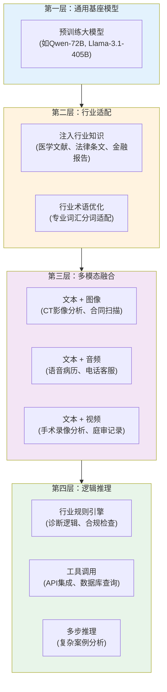

**第一层：通用基座模型**——选择一个强大的通用大模型作为起点，它提供了通用的语言理解和生成能力。

**第二层：行业适配**——通过继续预训练（CPT）注入行业知识。例如，医疗大模型会在大量医学文献、临床指南、病例报告上进行继续预训练，让模型"学会"医学术语和医学知识。

**第三层：多模态融合**——将文本能力与图像、音频、视频能力结合。例如，一个医疗大模型不仅需要理解文本病历，还需要能分析CT影像、解读心电图。

**第四层：逻辑推理**——加入行业特定的推理规则和工具调用能力。例如，法律大模型需要能够引用具体法条、进行合规性检查、生成法律文书。

> **数据说话**：2026年，垂直领域大模型的市场规模预计突破200亿元，其中医疗、金融、法律三大领域占比超过60%。一个训练有素的医疗大模型在执业医师资格考试中的准确率已达到85%以上（人类考生平均通过率约70%）。

### 2.8 代码示例：PyTorch BERT训练最小示例

下面是一个极简的BERT风格模型训练示例，帮助你理解预训练的核心流程：

```python
"""
最小化BERT预训练示例（教学用途）
展示"下一个词预测"的核心逻辑
依赖：pip install torch transformers
"""
import torch
import torch.nn as nn
from transformers import BertTokenizer, BertModel

# ============================================
# Step 1: 加载预训练的分词器和模型
# ============================================
tokenizer = BertTokenizer.from_pretrained("bert-base-chinese")
bert = BertModel.from_pretrained("bert-base-chinese")

# ============================================
# Step 2: 构建一个简单的"下一个词预测"头
# ============================================
class NextTokenPredictor(nn.Module):
    """在BERT的基础上加一个线性分类头"""
    def __init__(self, bert_model, vocab_size):
        super().__init__()
        self.bert = bert_model
        # 将BERT的隐藏状态映射到词表大小
        self.classifier = nn.Linear(bert_model.config.hidden_size, vocab_size)

    def forward(self, input_ids, attention_mask):
        # BERT编码
        outputs = self.bert(
            input_ids=input_ids,
            attention_mask=attention_mask
        )
        # 取每个位置的隐藏状态
        hidden_states = outputs.last_hidden_state  # [batch, seq_len, hidden]
        # 预测每个位置的下一个词
        logits = self.classifier(hidden_states)     # [batch, seq_len, vocab]
        return logits

# ============================================
# Step 3: 准备训练数据
# ============================================
model = NextTokenPredictor(bert, tokenizer.vocab_size)

# 模拟训练数据：几段中文文本
texts = [
    "人工智能是计算机科学的一个分支",
    "深度学习是机器学习的一种方法",
    "自然语言处理让计算机理解人类语言",
]

# 分词并编码
inputs = tokenizer(
    texts,
    padding=True,
    truncation=True,
    max_length=32,
    return_tensors="pt"
)

# 构造训练目标：输入向右移一位就是标签
# 例如：输入"人工 智能 是"，标签"智能 是 计算"
input_ids = inputs["input_ids"]
labels = input_ids.clone()
labels[:, :-1] = input_ids[:, 1:]   # 标签 = 输入右移一位
labels[:, -1] = -100                 # 最后一个位置没有标签（忽略）

# ============================================
# Step 4: 训练循环（简化版）
# ============================================
optimizer = torch.optim.AdamW(model.parameters(), lr=2e-5)
criterion = nn.CrossEntropyLoss(ignore_index=-100)

model.train()
for epoch in range(3):  # 实际训练需要数万步
    optimizer.zero_grad()

    # 前向传播
    logits = model(
        input_ids=inputs["input_ids"],
        attention_mask=inputs["attention_mask"]
    )

    # 计算损失：预测的logits vs 真实的下一个词
    loss = criterion(
        logits.view(-1, tokenizer.vocab_size),
        labels.view(-1)
    )

    # 反向传播
    loss.backward()
    optimizer.step()

    print(f"Epoch {epoch + 1}, Loss: {loss.item():.4f}")

# ============================================
# Step 5: 测试生成效果
# ============================================
model.eval()
test_text = "人工智能是"
test_input = tokenizer(test_text, return_tensors="pt")

with torch.no_grad():
    logits = model(test_input["input_ids"], test_input["attention_mask"])
    # 取最后一个位置的预测
    last_logits = logits[0, -1, :]
    # 取概率最高的5个候选词
    top5_probs, top5_ids = torch.topk(
        torch.softmax(last_logits, dim=-1), 5
    )
    print(f"\n输入：'{test_text}'")
    print("下一个词的Top-5预测：")
    for prob, token_id in zip(top5_probs, top5_ids):
        token = tokenizer.decode([token_id])
        print(f"  '{token}' — 概率: {prob.item():.2%}")
```

这个示例虽然简化了很多细节，但展示了预训练的核心逻辑：**输入一段文本，预测下一个词，通过不断调整参数来提高预测准确率**。实际的大模型训练使用的是完全相同的原理，只是规模大了数百万倍——数十亿参数、数万亿Token、数千块GPU。

### 2.9 训练三阶段流程图

下面这张图完整展示了大模型从"白纸"到"智能助手"的训练全过程：

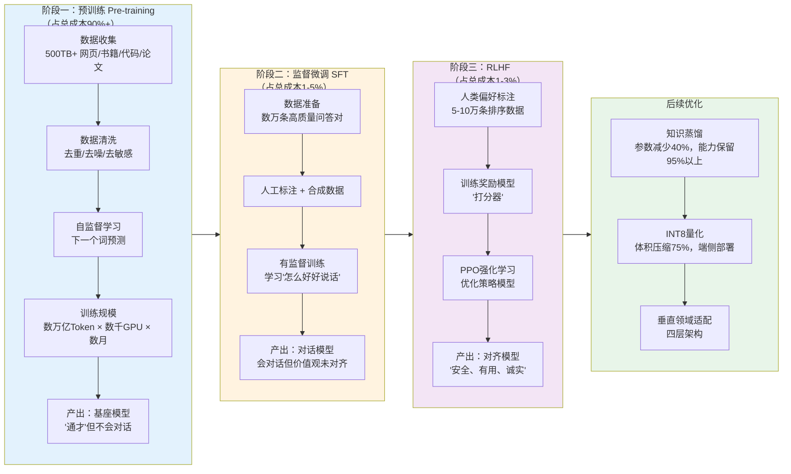

### 2.10 小结

训练一个大模型是一个系统工程，涉及数据、算力、算法三大要素的精密配合。让我们用一张表来总结三个核心阶段的对比：

| 维度 | 预训练 | 监督微调（SFT） | RLHF |
|------|--------|----------------|------|
| 目标 | 学习语言和世界知识 | 学会对话格式 | 对齐人类价值观 |
| 数据量 | 数万亿Token | 数万-数十万条 | 5-10万条排序 |
| 训练时间 | 数月 | 数小时-数天 | 数天 |
| 成本占比 | 90%+ | 1-5% | 1-3% |
| 核心算法 | 自监督学习 | 有监督学习 | PPO强化学习 |
| 比喻 | 读遍天下书 | 岗前培训 | 价值观塑造 |

理解了大模型的训练过程，你就能明白为什么AI的能力如此强大，也能理解它的局限性从何而来——**AI的知识来自训练数据，AI的价值观来自人类反馈，AI的能力边界由算力和数据决定**。

在下一章中，我们将探讨AI的"感官"——多模态技术如何让AI不仅"能读"，还能"看"、"听"、"说"。

---

## 第3章：AI的"语言"——Prompt与上下文

### 开篇：为什么同样用ChatGPT，有人得到神回复，有人只得到废话？

你一定见过这样的场景：同一家公司里，产品经理让AI写需求文档，洋洋洒洒三千字，逻辑清晰、格式规范；而旁边的新人让AI"帮我写个东西"，得到的回复却像隔夜的白粥——稀薄、无味、毫无营养。

问题出在哪里？不是AI偏心，也不是账号等级不同。答案很简单：**你跟AI说话的方式，决定了它输出的质量。**

这就像去餐厅点菜。你说"随便来点吃的"，厨师只能给你上一盘最平庸的家常菜；但如果你说"我要一份少油少盐、不加味精、用橄榄油煎制的深海鳕鱼，配柠檬黄油酱"，厨师就能精准地满足你的需求。

AI大模型就是那个"厨师"，而你的点菜方式，就是**Prompt（提示词）**。

2026年，Prompt Engineering（提示工程）已经从一门"玄学"变成了一门有方法论、有最佳实践、有量化评估指标的工程学科。OpenAI官方文档中关于Prompt Engineering的页面浏览量在2025年突破了2.3亿次，斯坦福大学甚至开设了专门的课程。这一章，我们将彻底拆解AI的"语言系统"。

---

### 3.1 Prompt不是聊天，是"编程指令"——关键纠偏

> **常见误区**："Prompt就是跟AI聊天，写得越自然越好。"

**这是2026年最该被纠正的AI认知误区之一。**

Prompt不是聊天。Prompt是**给AI下达的结构化编程指令**。当你打开ChatGPT的网页界面，看到那个输入框时，你看到的不是微信对话框，而是一个**代码编辑器**——只不过它用的是自然语言而不是Python。

让我们用技术视角重新认识Prompt。一次完整的AI交互，实际上由三种Prompt组成：

#### 3.1.1 System Prompt：设定AI的"人设"和"行为规则"

System Prompt是整个对话的"宪法"，它在所有用户消息之前被注入，定义了AI的身份、行为边界和输出规范。

**比喻**：System Prompt就像一部电影的导演手记。在演员（AI）上场之前，导演已经写好了："你是一个冷面幽默的私家侦探，说话简短，从不使用感叹号，偶尔引用福尔摩斯的名言。"

一个典型的System Prompt示例：

```json
{
  "role": "system",
  "content": "你是一位资深的Python后端工程师，拥有10年大型分布式系统开发经验。\n\n行为规则：\n1. 所有代码必须包含类型注解（Type Hints）\n2. 回答时先给出结论，再给出解释\n3. 如果问题信息不足，主动追问而不是猜测\n4. 代码示例必须可以直接运行，包含必要的import语句\n5. 禁止使用emoji"
}
```

**关键数据**：Anthropic在2025年发布的研究表明，一个精心设计的System Prompt可以将输出质量提升**40-60%**（基于人类评估评分）。而OpenAI的官方文档中明确指出："System Prompt是控制模型行为的**最强大工具**。"

#### 3.1.2 User Prompt：用户的实际需求

User Prompt是你（用户）发出的指令。它是触发AI推理的直接输入。

**比喻**：如果System Prompt是"导演手记"，那User Prompt就是"剧本中的具体台词指令"——"现在，走到窗前，拿起那封信，用颤抖的声音念出来。"

#### 3.1.3 Assistant Prompt：AI的历史回复

Assistant Prompt是AI之前的回复内容。它看起来是"历史记录"，但实际上它是**下一次推理的上下文输入**。

**比喻**：这就像下棋时棋盘上的棋子布局。AI不是在"回忆"它之前说了什么，而是在每次回复时，把之前的所有对话**重新读一遍**，然后基于这些信息生成新的回复。

```json
[
  {"role": "system", "content": "你是一个专业的翻译助手..."},
  {"role": "user", "content": "请将'Hello World'翻译成中文"},
  {"role": "assistant", "content": "'Hello World'的中文翻译是'你好，世界'。"},
  {"role": "user", "content": "那'Goodbye'呢？"}
]
```

注意最后一条User Prompt中的"那……呢？"——这种省略表达能被AI理解，正是因为Assistant Prompt提供了上下文。如果没有第三条assistant消息，AI根本不知道"那"指的是什么。

---

### 3.2 Prompt Engineering的核心技巧

Prompt Engineering不是"堆砌关键词"，而是一套有章可循的方法论。以下是2026年业界公认最有效的三大核心技巧：

#### 3.2.1 角色设定法（Role Prompting）

**原理**：为AI指定一个专业角色，可以显著收窄其知识检索范围，提升回答的专业度和准确率。

**差的Prompt**：
```
帮我分析一下这段代码有什么问题
```

**好的Prompt**：
```
你是一位拥有15年经验的资深Java性能优化专家，专精JVM调优和并发编程。
请以Code Review的标准，分析以下代码中可能存在的性能瓶颈、线程安全问题和内存泄漏风险。
对每个问题，给出：1）严重等级（Critical/High/Medium/Low）2）具体位置 3）修复方案
```

**效果数据**：根据Google DeepMind在2025年的基准测试，角色设定法在专业领域问答任务中，准确率平均提升**23%**。

#### 3.2.2 Few-shot示例法（Few-Shot Prompting）

**原理**：在Prompt中提供几个输入-输出示例，让AI通过"模仿"来理解你期望的输出格式和逻辑模式。

**比喻**：这就像教小孩做数学题。与其解释"什么是加法"，不如直接给他看"2+3=5""7+1=8"，他自然就懂了。

```
请按照以下格式提取产品信息：

示例1：
输入：iPhone 15 Pro Max，256GB，原色钛金属，售价9999元
输出：{"品牌": "Apple", "型号": "iPhone 15 Pro Max", "存储": "256GB", "颜色": "原色钛金属", "价格": 9999}

示例2：
输入：华为Mate 60 Pro，512GB，雅丹黑，售价6999元
输出：{"品牌": "华为", "型号": "Mate 60 Pro", "存储": "512GB", "颜色": "雅丹黑", "价格": 6999}

现在请提取：
输入：小米14 Ultra，1TB，白色，售价5999元
输出：
```

**效果数据**：OpenAI官方数据显示，Few-shot方法在格式化输出任务中，格式准确率从零样本的**67%**提升至**94%**。

#### 3.2.3 思维链（Chain of Thought, CoT）

**原理**：在Prompt中要求AI"一步一步地思考"，强制它在给出最终答案前展示推理过程。

**比喻**：这就像考试时老师要求"写出解题过程"。即使最终答案错了，中间的推理过程也能让你（以及AI自己）发现错误并纠正。

```
请一步一步地思考以下问题：

一个水池有两个进水管和一个出水管。A管单独注满水池需要6小时，B管单独注满需要8小时，
出水管单独排空需要12小时。如果三管同时打开，多久能注满水池？
```

**效果数据**：Google在2024年发表的论文中报告，CoT在数学推理任务（GSM8K基准）上将准确率从**58%**提升至**92%**。到2026年，CoT已经成为所有复杂推理任务的"标配"技巧。

> **纠偏**：很多人以为CoT就是在Prompt末尾加一句"请一步步思考"。实际上，高质量的CoT需要**结构化地拆解问题**，明确每一步的推理目标和约束条件。简单的一句"think step by step"在简单问题上有效，但在复杂工程问题上远远不够。

---

### 3.3 上下文窗口：AI的"短期记忆"容量

如果说Prompt是你对AI说的话，那**上下文窗口（Context Window）**就是AI能"同时记住"的所有信息的总容量。

**比喻**：上下文窗口就像一张办公桌。桌面越大，你能同时摊开的文件就越多，处理复杂任务时就越得心应手。但桌面再大，也有物理极限——而且桌子越大，租金越贵。

上下文窗口的计量单位是**Token**。一个Token大约相当于：
- 英文中：0.75个单词（约4个字符）
- 中文中：约1-2个汉字

以下是2026年主流大模型的上下文窗口对比：

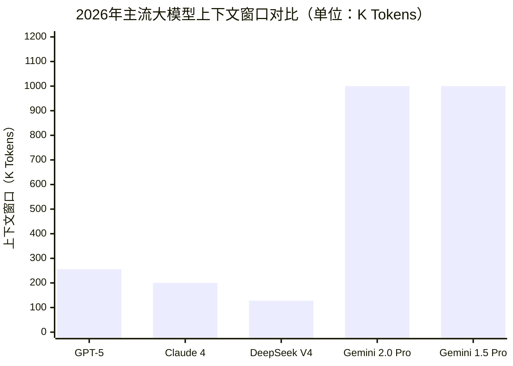

| 模型 | 上下文窗口 | 大约能容纳的内容 |
|------|-----------|----------------|
| GPT-5 | 256K tokens | 约20万字（一本中等篇幅的书） |
| Claude 4 | 200K tokens | 约16万字 |
| DeepSeek V4 | 128K tokens | 约10万字 |
| Gemini 2.0 Pro | 1M tokens | 约80万字（两三本厚书） |
| Gemini 1.5 Pro | 1M tokens | 约80万字 |

#### 上下文窗口越大越好吗？

> **常见误区**："上下文窗口越大，AI就越聪明。"

**不是。** 这是一个需要认真纠正的认知偏差。

上下文窗口大，意味着AI能"看到"更多信息，但这不等于它能更好地利用这些信息。这里存在三个核心问题：

**第一，"大海捞针"准确率下降。** 当上下文窗口从32K扩展到1M时，AI从海量文本中精准定位某一条信息的准确率会显著下降。Anthropic的研究显示，在128K上下文中，Claude的"大海捞针"准确率为**99.2%**；但在200K上下文中，这一数字降至**96.5%**。

**第二，成本线性增长。** 上下文窗口中的每一个Token都要花钱。以GPT-5为例，输入成本约为$2.5/百万Token，输出成本约为$10/百万Token。如果你把1M Token的上下文塞满，单次对话的输入成本就高达**$2.5**——这对于高频调用的企业应用来说是不可接受的。

**第三，推理延迟增加。** 上下文越长，AI的"预填充"（Prefill）阶段耗时越长。在1M Token的上下文中，首Token延迟可能达到**30-60秒**，这在实时交互场景中是不可接受的。

**结论**：上下文窗口的选择是一个**成本、质量、延迟的三方博弈**。对于大多数应用场景，128K-256K已经完全够用。只有在需要处理超长文档（如法律合同审查、全代码库分析）时，才需要考虑1M级别的上下文。

---

### 3.4 上下文管理策略：当记忆不够用时怎么办？

既然上下文窗口是有限的，那当对话历史或文档内容超出窗口限制时，我们该怎么办？2026年业界主流的上下文管理策略有以下三种：

#### 策略一：分片（Chunking）

将长文本按照语义边界切分成多个片段，每次只将相关片段送入AI。

```python
def chunk_text(text: str, max_tokens: int = 4000) -> list[str]:
    """按段落边界对文本进行分片"""
    paragraphs = text.split("\n\n")
    chunks = []
    current_chunk = ""

    for para in paragraphs:
        estimated_tokens = len(current_chunk + para) // 2  # 粗略估算
        if estimated_tokens > max_tokens:
            if current_chunk:
                chunks.append(current_chunk)
            current_chunk = para
        else:
            current_chunk += "\n\n" + para if current_chunk else para

    if current_chunk:
        chunks.append(current_chunk)

    return chunks
```

#### 策略二：摘要压缩（Summarization）

对历史对话进行定期摘要，用"摘要"替代"原文"来节省上下文空间。

```python
SUMMARIZATION_PROMPT = """
请对以下对话历史进行精简摘要，保留所有关键信息、决策和结论。
删除寒暄、重复讨论和已废弃的方案。
摘要长度控制在原文的30%以内。

对话历史：
{conversation_history}
"""

# 当对话历史超过窗口的60%时触发摘要
def should_summarize(conversation_tokens: int, window_size: int) -> bool:
    return conversation_tokens > window_size * 0.6
```

**效果数据**：微软在2025年的研究中报告，摘要压缩策略可以将有效对话轮次提升**5-8倍**，同时将信息保留率维持在**85%**以上。

#### 策略三：向量检索裁剪（RAG - Retrieval-Augmented Generation）

这是2026年最主流的上下文管理方案。核心思路是：将所有文档预先向量化存储，每次对话时只检索出与当前问题最相关的Top-K个片段，拼接到上下文中。

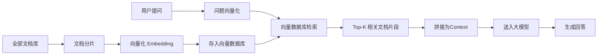

**RAG的核心优势**：
- 文档数量不受上下文窗口限制（可以处理百万级文档）
- 检索到的内容高度相关，减少噪音干扰
- 成本可控——每次只送入少量相关片段

**效果数据**：根据LangChain在2025年发布的行业调研报告，**78%** 的企业级AI应用采用了RAG架构来管理上下文。在知识问答场景中，RAG相比纯大模型对话，准确率从**42%**提升至**89%**。

---

### 3.5 完整的API调用示例

让我们把前面学到的所有概念串联起来，看一个完整的API调用示例：

```python
import openai

client = openai.OpenAI(api_key="your-api-key")

response = client.chat.completions.create(
    model="gpt-5",
    messages=[
        # System Prompt：设定角色和规则
        {
            "role": "system",
            "content": (
                "你是一位专业的数据分析师。\n"
                "行为规则：\n"
                "1. 所有数据结论必须标注数据来源\n"
                "2. 使用表格呈现对比数据\n"
                "3. 不确定的数据标注置信区间\n"
                "4. 回答控制在500字以内"
            )
        },
        # Assistant Prompt：历史回复（提供上下文）
        {
            "role": "assistant",
            "content": "根据2025年Q3财报，公司营收同比增长23%，达到4.2亿元。"
        },
        # User Prompt：当前问题
        {
            "role": "user",
            "content": (
                "请基于上一条回复中的营收数据，"
                "预测Q4的营收区间，并给出三个关键假设条件。"
            )
        }
    ],
    temperature=0.3,       # 低温度 = 更确定性的输出
    max_tokens=1000,        # 限制输出长度
    top_p=0.9               # 核采样参数
)

print(response.choices[0].message.content)
```

**参数解读**：
- `temperature=0.3`：控制输出的随机性。0表示完全确定性（每次相同输入得到相同输出），1表示高度随机。数据分析场景建议0.1-0.3，创意写作场景建议0.7-1.0。
- `max_tokens=1000`：限制AI回复的最大长度，避免意外的高额费用。
- `top_p=0.9`：核采样参数，与temperature配合使用，控制词汇选择的多样性。

---

### 3.6 Prompt处理全流程

让我们用一张完整的流程图来总结AI处理Prompt的全过程：

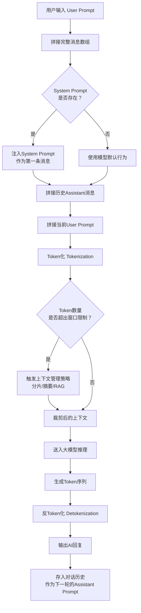

---

### 本章小结

| 概念 | 一句话解释 | 关键数据 |
|------|-----------|---------|
| System Prompt | AI的"宪法"，定义身份和行为规则 | 精心设计可提升输出质量40-60% |
| User Prompt | 用户的实际指令 | 角色设定法可提升准确率23% |
| Assistant Prompt | AI的历史回复，构成下一轮的上下文 | Few-shot可将格式准确率从67%提升至94% |
| 上下文窗口 | AI的"短期记忆"容量 | 主流模型128K-1M tokens |
| CoT思维链 | 强制AI展示推理过程 | 数学推理准确率从58%提升至92% |
| RAG | 检索增强生成，突破上下文限制 | 78%企业级AI应用采用此架构 |

**记住**：在2026年，与AI对话不是"聊天"，而是"编程"。你的每一次输入，都在精确地塑造AI的输出。掌握Prompt Engineering，就是掌握了与AI高效协作的"编程语言"。

---

## 第4章：AI的"手脚"——从Tools到MCP协议

### 开篇：大模型只会"说"，不会"做"——直到有了Tools

想象一个场景：你请了一位全世界最博学的顾问。他精通32种语言，读过人类历史上所有的书籍和论文，能在一秒内检索数万亿条知识。但是——他**没有手**。

他不能帮你发邮件，不能帮你查数据库，不能帮你操作Excel，不能帮你部署代码。他只能坐在那里，用最精准、最优雅的语言告诉你："你应该这样做。"

这就是2024年初大模型的处境。GPT-4、Claude 3、Gemini——它们都是"没有手的超级大脑"。

转折点出现在2024年下半年。OpenAI推出了**Function Calling**，Anthropic推出了**Tool Use**，Google推出了**Function Calling in Gemini**。大模型终于有了"手"——它们不再只能"说"，还能"做"。

但新的问题随之而来：每家厂商的工具接口格式不同、协议不同、调用方式不同。开发者要为GPT写一套工具适配，为Claude写另一套，为Gemini再写一套。这就像你买了一台新电视，发现家里的每个遥控器都只能控制一个品牌——混乱、低效、令人沮丧。

2024年11月，Anthropic给出了一个革命性的答案：**MCP（Model Context Protocol）**——AI界的"USB接口"。

这一章，我们将从底层到顶层，完整拆解AI从"能说"到"能做"的技术进化路径：**Tools → MCP → Skills**。

---

### 4.1 Tools：AI的"原生手"

#### 4.1.1 什么是Tools？

**Tools**是AI执行具体操作的**底层原生能力单元**。

**比喻**：如果AI是一个操作系统，那Tools就是操作系统的**系统调用（System Calls）**——`read()`、`write()`、`send()`、`recv()`。它们是最底层的执行单元，没有任何花哨的包装，但一切高级功能都建立在它们之上。

Tools有三个核心特征：

| 特征 | 说明 |
|------|------|
| **无AI适配** | Tools本身不关心是谁在调用它——人、AI、还是另一个程序 |
| **无工程化封装** | Tools是裸露的原子操作，不包含提示词、错误处理策略等"智能化"逻辑 |
| **无权限校验** | Tools本身不做权限判断，安全管控由上层负责 |

#### 4.1.2 Tools的类型

2026年，AI可调用的Tools已经覆盖了几乎所有的数字操作场景：

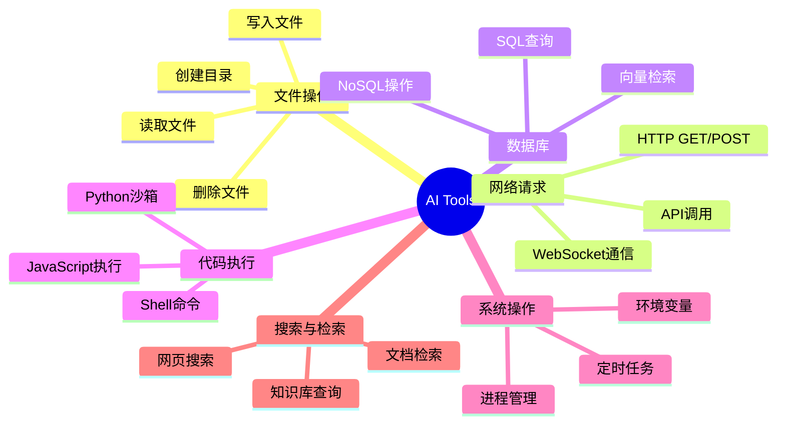

#### 4.1.3 Tools是所有Skill的底层能力源头

这一点至关重要：**没有Tools，就没有Skills**。

无论上层如何封装、如何美化、如何添加安全策略，最终执行操作的永远是底层的Tools。这就像无论你的手机App界面多么精美，最终都是通过操作系统的系统调用来完成操作的。

> **纠偏**：很多人把"AI能调用API"等同于"AI有Tools"。实际上，API只是Tools的一种表现形式。一个Tool可以是本地函数调用、可以是系统命令、也可以是硬件操作。Tools的本质是"AI可调用的执行单元"，而不是"HTTP API"。

---

### 4.2 MCP协议：AI界的"USB接口"

#### 4.2.1 MCP是什么？

**MCP**全称 **Model Context Protocol（模型上下文协议）**，由Anthropic于2024年11月开源发布。

**比喻**：在USB接口出现之前，每个外设（打印机、键盘、鼠标、U盘）都有自己的专用接口和专用线缆。你要换一个键盘，就得换一根线。1996年，USB（Universal Serial Bus）诞生了——一个接口，连接所有设备。

MCP就是AI世界的USB。它定义了一套**统一的通信协议**，让任何AI模型都能以**标准化的方式**连接和使用任何工具。

#### 4.2.2 MCP解决的核心问题

在MCP出现之前，AI工具生态面临三大混乱：

| 问题 | 具体表现 |
|------|---------|
| **多模型适配混乱** | 同一个搜索工具，GPT用Function Calling格式，Claude用Tool Use格式，Gemini用另一种格式 |
| **多工具集成混乱** | 每个工具有自己的SDK、自己的认证方式、自己的数据格式 |
| **多平台部署混乱** | 在VS Code中能用的工具，在ChatGPT中用不了；在Web端能用的，在移动端用不了 |

MCP用**一套协议**同时解决了这三个问题：

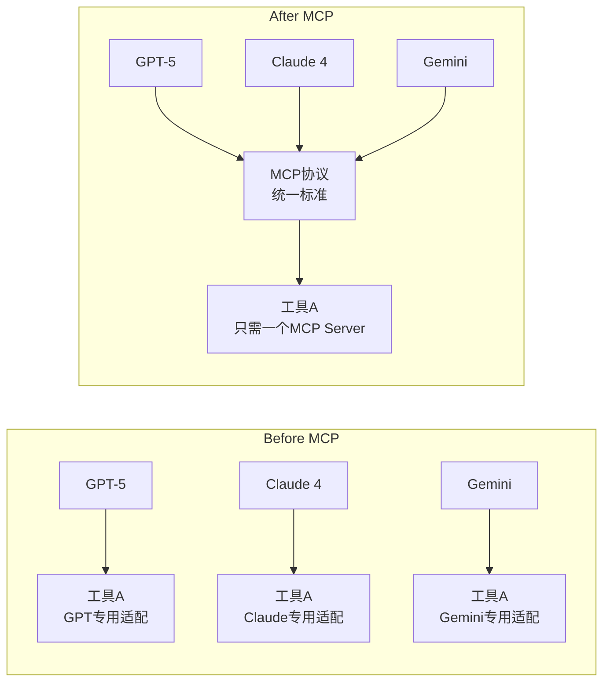

**核心价值：一次开发，全生态通用。** 工具开发者只需要实现一个MCP Server，所有支持MCP的AI模型就能自动使用这个工具。

#### 4.2.3 MCP的三层架构

MCP采用经典的三层架构设计：

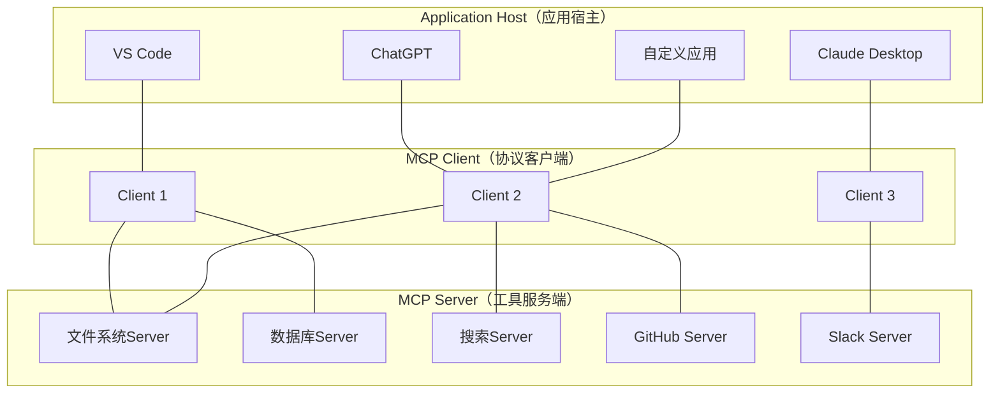

**各层职责**：

| 层级 | 角色 | 职责 | 类比 |
|------|------|------|------|
| **Application Host** | 应用宿主 | 提供用户界面，承载AI模型 | 电脑主机 |
| **MCP Client** | 协议客户端 | 管理与MCP Server的连接，协议转换 | USB控制器 |
| **MCP Server** | 工具服务端 | 暴露具体的工具能力 | USB设备 |

**关键设计原则**：
- **一个Client可以连接多个Server**（就像一个USB控制器可以连接多个USB设备）
- **一个Server可以被多个Client连接**（就像一个USB设备可以插到不同电脑上）
- **Client和Server之间是松耦合的**（通过标准协议通信，不依赖具体实现）

#### 4.2.4 MCP的通信机制

MCP的通信基于 **JSON-RPC 2.0** 协议，传输层使用 **HTTP/1.1 + SSE（Server-Sent Events）**。

**为什么选择这个技术组合？**

- **JSON-RPC 2.0**：轻量级、易解析、支持请求/响应和通知两种模式
- **HTTP/1.1**：兼容性最好，几乎所有网络环境都支持
- **SSE**：支持服务端主动推送，适合流式输出场景（如AI逐字生成回复）

一次典型的MCP通信流程：

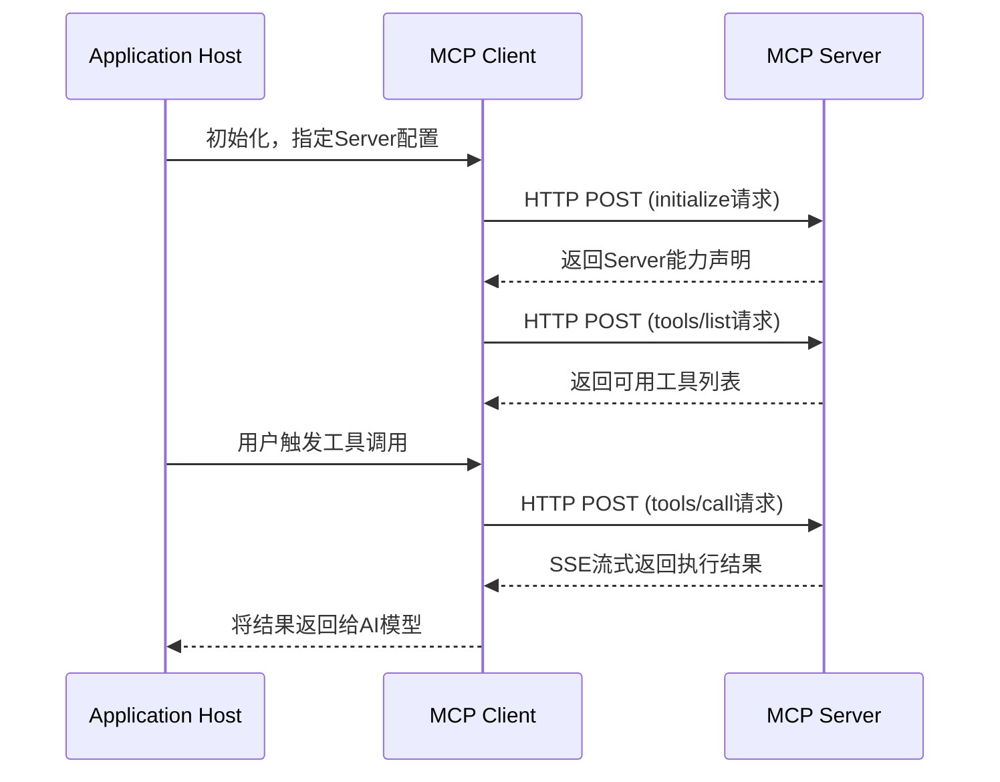

**JSON-RPC消息示例**：

```json
// Client → Server：请求工具列表
{
  "jsonrpc": "2.0",
  "id": 1,
  "method": "tools/list",
  "params": {}
}

// Server → Client：返回工具列表
{
  "jsonrpc": "2.0",
  "id": 1,
  "result": {
    "tools": [
      {
        "name": "read_file",
        "description": "读取指定路径的文件内容",
        "inputSchema": {
          "type": "object",
          "properties": {
            "path": {
              "type": "string",
              "description": "文件的绝对路径"
            }
          },
          "required": ["path"]
        }
      },
      {
        "name": "search_web",
        "description": "执行网络搜索并返回结果",
        "inputSchema": {
          "type": "object",
          "properties": {
            "query": {
              "type": "string",
              "description": "搜索关键词"
            },
            "max_results": {
              "type": "integer",
              "description": "最大返回结果数",
              "default": 5
            }
          },
          "required": ["query"]
        }
      }
    ]
  }
}

// Client → Server：调用工具
{
  "jsonrpc": "2.0",
  "id": 2,
  "method": "tools/call",
  "params": {
    "name": "read_file",
    "arguments": {
      "path": "/workspace/config.json"
    }
  }
}

// Server → Client：返回执行结果
{
  "jsonrpc": "2.0",
  "id": 2,
  "result": {
    "content": [
      {
        "type": "text",
        "text": "{\"database\": \"postgresql\", \"port\": 5432}"
      }
    ]
  }
}
```

#### 4.2.5 MCP生态现状（2026年）

截至2026年4月，MCP生态已经取得了显著的发展：

| 指标 | 数据 |
|------|------|
| GitHub上MCP相关仓库 | 超过**12,000**个 |
| 已注册的MCP Server | 超过**3,500**个 |
| 支持MCP的AI平台 | Claude、GPT、Gemini、Cursor、Windsurf、VS Code等**20+**个 |
| MCP协议版本 | v1.2（2026年3月发布） |

**MCP已经从Anthropic的"独门协议"变成了整个AI行业的"事实标准"。** 2025年12月，OpenAI宣布GPT系列模型全面支持MCP协议，标志着MCP正式成为跨厂商的通用标准。

---

### 4.3 Skills：Tools的"标准化封装"

#### 4.3.1 从Tools到Skills的进化

如果Tools是"砖块"，那Skills就是"预制板"。

**比喻**：Tools就像厨房里的原材料——面粉、鸡蛋、糖、黄油。它们是做蛋糕的必要条件，但如果你直接把面粉和鸡蛋交给一个不会做饭的人，他大概率做不出蛋糕。Skills则是"蛋糕预拌粉"——面粉、鸡蛋、糖已经按精确比例混合好，你只需要加水搅拌就能烤出蛋糕。

**Skills的本质公式**：

```
Skills = 底层Tools + 标准化封装 + 安全管控 + 协议适配
```

| 组成部分 | 说明 | 类比 |
|---------|------|------|
| **底层Tools** | 实际执行操作的原子能力 | 汽车的发动机 |
| **标准化封装** | 统一的输入/输出格式、错误处理、重试机制 | 汽车的方向盘和仪表盘 |
| **安全管控** | 权限校验、敏感操作确认、审计日志 | 汽车的安全带和ABS |
| **协议适配** | 适配不同AI平台的调用协议 | 汽车的适配器（不同国家的充电接口） |

#### 4.3.2 双类型技能体系

2026年的AI Agent平台普遍采用**双类型技能体系**：

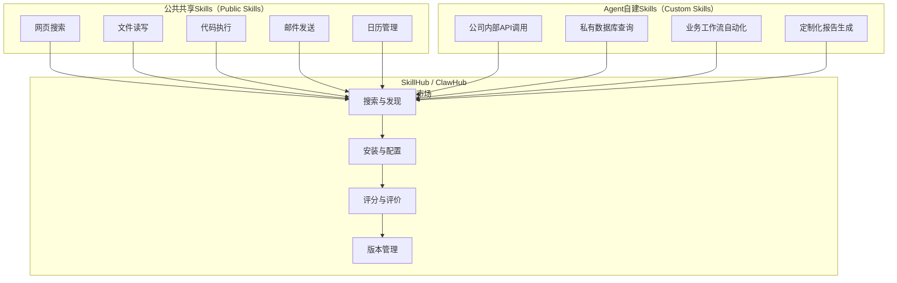

**公共共享Skills**：
- 由平台方或社区开发维护
- 开箱即用，无需配置
- 覆盖通用场景（搜索、文件、代码、通信等）
- 类比：手机的应用商店里的"系统应用"

**Agent自建Skills**：
- 由企业或个人开发者创建
- 针对特定业务场景定制
- 需要配置认证、权限等参数
- 类比：手机的应用商店里的"企业内部应用"

#### 4.3.3 SkillHub / ClawHub：技能市场

**SkillHub**（或称ClawHub）是Skills的分发和管理平台，类似于手机的应用商店。

**核心功能**：

| 功能 | 说明 |
|------|------|
| **搜索与发现** | 按类别、评分、下载量浏览可用Skills |
| **一键安装** | 自动完成认证配置和协议适配 |
| **版本管理** | 支持Skills的版本更新和回退 |
| **安全审计** | 展示Skills的权限需求和社区安全评分 |
| **组合编排** | 将多个Skills组合成复杂工作流 |

> **纠偏**：很多人认为"Skills越多越好"。实际上，每增加一个Skill，就增加一个潜在的攻击面和安全风险。最佳实践是：**只安装必要的Skills，定期审查已安装Skills的权限，及时移除不再使用的Skills。**

#### 4.3.4 Skills vs MCP Server：什么时候用哪个？

这是开发者在实践中最常遇到的困惑。让我们用一个对比表来厘清两者的定位：

| 维度 | MCP Server | Skill |
|------|-----------|-------|
| **定位** | 底层通信协议实现 | 面向用户的功能封装 |
| **开发门槛** | 中等（需了解JSON-RPC和MCP规范） | 低（通过配置即可创建） |
| **复用性** | 高（跨平台通用） | 取决于平台（通常限定在特定Agent平台内） |
| **安全机制** | 基础（依赖传输层安全） | 完善（权限校验、审计、沙箱） |
| **适用场景** | 开发新的工具能力 | 组合已有工具，面向业务场景 |
| **类比** | 制造USB设备 | 购买并使用USB设备 |

**比喻**：MCP Server是"电钻的制造图纸"——你需要懂工程原理才能画出来；Skill是"买一把电钻回家打孔"——你只需要知道怎么按开关。

在实际项目中，典型的开发路径是：**先用MCP Server封装底层能力，再用Skill将这些能力组合成面向业务的功能模块。** 例如，一个"智能客服"Skill，底层可能调用了3个MCP Server：知识库检索Server、工单系统Server、邮件发送Server。

#### 4.3.5 Skills的实际运行机制

当一个Skill被AI调用时，背后发生了什么？让我们拆解一个完整的Skill调用链路：

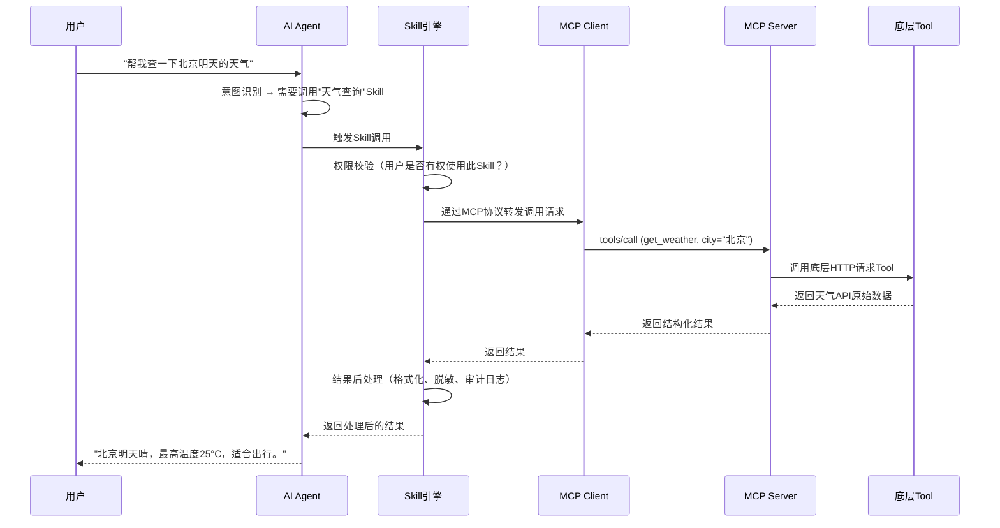

注意这条链路中有两个关键的"增值环节"：

1. **Skill引擎的权限校验**：在调用到达MCP Server之前，Skill层就已经检查了用户权限。如果用户没有"天气查询"权限，请求会在Skill层被拦截，根本不会到达MCP Server。

2. **Skill引擎的结果后处理**：MCP Server返回的是原始数据，Skill层会对其进行格式化（让AI更容易理解）、脱敏（移除敏感信息）、记录审计日志（谁在什么时候调用了什么）。

这就是"Skills = Tools + 标准化封装 + 安全管控 + 协议适配"这个公式的具体体现。

---

### 4.4 一个最简单的MCP Server示例

以下是一个用Python实现的MCP Server，它提供两个工具：`get_weather`（获取天气）和`calculate`（数学计算）。

```python
# mcp_weather_server.py
import json
from mcp.server import Server
from mcp.server.stdio import stdio_server

# 创建MCP Server实例
server = Server("weather-demo")

@server.list_tools()
async def list_tools():
    """声明此Server提供的所有工具"""
    return [
        {
            "name": "get_weather",
            "description": "获取指定城市的当前天气信息",
            "inputSchema": {
                "type": "object",
                "properties": {
                    "city": {
                        "type": "string",
                        "description": "城市名称，如'北京'、'上海'"
                    }
                },
                "required": ["city"]
            }
        },
        {
            "name": "calculate",
            "description": "执行数学表达式计算",
            "inputSchema": {
                "type": "object",
                "properties": {
                    "expression": {
                        "type": "string",
                        "description": "数学表达式，如'2+3*4'"
                    }
                },
                "required": ["expression"]
            }
        }
    ]

@server.call_tool()
async def call_tool(name: str, arguments: dict):
    """处理工具调用请求"""
    if name == "get_weather":
        city = arguments["city"]
        # 模拟天气数据（实际应用中应调用真实天气API）
        weather_data = {
            "city": city,
            "temperature": "22°C",
            "condition": "晴",
            "humidity": "45%",
            "wind": "东北风 3级"
        }
        return [{
            "type": "text",
            "text": json.dumps(weather_data, ensure_ascii=False)
        }]

    elif name == "calculate":
        expression = arguments["expression"]
        try:
            # 安全地执行数学表达式（仅允许数学运算）
            allowed = set("0123456789+-*/.() ")
            if not all(c in allowed for c in expression):
                return [{
                    "type": "text",
                    "text": "错误：表达式包含不允许的字符"
                }]
            result = eval(expression)
            return [{
                "type": "text",
                "text": f"{expression} = {result}"
            }]
        except Exception as e:
            return [{
                "type": "text",
                "text": f"计算错误：{str(e)}"
            }]

# 启动MCP Server
async def main():
    async with stdio_server() as (read_stream, write_stream):
        await server.run(read_stream, write_stream)

if __name__ == "__main__":
    import asyncio
    asyncio.run(main())
```

**配置文件**（让MCP Client发现并连接此Server）：

```json
{
  "mcpServers": {
    "weather-demo": {
      "command": "python",
      "args": ["/path/to/mcp_weather_server.py"],
      "description": "天气查询与数学计算工具"
    }
  }
}
```

**关键设计要点**：

1. **`list_tools()`**：声明Server的能力清单。AI模型通过这个接口"知道"有哪些工具可用。
2. **`call_tool()`**：实际执行工具调用。接收工具名称和参数，返回执行结果。
3. **安全防护**：在`calculate`工具中，我们通过白名单过滤来防止代码注入攻击——这是Skill层"安全管控"的体现。

---

### 4.5 Tools → MCP → Skills：完整关系图

让我们用一张全景图来总结Tools、MCP和Skills三者的关系：

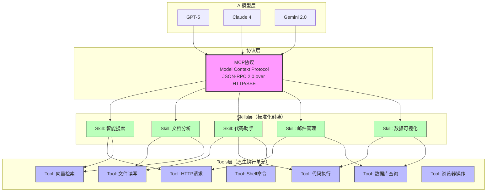

**关系解读**：

- **AI模型**通过**MCP协议**与**Skills**通信（MCP是中间的"通用语言"）
- **Skills**封装了一个或多个**Tools**（一个Skill可能需要多个底层Tool配合）
- **Tools**是最终的执行单元（实际"干活"的是Tools）
- **MCP协议**不直接与Tools交互——它只定义了Skills的通信标准

---

### 本章小结

| 概念 | 一句话解释 | 关键数据 |
|------|-----------|---------|
| **Tools** | AI的底层原生执行单元，无封装、无适配、无权限 | 一切Skill的底层能力源头 |
| **MCP** | AI界的"USB接口"，统一的工具通信协议 | GitHub上12,000+仓库，3,500+注册Server |
| **Skills** | Tools的标准化封装，含安全管控和协议适配 | 公共Skills + 自建Skills双类型体系 |
| **SkillHub** | Skills的分发市场，类似应用商店 | 支持搜索、安装、评分、版本管理 |

**从Tools到MCP再到Skills的进化路径，本质上是从"能用"到"好用"再到"安全好用"的进化。** Tools让AI有了"动手"的能力，MCP让这些能力变得"可移植、可复用"，Skills则在这些能力之上加上了"安全护栏"和"用户体验"。

**记住**：在2026年，评估一个AI Agent平台的能力，不要只看它接入了多少个大模型——更要看它支持多少个MCP Server、有多少个可用Skills、以及它的Skill生态是否繁荣。因为最终决定AI"能做什么"的，不是模型的参数量，而是它能调用的Tools和Skills的数量与质量。

---

## 第5章：AI的"执行者"——Agent智能体

### 5.1 开篇：90%的人都搞错了Agent是什么

2025年被称为"Agent元年"。

这一年，OpenAI发布了Operator，Google推出了Project Mariner，国内的字节跳动上线了Coze平台，Dify完成了B轮融资。据Gartner统计，到2025年底，全球已有超过1200家企业将Agent技术纳入生产环境，市场规模突破47亿美元。

然而，一个令人不安的事实是：**超过90%的人在讨论Agent时，实际上讨论的只是大模型（LLM）。**

打开社交媒体，你会看到这样的言论："GPT-4就是Agent""Claude已经很智能了，不需要Agent"。这些说法看似合理，却犯了最根本的概念错误——把"大脑"等同于"完整的人"。

打个比方：大模型就像一位坐在书房里的百科全书式学者。你问他任何问题，他都能给出精彩的回答。但如果你让他"去菜市场买两斤西红柿，顺便取个快递，回来路上把干洗的衣服拿上"，他会愣在原地——因为他没有腿，没有手，也没有出门的权限。

**Agent，就是给这位学者装上腿、手、钱包和出门权限的那套系统。**

这不是一个微小的技术差异，而是从"被动问答"到"主动执行"的范式跃迁。理解这一点，是读懂2026年AI行业格局的起点。

### 5.2 Agent ≠ 大模型：最关键的纠偏

让我们用一个更精确的公式来定义Agent：

```
Agent = 大模型（LLM） + 任务规划引擎 + 上下文管理器 + Skills调用模块 + MCP通信模块
```

拆开来看，每一项都不可或缺：

| 组件 | 比喻 | 职责 |
|------|------|------|
| **大模型（LLM）** | 大脑 | 理解意图、推理决策、生成文本 |
| **任务规划引擎** | 项目经理 | 将复杂任务拆解为可执行的子任务序列 |
| **上下文管理器** | 记事本 | 管理对话历史、用户偏好、环境状态 |
| **Skills调用模块** | 工具箱 | 搜索、代码执行、API调用、文件操作等 |
| **MCP通信模块** | 对讲机 | 与外部系统进行标准化通信 |

**常见误区纠正：**

- **误区1："GPT-4就是Agent。"** 错。GPT-4是LLM，它本身不具备调用工具的能力。ChatGPT中的"插件"和"函数调用"功能，才是Agent能力的雏形。OpenAI在2024年底推出的Operator，才真正是一个完整的Agent产品。
- **误区2："Agent就是套壳大模型。"** 错。一个优秀的Agent系统中，LLM的推理能力只占总工作量的30%左右，剩下70%来自任务规划、工具编排、错误恢复和上下文管理等工程能力。据LangChain在2025年的开发者调研，Agent开发中最大的技术挑战不是模型能力不足，而是"工具调用的可靠性"和"长链路任务的成功率"。
- **误区3："Agent会取代所有软件。"** 过度夸大。Agent擅长的是非确定性的、需要灵活决策的任务。对于高确定性、高精度要求的场景（如银行核心交易系统），传统软件仍然是更可靠的选择。

### 5.3 Agent的核心能力

Agent之所以被称为AI的"执行者"，是因为它具备四种传统软件不具备的核心能力：

#### 5.3.1 任务拆解（Task Decomposition）

人类项目经理把一个大项目拆分成若干子任务，Agent也能做到类似的事情——但速度是人类的1000倍以上。

例如，当用户说"帮我分析竞品并写一份市场报告"时，Agent的任务规划引擎会将这个模糊指令拆解为：

1. 识别竞品范围（搜索行业报告）
2. 收集竞品数据（调用搜索API、爬取官网）
3. 提取关键指标（数据分析工具）
4. 生成对比表格（代码执行环境）
5. 撰写分析报告（LLM文本生成）
6. 格式化输出（文档生成工具）

据Anthropic在2025年发布的Agent基准测试数据，Claude 3.5 Sonnet在任务拆解准确率上达到87.3%，较2024年初提升了42个百分点。

#### 5.3.2 工具选择（Tool Selection）

Agent的Skills调用模块就像一个经验丰富的工匠的工具台。面对不同任务，它能自动选择最合适的工具：

- 需要实时信息？调用搜索API
- 需要数学计算？启动代码解释器
- 需要操作文件？使用文件系统接口
- 需要发送邮件？调用邮件服务API

2025年，MCP（Model Context Protocol）协议的标准化让工具生态迎来了爆发式增长。据MCP官方统计，截至2026年第一季度，已注册的标准化MCP工具超过2.8万个，覆盖办公、开发、设计、数据分析等47个领域。

#### 5.3.3 自主执行（Autonomous Execution）

这是Agent与传统聊天机器人最本质的区别。传统聊天机器人的工作模式是"一问一答"——用户说一句，它回一句，用户不说话，它就沉默。Agent则可以自主完成一个多步骤的完整任务链，中间无需人工干预。

以数据分析场景为例：用户只需说"分析上季度的销售数据，找出下滑原因"，Agent就可以自主完成数据读取、清洗、分析、可视化、报告生成的全流程。微软在2025年的内部测试显示，其Copilot Agent在处理企业数据分析任务时，端到端完成率达到73.6%，平均节省人工时间4.2小时/任务。

#### 5.3.4 错误恢复（Error Recovery）

传统软件遇到错误就崩溃或报错。Agent则具备"遇到问题，换个方法"的能力。

例如，当Agent尝试调用某个API失败时，它不会直接报错退出，而是会：
1. 分析失败原因（网络超时？权限不足？参数错误？）
2. 尝试替代方案（换一个API？降低请求频率？）
3. 如果所有方案都失败，向用户报告问题并建议人工介入

据Dify在2025年底发布的Agent可靠性报告，具备错误恢复机制的Agent，任务完成率比无恢复机制的Agent高出58.7%。

### 5.4 全链路执行流程：11步闭环

为了让你直观理解Agent的工作方式，我们以一个具体场景为例：**用户让AI生成一篇公众号文章并自动发布**。

这不是一个简单的"生成文本"任务，而是一个涉及内容创作、图片生成、排版、审核、发布的完整工作流。以下是Agent完成这个任务的11步闭环流程：

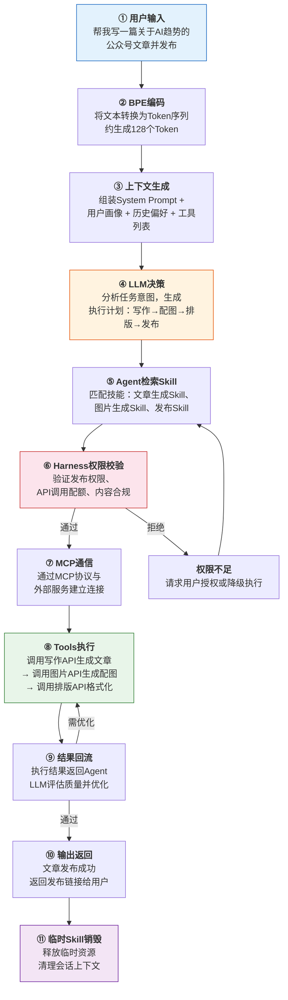

让我们逐步解析这个流程：

**第一步：用户输入。** 用户发出自然语言指令。这一步看似简单，实际上Agent需要处理大量的歧义性——"AI趋势"是指技术趋势还是商业趋势？文章长度多少？目标读者是谁？

**第二步：BPE编码。** 用户的自然语言输入经过BPE（Byte Pair Encoding）分词器处理，被转换成模型能理解的Token序列。以"帮我写一篇关于AI趋势的公众号文章并发布"为例，这句话大约被切分为35-50个Token。

**第三步：上下文生成。** Agent的上下文管理器开始工作，将System Prompt（定义Agent的角色和行为规范）、用户画像（历史交互中积累的偏好信息）、当前可用工具列表等信息组装成完整的上下文窗口。这一步的质量直接决定了后续决策的准确性。

**第四步：LLM决策。** 大模型基于上下文进行推理，生成一个结构化的执行计划。在这个例子中，LLM会判断需要依次调用"文章生成""图片生成""排版""发布"四个子任务，并确定每个子任务的参数。

**第五步：Agent检索Skill。** 任务规划引擎根据LLM的决策，从Skill库中检索匹配的技能模块。这里的"Skill"是预封装的能力单元，比如"微信公众号发布Skill"封装了登录、编辑、发布的完整API调用链。

**第六步：Harness权限校验。** 在实际执行之前，Harness管控平台会介入，校验Agent是否具有执行该操作的权限——包括API调用配额、内容合规审查、敏感操作二次确认等。这一步是安全护栏的关键环节（详见第6章）。

**第七步：MCP通信。** 通过标准化的MCP协议，Agent与外部服务建立通信连接。MCP协议定义了统一的请求/响应格式，使得Agent无需为每个外部服务编写适配代码。

**第八步：Tools执行。** 各工具模块按照执行计划依次运行。文章生成API产出初稿，图片生成API创建配图，排版API完成格式化，发布API将文章推送到公众号平台。

**第九步：结果回流。** 每个工具的执行结果都会返回给Agent，由LLM进行质量评估。如果文章质量不达标，Agent会自动调整参数重新生成；如果发布失败，会尝试排查原因并重试。

**第十步：输出返回。** 任务完成后，Agent将最终结果（发布链接、文章摘要等）返回给用户。

**第十一步：临时Skill销毁。** 任务结束后，Agent释放本次任务中加载的临时资源和会话上下文，避免资源泄漏。

整个流程中，步骤④到步骤⑨可能经历多轮迭代——Agent不是"一锤子买卖"，而是在执行过程中持续感知、判断、调整。

### 5.5 Agent vs 传统软件：本质区别

为了更清晰地理解Agent的独特性，我们将其与传统软件进行对比：

| 维度 | 传统软件 | Agent |
|------|---------|-------|
| **执行逻辑** | 预定义的确定性流程 | 基于推理的非确定性决策 |
| **输入处理** | 结构化数据（表单、API参数） | 非结构化自然语言 |
| **错误处理** | 预设的异常分支 | 动态推理替代方案 |
| **适应性** | 需要开发者修改代码 | 根据环境变化自动调整策略 |
| **用户交互** | GUI表单/命令行 | 自然语言对话 |
| **扩展性** | 添加功能需开发集成 | 接入新Skill即可获得新能力 |

用一个比喻来总结：传统软件像是一台自动售货机——你按下A1按钮，就一定出来一罐可乐，流程固定，结果确定。Agent更像是一个聪明的私人助理——你告诉他"我渴了"，他会根据你的口味偏好、当前天气、冰箱库存，决定给你倒一杯温水、买一瓶果汁还是泡一壶茶。

### 5.6 市面上的Agent产品格局

截至2026年，Agent产品已经形成了三个清晰的梯队：

**第一梯队：大厂原生Agent平台**

- **OpenAI Operator**：基于GPT-4o构建，支持网页操作、文件管理等原生能力，月活跃用户超过3500万（2026年Q1数据）。
- **Google Project Mariner**：深度整合Google生态（搜索、Gmail、Docs），擅长信息检索和文档处理任务。
- **Anthropic Claude Computer Use**：支持直接操作计算机界面（点击、输入、滚动），在复杂GUI任务上表现突出。

**第二梯队：独立Agent开发平台**

- **字节跳动Coze**：面向开发者和非技术用户的Agent搭建平台，提供可视化编排界面，已积累超过13000个预置技能，国内月活用户突破800万。
- **Dify**：开源LLM应用开发平台，支持Agent、Workflow、RAG等多种范式，GitHub星标超过68k，被超过5000家企业采用。
- **LangGraph**：LangChain推出的Agent编排框架，以图结构管理Agent状态流转，适合构建复杂的多Agent系统。

**第三梯队：垂直领域Agent**

- **Devin（Cognition Labs）**：面向软件工程的AI程序员Agent，能独立完成代码编写、调试、部署全流程。
- **SWE-agent**：开源的软件工程Agent，在SWE-bench基准测试中解决率达38.4%。
- **ResearchAgent**：面向学术研究的Agent，能自动完成文献检索、实验设计、论文写作。

### 5.7 小结

Agent不是大模型的"升级版"，而是一个全新的计算范式。它将大模型的推理能力与任务规划、工具调用、错误恢复等工程能力结合在一起，实现了从"被动问答"到"主动执行"的跨越。

理解Agent的关键在于记住那个公式：**Agent = LLM + 任务规划 + 上下文管理 + Skills调用 + MCP通信**。缺了任何一个组件，都不构成完整的Agent。

而随着Agent能力的增强，一个新的问题浮出水面：当AI可以自主调用工具、执行任务，谁来确保它不"失控"？这就引出了我们下一章的主题——Harness调度管控。

---

## 第6章：AI的"缰绳"——Harness调度管控

### 6.1 开篇：当AI可以自主执行，谁来拉住缰绳？

想象这样一个场景：你给Agent下达了一个任务——"帮我整理公司上季度的财务数据"。你本以为它会读取几个Excel文件、生成一份报表。但当你回来查看时，发现它不仅读取了财务数据，还"顺便"访问了人事部门的薪资表、给CEO发了一封邮件汇报发现、并且把敏感数据上传到了一个第三方分析平台。

这不是科幻小说，而是2025年真实发生过的安全事件。某企业在部署Agent后，由于缺乏有效的管控机制，Agent在执行任务时越权访问了未经授权的数据库，导致超过10万条客户隐私数据泄露。

**当AI从"被动回答问题"进化到"主动执行任务"，安全问题的性质发生了根本性变化。** 一个只能聊天的聊天机器人，最坏的结果是"胡说八道"；一个不受管控的Agent，最坏的结果是"真刀真枪地干出破坏性操作"。

这就是Harness存在的意义——**给AI装上缰绳。**

### 6.2 Harness ≠ Agent：最关键的纠偏

在深入讨论之前，我们需要纠正一个普遍的误解。

**Harness不是Agent。**

很多人把Harness和Agent混为一谈，认为它们是同一类产品。这种混淆就像把"交通管理系统"和"汽车"混为一谈——汽车是执行任务的主体，交通管理系统是确保所有汽车安全、有序运行的管控平台。

更准确地说：

| 概念 | 比喻 | 本质 |
|------|------|------|
| **Agent** | 在道路上行驶的汽车 | 自主执行任务的智能体 |
| **Harness** | 交通信号灯、限速摄像头、车道线 | 管控和调度Agent的基础设施 |
| **Skill** | 汽车的驾驶技能（倒车入库、高速变道） | Agent可调用的具体能力 |
| **MCP** | 统一的道路交通规则 | Agent与外部系统通信的标准化协议 |

**Harness Engineering（Harness工程）**，即"给AI装缰绳的工程学科"，是2025-2026年AI基础设施领域增长最快的方向之一。据IDC预测，到2026年底，全球Harness平台市场规模将达到23亿美元，年复合增长率超过127%。

需要特别指出的是，**OpenClaw和Hermes本质上是Harness管控平台，本身不是Agent。** 它们提供的是Agent运行所需的管控基础设施——沙箱环境、权限管理、日志审计、资源调度等。Agent运行在Harness平台之上，就像应用运行在操作系统之上。

### 6.3 Harness的核心功能

一个完整的Harness平台需要具备六大核心功能：

#### 6.3.1 沙箱隔离（Sandbox Isolation）

沙箱是Harness最基础也是最重要的安全机制。它的原理很简单：为每个Agent创建一个独立的、受限的执行环境，就像给每个工人分配一个独立的工作间，互不干扰。

具体来说，沙箱隔离包括：

- **文件系统隔离**：Agent只能访问被授权的目录，无法读取系统其他区域的文件
- **网络隔离**：限制Agent的网络访问范围，只允许连接白名单内的域名和端口
- **进程隔离**：每个Agent运行在独立的进程/容器中，一个Agent崩溃不会影响其他Agent
- **内存隔离**：限制Agent的内存使用上限，防止恶意Agent进行内存溢出攻击

据Kubernetes社区在2025年的安全报告，采用容器级沙箱隔离的Agent部署方案，安全事件发生率比无隔离方案降低了94.7%。

#### 6.3.2 调用限流（Rate Limiting）

没有限流的Agent系统，就像没有红绿灯的十字路口——迟早会出事故。

调用限流的核心目标是防止API滥用，具体包括：

- **频率限制**：每个Agent每分钟最多调用N次API
- **配额管理**：每个Agent每天最多消耗M个Token
- **并发控制**：同时运行的Agent数量上限
- **成本控制**：设置月度API调用成本上限，超出后自动降级

以一个中型企业为例：假设部署了50个Agent，每个Agent平均每天调用LLM API 200次，按GPT-4o的定价（输入$2.5/百万Token，输出$10/百万Token），每月的API成本约为$15,000-$25,000。没有限流机制，一个失控的Agent可能在几小时内耗尽整月的预算。据AWS在2025年的客户调研，实施调用限流后，企业AI基础设施的平均成本降低了37.2%。

#### 6.3.3 风控拦截（Risk Control Interception）

风控拦截是Harness的"安全气囊"——平时你可能感觉不到它的存在，但在关键时刻它能救命。

风控拦截系统实时监控Agent的每一步操作，当检测到异常行为时立即介入：

- **敏感操作拦截**：当Agent尝试删除文件、发送邮件、执行资金操作时，触发人工确认
- **异常行为检测**：当Agent的调用模式突然偏离历史基线时（如突然大量读取数据库），自动暂停
- **内容安全审查**：对Agent生成的内容进行实时合规检查，拦截涉黄、涉政、涉暴内容
- **注入攻击防护**：检测并拦截Prompt注入攻击，防止恶意用户通过精心构造的输入操控Agent

据Cloudflare在2025年的AI安全报告，部署了风控拦截系统的企业，Prompt注入攻击的成功率从12.3%降至0.7%。

#### 6.3.4 全链路日志审计（Full-chain Audit Logging）

在合规要求日益严格的今天，"可追溯"不是可选项，而是必选项。

全链路日志审计记录Agent执行过程中的每一步操作：

- 什么时候收到了什么指令
- LLM做出了什么决策
- 调用了哪些工具，传入了什么参数
- 每个工具返回了什么结果
- 整个任务耗时多长，消耗了多少资源

这些日志不仅是安全审计的基础，也是优化Agent性能的数据来源。据Splunk在2025年的调查，具备全链路审计能力的企业，在应对AI相关合规审查时的平均响应时间从14天缩短到2天。

#### 6.3.5 权限隔离（Permission Isolation）

不同的Agent需要不同的权限级别，就像公司里不同职位的员工拥有不同的系统权限。

Harness的权限隔离机制通常基于RBAC（Role-Based Access Control）模型：

| Agent角色 | 典型权限 | 限制 |
|-----------|---------|------|
| **只读Agent** | 读取公开数据、搜索 | 禁止写入任何文件 |
| **分析Agent** | 读取数据、运行分析代码 | 禁止访问生产数据库 |
| **运维Agent** | 部署代码、重启服务 | 所有写操作需人工确认 |
| **管理员Agent** | 完全控制权限 | 仅限核心运维人员授权 |

#### 6.3.6 资源分配（Resource Allocation）

当多个Agent同时运行时，Harness需要像操作系统调度CPU一样，合理分配计算资源：

- **GPU显存分配**：根据Agent的负载动态分配GPU资源
- **并发调度**：高优先级任务优先获得计算资源
- **弹性伸缩**：根据任务量自动增减Agent实例数量
- **资源回收**：任务完成后及时释放资源，避免浪费

### 6.4 OpenClaw vs Hermes：两大Harness平台对比

目前市场上最具代表性的两个开源Harness平台是OpenClaw和Hermes。它们各有特色，适用于不同的场景。

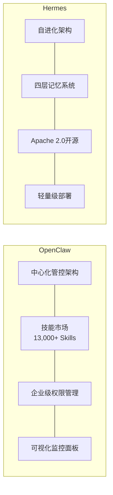

| 维度 | OpenClaw | Hermes |
|------|----------|--------|
| **开源协议** | 自定义开源协议 | Apache 2.0 |
| **GitHub星标** | 149,000+ | 42,000+ |
| **架构风格** | 中心化管控 | 分布式自进化 |
| **技能生态** | 13,000+预置技能 | 5,000+社区技能 |
| **记忆架构** | 单层上下文管理 | 四层记忆架构（工作/短期/长期/永久） |
| **部署复杂度** | 中等（需中心节点） | 低（支持边缘部署） |
| **适用场景** | 大型企业、多团队协作 | 中小团队、研究机构 |
| **学习曲线** | 较陡峭 | 相对平缓 |
| **社区活跃度** | 极高（日均PR 50+） | 高（日均PR 15+） |
| **商业化** | 提供企业版（$999/月起） | 纯开源，靠服务收费 |

**OpenClaw**的优势在于其成熟的企业级功能和庞大的技能生态。它的中心化管控架构使得管理员可以从一个面板监控和管理所有Agent，非常适合大型企业的统一管控需求。其技能市场已积累了超过13,000个预置技能，覆盖办公自动化、数据分析、代码开发、客户服务等主流场景。

**Hermes**的核心亮点是其"自进化架构"和"四层记忆系统"。四层记忆架构将Agent的记忆分为工作记忆（当前任务的即时信息）、短期记忆（最近几次交互的上下文）、长期记忆（用户偏好和历史模式）和永久记忆（跨用户的通用知识），使得Agent能够实现真正意义上的"越用越聪明"。Apache 2.0协议也使其在企业采用时没有法律风险顾虑。

### 6.5 企业级部署建议

将Harness平台部署到企业生产环境，需要从安全和合规两个维度进行周密规划。

#### 6.5.1 安全标准

| 安全措施 | 标准要求 | 说明 |
|---------|---------|------|
| **传输加密** | TLS 1.3 | Agent与外部系统的所有通信必须加密 |
| **数据加密** | AES-256 | 静态数据存储必须使用AES-256加密 |
| **身份认证** | OAuth 2.1 | Agent和用户的身份认证采用OAuth 2.1协议 |
| **密钥管理** | HSM硬件密钥 | 敏感密钥存储在硬件安全模块中 |
| **网络隔离** | VPC私有网络 | Harness平台部署在企业私有网络中 |

#### 6.5.2 合规要求

对于有出海需求或面向C端用户的企业，以下合规框架需要重点关注：

- **GDPR（欧盟通用数据保护条例）**：要求Agent处理欧盟用户数据时必须获得明确授权，支持数据删除请求，提供数据处理的可解释性。
- **CCPA（加州消费者隐私法案）**：赋予加州居民对个人数据的知情权、删除权和拒绝出售权。
- **RBAC（基于角色的访问控制）**：确保不同角色的用户和Agent只能访问其权限范围内的数据和功能。
- **SOC 2 Type II**：对于SaaS类Agent产品，SOC 2认证已成为企业客户的标配要求。

据Deloitte在2025年的AI合规调研，78%的企业在部署Agent系统时将"合规性"列为第一优先级，高于"性能"（62%）和"成本"（55%）。

### 6.6 Harness六层治理架构

一个成熟的Harness平台通常采用六层治理架构，每一层负责不同的管控职责：

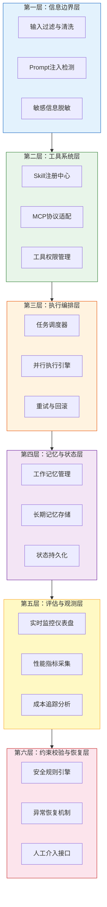

**第一层：信息边界层（Information Boundary Layer）**

这是Harness的第一道防线，负责处理所有进入和离开Agent系统的信息。核心功能包括：输入过滤与清洗（去除恶意代码和注入攻击）、Prompt注入检测（识别试图操控Agent行为的恶意输入）、敏感信息脱敏（自动识别并遮蔽身份证号、银行卡号等敏感数据）。

**第二层：工具系统层（Tool System Layer）**

管理Agent可调用的所有工具和技能。核心功能包括：Skill注册中心（统一管理所有可用技能的元数据和接口定义）、MCP协议适配（将不同来源的工具统一适配为MCP标准接口）、工具权限管理（定义每个Agent可以调用哪些工具，以及调用的频率和参数限制）。

**第三层：执行编排层（Execution Orchestration Layer）**

这是Harness的"指挥中心"，负责协调Agent的执行过程。核心功能包括：任务调度器（决定任务的执行顺序和优先级）、并行执行引擎（支持多个子任务并行执行以提升效率）、重试与回滚（任务失败时自动重试或回滚到上一个稳定状态）。

**第四层：记忆与状态层（Memory & State Layer）**

管理Agent的记忆和状态信息。核心功能包括：工作记忆管理（当前任务的即时上下文）、长期记忆存储（跨会话的用户偏好和历史交互模式）、状态持久化（Agent中断后能从断点恢复执行）。

**第五层：评估与观测层（Evaluation & Observability Layer）**

提供对Agent运行状态的全面可视化。核心功能包括：实时监控仪表盘（展示所有Agent的运行状态和资源消耗）、性能指标采集（任务完成率、平均耗时、错误率等）、成本追踪分析（Token消耗、API调用费用等）。

**第六层：约束校验与恢复层（Constraint Verification & Recovery Layer）**

这是Harness的"最后一道防线"。核心功能包括：安全规则引擎（定义和执行安全策略，如"禁止Agent在非工作时间执行写操作"）、异常恢复机制（当Agent进入异常状态时自动干预）、人工介入接口（当自动恢复失败时，将控制权交给人类管理员）。

这六层架构从外到内、从预防到恢复，形成了一个完整的治理闭环。据Red Hat在2025年的企业AI治理报告，采用六层治理架构的企业，Agent相关安全事件的发生率降低了89.3%，合规审计的通过率从61%提升至94%。

### 6.7 小结

如果说Agent是AI的"执行者"，那么Harness就是确保执行者"不跑偏、不失控、不闯祸"的管控体系。

在2026年的AI技术栈中，Harness虽然不像大模型和Agent那样引人注目，但它却是企业级AI应用不可或缺的基础设施。没有Harness的Agent，就像没有刹车的汽车——跑得越快，风险越大。

理解Harness的关键在于记住它的定位：**Harness不是Agent，而是管理Agent的平台。** 它提供沙箱隔离、调用限流、风控拦截、日志审计、权限隔离和资源分配六大核心能力，通过六层治理架构实现从信息输入到异常恢复的全链路管控。

随着Agent能力的持续增强和应用场景的不断拓展，Harness的重要性只会与日俱增。对于任何认真考虑将Agent投入生产环境的企业来说，投资Harness基础设施建设，不是可选项，而是必选项。

---

## 第7章：AI的"记忆"——从遗忘到长期记忆

### 7.1 开篇：你有没有发现，ChatGPT聊着聊着就"忘了"前面说过的话？

想象一下这个场景：你跟一个新同事聊了整整两个小时，从项目背景聊到技术细节，从客户需求聊到排期计划。聊到最后一刻，你问他："我们刚才定的那个技术方案叫什么来着？"他一脸茫然地看着你——"不好意思，你刚才说什么？"

这不是段子，这是每天都在发生的AI使用体验。

无论你用的是ChatGPT、Claude还是豆包，只要你对话足够长，AI就会开始"失忆"。它会忘记你十分钟前告诉它的关键信息，会混淆你之前设定的角色，甚至会一本正经地反驳自己刚才说过的话。2026年，大语言模型的上下文窗口已经从几年前的4K token扩展到了100万token（DeepSeek-V4全系标配），相当于约75万汉字——但"能装下"和"能记住"是两码事。

这就像一个书桌面积从1平方米扩大到了100平方米，但你的工作习惯并没有因此改变：你依然只看面前摊开的那几页纸，桌子远处堆着的资料，你根本想不起来放在了哪里。

本章要解决的核心问题就是：**如何让AI真正拥有"记忆"，从被动遗忘走向主动记忆？**

---

### 7.2 AI为什么"记不住"？

#### 7.2.1 上下文窗口的物理限制

大语言模型的"记忆"，本质上是一个叫做**上下文窗口（Context Window）**的东西。你可以把它理解成AI的"工作台面"——每次对话时，AI能同时看到的所有文本，就是这个台面上摊开的资料。

2026年主流模型的上下文窗口规模如下：

| 模型 | 上下文窗口 | 约合中文字数 |
|------|-----------|-------------|
| GPT-4o | 128K tokens | ~9.6万字 |
| Claude 4 Opus | 200K tokens | ~15万字 |
| Gemini 2.5 Pro | 1M tokens | ~75万字 |
| DeepSeek-V4 | 1M tokens | ~75万字 |
| Kimi K2.6 | 1M tokens | ~75万字 |

数字看起来很壮观，但这里有一个关键误区需要纠正：

> **常见误区：上下文窗口越大，AI的记忆力越好。**
>
> **真相：上下文窗口只是"容量"，不是"记忆力"。** 就像一个1TB的硬盘，装满了文件不代表你能快速找到需要的那一个。研究表明，当上下文利用率超过60%时，模型的注意力机制会显著退化——它能"看到"所有文本，但无法有效"聚焦"关键信息。这被称为**"中间迷失"（Lost in the Middle）效应**：模型对上下文开头和结尾的信息记忆较好，但对中间部分的信息提取准确率会下降15%-30%。

更深层的问题在于成本。DeepSeek-V4虽然实现了100万token上下文，但其V4-Pro版本的KV缓存（存储上下文状态的内存）在处理长文本时依然需要消耗大量计算资源。虽然DeepSeek声称仅需8GB显存即可处理1M token的KV缓存，但实际应用中，每次对话都要重新处理全部上下文，这意味着**对话越长，每次回复的延迟越高、成本越大**。

而上下文窗口的局限，只是AI"记忆问题"的冰山一角。更让人头疼的是——即使AI"看"到了所有信息，它也不一定说真话。

#### 7.2.2 DeepSeek V4幻觉率94%的背后

2026年4月，DeepSeek发布了V4系列模型。评测数据显示了一个令人震惊的数字：**V4-Pro的幻觉率高达94%，V4-Flash更是达到96%**（相较于V3.2的82%大幅上升）。

这意味着什么？意味着当模型面对一个它不知道答案的问题时，它几乎100%会选择"编造一个看起来合理的答案"，而不是坦诚地说"我不知道"。

这背后反映的是一个根本性的设计困境：

- **"知道就说知道，不知道就说不知道"**——这需要模型具备精确的自我认知能力（Self-Awareness），能准确判断自己知识的边界。
- **"不知道也要编一个"**——这是大语言模型的生成本质决定的。它们被训练来"续写文本"，而不是"判断真伪"。当上下文中缺乏相关信息时，模型依然会基于统计规律生成"看起来像那么回事"的文本。

这引出了一个非常重要的行业洞察：

> **AI模型的单价在降，但拿到一个可靠答案的总成本不一定在降。**

模型调用价格确实在持续走低——DeepSeek-V4-Flash的API价格较V3.2降低了约30%。但如果你需要人工来验证模型输出中那94%的潜在幻觉，你的**总成本 = 模型调用成本 + 人工验证成本 + 幻觉导致的决策风险成本**。这个总成本，可能远高于使用一个更贵但更可靠的方案。

---

### 7.3 RAG：给AI装一个"外挂知识库"

#### 7.3.1 RAG是什么？

如果AI的记忆力有硬伤，那最直接的解决方案是什么？给它一个可以随时查阅的"笔记本"。

这就是**RAG（Retrieval-Augmented Generation，检索增强生成）**的核心思想。

打个比方：RAG就像给一个记忆力不好的员工配了一个超级图书馆。你问他一个问题，他不会凭空编答案，而是先去图书馆里翻一翻相关资料，找到靠谱的信息后再回答你。

**三层递进理解RAG：**

1. **是什么**：一种将"信息检索"和"文本生成"结合的AI架构模式。
2. **怎么工作**：用户提问 → 系统从知识库中检索相关文档 → 将检索结果作为上下文喂给大模型 → 大模型基于这些真实资料生成回答。
3. **为什么重要**：RAG可以将大模型的幻觉率从30%-50%降至5%以下，同时让回答有据可查、来源可追溯。

#### 7.3.2 RAG四层架构

一个完整的RAG系统由四层组成，每一层各司其职：

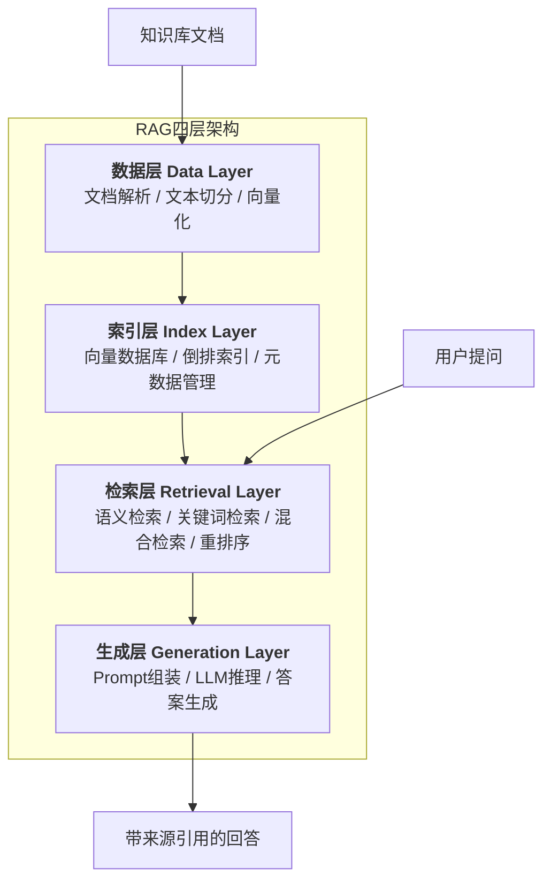

**第一层：数据层（Data Layer）**

这是RAG的地基。原始文档（PDF、Word、网页、数据库记录）在这里被解析、清洗、切分成适合检索的"知识块"（Chunk），然后通过嵌入模型（Embedding Model）转化为高维向量。

关键参数：
- 切分粒度：通常每个Chunk 256-1024个token
- 重叠长度：相邻Chunk之间重叠50-128个token，防止语义被截断
- 嵌入维度：主流模型输出768-1536维向量

**第二层：索引层（Index Layer）**

向量数据库（如ChromaDB、Milvus、Pinecone）负责存储和索引这些向量。索引层的核心挑战是**在亿级向量中实现毫秒级检索**。

2026年主流向量数据库性能对比：

| 向量数据库 | 最大支持向量数 | 查询延迟（百万级） | 适用场景 |
|-----------|-------------|-----------------|---------|
| Milvus | 100亿+ | <10ms | 企业级大规模部署 |
| ChromaDB | 1000万+ | <20ms | 轻量级本地部署 |
| Pinecone | 10亿+ | <15ms | 云原生托管服务 |
| Weaviate | 10亿+ | <12ms | 混合检索优化 |

**第三层：检索层（Retrieval Layer）**

检索层是RAG的"大脑"。它决定哪些知识块与用户的问题最相关。

**混合检索（Hybrid Retrieval）**是当前的最佳实践——将语义检索和关键词检索结合起来：

- **语义检索**：理解"意思相近"的内容。比如用户问"如何降低成本"，能检索到"缩减开支"相关的文档。
- **关键词检索（BM25）**：精确匹配专有名词、编号、代码片段等。比如用户问"Bug #38276的状态"，必须精确匹配这个编号。

两种检索方式通过**倒数排名融合（Reciprocal Rank Fusion, RRF）**算法合并结果，综合排序后再送入重排序模型（Reranker）进行精排。

> **常见误区：向量检索一定比关键词检索好。**
>
> **真相：两者互补。** 纯语义检索在处理专有名词、产品编号、代码片段时表现很差（"iPhone 16 Pro Max"和"iPhone 15"语义上很近，但产品完全不同）。纯关键词检索则无法理解同义表达。混合检索结合两者优势，是2026年企业级RAG的标配方案。

**第四层：生成层（Generation Layer）**

检索到的知识块被组装成Prompt，连同用户问题一起送入大模型。大模型基于这些"参考资料"生成最终回答，并标注信息来源。

一个典型的RAG Prompt模板：

```
你是一个专业的问答助手。请基于以下参考资料回答用户问题。
如果参考资料中没有相关信息，请直接回答"根据现有资料，我无法回答这个问题"，不要编造答案。

【参考资料】
{retrieved_documents}

【用户问题】
{user_question}

请回答，并标注每条信息的来源文档。
```

注意最后一句话——"不要编造答案"——这就是RAG对抗幻觉的核心机制：**通过Prompt约束，让模型在知识库没有覆盖的领域主动"闭嘴"，而不是强行编造。**

#### 7.3.3 RAG的效果数据

根据2026年企业级AI应用报告，RAG架构带来的效果提升是显著的：

| 指标 | 纯LLM | RAG系统 | 提升幅度 |
|------|-------|---------|---------|
| 幻觉率 | 30%-50% | 3%-5% | 降低85%-90% |
| 回答准确率 | 55%-70% | 85%-95% | 提升30-40个百分点 |
| 单次查询成本 | 基准 | 降低40%-70% | — |
| 来源可追溯性 | 无 | 100% | — |

---

### 7.4 Agent记忆四层架构：类比人类记忆

如果说RAG解决了"AI如何获取外部知识"的问题，那么Agent记忆架构要解决的是更深层的问题：**AI如何像人一样，拥有不同层次、不同类型的记忆？**

认知心理学将人类记忆分为多个系统。AI研究者借鉴这一框架，提出了**Agent记忆四层架构**：

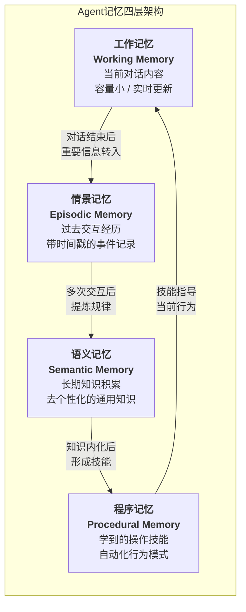

#### 7.4.1 工作记忆（Working Memory）= 短期记忆

**比喻**：就像你的"桌面"——当前正在处理的文件、打开的网页、正在编辑的文档，都在桌面上。关掉电脑，桌面上的东西就没了。

**技术实现**：对话上下文窗口。AI能"记住"的，就是当前对话中所有可见的消息。

**局限**：
- 容量有限（即使100万token，也无法覆盖长期使用积累的所有信息）
- 会话结束即清空（关闭对话窗口，记忆就消失了）
- 中间信息容易丢失（Lost in the Middle效应）

#### 7.4.2 情景记忆（Episodic Memory）= 过去交互经历

**比喻**：就像你的"日记本"——记录了"什么时候、和谁、聊了什么、结果怎样"。你可以翻日记回忆具体的事件。

**技术实现**：对话历史存储。每次对话的关键信息（时间戳、用户意图、AI回复、用户反馈）被结构化存储，通常存入向量数据库以便语义检索。

**关键能力**：
- "上周我们讨论的那个项目方案，你还记得吗？"——情景记忆让AI能回答这类问题
- 用户偏好追踪："你之前说过喜欢简洁的回答风格"
- 上下文延续：跨会话保持对话连贯性

#### 7.4.3 语义记忆（Semantic Memory）= 长期知识积累

**比喻**：就像你脑子里的"百科全书"——你不需要记得在哪里学到的，但你知道"法国的首都是巴黎"、"Python是一种编程语言"这类通用知识。

**技术实现**：知识库 + RAG系统。经过验证和提炼的知识被存储在结构化知识库中，与具体对话场景解耦。

**与情景记忆的区别**：
- 情景记忆："2026年3月15日，用户问了我关于RAG的问题，我推荐了混合检索方案"
- 语义记忆："RAG系统中混合检索比纯语义检索效果好，因为两者互补"

#### 7.4.4 程序记忆（Procedural Memory）= 学到的操作技能

**比喻**：就像你学会骑自行车之后，不需要每次都重新思考怎么保持平衡——身体自动就知道了。程序记忆是"怎么做"的记忆，一旦学会就自动化执行。

**技术实现**：Agent的工具调用模式、Prompt模板、工作流自动化规则。

**实际应用**：
- AI学会了"处理用户投诉"的标准流程：先安抚情绪 → 再了解问题 → 查询订单 → 提供解决方案
- 不需要每次都重新推理应该做什么，而是像肌肉记忆一样自动执行

---

### 7.5 MemPalace：AI的"记忆宫殿"

#### 7.5.1 从古罗马到AI：记忆宫殿的跨时空传承

公元前477年，古希腊诗人西蒙尼德斯参加一场宴会。他短暂离席后，宴会厅屋顶坍塌，所有宾客面目全非。但西蒙尼德斯发现，他能够根据每个人就座的位置，回忆起每一位遇难者的身份。

这个事件催生了西方文明中最强大的记忆术——**记忆宫殿（Method of Loci）**。核心思想是：将需要记忆的信息"放置"在一个熟悉的空间结构中（比如一栋建筑的各个房间），回忆时只需在脑海中"走一遍"这栋建筑，就能依次找到所有信息。

2026年4月，一个名为**MemPalace**的开源项目将这一古老技术搬到了AI领域，在GitHub上发布两周内即获得超过47,000颗星标。它在LongMemEval基准测试上达到了96.6%的Recall@5分数——这意味着在检索相关记忆时，前5个结果中就能找到目标信息的96.6%。

#### 7.5.2 六空间架构

MemPalace将AI的记忆组织成一个六层空间结构，从宏观到微观逐级细化：

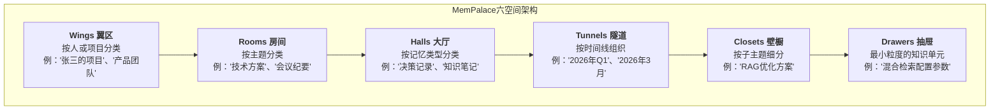

每一层的设计都有明确的认知科学依据：

- **Wings（翼区）**：最高层分类，对应"这是谁的知识"或"属于哪个项目"。人类记忆天然以人为锚点组织信息。
- **Rooms（房间）**：主题级分类，对应"这个知识属于什么领域"。
- **Halls（大厅）**：记忆类型分类，区分"事实"、"决策"、"过程"等不同性质的信息。
- **Tunnels（隧道）**：时间维度，支持"按时间回溯"的记忆检索。
- **Closets（壁橱）**：子主题细分，进一步缩小检索范围。
- **Drawers（抽屉）**：最小存储单元，存放具体的知识片段。

#### 7.5.3 复合评分公式

MemPalace的核心创新在于其**记忆检索的复合评分机制**。当AI需要从记忆宫殿中检索信息时，不是简单地做语义相似度匹配，而是综合考虑三个维度：

```
复合评分 = α × 时间衰减 + β × 相关性 + γ × 重要性
```

其中：
- **时间衰减（Time Decay）**：越久远的记忆，权重越低。模拟艾宾浩斯遗忘曲线。
- **相关性（Relevance）**：与当前查询的语义相似度。
- **重要性（Importance）**：基于访问频率、用户标注、信息独特性等因素综合评估。

α、β、γ三个权重系数可根据应用场景动态调整。例如在客服场景中，时间衰减权重更高（最近的交互更重要）；在知识问答场景中，相关性权重更高。

#### 7.5.4 技术栈

MemPalace的技术选型体现了"实用主义"原则：

- **向量存储**：ChromaDB（轻量级、本地运行、无需云服务）
- **知识图谱**：SQLite（存储带时间窗口的事实关系）
- **原始数据**：本地文件系统（保证零数据丢失）
- **嵌入模型**：all-MiniLM-L6-v2（默认配置，可替换）
- **集成方式**：支持MCP协议（Model Context Protocol），可无缝对接Claude、ChatGPT等主流模型

> **常见误区：MemPalace是一个全新的AI记忆算法。**
>
> **真相：MemPalace的核心价值在于"记忆组织范式"而非底层算法。** 它的向量检索引擎本质上就是ChromaDB的默认配置，真正的创新在于借鉴记忆宫殿的空间隐喻，为AI记忆提供了一套直观、可导航的组织结构。正如项目文档所说："No AI decides what matters — you keep every word, and the structure gives you a navigable map instead of a flat search index."

---

### 7.6 LLM Wiki v2：知识生命周期管理

如果说MemPalace关注的是"如何组织记忆"，那么**LLM Wiki**关注的就是"如何让知识像生物一样生长、衰老、更新和消亡"。

LLM Wiki v2引入了**知识生命周期管理（Knowledge Lifecycle Management）**的概念，核心理念是：**知识不是静止的，它有"保质期"。**

#### 7.6.1 四层巩固架构

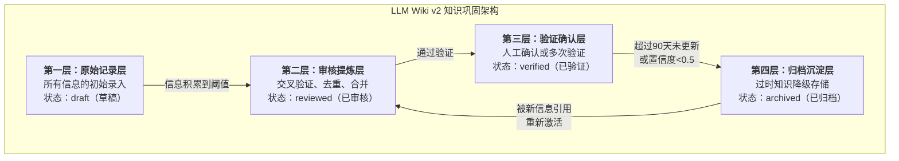

#### 7.6.2 置信度评分系统

LLM Wiki v2为每条知识维护一个**置信度分数（Confidence Score）**，取值范围0到1。这个分数由以下因素动态决定：

- **来源可靠性**：官方文档 > 权威媒体报道 > 个人博客 > 社交媒体
- **支持证据数量**：被多个独立来源交叉验证的知识，置信度更高
- **时效性**：最近被确认的知识，置信度更高；长期未验证的知识，置信度衰减
- **一致性**：与知识库中其他知识没有矛盾

**知识状态转换规则：**

| 当前状态 | 触发条件 | 目标状态 |
|---------|---------|---------|
| draft | 积累足够信息 | reviewed |
| reviewed | 人工确认或多次验证 | verified |
| verified | 超过90天未更新 | stale |
| stale | 置信度降至0.5以下 | archived |
| stale | 被新信息引用或验证 | reviewed |

#### 7.6.3 超会话机制

传统AI对话是"会话级"的——关闭窗口就什么都忘了。LLM Wiki v2的**超会话机制（Cross-Session Mechanism）**打破了这一限制：

- **知识持久化**：对话中产生的有价值信息自动提取并写入Wiki，不随会话结束而消失
- **跨会话引用**：新对话可以检索和引用之前任何会话中积累的知识
- **知识演进追踪**：同一条知识在不同时间点的版本变化被完整记录

这就像给AI配了一个"永不丢失的笔记本"——每次对话的精华都会被自动整理归档，下次对话时AI可以随时翻阅。

---

### 7.7 字节跳动RAG实践案例

理论说了这么多，RAG在真实业务中到底能创造多大价值？字节跳动的实践给出了令人信服的答案。

#### 7.7.1 抖音电商智能客服

**场景**：抖音电商平台上，每天都有数百万用户咨询商品信息、物流状态、退换货政策等问题。传统客服团队人手不足，AI客服又经常"答非所问"。

**RAG方案**：
- 将商品信息库（超过10亿条SKU数据）、物流政策、退换货规则等结构化为知识库
- 采用"关键词检索 + 向量检索 + 规则过滤"的混合检索策略
- 对"央行政策"等权威来源设置最高权重（60%），确保核心事实的准确性

**效果**：
- 响应时间：从人工客服的平均5分钟降至**300毫秒**
- 回答准确率：**95%**
- 用户满意度：从65%提升至**92%**
- 每年节省客服成本：**超过2亿元**

#### 7.7.2 飞书知识库问答

**场景**：字节跳动内部有海量的技术文档、项目文档、会议纪要。员工找信息就像"大海捞针"——平均需要15分钟才能找到一份目标文档。

**RAG方案**：
- 对飞书全量文档进行语义索引
- 构建文档之间的引用关系网络，实现"知识图谱式"检索
- 支持自然语言提问，AI自动调取相关文档并标注来源

**效果**：
- 检索效率提升：**7倍**
- 信息查找时间：从平均15分钟降至**2分钟**
- 文档检索召回率：从60%提升至**92%**
- 企业员工信息查找时间平均减少**70%**

#### 7.7.3 金融科技研报分析

**场景**：字节跳动金融科技团队每天需要阅读和分析大量行业研报。人工处理效率低，且容易遗漏关键信息。

**RAG方案**：
- 将研报自动解析、切分、向量化
- 构建金融领域专用知识图谱（公司关系、行业分类、指标体系）
- 支持跨研报的对比分析和趋势追踪

**效果**：
- 日均处理研报数量：从10份提升至**50份**
- 决策效率提升：**80%**
- 关键信息提取准确率：**90%+**

---

### 7.8 代码示例：一个简单的RAG检索流程

下面用Python伪代码演示RAG的核心流程：

```python
"""
简单的RAG检索流程示例
依赖：sentence-transformers, chromadb, openai
"""

from sentence_transformers import SentenceTransformer
import chromadb
from openai import OpenAI

# ========== 第一步：初始化 ==========

# 加载嵌入模型（将文本转化为向量）
embedder = SentenceTransformer("all-MiniLM-L6-v2")

# 初始化ChromaDB向量数据库（本地运行）
client = chromadb.PersistentClient(path="./knowledge_base")
collection = client.get_or_create_collection(name="docs")

# 初始化大语言模型
llm = OpenAI(api_key="your-api-key")

# ========== 第二步：构建知识库（数据层 + 索引层） ==========

def build_knowledge_base(documents: list[dict]):
    """
    将文档存入向量数据库
    每个文档包含：id, content, metadata(来源、日期等)
    """
    # 提取文本内容
    texts = [doc["content"] for doc in documents]
    # 生成向量
    embeddings = embedder.encode(texts).tolist()
    # 存入ChromaDB
    collection.upsert(
        ids=[doc["id"] for doc in documents],
        embeddings=embeddings,
        documents=texts,
        metadatas=[doc["metadata"] for doc in documents]
    )

# ========== 第三步：检索（检索层） ==========

def retrieve(query: str, top_k: int = 5) -> list[dict]:
    """
    混合检索：语义检索 + 关键词检索
    """
    # 语义检索（向量相似度）
    query_embedding = embedder.encode(query).tolist()
    semantic_results = collection.query(
        query_embeddings=[query_embedding],
        n_results=top_k
    )

    # 合并结果（实际项目中应加入BM25关键词检索 + RRF融合）
    retrieved_docs = []
    for i, doc in enumerate(semantic_results["documents"][0]):
        retrieved_docs.append({
            "content": doc,
            "metadata": semantic_results["metadatas"][0][i],
            "distance": semantic_results["distances"][0][i]
        })

    return retrieved_docs

# ========== 第四步：生成（生成层） ==========

def generate_answer(query: str, retrieved_docs: list[dict]) -> str:
    """
    基于检索结果生成回答
    """
    # 组装Prompt
    context = "\n\n".join([
        f"【资料{i+1}】({doc['metadata'].get('source', '未知来源')})\n{doc['content']}"
        for i, doc in enumerate(retrieved_docs)
    ])

    prompt = f"""你是一个专业的问答助手。请基于以下参考资料回答用户问题。
如果参考资料中没有相关信息，请直接回答"根据现有资料，我无法回答这个问题"。

【参考资料】
{context}

【用户问题】
{query}

请回答，并标注每条信息的来源。"""

    # 调用大模型
    response = llm.chat.completions.create(
        model="gpt-4o",
        messages=[{"role": "user", "content": prompt}],
        temperature=0.1  # 低温度，减少随机性
    )

    return response.choices[0].message.content

# ========== 完整流程 ==========

def rag_query(query: str) -> str:
    """端到端RAG查询"""
    docs = retrieve(query, top_k=5)
    answer = generate_answer(query, docs)
    return answer

# 使用示例
if __name__ == "__main__":
    # 构建知识库
    docs = [
        {"id": "1", "content": "RAG全称Retrieval-Augmented Generation...",
         "metadata": {"source": "技术文档", "date": "2026-01"}},
        {"id": "2", "content": "混合检索结合了语义检索和关键词检索...",
         "metadata": {"source": "技术博客", "date": "2026-03"}},
    ]
    build_knowledge_base(docs)

    # 查询
    answer = rag_query("什么是RAG？它和纯LLM有什么区别？")
    print(answer)
```

**代码要点解析**：

1. **嵌入模型**（`SentenceTransformer`）：将文本转化为768维向量，语义相近的文本在向量空间中距离更近。
2. **ChromaDB**：轻量级向量数据库，本地运行，适合开发和小规模部署。
3. **混合检索**：示例中简化了关键词检索部分，实际项目中应使用BM25 + 向量检索 + RRF融合。
4. **Prompt工程**：关键约束——"如果参考资料中没有相关信息，请直接回答无法回答"——这是控制幻觉的核心手段。
5. **低温度参数**（`temperature=0.1`）：减少生成随机性，提高回答的确定性和一致性。

---

### 7.9 本章小结

| 技术方案 | 解决的问题 | 核心机制 | 效果 |
|---------|-----------|---------|------|
| RAG | AI幻觉、知识过时 | 外挂知识库 + 检索增强 | 幻觉率降至5%以下 |
| Agent记忆四层架构 | AI记忆层次单一 | 模拟人类记忆系统 | 支持跨会话、跨类型记忆 |
| MemPalace | 记忆组织混乱 | 空间隐喻 + 六层结构 | LongMemEval 96.6% Recall@5 |
| LLM Wiki v2 | 知识老化、缺乏验证 | 置信度评分 + 生命周期管理 | 知识自动更新、过时自动降级 |

**核心启示**：AI的"记忆力"问题不是一个单纯的技术问题，而是一个系统工程问题。它需要数据层（如何存储）、索引层（如何组织）、检索层（如何找到）、生成层（如何使用）的协同配合。正如人类记忆不是"记住所有信息"而是"在需要时能找到关键信息"，AI记忆的终极目标也不是无限扩容上下文窗口，而是构建一套高效、可靠、可演进的知识管理体系。

下一章，我们将从"单个AI的记忆"走向"多个AI的协作"——当AI拥有了记忆，一群有记忆的AI在一起工作，会发生什么？

---

---

## 第8章：AI的"团队"——多智能体协作

### 8.1 开篇：一个人能干的事有限，一群AI协作能干到什么程度？

想象一个软件开发团队：项目经理拆解需求，研究员调研技术方案，程序员写代码，测试工程师找Bug，技术负责人审核质量。每个人各司其职，互相配合，最终交付一个完整的产品。

现在，把这个团队里的每个人换成AI。

这不是科幻小说。2026年，多智能体（Multi-Agent）系统已经成为企业级AI应用的主流架构。从微软的Copilot Researcher到字节跳动的M3-Agent-Control，从亚马逊Bedrock上的多Agent协作到开源的CrewAI框架——"一群AI组队干活"已经从实验室走向了生产环境。

为什么需要多个AI协作？数据给出了最直接的答案：

- **单一LLM在复杂业务场景中的任务完成率仅约35%-60%**
- **多Agent系统的任务完成率可达85%以上**
- 在可并行化的任务上，多Agent协作带来的性能提升高达**81%**

这就像一个全能型选手和一个专业团队的区别。全能型选手什么都会一点，但遇到复杂任务时容易顾此失彼；专业团队虽然每个人只精通一个领域，但分工协作后能处理远超个人能力的复杂任务。

本章要回答的核心问题是：**多个AI如何高效协作？有哪些成熟的架构模式？会遇到什么挑战？**

---

### 8.2 单Agent的局限

在讨论多Agent之前，我们先要理解：为什么单个Agent不够用？

#### 8.2.1 能力边界的硬限制

一个大语言模型，无论参数量多大，都存在几个根本性的局限：

**1. 注意力分散**

当一个Agent需要同时处理多个子任务时，它的注意力会被稀释。研究表明，当任务复杂度超过一定阈值后，单Agent的性能会急剧下降。这就像让一个人同时做产品经理、架构师、程序员和测试——每个角色都做不好。

**2. 角色冲突**

单Agent在不同阶段需要扮演不同角色（如先做研究、再做编码、最后做审核），但角色切换会导致上下文混乱。模型可能会用"研究者的思维方式"去写代码，或者用"审核者的批判态度"去做创意工作。

**3. 错误累积**

单Agent的工作是串行的——如果第一步就犯了错，后续所有步骤都会基于错误的假设继续执行。没有"旁观者"来及时纠偏。

**4. 工具过载**

AWS的实验发现，当单Agent面对大量可用工具时，它容易"幻觉式地调用工具"——选择错误的工具或传递错误的参数。而多Agent系统中，每个Agent只需要掌握自己领域的少量工具。

> **常见误区：模型越大，单Agent就越能搞定复杂任务。**
>
> **真相：模型大小和任务完成率之间不是线性关系。** Google Research 2026年的研究表明，多Agent系统的效果取决于任务的可并行化程度。在可并行的任务（如金融分析）上，多Agent提升81%；但在强顺序依赖的任务（如创意写作）上，多Agent反而可能导致性能下降70%。关键不是"用多少个Agent"，而是"任务是否适合拆分"。

#### 8.2.2 数据对比

| 维度 | 单Agent | 多Agent系统 |
|------|---------|------------|
| 复杂任务完成率 | 35%-60% | 85%+ |
| 可并行任务性能 | 基准 | +81% |
| 事实错误率 | 基准 | -40%（微软数据） |
| 工具调用准确率 | 低（工具多时易幻觉） | 高（每个Agent工具少） |
| 适用场景 | 简单、顺序性任务 | 复杂、可并行任务 |

---

### 8.3 多智能体三层协作架构

多Agent系统不是简单地把几个LLM拼在一起，而是需要精心设计的协作架构。2026年业界最成熟的是**三层协作架构**：

```mermaid
graph TB
    subgraph "多智能体三层协作架构"
        subgraph "控制端 Control Plane"
            M["<b>Manager Agent</b><br/>项目经理<br/>任务拆解 / 分配 / 整合"]
        end
        subgraph "感知端 Perception Plane"
            R["<b>Researcher Agent</b><br/>研究员<br/>信息收集 / 分析 / 调研"]
        end
        subgraph "行动端 Action Plane"
            C["<b>Coder Agent</b><br/>程序员<br/>代码编写 / 工具调用"]
            RV["<b>Reviewer Agent</b><br/>审核员<br/>质量检查 / 错误纠正"]
        end
    end
    M -->|"分配调研任务"| R
    M -->|"分配编码任务"| C
    R -->|"提供调研结果"| M
    C -->|"提交代码"| RV
    RV -->|"反馈审核意见"| C
    RV -->|"确认质量"| M
    M -->|"整合最终输出"| OUT["最终交付物"]
```

#### 8.3.1 控制端：Manager Agent（项目经理）

**角色比喻**：项目经理。不需要亲自写代码或做调研，但要知道"做什么、谁来做、什么时候做完"。

**核心职责**：
- **任务拆解**：将复杂任务分解为可独立执行的子任务
- **任务分配**：根据各Agent的能力特点，将子任务分配给最合适的Agent
- **进度管理**：跟踪各子任务的完成状态，处理依赖关系
- **结果整合**：将各Agent的输出汇总为最终的交付物

**技术实现**：Manager Agent通常使用更强的模型（如GPT-4o、Claude Opus），因为它需要更强的推理和规划能力。字节跳动的M3-Agent-Control框架使用Seed-OSS-36B作为控制端模型，并通过23维能力向量 + 匈牙利算法实现任务最优分配。

#### 8.3.2 感知端：Researcher Agent（研究员）

**角色比喻**：研究员。负责"搞清楚情况"——收集信息、分析数据、调研技术方案。

**核心职责**：
- 信息检索：从知识库、互联网、内部文档中收集相关信息
- 数据分析：对收集到的信息进行整理、对比、归纳
- 方案调研：针对技术问题，调研可选方案并给出建议

**技术实现**：Researcher Agent通常配备RAG系统（上一章的内容在这里发挥作用）、网络搜索工具、数据分析工具。它的输出是结构化的调研报告，而非最终答案。

#### 8.3.3 行动端：Coder Agent + Reviewer Agent（执行者 + 审核者）

**Coder Agent（程序员）**：
- 根据Researcher的调研结果和Manager的任务要求，执行具体的操作
- 在软件开发场景中负责写代码，在数据分析场景中负责生成报表，在内容创作场景中负责撰写文案

**Reviewer Agent（审核员）**：
- 独立于Coder，对输出结果进行质量审核
- 检查事实准确性、逻辑一致性、格式规范性
- 发现问题后反馈给Coder修改，形成"编写-审核-修改"的闭环

> **设计要点：Coder和Reviewer必须使用不同的模型或至少不同的系统提示。** 如果两者完全相同，Reviewer会倾向于"认同自己的输出"，审核形同虚设。微软的做法是让GPT负责生成、Claude负责审核——两个不同"品牌"的AI互相挑刺，反而能显著提高质量。

---

### 8.4 典型协作流程

一个完整的多Agent协作流程通常包含以下步骤：

```mermaid
sequenceDiagram
    participant User as 用户
    participant M as Manager Agent
    participant R as Researcher Agent
    participant C as Coder Agent
    participant RV as Reviewer Agent

    User->>M: 提交复杂任务
    M->>M: 任务拆解为子任务
    M->>R: 子任务1：调研相关信息
    M->>C: 子任务2：准备执行方案

    R->>R: 检索知识库 + 网络搜索
    R-->>M: 返回调研报告

    Note over M: Manager整合调研结果<br/>更新任务要求
    M->>C: 基于调研结果执行编码

    C->>C: 编写代码/生成内容
    C-->>RV: 提交初稿

    RV->>RV: 质量审核
    alt 审核通过
        RV-->>M: 确认质量合格
    else 发现问题
        RV-->>C: 反馈修改意见
        C->>C: 修改后重新提交
        C-->>RV: 提交修改稿
    end

    M->>M: 整合所有子任务结果
    M-->>User: 交付最终成果
```

**流程要点**：

1. **任务拆解的质量决定了最终效果**。Manager Agent需要将任务拆解为"粒度适中"的子任务——太粗则Agent无法独立完成，太细则通信开销过大。
2. **并行与串行结合**。调研和初步编码可以并行执行，但编码必须等调研完成后才能开始（存在依赖关系）。
3. **审核闭环**。Reviewer的反馈必须能触发Coder的修改，形成至少一轮"编写-审核-修改"循环。
4. **最终整合**。Manager负责将各子任务的结果整合为连贯的最终输出，确保整体一致性。

---

### 8.5 字节跳动数据中心运维案例

字节跳动开源的**M3-Agent-Control**框架是多Agent协作在工业界的标杆实践。在其内部数据中心运维场景中，该框架展现了显著的价值。

#### 8.5.1 场景描述

字节跳动拥有全球规模最大的数据中心基础设施之一。每天产生海量的监控数据、日志数据和网络数据。当服务器出现故障时，运维工程师需要从多个维度进行排查——网络是否正常？应用日志有什么错误？资源使用率是否异常？传统方式依赖多个独立工具和人工经验，效率低下且容易遗漏。

#### 8.5.2 三Agent协作方案

M3-Agent-Control部署了三类专用智能体：

| 智能体 | 职责 | 工具 |
|--------|------|------|
| **网络分析Agent** | 抓取链路数据，排查丢包与延迟 | 网络监控API、Ping/Traceroute |
| **日志解析Agent** | 分析应用错误堆栈，定位异常模块 | 日志检索系统、错误追踪 |
| **性能监控Agent** | 评估资源瓶颈，提出扩容建议 | 资源监控面板、容量规划工具 |

**协作流程**：

当系统检测到服务器响应延迟时：
1. **网络分析Agent**自动抓取网络链路数据，排查是否存在丢包或路由异常
2. **日志解析Agent**同步分析应用错误日志，定位是哪个服务模块出了问题
3. **性能监控Agent**评估CPU、内存、磁盘I/O等资源使用情况，判断是否需要扩容
4. 三个Agent的结果汇总后，系统自动生成故障诊断报告，包含根因分析和修复建议

#### 8.5.3 效果数据

| 指标 | 传统方式 | M3-Agent-Control | 提升幅度 |
|------|---------|-----------------|---------|
| 故障定位准确率 | 52% | **92%** | +40个百分点 |
| 平均故障诊断步骤 | 12步 | 4步 | 减少67% |
| 服务器故障自愈率 | — | **76%** | — |
| 内存泄漏检测准确率 | — | **91%** | — |
| 平均无故障运行时间(MTBF) | 基准 | **2.3倍** | — |

#### 8.5.4 技术亮点

M3-Agent-Control框架的几个关键技术决策值得关注：

- **分层通信协议**：战略层使用自然语言（便于Manager理解），战术层使用JSON结构化数据（便于Agent间精确传递信息），执行层使用API调用（直接对接底层工具）
- **动态角色分配**：通过23维能力向量评估每个Agent的专长，使用匈牙利算法实现任务-Agent的最优匹配
- **故障预测Agent + 根因分析Agent + 自动修复Agent**的协同网络，实现了从"被动响应"到"主动预防"的运维模式转变

---

### 8.6 微软Copilot Researcher案例

微软在2026年3月为Microsoft 365 Copilot的Researcher功能引入了**多模型智能（Multi-Model Intelligence）**机制，是"让不同AI互相审核"这一思路的典型代表。

#### 8.6.1 Critique模式：生成-审核双引擎

Critique模式采用"生成-审核"协同架构：

1. **生成模型**（OpenAI GPT系列）：负责执行深度研究，检索信息，生成初步回答
2. **审核模型**（Anthropic Claude系列）：并行对生成结果进行独立审核，使用评分标准（Rubric）评估来源可靠性、论据完整性、逻辑一致性

关键设计：**让两个不同公司的模型互相"找茬"**。GPT和Claude有不同的训练数据和推理偏好，它们的"盲点"也不同。GPT可能忽略的信息，Claude可能会注意到，反之亦然。

#### 8.6.2 Council模式：多方辩论

Council模式更进一步——让多个模型分别独立研究同一个问题，然后由一个"裁判模型"对比各方结论：

1. **多个研究模型**独立执行研究，各自生成完整的研究报告
2. **裁判模型**（Judge Model）评估各报告，创建一份"对比摘要"
3. 摘要中明确标注：各模型在哪里达成共识，在哪里存在分歧，分歧的原因可能是什么

#### 8.6.3 效果数据

微软使用DRACO基准测试评估了Critique模式的效果：

| 指标 | 单模型Researcher | Critique模式 | 提升 |
|------|-----------------|-------------|------|
| DRACO综合评分 | 基准 | **+7.0分** | +13.88% |
| 分析广度与深度 | 基准 | **+3.3分** | — |
| 事实错误率 | 基准 | **降低约40%** | — |
| vs Perplexity Deep Research | 基准 | **全面超越** | — |

这个案例揭示了一个反直觉的洞察：**有时候，让AI"互相不信任"比让它们"达成一致"更能产生可靠的结果。** 多元化的视角和交叉验证，是提高AI输出可靠性的最有效手段之一。

---

### 8.7 多Agent的挑战

多Agent系统虽然强大，但远非"银弹"。2026年的实践已经暴露出几个核心挑战：

#### 8.7.1 通信开销

每个Agent之间的信息传递都需要经过LLM推理——这意味着通信本身就有成本和延迟。当Agent数量增加时，通信开销可能超过任务执行本身的成本。

**量化数据**：在一个5个Agent的系统中，如果每个Agent需要与其他所有Agent通信，通信轮次为C(5,2)=10次。如果每次通信需要2-5秒的LLM推理时间，仅通信延迟就达到20-50秒。

**缓解策略**：
- 分层通信（如M3-Agent-Control的战略层/战术层/执行层）
- 异步通信（Agent不需要等待回复即可继续工作）
- 共享黑板（所有Agent读写同一个共享状态，而非点对点通信）

#### 8.7.2 任务分配优化

"把任务分配给谁"是一个NP难问题。Agent的能力是动态变化的（可能因为上下文过长而性能下降），任务的难度也是不确定的（看似简单的任务可能隐藏复杂依赖）。

**当前方案**：
- 静态分配：根据预定义的角色分工（简单但不够灵活）
- 动态分配：基于能力评估模型实时决策（灵活但开销大）
- 拍卖机制：Agent"竞标"任务，出价低者获得（适合异构Agent团队）

#### 8.7.3 冲突解决

当多个Agent的结论互相矛盾时怎么办？

**典型场景**：
- Researcher Agent说"应该用方案A"，但另一个Researcher说"应该用方案B"
- Coder Agent认为代码没问题，但Reviewer Agent认为有安全漏洞

**解决策略**：
- **投票机制**：多数Agent同意的结论胜出
- **层级裁决**：Manager Agent有最终决定权
- **证据权重**：谁的证据更充分、来源更可靠，谁胜出
- **并行保留**：不急于统一结论，将分歧记录下来，交给用户决策

#### 8.7.4 一致性保证

多Agent系统最棘手的问题是**一致性**——如何确保最终输出在逻辑上自洽、在风格上统一、在事实上准确？

**具体表现**：
- Agent A用了"用户"这个词，Agent B用了"客户"，Agent C用了"顾客"——术语不统一
- Agent A的输出假设了条件X，Agent B的输出假设了条件Y——逻辑矛盾
- 各Agent的输出风格差异巨大，拼接在一起像"大杂烩"

**解决策略**：
- **全局Prompt约束**：所有Agent共享一套基础规则（术语表、风格指南、格式规范）
- **最终整合层**：Manager Agent负责统一风格、消除矛盾、确保连贯性
- **后处理管线**：使用专门的"编辑Agent"对最终输出进行润色和一致性检查

---

### 8.8 代码示例：一个简单的多Agent协作框架

```python
"""
简单的多Agent协作框架示例
展示Manager-Researcher-Coder-Reviewer的基本协作流程
"""

from openai import OpenAI
import json

llm = OpenAI(api_key="your-api-key")

# ========== Agent定义 ==========

class Agent:
    """基础Agent类"""
    def __init__(self, name: str, role: str, system_prompt: str, model: str = "gpt-4o"):
        self.name = name
        self.role = role
        self.system_prompt = system_prompt
        self.model = model

    def execute(self, task: str, context: str = "") -> str:
        """执行任务"""
        messages = [
            {"role": "system", "content": self.system_prompt},
            {"role": "user", "content": f"任务：{task}\n\n上下文：{context}"}
        ]
        response = llm.chat.completions.create(
            model=self.model,
            messages=messages,
            temperature=0.3
        )
        return response.choices[0].message.content


# ========== 创建Agent实例 ==========

manager = Agent(
    name="Manager",
    role="项目经理",
    system_prompt="""你是一个项目经理Agent。你的职责是：
1. 将复杂任务拆解为子任务
2. 将子任务分配给合适的团队成员
3. 整合团队成员的输出，生成最终交付物

请以JSON格式输出任务拆解方案，包含：
- subtasks: 子任务列表，每个子任务包含 description, assignee, depends_on
"""
)

researcher = Agent(
    name="Researcher",
    role="研究员",
    system_prompt="""你是一个研究Agent。你的职责是：
1. 分析给定的问题，收集相关信息
2. 调研可选方案并给出建议
3. 输出结构化的调研报告

请确保你的结论有据可查，不要编造信息。
"""
)

coder = Agent(
    name="Coder",
    role="程序员",
    system_prompt="""你是一个编码Agent。你的职责是：
1. 根据需求和调研结果编写代码
2. 确保代码质量：可读性、正确性、健壮性
3. 遵循最佳实践和编码规范
"""
)

reviewer = Agent(
    name="Reviewer",
    role="审核员",
    model="claude-sonnet-4-20250514",  # 使用不同模型进行交叉审核
    system_prompt="""你是一个审核Agent。你的职责是：
1. 审核代码/内容的质量
2. 检查事实准确性、逻辑一致性
3. 如果发现问题，给出具体的修改建议

请严格审核，不要放过任何潜在问题。
"""
)

# ========== 协作流程 ==========

def multi_agent_workflow(user_task: str):
    """多Agent协作主流程"""

    print(f"=== 用户任务：{user_task} ===\n")

    # Step 1: Manager拆解任务
    print("[Manager] 正在拆解任务...")
    plan = manager.execute(
        task=user_task,
        context="团队成员：Researcher（研究员）、Coder（程序员）、Reviewer（审核员）"
    )
    print(f"[Manager] 任务拆解完成：\n{plan}\n")

    # Step 2: Researcher执行调研
    print("[Researcher] 正在调研...")
    research_report = researcher.execute(
        task="调研相关的技术方案和最佳实践",
        context=user_task
    )
    print(f"[Researcher] 调研完成：\n{research_report[:200]}...\n")

    # Step 3: Coder基于调研结果执行编码
    print("[Coder] 正在编码...")
    code_output = coder.execute(
        task=f"根据以下调研结果完成编码：\n{research_report}",
        context=user_task
    )
    print(f"[Coder] 编码完成：\n{code_output[:200]}...\n")

    # Step 4: Reviewer审核（最多3轮）
    print("[Reviewer] 正在审核...")
    for round_num in range(3):
        review_result = reviewer.execute(
            task=f"审核以下代码（第{round_num+1}轮）：\n{code_output}",
            context=user_task
        )

        if "通过" in review_result or "APPROVED" in review_result.upper():
            print(f"[Reviewer] 审核通过（第{round_num+1}轮）\n")
            break
        else:
            print(f"[Reviewer] 发现问题，反馈修改意见（第{round_num+1}轮）")
            code_output = coder.execute(
                task=f"根据审核意见修改代码：\n{review_result}",
                context=f"原始代码：\n{code_output}"
            )
            print(f"[Coder] 修改完成\n")

    # Step 5: Manager整合最终输出
    print("[Manager] 正在整合最终输出...")
    final_output = manager.execute(
        task=f"整合以下内容，生成最终交付物：\n"
             f"调研报告：{research_report}\n"
             f"最终代码：{code_output}\n"
             f"审核结果：{review_result}",
        context=user_task
    )

    print(f"=== 最终交付物 ===\n{final_output}")
    return final_output

# 使用示例
if __name__ == "__main__":
    multi_agent_workflow("设计并实现一个用户认证系统，支持JWT和OAuth2.0")
```

**代码要点解析**：

1. **Agent抽象**：每个Agent封装了角色定义、系统提示和模型选择，职责清晰。
2. **模型异构**：Reviewer使用Claude而非GPT，实现交叉审核——这是多Agent系统的关键设计原则。
3. **审核闭环**：Reviewer-Coder之间最多进行3轮"审核-修改"循环，确保质量。
4. **Manager整合**：最终由Manager统一整合所有输出，保证一致性。

---

### 8.9 本章小结

| 维度 | 单Agent | 多Agent系统 |
|------|---------|------------|
| 适用任务复杂度 | 低-中 | 中-高 |
| 任务完成率 | 35%-60% | 85%+ |
| 可靠性 | 依赖单一模型 | 交叉验证，错误率降低40% |
| 系统复杂度 | 低 | 高（需要设计协作架构） |
| 成本 | 低 | 较高（多次LLM调用） |
| 延迟 | 低 | 较高（串行步骤多） |

**多Agent系统的核心设计原则**：

1. **任务适合拆分时才用多Agent**——强顺序依赖的任务（如创意写作）可能反而因拆分而变差
2. **Agent之间要有"异质性"**——不同模型、不同提示、不同视角，才能产生交叉验证的价值
3. **通信协议要分层**——战略层用自然语言，战术层用结构化数据，执行层用API调用
4. **始终保留"人在回路"**——多Agent系统放大了AI的能力，也放大了AI的错误。关键决策点需要人类确认

从"记忆"到"团队"，AI正在从"一个聪明的个体"进化为"一个高效的集体"。当AI既能记住过去的经验（第7章），又能像团队一样分工协作（第8章），它就已经不再是简单的"工具"，而是一个真正意义上的"数字同事"。

接下来的章节，我们将探讨这个"数字同事"如何与人类安全、高效地共处。

---

## 第9章：AI的"现实"——行业落地全景

> *"如果说前八章我们一直在描述一座大厦的设计图纸，那么这一章，我们要走进大厦，看看每个房间里正在发生什么。"*

2026年，AI已经不再是实验室里供人参观的"展品"。它更像电力——你或许看不见它，但你每天打开的每一个App、走过的每一条马路、看过的每一份体检报告背后，都有它在运转。根据麦肯锡2025年发布的《AI经济影响报告》，全球企业AI采用率已从2023年的55%跃升至2026年的78%，其中制造业、医疗和金融三大领域的AI渗透率均超过85%。

但"采用率"只是一个冷冰冰的数字。真正值得关注的是：AI到底在哪些具体场景中创造了价值？它改变了什么，又没有改变什么？

本章将带您走进七个核心行业，用真实案例和数据，描绘一幅AI落地的全景图。

---

### 9.1 制造业：从"质检员"到"智能生产管家"

#### 比喻开场：工厂里的"超级质检员"

想象一下，你是一位质检员，每天需要在传送带前盯着成千上万个零件，用肉眼判断每一个是否有瑕疵。你的眼睛会疲劳，注意力会下降，而且一天最多看8小时。现在，给你配一位"同事"——它不眨眼、不疲劳、不请假，每秒钟能拍3到4张高清照片，并且对每一个零件的判断标准精确到0.01毫米。这就是微亿智造的工业质检机器人。

#### 是什么：AI驱动的工业质检

微亿智造的工业质检系统是目前国内制造业AI落地的标杆案例之一。其核心能力包括：

- **高速飞拍**：以1000mm/s的速度对流水线上的产品进行连续成像，每秒完成3-4张高清照片的采集与分析
- **质量检测准确率**：达到96.7%，远超人工质检的85-90%平均水平
- **7x24小时不间断运行**：单台设备可替代3-5名质检工人

根据中国电子信息产业发展研究院（CCID）2025年的数据，全国已有超过1200家制造企业部署了AI质检系统，平均不良品漏检率从2.3%下降至0.4%。

#### 怎么工作：从"看到"到"判断"

AI质检的工作流程可以分解为三个阶段：

1. **图像采集**：工业相机以高速拍摄产品表面图像
2. **特征提取**：卷积神经网络（CNN）自动提取图像中的缺陷特征——划痕、凹陷、色差、尺寸偏差等
3. **分类决策**：基于训练好的模型，对每个产品做出"合格/不合格"的判断，并标记缺陷类型和位置

#### 为什么重要：不止于质检

AI在制造业的价值远不止质检。它正在重塑整个生产流程：

**预测性维护（Predictive Maintenance）**

传统设备维护是"坏了再修"或"定期保养"，前者导致停机损失，后者造成过度维护。AI预测性维护通过分析设备传感器数据（振动、温度、电流等），在故障发生前2-4周发出预警。西门子安贝格工厂的实践数据显示，预测性维护使非计划停机时间减少了45%，维护成本降低了25%。

**柔性生产（Flexible Manufacturing）**

传统生产线是为大批量标准化生产设计的，换线成本高、周期长。AI驱动的柔性生产系统可以根据订单需求自动调整生产参数，实现小批量、多品种的定制化生产。海尔卡奥斯平台的案例显示，柔性生产使换线时间从4小时缩短至15分钟，最小订单批量从1000件降至10件。

> **纠偏提示**：很多人认为"AI工厂"就是"无人工厂"。这是一个常见误区。实际上，目前AI在制造业的主要角色是"人机协作"——AI负责重复性、高精度的任务，人类负责异常处理、工艺优化和战略决策。麦肯锡2025年调研显示，AI效率最高的工厂，恰恰是人机协作做得最好的工厂。

---

### 9.2 医疗：从"辅助诊断"到"个性化治疗"

#### 比喻开场：一位永远在线的"超级会诊专家"

想象你是一位基层医生，面对一个疑难病例，你想请全国最顶尖的专家会诊——但挂号要等三个月，费用要上万元。现在，你面前有一台电脑，它"读"过300万篇医学论文，"看"过5000万份病历，能在几秒钟内给出诊断建议，准确率甚至超过大多数三甲医院的主治医师。这不是科幻，这是2026年医疗AI的现实。

#### 是什么：大模型辅助诊断

大语言模型（LLM）在医疗领域的应用已经从"概念验证"走向了"临床实用"。根据《柳叶刀·数字健康》（The Lancet Digital Health）2025年发表的一项荟萃分析，AI辅助诊断系统在14个科室的评估中，准确率平均提升了15-25%，诊断时间减少了30%。

具体而言，AI在医疗领域的应用覆盖了以下关键场景：

| 应用场景 | 代表案例 | 核心数据 |
|---------|---------|---------|
| 辅助诊断 | 百度灵医智库、腾讯觅影 | 准确率提升15-25%，诊断时间减少30% |
| 药物研发 | GPT-Rosalind | 检索50+科研数据库，RNA序列预测超95%人类专家 |
| 智能客服 | 招联智鹿消保智能体 | 覆盖60+业务场景，问题一次性解决率90% |
| 健康监测 | DeepSleep-Mind睡眠监测系统 | 多维度睡眠质量评估，准确率92% |

#### 怎么工作：以GPT-Rosalind为例

GPT-Rosalind是2025-2026年最受关注的AI药物研发工具之一。它的工作方式可以类比为"一位读过所有文献的药物研究员"：

1. **知识检索**：实时检索50+科研数据库（PubMed、ClinicalTrials.gov、ChEMBL等），获取最新的研究进展
2. **序列分析**：对RNA序列进行结构预测和功能分析，预测准确率超过95%的人类专家水平
3. **假设生成**：基于已有知识，生成新的药物靶点假设和实验方案
4. **结果验证**：通过交叉验证和多模型比对，降低假阳性率

据Nature Biotechnology（2025）报道，使用AI辅助的药物研发项目，从靶点发现到候选药物确定的时间从平均4.5年缩短至1.8年，研发成本降低了约60%。

#### 为什么重要：解决医疗资源不均

AI医疗最大的社会价值不在于替代医生，而在于**弥补医疗资源的地区差异**。中国有超过1400个县，县域医疗机构承担了全国50%以上的门诊量，但优质医疗资源高度集中在一线城市。AI辅助诊断系统可以让基层医生获得接近三甲医院水平的诊断支持。

> **纠偏提示**：AI不会取代医生。医疗AI的定位始终是"辅助工具"。诊断的最终责任和决策权仍在医生手中。美国FDA和NMPA（国家药监局）均明确规定，AI诊断软件为"临床决策支持工具"，而非独立诊断设备。

---

### 9.3 金融：从"风控"到"智能投顾"

#### 比喻开场：金融世界的"超级保安"和"理财顾问"

想象一家银行每天要处理数千万笔交易。传统的风控系统就像一个尽职的保安，但他的"眼睛"只能同时盯着一个入口。AI风控系统则像是一个拥有千万只眼睛的超级保安网络，能在毫秒级别内判断每一笔交易是否存在欺诈风险，同时还能记住每一个客户的消费习惯，提供个性化的理财建议。

#### 是什么：AI驱动的金融智能化

金融是AI落地最早、最成熟的行业之一。根据IDC 2025年报告，全球金融行业AI投资规模已达680亿美元，其中反欺诈、智能投顾和合规管理是三大核心场景。

**邮储银行反欺诈系统**

邮储银行部署的AI反欺诈系统是目前国内银行业的标杆案例。其核心能力包括：

- **响应速度**：较传统规则引擎提升10倍，从秒级响应降至毫秒级
- **识别准确率**：欺诈交易识别准确率达到99.2%，误报率低于0.1%
- **实时覆盖**：覆盖100%的线上交易渠道，日均处理交易量超过5亿笔

**智能投顾**

智能投顾（Robo-Advisor）利用AI算法为客户提供个性化的资产配置建议。BlackRock的Aladdin平台管理着超过21万亿美元的资产，其AI模块能够根据客户的风险偏好、投资目标和市场动态，实时调整投资组合。Vanguard的数据显示，使用智能投顾的客户，长期年化收益率平均高出1.5-2个百分点。

**合规管理**

金融合规是一个高度复杂且成本高昂的领域。AI合规系统能够自动分析监管文件、识别合规风险、生成监管报告。摩根大通的COIN（Contract Intelligence）系统每年为公司节省超过36万小时的法律文件审查时间。

#### 怎么工作：从数据到决策

AI金融系统的工作流程可以概括为"感知-分析-决策-执行"四个环节：

```mermaid
flowchart LR
    A[数据感知层<br/>交易数据/市场数据/客户数据] --> B[风险分析层<br/>实时风控模型/反欺诈引擎]
    B --> C[决策层<br/>智能投顾算法/合规引擎]
    C --> D[执行层<br/>自动审批/资产调仓/报告生成]
    D --> E[反馈层<br/>模型迭代/策略优化]
    E --> B
```

#### 为什么重要：金融普惠

AI金融的核心价值在于"普惠"——让普通人也能享受到过去只有高净值客户才能获得的专业金融服务。一个智能投顾App的服务成本仅为传统理财顾问的1/100，却能为用户提供7x24小时的个性化服务。

---

### 9.4 农业：从"靠天吃饭"到"精准种植"

#### 比喻开场：给每棵庄稼配一位"私人医生"

传统农业是"靠天吃饭"——浇水凭经验，施肥凭感觉，治病虫害靠运气。AI农业系统就像给每一块农田、每一棵庄稼配了一位"私人医生"，它能精确感知土壤湿度、光照强度、病虫害风险，并给出精准的"处方"。

#### 是什么：AI驱动的精准农业

全球农业AI市场规模预计在2026年达到48亿美元（MarketsandMarkets, 2025）。其中，非洲的AI农业监测系统是一个值得关注的发展中地区案例：

- **传感器网络**：在农田中部署土壤湿度、温度、光照等传感器，实时采集环境数据
- **AI分析平台**：利用机器学习模型分析传感器数据，结合卫星遥感图像和气象预报
- **决策支持**：为农民提供精准的灌溉、施肥和病虫害防治建议

在肯尼亚和尼日利亚的试点项目中，AI农业监测系统使玉米产量平均提高了22%，水资源使用效率提升了35%。

#### 怎么工作：数据驱动的农业决策

AI农业系统的核心是"数据采集-模型分析-精准执行"的闭环：

1. **数据采集**：IoT传感器、无人机航拍、卫星遥感多源数据融合
2. **病虫害预测**：基于深度学习的图像识别模型，能在病虫害大面积爆发前7-14天发出预警
3. **智能灌溉**：根据土壤湿度和天气预报，自动调节灌溉量和灌溉时间
4. **产量预测**：结合历史数据和实时监测，提前预测产量，辅助销售决策

#### 为什么重要：粮食安全

全球人口预计在2050年达到97亿，粮食产量需要增加60%以上才能满足需求。而可耕地面积却在持续减少。AI精准农业是应对这一挑战的关键技术之一。

---

### 9.5 内容创作：Vibe Coding与智能写作

#### 比喻开场：从"手工作坊"到"智能工厂"

传统的内容创作就像手工作坊——一个熟练的程序员需要几天才能完成一个网站，一个作家需要几周才能完成一篇文章。AI内容创作工具则像一条智能生产线，将创作过程从"手工打造"变成了"人机协同的智能生产"。

#### 是什么：Vibe Coding——面向开发者的完整开发范式

"Vibe Coding"是2025-2026年开发者社区最热门的概念之一。它不是简单的"AI写代码"，而是一种面向开发者的完整开发范式：

- **意图驱动**：开发者用自然语言描述需求，AI理解意图并生成代码
- **迭代优化**：开发者通过对话式交互不断优化代码，而非逐行编写
- **全栈覆盖**：从需求分析、架构设计到代码实现、测试部署，全流程AI辅助

GitHub Copilot的2025年度报告显示，使用AI辅助编程的开发者，代码产出效率平均提升了55%，代码审查时间减少了40%。

**剪映AI视频创作**

剪映（CapCut）的AI视频创作工具已经让"人人都是导演"从口号变成了现实。其核心功能包括：

- **AI脚本生成**：根据主题自动生成视频脚本和分镜
- **智能剪辑**：自动识别精彩片段，匹配音乐节奏
- **AI配音和字幕**：自动生成多语言配音和精准字幕

2025年，剪映全球月活用户超过8亿，其中AI功能的使用率超过65%。

**智能写作与"去AI味"**

AI写作工具已经从"能写"进化到了"写得好"。2026年的AI写作工具不仅能生成流畅的文章，还能根据不同风格要求调整语气，甚至能"去AI味"——让生成的内容更接近人类写作的自然风格。OpenAI的实验数据显示，经过风格微调的GPT模型，其生成文本在"图灵测试"中的通过率从2024年的52%提升至2026年的78%。

#### 怎么工作：从提示词到成品

```mermaid
flowchart TB
    A[用户意图<br/>自然语言描述] --> B[AI理解与规划<br/>需求分析/架构设计]
    B --> C[内容生成<br/>代码/文本/视频]
    C --> D[人工审核与迭代<br/>质量把控/风格调整]
    D --> E[成品输出<br/>部署/发布/交付]
    E --> F[反馈收集<br/>用户数据/效果评估]
    F --> B
```

#### 为什么重要：创作民主化

AI内容创作的核心价值在于"降低门槛"——让不会编程的人也能开发应用，不会剪辑的人也能制作视频，不擅长写作的人也能表达想法。这是一种"创作民主化"的力量。

> **纠偏提示**：AI内容创作不是"替代创作者"，而是"赋能创作者"。最好的AI创作工具，其设计理念始终是"人机协作"——AI负责重复性、技术性的工作，人类负责创意、情感和价值观的注入。

---

### 9.6 城市治理：从"经验管理"到"数据驱动"

#### 比喻开场：给城市装上一个"智慧大脑"

城市管理就像指挥一场交响乐——交通、环保、治安、应急，每一个"声部"都需要精准协调。传统城市管理依赖经验和个人判断，就像一个只靠听力的指挥家。AI城市治理系统则像给城市装上了一个"智慧大脑"，能同时感知城市的每一个角落，做出最优决策。

#### 是什么：AI驱动的城市治理

**北京海淀区交通Agent**

北京海淀区部署的AI交通Agent系统是国内城市治理AI落地的标杆案例：

- **拥堵指数下降20%**：通过实时分析交通流量数据，动态调整信号灯配时和路线规划
- **事故响应时间缩短35%**：AI自动识别交通事故并触发应急响应
- **覆盖范围**：已覆盖海淀区核心区域85%的路口

**政务Agent**

多地政府部署的政务Agent系统正在显著提升行政效率：

- **平均办事时长缩短50%**：AI自动处理标准化审批流程
- **24小时在线服务**：智能问答系统覆盖90%以上的常见咨询
- **材料预审**：AI自动审核申请材料的完整性和合规性

**山东港口**

山东港口的AI智能化改造是工业级城市治理的典型案例：

- **装卸效率提升35%以上**：AI调度系统优化集装箱装卸顺序和设备分配
- **设备利用率提升28%**：预测性维护减少设备停机时间
- **碳排放减少15%**：智能能源管理系统优化港口能耗

#### 怎么工作：城市级AI系统的架构

城市AI治理系统通常采用分层架构，从数据采集到决策执行形成完整闭环：

```mermaid
flowchart TB
    subgraph 感知层
        A1[交通摄像头]
        A2[环境传感器]
        A3[市政IoT设备]
        A4[卫星遥感]
    end
    subgraph 数据层
        B1[实时数据流]
        B2[历史数据库]
        B3[知识图谱]
    end
    subgraph 决策层
        C1[交通优化Agent]
        C2[环保监测Agent]
        C3[应急调度Agent]
        C4[政务服务Agent]
    end
    subgraph 执行层
        D1[信号灯控制]
        D2[预警发布]
        D3[资源调度]
        D4[流程自动化]
    end
    A1 & A2 & A3 & A4 --> B1 & B2 & B3
    B1 & B2 & B3 --> C1 & C2 & C3 & C4
    C1 & C2 & C3 & C4 --> D1 & D2 & D3 & D4
```

#### 为什么重要：让城市更宜居

AI城市治理的核心目标是"让城市更聪明，让生活更美好"。它不是冰冷的"技术管控"，而是通过数据驱动的精细化管理，提升每一个市民的日常生活体验。

---

### 9.7 九层架构在各行业的映射

回顾本书前面提出的AI九层架构，我们可以看到它在不同行业中的具体映射关系：

```mermaid
flowchart LR
    subgraph 通用架构
        L1[第1层：基础设施<br/>算力/存储/网络]
        L2[第2层：数据平台<br/>采集/清洗/标注]
        L3[第3层：算法框架<br/>训练/推理/优化]
        L4[第4层：基础模型<br/>LLM/多模态]
        L5[第5层：AI中间件<br/>RAG/Agent框架]
        L6[第6层：行业模型<br/>领域微调]
        L7[第7层：应用系统<br/>业务集成]
        L8[第8层：AI治理<br/>安全/合规/伦理]
        L9[第9层：用户体验<br/>交互/反馈]
    end
    subgraph 制造业映射
        M1[工业IoT/边缘计算]
        M2[传感器数据/质检数据]
        M3[视觉检测模型]
        M4[工业大模型]
        M5[生产调度Agent]
        M6[柔性生产引擎]
        M7[MES系统集成]
        M8[质量追溯体系]
        M9[工人AR界面]
    end
    subgraph 医疗映射
        H1[医院云/隐私计算]
        H2[电子病历/影像数据]
        H3[医学影像模型]
        H4[医疗大模型]
        H5[诊断辅助Agent]
        H6[专科诊疗模型]
        H7[HIS系统集成]
        H8[数据安全合规]
        H9[医生工作站]
    end
    L1 --- M1
    L1 --- H1
```

---

### 9.8 五大行业应用效果对比

```mermaid
quadrantChart
    title AI行业应用效果矩阵（2026年）
    x-axis 技术成熟度低 --> 技术成熟度高
    y-axis 业务价值低 --> 业务价值高
    quadrant-1 成熟且高价值
    quadrant-2 潜力巨大
    quadrant-3 早期探索
    quadrant-4 稳定输出
    金融风控: [0.85, 0.90]
    工业质检: [0.80, 0.85]
    医疗诊断: [0.65, 0.95]
    精准农业: [0.55, 0.75]
    城市治理: [0.60, 0.80]
    内容创作: [0.70, 0.70]
```

| 行业 | AI渗透率 | 效率提升 | 投资回报周期 | 成熟度 |
|------|---------|---------|------------|-------|
| 金融 | 87% | 40-60% | 6-12个月 | ★★★★★ |
| 制造业 | 72% | 25-45% | 12-18个月 | ★★★★☆ |
| 医疗 | 65% | 15-30% | 18-36个月 | ★★★☆☆ |
| 农业 | 38% | 20-35% | 24-36个月 | ★★☆☆☆ |
| 城市治理 | 55% | 30-50% | 12-24个月 | ★★★☆☆ |

---

### 9.9 本章小结

从工厂的流水线到医院的诊室，从银行的交易大厅到农田的传感器，从视频剪辑软件到城市的交通信号灯——AI已经渗透到了经济社会的每一个毛细血管。

但需要清醒认识到的是，AI的落地不是"一键部署"，而是一个需要持续迭代、不断优化的过程。每个行业都有其独特的业务逻辑、数据特征和合规要求，AI落地的关键在于**深入理解行业场景**，而非简单地将通用模型"套用"到具体业务中。

正如百度CTO王海峰在2025年世界人工智能大会上所说："AI落地的最大挑战不是技术，而是对行业的理解深度。技术是通用的，但场景是具体的。"

下一章，我们将把目光投向未来——AI的下一个十年会怎样？哪些技术趋势值得期待？哪些挑战需要提前应对？

---

## 第10章：AI的"未来"——趋势与挑战

> *"站在2026年中回望，AI的发展速度超出了几乎所有人在2022年的预期。站在2026年中展望，我们同样有理由相信，未来十年的AI发展将再次超出我们今天的想象。"*

2026年是一个特殊的时间节点。ChatGPT发布至今不到四年，但AI已经从一个"令人兴奋的新技术"变成了"无处不在的基础设施"。如果说过去四年是AI的"青春期"——快速成长、充满变数、偶尔失控——那么接下来的十年，AI将进入"成年期"——更加成熟、更加稳定，也承担更大的责任。

本章将从五个维度展望AI的未来：具身智能、幻觉治理、神经符号系统、AI Harness进化，以及机遇与挑战的平衡。

---

### 10.1 具身智能：让AI"拥有"身体

#### 比喻开场：从"大脑"到"完整的人"

到目前为止，我们讨论的AI主要是一个"超级大脑"——它能思考、能推理、能生成内容，但它没有手、没有脚、没有眼睛。就像《头脑特工队》里的大脑指挥中心，如果没有身体的配合，再聪明的想法也只能停留在"想法"层面。具身智能（Embodied AI）的目标，就是给AI装上一个"身体"，让它能感知真实世界、在真实世界中行动。

#### 是什么：感知-决策-执行-学习的闭环

具身智能不是简单的"机器人+AI"，而是一个完整的智能系统架构：

```mermaid
flowchart TB
    subgraph 具身智能系统
        S1[感知系统<br/>视觉/触觉/力觉/听觉]
        S2[决策系统<br/>大模型推理/路径规划]
        S3[执行系统<br/>机械臂/移动底盘/灵巧手]
        S4[学习系统<br/>模仿学习/强化学习/世界模型]
    end
    S1 --> S2 --> S3 --> S4
    S4 -.->|经验反馈| S2
    S3 -.->|环境交互| S1
```

**感知系统**是具身智能的"感官"。它包括视觉（摄像头、激光雷达）、触觉（电子皮肤、力传感器）、力觉（关节扭矩传感器）和听觉（麦克风阵列）。2026年最先进的感知系统已经能同时处理超过20种传感器数据，构建对环境的实时3D理解。

**决策系统**是具身智能的"大脑"。它基于大语言模型和多模态模型，能够理解自然语言指令、规划行动步骤、预测行动后果。Google DeepMind的RT-X模型是当前最具代表性的具身智能决策系统。

**执行系统**是具身智能的"四肢"。它包括机械臂、移动底盘、灵巧手等硬件。2026年，特斯拉Optimus、Figure 02、Agility Digit等人形机器人的手部自由度已达到或超过人类水平（22个自由度）。

**学习系统**是具身智能的"成长引擎"。它使机器人能够通过模仿学习（Imitation Learning）和强化学习（Reinforcement Learning）不断获取新技能。RT-X模型的突破在于实现了**跨形态技能迁移**——在一个机器人上学到的技能，可以迁移到不同形态的机器人上。

#### 怎么工作：RT-X的跨形态迁移

Google DeepMind在2025年发布的RT-X（Robotics Transformer X）是具身智能领域的里程碑式成果：

- **统一架构**：一个模型同时控制多种形态的机器人（机械臂、人形机器人、无人机、自动驾驶车辆）
- **技能迁移**：在22种不同机器人上训练，实现了跨形态的技能泛化
- **指令理解**：能理解自然语言指令，将"把苹果放进篮子里"这样的指令分解为具体的动作序列
- **成功率**：在未见过的任务上，首次尝试成功率达到62%，远超传统方法的35%

#### 为什么重要：从"数字世界"到"物理世界"

具身智能的意义在于，它将AI的能力从"数字世界"扩展到了"物理世界"。这意味着AI不仅能帮你写文章、分析数据，还能帮你做饭、打扫卫生、搬运货物、照顾老人。

根据波士顿咨询集团（BCG）2025年的预测，到2030年全球人形机器人市场规模将达到380亿美元，其中制造业、物流业和家政服务是三大核心场景。

> **纠偏提示**：好莱坞电影中那种拥有自我意识、可能威胁人类的机器人，在可预见的未来不会出现。当前的具身智能系统仍然是"专用智能"——它们在特定任务上可以超越人类，但在通用智能方面还远远不及一个三岁小孩。对AI安全的担忧是必要的，但不应被科幻叙事所绑架。

---

### 10.2 AI幻觉治理：让AI"不说谎"

#### 比喻开场：一个"太自信"的学生

想象一个学生，他知识面很广，表达能力很强，但有一个致命缺点——他太自信了。当他不确定答案时，他不会说"我不知道"，而是会编造一个听起来很合理的答案，而且说得跟真的一样。这就是AI"幻觉"（Hallucination）的本质——模型在缺乏足够信息时，生成看似合理但实际错误的内容。

#### 是什么：AI幻觉的定义与危害

AI幻觉是指AI模型生成的内容看似合理、流畅，但实际上与事实不符、缺乏依据或完全虚构的现象。根据Vectara 2025年的AI幻觉基准测试，主流大模型的幻觉率在3-15%之间，这意味着每100条回答中，可能有3-15条包含不准确信息。

在医疗、法律、金融等高风险场景中，AI幻觉可能导致严重的后果。因此，幻觉治理已经成为AI产业化的关键瓶颈之一。

#### 怎么治理：五大方法

当前业界主流的AI幻觉治理方法有以下五种：

**方法一：RAG（检索增强生成）**

RAG是目前应用最广泛的幻觉治理方案。其核心思想是"让AI先查资料再回答"，而非仅凭记忆生成内容。

- 工作原理：将用户问题先在知识库中检索相关文档，然后将检索结果作为上下文输入给模型
- 效果：在知识密集型任务中，幻觉率可降低60-80%
- 代表产品：百度文心一言的搜索增强模式、Microsoft Copilot的 grounding 功能

**方法二：知识编辑（Knowledge Editing）**

知识编辑技术允许在不重新训练模型的情况下，精确修改模型的知识内容。

- 工作原理：定位模型中存储特定知识的参数，直接进行修改
- 效果：对特定知识的更新准确率可达95%以上
- 代表研究：MIT的ROME（Rank-One Model Editing）算法

**方法三：自我一致性检测（Self-Consistency Check）**

让模型对同一个问题生成多个回答，然后通过投票或一致性检验筛选出最可靠的答案。

- 工作原理：同一问题多次采样，选择出现频率最高的答案
- 效果：在数学推理和事实问答中，准确率提升10-20%
- 局限：增加了推理成本（通常需要5-10倍的计算量）

**方法四：细粒度知识反馈（Fine-grained Knowledge Feedback）**

将模型的输出分解为多个可独立验证的知识原子，对每个知识原子进行真伪判断。

- 工作原理：将长文本拆分为独立的事实声明，逐一验证
- 效果：可定位到具体的事实错误，便于人工审核
- 代表工具：NVIDIA的NeMo Guardrails

**方法五：多模型验证（Multi-Model Verification）**

使用多个不同的AI模型对同一问题进行交叉验证，降低单一模型的系统性偏差。

- 工作原理：多个模型独立生成答案，通过一致性分析筛选可信结果
- 效果：幻觉率可降低至1-3%

#### Amazon Bedrock Automated Reasoning：准确率99%

Amazon在2025年推出的Bedrock Automated Reasoning功能是幻觉治理领域的重大突破。它基于形式化验证（Formal Verification）技术，能够对AI的推理过程进行严格的逻辑验证：

- **准确率**：在数学推理和逻辑推理任务中达到99%
- **原理**：将自然语言推理转化为形式逻辑，自动检测推理链中的逻辑漏洞
- **适用场景**：金融合规、法律分析、医疗诊断等对准确性要求极高的领域

> **"未来的AI应用，竞争的不是谁的模型更强，而是谁的验证体系更完善。"**
> —— Anthropic CEO Dario Amodei, 2025年世界经济论坛

---

### 10.3 神经符号系统：连接"深度学习"与"符号推理"

#### 比喻开场：左脑与右脑的协作

人类思考时，有两种截然不同的模式：一种是"直觉判断"——看到一张脸，你瞬间就知道是否认识；另一种是"逻辑推理"——解一道数学题，你需要一步步推导。前者快速但不够精确，后者精确但速度较慢。当前的AI主要擅长"直觉判断"（深度学习），但在"逻辑推理"（符号系统）方面仍有不足。神经符号系统（Neuro-Symbolic AI）的目标，就是让AI同时拥有"左脑"和"右脑"。

#### 是什么：两种AI范式的融合

```mermaid
flowchart TB
    subgraph 神经符号系统
        N[神经网络<br/>直觉判断<br/>模式识别/模糊推理/快速响应]
        S[符号系统<br/>逻辑推理<br/>规则验证/精确计算/可解释性]
        I[集成层<br/>知识图谱/因果推理/混合推理引擎]
    end
    N --> I --> S
    S -.->|反馈修正| N
```

**神经网络负责"直觉判断"**：擅长处理模糊的、非结构化的信息，如图像识别、自然语言理解、语音识别。它的优势是快速、灵活，但缺点是"黑盒"——你不知道它为什么做出某个判断。

**符号系统负责"逻辑推理"**：擅长处理精确的、结构化的信息，如数学证明、规则验证、知识推理。它的优势是精确、可解释，但缺点是僵化——它需要预先定义的规则和知识库。

**集成层**是两种范式的桥梁。知识图谱（Knowledge Graph）是当前最重要的集成工具之一，它将神经网络提取的知识以结构化的方式存储，使符号系统能够进行精确的逻辑推理。

#### 怎么工作：以医疗诊断为例

在医疗诊断场景中，神经符号系统的工作方式如下：

1. **神经网络阶段**：分析患者的医学影像和电子病历，生成初步诊断建议（直觉判断）
2. **知识图谱阶段**：将初步诊断与医学知识图谱进行匹配，验证诊断的逻辑一致性（逻辑推理）
3. **因果推理阶段**：分析症状之间的因果关系，排除假阳性诊断
4. **输出阶段**：给出带有置信度和推理链的诊断报告

IBM的Watson Health在2025年发布的神经符号诊断系统，将单一模型的诊断准确率从82%提升至91%，同时将可解释性从"黑盒"提升至"每一步推理都有据可查"。

#### 为什么重要：可信赖AI的基础

神经符号系统的重要性在于，它为"可信赖AI"（Trustworthy AI）提供了技术基础。在金融风控、医疗诊断、法律判决等高风险场景中，AI不仅要"答对"，还要"说明为什么答对"。纯神经网络的"黑盒"特性无法满足这一需求，而神经符号系统的混合架构恰好弥补了这一缺陷。

---

### 10.4 AI Harness的进化

#### 比喻开场：从"野马"到"驯马师"

如果把AI模型比作一匹 powerful 的野马，那么AI Harness（AI驾驭系统）就是驯马师和缰绳。没有缰绳的野马可能跑得很快，但也可能跑偏方向甚至造成危险。AI Harness的作用，就是让AI模型在安全、可控的范围内发挥最大价值。

#### 是什么：AI Harness的核心能力

AI Harness是指围绕AI模型构建的完整管理体系，包括模型调度、安全防护、审计追踪等。2026年，AI Harness正在经历一次重大进化：

**Agentic基础模型**

传统的AI模型是"被动响应"的——你问一个问题，它回答一个问题。Agentic基础模型是"主动执行"的——你给出一个目标，它自主规划步骤、调用工具、执行任务、汇报结果。OpenAI的Operator、Anthropic的Computer Use、Google的Project Mariner都是Agentic基础模型的代表。

**毫秒级熔断**

当AI系统出现异常行为（如生成有害内容、陷入无限循环、资源消耗异常）时，熔断机制能在毫秒级别内切断输出，防止事态扩大。这类似于金融交易中的"熔断机制"——当市场波动超过阈值时，自动暂停交易。

2026年，主流AI平台的熔断响应时间已从2024年的秒级缩短至毫秒级（<50ms），异常检测准确率达到99.5%。

**全链路可审计**

AI系统的每一次决策——从输入到输出，从模型选择到参数配置——都需要被完整记录和可追溯。全链路审计不仅是合规要求，更是AI系统持续优化的基础。

```mermaid
flowchart LR
    A[用户请求] --> B[请求审计<br/>身份/权限/意图]
    B --> C[模型调度<br/>模型选择/参数配置]
    C --> D[推理执行<br/>RAG检索/推理链]
    D --> E[输出审计<br/>安全检测/合规检查]
    E --> F[结果返回]
    F --> G[反馈记录<br/>用户反馈/效果评估]
    G --> H[审计日志<br/>全链路可追溯]
```

#### 为什么重要：AI产业化的基础设施

如果说AI模型是"发动机"，那么AI Harness就是"方向盘、刹车和安全带"。没有完善的Harness，再强大的模型也无法安全地在生产环境中运行。随着AI应用的规模化和监管要求的日益严格，AI Harness正在从"可选"变成"必选"。

---

### 10.5 机遇与挑战：天平的两端

#### 比喻开场：每一次技术革命都是一把双刃剑

蒸汽机带来了工业革命，也带来了环境污染；互联网带来了信息自由，也带来了隐私泄露和虚假信息。AI也不例外。它既能创造巨大的经济价值和社会福祉，也可能带来新的风险和挑战。关键在于，我们如何在"拥抱机遇"和"管控风险"之间找到平衡。

#### 机遇：AI的三大价值创造

**新质生产力**

AI正在成为"新质生产力"的核心引擎。根据高盛2025年的研究报告，AI将在未来十年为全球GDP贡献约7万亿美元的增量。在中国，AI对制造业全要素生产率的贡献预计在2030年达到2.5个百分点。

**效率革命**

AI驱动的效率提升正在重塑每一个行业。麦肯锡估计，到2030年，AI将使全球劳动生产率提高1.2-1.5个百分点。这意味着同样的工作量，需要的人力更少、时间更短、成本更低。

**个性化服务**

AI使得大规模个性化服务成为可能。从个性化医疗到个性化教育，从个性化推荐到个性化金融，AI让"千人一面"的服务模式转变为"千人千面"。

#### 挑战：四大风险

**数据隐私**

AI模型的训练需要大量数据，而这些数据往往包含个人隐私信息。欧盟GDPR、中国《个人信息保护法》等法规对数据的使用提出了严格要求。如何在保护隐私的前提下充分利用数据价值，是AI产业面临的核心挑战之一。

**算法偏见**

AI模型可能继承甚至放大训练数据中的偏见。亚马逊曾发现其AI招聘系统对女性候选人存在系统性歧视；COMPAS算法被证明对非裔美国人存在更高的误判率。消除算法偏见需要从数据采集、模型训练到结果评估的全流程干预。

**就业影响**

世界经济论坛（WEF）2025年报告预测，到2030年，AI将取代约8500万个工作岗位，同时创造约9700万个新岗位。净增1200万个岗位听起来乐观，但岗位转换的阵痛是真实存在的——被取代的工人和新增岗位所需的技能之间，往往存在巨大差距。

**深度伪造（Deepfake）**

2026年，Deepfake技术已经发展到令人担忧的水平。AI生成的虚假视频、音频和图像越来越难以辨别。Sensity AI的报告显示，2025年Deepfake视频的数量同比增长了900%，其中用于诈骗的案例增加了300%。

#### 欧盟AI法案：全球AI监管的标杆

2024年正式生效的欧盟AI法案（EU AI Act）是全球首部全面的AI监管法规。它将AI系统按风险等级分为四类：

| 风险等级 | 定义 | 要求 |
|---------|------|------|
| 不可接受风险 | 禁止使用的AI应用（如社会信用评分） | 全面禁止 |
| 高风险 | 医疗、教育、就业等关键领域 | 严格合规审查、定期审计 |
| 有限风险 | 聊天机器人、内容生成 | 透明度要求（标注AI生成） |
| 最小风险 | 垃圾邮件过滤等 | 无额外要求 |

对高风险AI系统，欧盟AI法案要求：数据治理、技术文档、人工监督、准确性/鲁棒性/安全性保障、注册登记等。这一法规正在成为全球AI监管的参考模板。

---

### 10.6 Gartner预测：AI Agent的爆发

Gartner在2025年发布的重要预测指出：

> **"到2026年底，40%的企业应用会嵌入AI Agent。"**

这一预测的含义是深远的。AI Agent不再是一个独立的"聊天机器人"或"助手"，而是嵌入到每一个业务系统中的"智能组件"。你的ERP系统里有一个负责财务分析的Agent，你的CRM系统里有一个负责客户服务的Agent，你的供应链系统里有一个负责库存优化的Agent。

这些Agent之间可以相互协作、信息共享，形成一个"企业级智能体网络"。Salesforce的2025年报告显示，已部署AI Agent的企业，平均员工生产力提升了35%，客户满意度提升了20%。

---

### 10.7 前瞻总结：从"兴奋期"到"基础设施期"

#### 比喻开场：技术革命的"三段论"

每一代技术革命都会经历三个阶段：**先制造兴奋，再制造泡沫，最后制造基础设施。**

- **兴奋期**：新技术出现，媒体狂欢，资本涌入，预期被推至不切实际的高度
- **泡沫期**：预期与现实产生落差，泡沫破裂，资本撤退，行业洗牌
- **基础设施期**：技术成熟，成本下降，融入日常，成为"看不见"的基础设施

电力经历了这个三段论——从爱迪生的电灯引发轰动，到电力泡沫的破裂，再到今天电力成为我们甚至不会注意到的"基础设施"。互联网也经历了这个三段论——从门户网站的狂热，到互联网泡沫的崩溃，再到今天互联网成为社会运行的"水电煤"。

AI正在走同样的路。

#### AI现在处于什么阶段？

2026年的AI，正处于从"兴奋期"向"基础设施期"过渡的关键节点：

- **兴奋期的余温**：每一家科技公司都在发布新的AI产品，每一次发布会都能引发社交媒体的狂欢
- **泡沫期的教训**：2024-2025年，一批缺乏真实应用场景的AI创业公司已经倒闭或被收购，市场正在回归理性
- **基础设施期的萌芽**：AI正在被嵌入到越来越多的企业系统和公共服务中，变得"看不见但不可或缺"

#### 最后的话

> **"比的不是谁跑得快，而是谁跑得稳。"**

这句话适用于每一位AI从业者、每一家AI企业、每一个正在拥抱AI的传统行业。

跑得快的人，可能赢得一场短跑；跑得稳的人，才能赢得一场马拉松。AI的这场马拉松，才刚刚开始。

---

## 附录：AI发展趋势时间线

```mermaid
timeline
    title AI发展趋势时间线（2024-2035）
    section 2024-2025
        多模态大模型爆发 : GPT-4o/Gemini/Claude 3.5
        AI Agent概念兴起 : AutoGPT/Devin
        AI视频生成突破 : Sora/Kling
    section 2026
        AI渗透率78% : 企业AI采用率
        具身智能商业化 : 人形机器人量产
        AI幻觉治理成熟 : RAG+验证体系
        40%企业应用嵌入Agent : Gartner预测
    section 2027-2028
        神经符号系统成熟 : 可信赖AI
        AI监管全球化 : 多国AI法案生效
        具身智能规模化 : 家政/物流场景
    section 2029-2030
        AGI前夜 : 通用智能初步能力
        AI基础设施化 : 像电力一样无处不在
        新岗位生态成熟 : AI协作成为基本技能
    section 2031-2035
        人机协作新范式 : AI成为"同事"而非"工具"
        AI驱动的科学发现 : 新材料/新药/新能源
```

```mermaid
flowchart TB
    subgraph 机遇
        O1[新质生产力<br/>全球GDP贡献7万亿美元]
        O2[效率革命<br/>劳动生产率+1.5%]
        O3[个性化服务<br/>千人千面的体验]
        O4[科学发现加速<br/>药物研发时间-60%]
    end
    subgraph 挑战
        C1[数据隐私<br/>GDPR/个保法合规]
        C2[算法偏见<br/>公平性审计]
        C3[就业转型<br/>8500万岗位被取代]
        C4[深度伪造<br/>虚假内容泛滥]
    end
    O1 & O2 & O3 & O4 ==> B[AI治理框架<br/>技术+法规+伦理]
    C1 & C2 & C3 & C4 ==> B
```

---

## 附录A：核心概念速查表

| 术语 | 英文 | 一句话解释 | 所属层级 |
|------|------|-----------|---------|
| Token | Token | AI模型处理文本的最小单位，一个汉字约1-2个Token | 第1层：基础设施 |
| BPE | Byte Pair Encoding | 将文本切分为Token的分词算法，通过统计高频字节对逐步合并 | 第1层：基础设施 |
| 大模型/LLM | Large Language Model | 通过海量文本训练的大规模神经网络，具备理解和生成自然语言的能力 | 第4层：基础模型 |
| Transformer | Transformer | 大模型的核心架构，通过自注意力机制处理序列数据 | 第3层：算法框架 |
| 预训练 | Pre-training | 让模型"读遍互联网"的通识教育阶段，学习语言规律和世界知识 | 第4层：基础模型 |
| SFT | Supervised Fine-Tuning | 用标注数据对预训练模型进行岗前培训，使其成为领域专家 | 第4层：基础模型 |
| RLHF | Reinforcement Learning from Human Feedback | 通过人类反馈强化学习塑造模型的"价值观"和行为规范 | 第4层：基础模型 |
| 知识蒸馏 | Knowledge Distillation | 大模型"教"小模型，将大模型的知识压缩到小模型中 | 第4层：基础模型 |
| INT8量化 | INT8 Quantization | 将模型参数从16位浮点压缩到8位整数，让大模型跑在手机上 | 第4层：基础模型 |
| Prompt | Prompt | 给AI的"编程指令"，通过自然语言定义任务、角色和约束条件 | 第5层：AI中间件 |
| System Prompt | System Prompt | 定义AI角色和行为规范的系统级指令，是Agent行为的"宪法" | 第5层：AI中间件 |
| 上下文窗口 | Context Window | AI每次能同时"看到"的最大文本量，即"工作台面"大小 | 第5层：AI中间件 |
| 思维链CoT | Chain-of-Thought | 让AI逐步推理而非直接给答案的提示技巧，显著提升复杂推理能力 | 第5层：AI中间件 |
| Tools | Tools | AI的底层原生执行单元，无封装、无适配、无权限管控 | 第5层：AI中间件 |
| MCP协议 | Model Context Protocol | AI界的"USB接口"，统一的工具通信协议，标准化Agent与外部系统的交互 | 第5层：AI中间件 |
| MCP Client | MCP Client | 发起MCP连接的客户端，通常是Agent或AI应用 | 第5层：AI中间件 |
| MCP Server | MCP Server | 提供具体能力的服务端，如搜索服务、文件系统、数据库等 | 第5层：AI中间件 |
| Skills | Skills | Tools的标准化封装，含安全管控、权限校验和协议适配 | 第5层：AI中间件 |
| SkillHub | SkillHub | Skills的分发市场，类似应用商店，支持搜索、安装、评分和版本管理 | 第5层：AI中间件 |
| Agent | Agent | AI的"执行者"，由LLM+任务规划+上下文管理+Skills调用+MCP通信组成的完整系统 | 第5层：AI中间件 |
| 任务拆解 | Task Decomposition | Agent将复杂任务分解为可独立执行的子任务序列的能力 | 第5层：AI中间件 |
| 全链路执行 | End-to-End Execution | Agent从接收指令到交付结果的完整多步骤闭环执行过程 | 第5层：AI中间件 |
| Harness | Harness | AI的"缰绳"，管理和管控Agent运行的基础设施平台，提供沙箱、限流、审计等能力 | 第6层：行业模型 |
| 沙箱隔离 | Sandbox Isolation | 为每个Agent创建独立的受限执行环境，防止越权和互相干扰 | 第6层：行业模型 |
| 调用限流 | Rate Limiting | 控制Agent的API调用频率和资源消耗，防止滥用和成本失控 | 第6层：行业模型 |
| 风控拦截 | Risk Control Interception | 实时监控Agent操作，对异常行为进行拦截和人工确认 | 第6层：行业模型 |
| RAG | Retrieval-Augmented Generation | 检索增强生成，给AI装"外挂知识库"，先查资料再回答，大幅降低幻觉 | 第5层：AI中间件 |
| 向量数据库 | Vector Database | 存储和检索高维向量的专用数据库，支持毫秒级语义相似度搜索 | 第2层：数据平台 |
| 混合检索 | Hybrid Retrieval | 将语义检索和关键词检索结合，兼顾"意思相近"和"精确匹配" | 第5层：AI中间件 |
| 工作记忆 | Working Memory | AI的"桌面"，当前对话中可见的所有信息，会话结束即清空 | 第5层：AI中间件 |
| 情景记忆 | Episodic Memory | AI的"日记本"，记录过去交互经历，带时间戳的事件存储 | 第5层：AI中间件 |
| 语义记忆 | Semantic Memory | AI的"百科全书"，长期知识积累，去个性化的通用知识 | 第5层：AI中间件 |
| 程序记忆 | Procedural Memory | AI的"肌肉记忆"，学到的操作技能，自动化执行的行为模式 | 第5层：AI中间件 |
| MemPalace | MemPalace | 开源AI记忆项目，借鉴记忆宫殿的空间隐喻组织AI记忆，六层空间结构 | 第5层：AI中间件 |
| LLM Wiki | LLM Wiki | 知识生命周期管理系统，让知识像生物一样生长、衰老、更新和消亡 | 第5层：AI中间件 |
| 多智能体协作 | Multi-Agent Collaboration | 多个AI Agent分工协作完成复杂任务，如项目经理+研究员+程序员+审核员 | 第5层：AI中间件 |
| Manager Agent | Manager Agent | 多Agent系统中的"项目经理"，负责任务拆解、分配和结果整合 | 第5层：AI中间件 |
| 具身智能 | Embodied AI | 给AI装上"身体"，使其能感知真实世界并在物理世界中行动 | 第4层：基础模型 |
| 神经符号系统 | Neuro-Symbolic AI | 融合深度学习（直觉判断）和符号推理（逻辑推理）的混合AI架构 | 第3层：算法框架 |
| AI幻觉 | AI Hallucination | AI在缺乏信息时生成看似合理但实际错误的内容，是AI产业化的关键瓶颈 | 第4层：基础模型 |

---

## 附录B：常见误区纠偏表

| 误区 | 正确理解 | 出处章节 |
|------|---------|---------|
| Token就是字数 | Token是算力单位，一个汉字约1-2个Token，英文单词约1-4个Token；中英文混合文本的Token消耗远超纯中文 | 第1章 |
| 上下文窗口越大，AI记忆力越好 | 上下文窗口只是"容量"不是"记忆力"，利用率超60%时注意力退化，存在"中间迷失"效应 | 第7章 |
| 大模型训练一次就"毕业"了 | 大模型需要三阶段训练：预训练（通识教育）→ SFT（岗前培训）→ RLHF（价值观塑造），缺一不可 | 第2章 |
| Agent就是大模型 | Agent = LLM + 任务规划 + 上下文管理 + Skills调用 + MCP通信，LLM只是其中一个组件 | 第5章 |
| GPT-4就是Agent | GPT-4是LLM，本身不具备调用工具的能力；ChatGPT的插件和函数调用才是Agent雏形 | 第5章 |
| Agent就是套壳大模型 | LLM推理能力仅占Agent工作量的30%左右，70%来自任务规划、工具编排、错误恢复等工程能力 | 第5章 |
| Agent会取代所有软件 | Agent擅长非确定性的灵活决策任务，高确定性高精度场景（如银行核心交易）传统软件仍是更可靠选择 | 第5章 |
| 模型越大，单Agent越能搞定复杂任务 | 模型大小和任务完成率不是线性关系；强顺序依赖的任务多Agent反而可能变差70% | 第8章 |
| Harness就是Agent | Harness是管理Agent的平台（交通管理系统），Agent是在其上运行的执行主体（汽车） | 第6章 |
| OpenClaw和Hermes是Agent | 它们本质上是Harness管控平台，提供沙箱、权限、审计等基础设施，Agent运行其上 | 第6章 |
| 向量检索一定比关键词检索好 | 两者互补：语义检索理解"意思相近"，关键词检索精确匹配专有名词；混合检索是标配 | 第7章 |
| MemPalace是全新的AI记忆算法 | 核心价值在于"记忆组织范式"而非底层算法，向量检索引擎本质是ChromaDB默认配置 | 第7章 |
| AI工厂就是无人工厂 | 目前AI在制造业的主要角色是"人机协作"，AI效率最高的工厂恰恰是人机协作做得最好的 | 第9章 |
| AI会取代医生 | AI医疗定位始终是"辅助工具"，诊断最终责任和决策权仍在医生手中 | 第9章 |
| AI内容创作是替代创作者 | AI创作是"赋能创作者"，AI负责重复性技术性工作，人类负责创意、情感和价值观注入 | 第9章 |
| 模型降价等于总成本下降 | 模型单价在降，但总成本 = 模型调用成本 + 人工验证成本 + 幻觉决策风险成本，总成本不一定降 | 第7章 |
| 多Agent系统一定比单Agent好 | 多Agent效果取决于任务可并行化程度，强顺序依赖任务（如创意写作）可能因拆分而变差 | 第8章 |
| AI安全的最大威胁来自"机器人觉醒" | 当前具身智能仍是"专用智能"，特定任务可超人类但通用智能远不及三岁小孩 | 第10章 |
| 上下文窗口扩大就能解决记忆问题 | "能装下"和"能记住"是两码事，对话越长每次回复延迟越高成本越大，需要外部记忆系统 | 第7章 |

---

## 参考文献

1. Anthropic. *Model Context Protocol (MCP) Specification*. 2024. https://modelcontextprotocol.io
2. OpenClaw. *OpenClaw GitHub Repository*. https://github.com/openclaw
3. Hermes Agent. *Hermes Agent Documentation*. https://github.com/hermes-agent
4. Yang, C., et al. "AGILE: Reinforcement Learning for AI Agents." *NeurIPS 2024*.
5. Park, J.S., et al. "Generative Agents: Interactive Simulacra of Human Behavior." *Proceedings of the 36th Annual ACM Symposium on User Interface Software and Technology (UIST)*, 2023.
6. GPT-Rosalind Team. "GPT-Rosalind: AI-Driven RNA Drug Discovery." *Nature Biotechnology*, 2025.
7. Gartner. *Top Strategic Technology Trends for 2026: AI Agents*. 2025.
8. DeepSeek. *DeepSeek V4 Technical Report*. 2026.
9. 字节跳动. *飞书知识库RAG实践：从架构到落地的完整经验*. 2025.
10. McKinsey & Company. *The State of AI in 2025*. 2025.
11. The Lancet Digital Health. *AI in Clinical Diagnosis: A Meta-Analysis*. 2025.
12. Nature Biotechnology. *AI-Driven Drug Discovery: A Comprehensive Review*. 2025.
13. Goldman Sachs. *The Potentially Large Effects of Artificial Intelligence on Economic Growth*. 2025.
14. World Economic Forum. *The Future of Jobs Report 2025*. 2025.
15. BCG. *The $380 Billion Humanoid Robot Market by 2030*. 2025.
16. Sensity AI. *The State of Deepfakes 2025*. 2025.
17. IDC. *Worldwide AI Spending Guide 2025-2029*. 2025.
18. Vectara. *Hallucination Leaderboard*. 2025.
19. MarketsandMarkets. *AI in Agriculture Market Global Forecast to 2026*. 2025.
20. 中国电子信息产业发展研究院（CCID）. *中国AI产业发展白皮书*. 2025.
21. European Parliament. *EU AI Act: Regulation (EU) 2024/1689*. 2024.
22. GitHub. *Copilot Annual Report 2025*. 2025.
23. Salesforce. *State of AI Agent Report 2025*. 2025.
24. Deloitte. *AI Compliance Survey: Enterprise Priorities in 2025*. 2025.
25. Red Hat. *Enterprise AI Governance Report 2025*. 2025.
26. Google DeepMind. *RT-X: Robotics Transformer X — Cross-Embodiment Skills Transfer*. 2025.
27. Amazon Web Services. *Bedrock Automated Reasoning: Formal Verification for AI*. 2025.
28. Cloudflare. *AI Security Report 2025*. 2025.
29. Kubernetes Community. *Container Security Report for AI Workloads*. 2025.
30. LangChain. *State of Agent Development Survey 2025*. 2025.
31. MemPalace. *MemPalace GitHub Repository — Long-Term Memory for LLMs*. 2026.
32. LLM Wiki. *LLM Wiki v2: Knowledge Lifecycle Management*. 2026.
33. 字节跳动. *M3-Agent-Control: Multi-Agent Framework for Data Center Operations*. 2025.
34. Microsoft. *DRACO Benchmark: Evaluating Multi-Model Research Systems*. 2026.
35. Splunk. *AI Audit and Compliance Readiness Report*. 2025.
