# 2026 AI Industry Technical Guide: From Token to Agent — A Complete Picture of AI Anyone Can Understand

**Version**: V1.0
**Date**: April 27, 2026
**Positioning**: A comprehensive guide to the AI industry that is accessible to general readers yet professionally accurate

---

## Table of Contents

- [Foreword / Executive Summary](#foreword--executive-summary)
- [Chapter 1: The "Atoms" of AI — What Exactly is a Token?](#chapter-1-the-atoms-of-ai--what-exactly-is-a-token)
  - [1.1 Opening: You Use ChatGPT Every Day, But Do You Really Know What It's "Computing"?](#11-opening-you-use-chatgpt-every-day-but-do-you-really-know-what-its-computing)
  - [1.2 Tokens Are Not Word Counts — They Are Units of Compute](#12-tokens-are-not-word-counts--they-are-units-of-compute)
  - [1.3 The BPE Tokenization Algorithm: How AI "Reads" Text](#13-the-bpe-tokenization-algorithm-how-ai-reads-text)
  - [1.4 The Economics of Tokens](#14-the-economics-of-tokens)
  - [1.5 Code Example: Demonstrating Tokenization with Python's tiktoken Library](#15-code-example-demonstrating-tokenization-with-pythons-tiktoken-library)
  - [1.6 Common Misconceptions Correction Table](#16-common-misconceptions-correction-table)
  - [1.7 Token Processing Flowchart](#17-token-processing-flowchart)
  - [1.8 Chapter Summary](#18-chapter-summary)
- [Chapter 2: The "Brain" of AI — How Are Large Models Trained?](#chapter-2-the-brain-of-ai--how-are-large-models-trained)
  - [2.1 Opening: How Much Does It Actually Cost to Train a Large Model?](#21-opening-how-much-does-it-actually-cost-to-train-a-large-model)
  - [2.2 Pre-training: A "General Education" Reading the Entire Internet](#22-pre-training-a-general-education-reading-the-entire-internet)
  - [2.3 Supervised Fine-Tuning (SFT): "On-the-Job Training" from Generalist to Specialist](#23-supervised-fine-tuning-sft-on-the-job-training-from-generalist-to-specialist)
  - [2.4 RLHF: Reinforcement Learning from Human Feedback — "Shaping Values"](#24-rlhf-reinforcement-learning-from-human-feedback--shaping-values)
  - [2.5 Knowledge Distillation: Large Models "Teaching" Small Models](#25-knowledge-distillation-large-models-teaching-small-models)
  - [2.6 INT8 Quantization: Running Large Models on Phones](#26-int8-quantization-running-large-models-on-phones)
  - [2.7 Four-Layer Architecture for Vertical Domain Models](#27-four-layer-architecture-for-vertical-domain-models)
  - [2.8 Code Example: Minimal PyTorch BERT Training Example](#28-code-example-minimal-pytorch-bert-training-example)
  - [2.9 Three-Stage Training Flowchart](#29-three-stage-training-flowchart)
  - [2.10 Chapter Summary](#210-chapter-summary)
- [Chapter 3: The "Language" of AI — Prompt and Context](#chapter-3-the-language-of-ai--prompt-and-context)
  - [3.1 Prompt Is Not Chat — It's "Programming Instructions": A Critical Correction](#31-prompt-is-not-chat--its-programming-instructions-a-critical-correction)
  - [3.2 Core Techniques of Prompt Engineering](#32-core-techniques-of-prompt-engineering)
  - [3.3 Context Window: The Capacity of AI's "Short-Term Memory"](#33-context-window-the-capacity-of-ais-short-term-memory)
  - [3.4 Context Management Strategies: What to Do When Memory Runs Out?](#34-context-management-strategies-what-to-do-when-memory-runs-out)
  - [3.5 Complete API Call Example](#35-complete-api-call-example)
  - [3.6 Full Prompt Processing Pipeline](#36-full-prompt-processing-pipeline)
- [Chapter 4: The "Hands and Feet" of AI — From Tools to the MCP Protocol](#chapter-4-the-hands-and-feet-of-ai--from-tools-to-the-mcp-protocol)
  - [4.1 Tools: AI's "Native Hands"](#41-tools-ais-native-hands)
  - [4.2 MCP Protocol: The "USB Interface" of the AI World](#42-mcp-protocol-the-usb-interface-of-the-ai-world)
  - [4.3 Skills: The "Standardized Packaging" of Tools](#43-skills-the-standardized-packaging-of-tools)
  - [4.4 A Simplest MCP Server Example](#44-a-simplest-mcp-server-example)
  - [4.5 Tools → MCP → Skills: Complete Relationship Diagram](#45-tools--mcp--skills-complete-relationship-diagram)
- [Chapter 5: The "Executor" of AI — Agent](#chapter-5-the-executor-of-ai--agent)
  - [5.1 Opening: 90% of People Misunderstand What an Agent Is](#51-opening-90-of-people-misunderstand-what-an-agent-is)
  - [5.2 Agent ≠ Large Model: The Most Critical Correction](#52-agent--large-model-the-most-critical-correction)
  - [5.3 Core Capabilities of an Agent](#53-core-capabilities-of-an-agent)
  - [5.4 Full-Chain Execution Pipeline: An 11-Step Closed Loop](#54-full-chain-execution-pipeline-an-11-step-closed-loop)
  - [5.5 Agent vs. Traditional Software: The Fundamental Difference](#55-agent-vs-traditional-software-the-fundamental-difference)
  - [5.6 The Agent Product Landscape in the Market](#56-the-agent-product-landscape-in-the-market)
  - [5.7 Chapter Summary](#57-chapter-summary)
- [Chapter 6: The "Reins" of AI — Harness Scheduling and Governance](#chapter-6-the-reins-of-ai--harness-scheduling-and-governance)
  - [6.1 Opening: When AI Can Execute Autonomously, Who Holds the Reins?](#61-opening-when-ai-can-execute-autonomously-who-holds-the-reins)
  - [6.2 Harness ≠ Agent: The Most Critical Correction](#62-harness--agent-the-most-critical-correction)
  - [6.3 Core Functions of Harness](#63-core-functions-of-harness)
  - [6.4 OpenClaw vs. Hermes: Comparing Two Major Harness Platforms](#64-openclaw-vs-hermes-comparing-two-major-harness-platforms)
  - [6.5 Enterprise Deployment Recommendations](#65-enterprise-deployment-recommendations)
  - [6.6 Six-Layer Governance Architecture of Harness](#66-six-layer-governance-architecture-of-harness)
  - [6.7 Chapter Summary](#67-chapter-summary)
- [Chapter 7: The "Memory" of AI — From Forgetting to Long-Term Memory](#chapter-7-the-memory-of-ai--from-forgetting-to-long-term-memory)
  - [7.1 Opening: Have You Noticed That ChatGPT "Forgets" What Was Said Earlier in a Conversation?](#71-opening-have-you-noticed-that-chatgpt-forgets-what-was-said-earlier-in-a-conversation)
  - [7.2 Why Can't AI "Remember"?](#72-why-cant-ai-remember)
  - [7.3 RAG: Giving AI an "External Knowledge Base"](#73-rag-giving-ai-an-external-knowledge-base)
  - [7.4 Four-Layer Agent Memory Architecture: An Analogy to Human Memory](#74-four-layer-agent-memory-architecture-an-analogy-to-human-memory)
  - [7.5 MemPalace: AI's "Memory Palace"](#75-mempalace-ais-memory-palace)
  - [7.6 LLM Wiki v2: Knowledge Lifecycle Management](#76-llm-wiki-v2-knowledge-lifecycle-management)
  - [7.7 ByteDance RAG Practice Case Study](#77-bytedance-rag-practice-case-study)
  - [7.8 Code Example: A Simple RAG Retrieval Pipeline](#78-code-example-a-simple-rag-retrieval-pipeline)
  - [7.9 Chapter Summary](#79-chapter-summary)
- [Chapter 8: The "Team" of AI — Multi-Agent Collaboration](#chapter-8-the-team-of-ai--multi-agent-collaboration)
  - [8.1 Opening: One Person Can Only Do So Much — How Far Can a Team of AI Agents Go?](#81-opening-one-person-can-only-do-so-much--how-far-can-a-team-of-ai-agents-go)
  - [8.2 Limitations of a Single Agent](#82-limitations-of-a-single-agent)
  - [8.3 Three-Layer Multi-Agent Collaboration Architecture](#83-three-layer-multi-agent-collaboration-architecture)
  - [8.4 Typical Collaboration Workflow](#84-typical-collaboration-workflow)
  - [8.5 ByteDance Data Center Operations Case Study](#85-bytedance-data-center-operations-case-study)
  - [8.6 Microsoft Copilot Researcher Case Study](#86-microsoft-copilot-researcher-case-study)
  - [8.7 Challenges of Multi-Agent Systems](#87-challenges-of-multi-agent-systems)
  - [8.8 Code Example: A Simple Multi-Agent Collaboration Framework](#88-code-example-a-simple-multi-agent-collaboration-framework)
  - [8.9 Chapter Summary](#89-chapter-summary)
- [Chapter 9: The "Reality" of AI — A Panorama of Industry Applications](#chapter-9-the-reality-of-ai--a-panorama-of-industry-applications)
  - [9.1 Manufacturing: From "Quality Inspector" to "Intelligent Production Manager"](#91-manufacturing-from-quality-inspector-to-intelligent-production-manager)
  - [9.2 Healthcare: From "Assisted Diagnosis" to "Personalized Treatment"](#92-healthcare-from-assisted-diagnosis-to-personalized-treatment)
  - [9.3 Finance: From "Risk Control" to "Intelligent Investment Advisory"](#93-finance-from-risk-control-to-intelligent-investment-advisory)
  - [9.4 Agriculture: From "Relying on the Weather" to "Precision Farming"](#94-agriculture-from-relying-on-the-weather-to-precision-farming)
  - [9.5 Content Creation: Vibe Coding and Intelligent Writing](#95-content-creation-vibe-coding-and-intelligent-writing)
  - [9.6 Urban Governance: From "Experience-Based Management" to "Data-Driven"](#96-urban-governance-from-experience-based-management-to-data-driven)
  - [9.7 Mapping the Nine-Layer Architecture Across Industries](#97-mapping-the-nine-layer-architecture-across-industries)
  - [9.8 Comparison of Application Effects Across Five Major Industries](#98-comparison-of-application-effects-across-five-major-industries)
  - [9.9 Chapter Summary](#99-chapter-summary)
- [Chapter 10: The "Future" of AI — Trends and Challenges](#chapter-10-the-future-of-ai--trends-and-challenges)
  - [10.1 Embodied Intelligence: Giving AI a "Body"](#101-embodied-intelligence-giving-ai-a-body)
  - [10.2 AI Hallucination Governance: Making AI "Stop Lying"](#102-ai-hallucination-governance-making-ai-stop-lying)
  - [10.3 Neuro-Symbolic Systems: Connecting "Deep Learning" and "Symbolic Reasoning"](#103-neuro-symbolic-systems-connecting-deep-learning-and-symbolic-reasoning)
  - [10.4 The Evolution of AI Harness](#104-the-evolution-of-ai-harness)
  - [10.5 Opportunities and Challenges: Two Sides of the Scale](#105-opportunities-and-challenges-two-sides-of-the-scale)
  - [10.6 Gartner Prediction: The Explosion of AI Agents](#106-gartner-prediction-the-explosion-of-ai-agents)
  - [10.7 Forward-Looking Summary: From "Excitement Phase" to "Infrastructure Phase"](#107-forward-looking-summary-from-excitement-phase-to-infrastructure-phase)
- [Appendix A: Core Concepts Quick Reference](#appendix-a-core-concepts-quick-reference)
- [Appendix B: Common Misconceptions Corrected](#appendix-b-common-misconceptions-corrected)
- [References](#references)

---

## Foreword / Executive Summary

In 2026, AI has become ubiquitous infrastructure in our daily lives. However, an unsettling fact remains: the vast majority of people — including many tech professionals — still understand AI at the level of "a chatbot that can talk." When people discuss terms like "Large Model," "Agent," "RAG," and "MCP," they often substitute vague intuition for precise understanding. Conceptual confusion, ambiguous definitions, and unclear hierarchies have become the biggest barriers preventing ordinary people from understanding the AI industry.

This guide was created precisely to address this pain point.

We propose a **Nine-Layer Architecture Framework** for systematically understanding the AI technology stack: from the foundational **Token** (the "atom" of the AI world, the smallest unit of computation), to the **LLM** (Large Language Model, the "brain" of AI), to the **Prompt** (the "language" of AI), to **Context** (the "memory" of AI), to **Tools** (the "hands and feet" of AI), to **MCP** (Model Context Protocol, the "USB interface" of the AI world), to **Skills** (the standardized packaging of Tools), to the **Agent** (the "executor" of AI), and finally to the **Harness** (scheduling and governance, the "reins" of AI). These nine layers, from bottom to top, from atom to system, form a complete cognitive framework for AI technology.

This guide is divided into 10 chapters. Chapters 1-2 start from Token and model training to help you build an intuitive understanding of AI's underlying mechanisms; Chapters 3-4 dive into Prompt engineering and tool protocols, revealing the technical evolution path from "being able to speak" to "being able to act"; Chapters 5-6 focus on Agent and Harness, the two most core concepts in the 2026 AI industry; Chapters 7-8 explore AI memory systems and multi-agent collaboration, demonstrating AI's leap from "individual" to "team"; Chapters 9-10 elevate the perspective to industry applications and future trends, painting a panoramic picture of AI with real cases and data.

**Who should read this guide?** If you are a general reader hoping to "understand what AI is actually doing," this guide uses accessible analogies and clear logic to help you build a complete cognitive framework. If you are a tech enthusiast, this guide provides extensive first-hand data and code examples to satisfy your technical curiosity. If you are an industry professional, the Nine-Layer Architecture Framework and industry cases in this guide can serve as a standardized language for explaining AI to your teams and clients.

From Token to Agent, from foundational principles to cutting-edge trends — let us begin this journey of AI understanding.

---

## Chapter 1: The "Atoms" of AI — What Exactly is a Token? (AI的"原子"——Token到底是什么？)

### 1.1 Opening: You Use ChatGPT Every Day, But Do You Really Know What It's "Computing"? (开篇：你每天用ChatGPT，但你真的知道它在"算"什么吗？)

Imagine walking into a buffet restaurant. You don't shove an entire plate of food into your mouth at once — you take one bite at a time. AI processes language in a similar way: it doesn't swallow an entire article in one gulp, but rather cuts text into bite-sized "fragments" and digests them piece by piece. These fragments are **Tokens**.

In 2026, the global daily Token processing volume of large models has exceeded 30 trillion (public data from the Doubao large model). Every time you ask ChatGPT a question, have DeepSeek write code, or use Claude to analyze a document, the core unit of measurement operating behind the scenes is the Token. It is the "atom" of the AI world — the smallest, indivisible unit of computation.

But if you ask most people "What is a Token?", the most common answer is "It's basically the word count." This answer couldn't be more wrong.

### 1.2 Tokens Are Not Word Counts — They Are Units of Compute (Token不是字数，是算力单位)

> **White Paper Definition**: A Token is the smallest discrete unit of computation during neural network forward inference and backward calculation based on the Transformer architecture in large models.

Let's use a more intuitive analogy to understand this.

**Analogy: Tokens are like a supermarket's unit of pricing**

When you shop at a supermarket, you don't pay by the "item" at checkout — you pay by weight in "grams." Similarly, AI doesn't calculate costs by "characters" or "words," but by "Tokens." One Chinese character might equal 1 Token, or it might equal 2 Tokens; one English word might equal 1 Token, or it might be split into 3 Tokens. Just as different products have different weights, different texts consume different amounts of Tokens.

**Key Distinction: Character Count ≠ Token Count**

| Text | Character Count | Token Count (GPT-4 cl100k_base) | Ratio |
|------|-----------------|----------------------------------|-------|
| "你好世界" | 4 characters | ~3-4 Tokens | ~1:1 |
| "Hello World" | 11 characters | ~2 Tokens | ~5.5:1 |
| "Artificial Intelligence" | 23 characters | ~3 Tokens | ~7.7:1 |
| "🤖🔥" | 2 characters | ~6 Tokens | 1:3 |

> **Rule of Thumb**: 1-2 Chinese characters ≈ 1 Token; 4-5 English characters ≈ 1 Token; Emoji and special symbols consume the most Tokens — a single Emoji may require 3-6 Tokens.

What does this mean? A 1,000-character Chinese article consumes approximately 500-1,000 Tokens, while the same meaning in English might only require 300-500 Tokens. **Chinese users naturally consume more Tokens** — which is why domestic large models have invested heavily in Chinese tokenization optimization.

### 1.3 The BPE Tokenization Algorithm: How AI "Reads" Text (BPE分词算法：AI如何"读"文字)

AI does not "read" text the way humans do. In the Transformer architecture, all text must go through a "translation" step before entering the model: converting human-readable text into a sequence of numbers that the model can process. This process is called **Tokenization**.

The currently mainstream tokenization algorithm is **BPE (Byte Pair Encoding)** and its variants (WordPiece, SentencePiece).

**Analogy: BPE is like learning abbreviations**

Imagine you're taking notes. At first, you record letter by letter: "A-R-T-I-F-I-C-I-A-L." But as you write, you notice that "ARTI" appears repeatedly, so you invent an abbreviation symbol "★" to replace it. The next time you see "ARTI," you simply write "★." This is exactly what the BPE algorithm does — it counts the frequency of all byte pairs in the training corpus, merges the most frequent byte pairs into a new Token, and iterates repeatedly until the vocabulary reaches a preset size (typically 32,000 to 128,000 Tokens).

**Tokenization Example: "AI正在改变我们的生活方式"**

Using a WordPiece-like tokenizer, the tokenization process for this sentence looks roughly like this:

```
原始文本：AI正在改变我们的生活方式

Step 1 - 字符级别拆分：
A | I | 正 | 在 | 改 | 变 | 我 | 们 | 的 | 生 | 活 | 方 | 式

Step 2 - 高频字节对合并（基于训练语料统计）：
"AI" → 单个Token（英文常见词，合并）
"正在" → 单个Token（中文高频双字词，合并）
"改变" → 单个Token（中文高频双字词，合并）
"我们" → 单个Token（中文高频双字词，合并）
"的" → 单个Token（中文最高频单字，保留）
"生活" → 单个Token（中文高频双字词，合并）
"方式" → 单个Token（中文高频双字词，合并）

最终Token序列：
[AI] [正在] [改变] [我们] [的] [生活] [方式]
→ 共7个Token
```

Compare with the English example:

```
原始文本：AI is changing our way of life

Token序列：
[AI] [ is] [ changing] [ our] [ way] [ of] [ life]
→ 共7个Token
```

As you can see, Chinese and English consume roughly the same number of Tokens when conveying the same meaning. However, for more specialized Chinese terminology (such as "量子纠缠态"), due to its low frequency in the training corpus, it may be split into more Tokens.

### 1.4 The Economics of Tokens (Token的经济账)

Tokens are not just a technical concept — they are real money. In the 2026 large model API market, Tokens are "currency."

**DeepSeek V4 Pricing (Latest as of April 2026)**:

| Model | Input Price (Cache Hit) | Input Price (Cache Miss) | Output Price |
|-------|------------------------|-------------------------|--------------|
| V4-Flash | 0.02 yuan/million Tokens | 2 yuan/million Tokens | 8 yuan/million Tokens |
| V4-Pro | 0.025 yuan/million Tokens | 3 yuan/million Tokens (limited time) | 6 yuan/million Tokens (limited time) |

> **Note**: The above prices reflect DeepSeek's price reductions at the end of April 2026. The original V4-Pro prices were 12 yuan/million Tokens for input and 24 yuan/million Tokens for output — a reduction of 75%.

**Why is output so much more expensive than input?**

This is a critically important question. Taking DeepSeek V4-Pro's original pricing as an example, the output price (24 yuan/million Tokens) is **2 times** the input price (12 yuan/million Tokens); and on models like GPT-4o, this gap is even larger, with output prices typically being **3-6 times** the input price.

**Analogy: Input is "reading comprehension," output is "writing an essay"**

- **Input Tokens (Prompt)**: The model only needs to "read through" your question once, performing a single forward pass — like a student reading a test question.
- **Output Tokens (Completion)**: The model needs to "generate" the answer word by word, performing a complete forward pass for each Token generated — like a student writing an essay word by word. Generating 1,000 Tokens means performing 1,000 forward passes.

The deeper reason lies in the **nature of autoregressive generation**: when the model generates the Nth Token, it must first see the output of the previous N-1 Tokens. This is a serial process that cannot be batch-parallelized like input processing. Therefore, the computational cost of output is far greater than that of input.

**Actual Cost Calculation Example**:

Suppose you developed an AI customer service chatbot that handles 1,000 conversations per day:
- Average input per conversation: 500 Tokens (user question + system prompt)
- Average output per conversation: 800 Tokens (AI response)
- Using DeepSeek V4-Flash

```
每日输入Token：1000 × 500 = 50万Token = 0.5百万Token
每日输出Token：1000 × 800 = 80万Token = 0.8百万Token

每日成本（缓存未命中）：
  输入：0.5 × 2元 = 1元
  输出：0.8 × 8元 = 6.4元
  合计：7.4元/天

每月成本：7.4 × 30 = 222元/月
```

If cache optimization is enabled (so that repeated system prompts hit the cache), costs can be further reduced by over 80%.

### 1.5 Code Example: Demonstrating Tokenization with Python's tiktoken Library (代码示例：用Python的tiktoken库展示Token化过程)

The following code lets you see with your own eyes how text is split into Tokens:

```python
"""
Token化演示：使用tiktoken库查看文本如何被切分为Token
安装依赖：pip install tiktoken
"""
import tiktoken

# 使用GPT-4的分词器（cl100k_base）
enc = tiktoken.get_encoding("cl100k_base")

# 测试文本
texts = [
    "AI正在改变我们的生活方式",
    "Artificial Intelligence is changing our way of life",
    "大语言模型（LLM）是2026年最重要的技术趋势之一",
    "Hello 🌍 World 🤖"
]

for text in texts:
    # 编码为Token ID序列
    token_ids = enc.encode(text)
    # 解码每个Token，查看具体切分结果
    tokens = [enc.decode([t]) for t in token_ids]

    print(f"原文：{text}")
    print(f"字符数：{len(text)}")
    print(f"Token数：{len(token_ids)}")
    print(f"Token序列：{tokens}")
    print(f"Token IDs：{token_ids}")
    print("-" * 60)

# 计算Token消耗成本（以DeepSeek V4-Flash为例）
def estimate_cost(text: str, model: str = "v4-flash") -> dict:
    """估算单次API调用的Token成本"""
    token_count = len(enc.encode(text))
    # 假设输出长度为输入的1.5倍
    output_tokens = int(token_count * 1.5)

    if model == "v4-flash":
        input_price = 2.0   # 元/百万Token（缓存未命中）
        output_price = 8.0  # 元/百万Token
    elif model == "v4-pro":
        input_price = 3.0   # 元/百万Token（限时价）
        output_price = 6.0  # 元/百万Token（限时价）

    input_cost = (token_count / 1_000_000) * input_price
    output_cost = (output_tokens / 1_000_000) * output_price

    return {
        "input_tokens": token_count,
        "estimated_output_tokens": output_tokens,
        "input_cost_yuan": input_cost,
        "output_cost_yuan": output_cost,
        "total_cost_yuan": input_cost + output_cost
    }

# 示例：估算处理一篇5000字文章的成本
article = "这是一篇约5000字的长文章..." * 500  # 模拟长文本
cost = estimate_cost(article)
print(f"\n成本估算（5000字文章）：")
print(f"  输入Token：{cost['input_tokens']:,}")
print(f"  预计输出Token：{cost['estimated_output_tokens']:,}")
print(f"  输入成本：¥{cost['input_cost_yuan']:.4f}")
print(f"  输出成本：¥{cost['output_cost_yuan']:.4f}")
print(f"  总成本：¥{cost['total_cost_yuan']:.4f}")
```

When you run this code, you will intuitively see that Chinese text consumes far more Tokens than semantically equivalent English text, and that Emoji characters have staggering Token consumption.

### 1.6 Common Misconceptions Correction Table (常见误区纠偏表)

| Misconception | The Truth |
|---------------|-----------|
| "Tokens are just word counts" | Tokens are the smallest unit of computation in AI models, with no fixed conversion ratio to word counts. 1-2 Chinese characters ≈ 1 Token, 4-5 English characters ≈ 1 Token |
| "Chinese and English Token consumption is about the same" | Chinese Token consumption is typically 1.5-2 times that of English. A Chinese sentence may require more Tokens to express the same meaning |
| "Fewer Tokens is always better" | Token count affects semantic completeness. Over-compressing Tokens can lead to information loss and reduced model understanding accuracy |
| "All models calculate Tokens the same way" | Different models use different tokenizers (BPE, WordPiece, SentencePiece), and the same text may differ by more than 30% in Token count across different models |
| "Output Tokens and Input Tokens cost the same" | Output Tokens are typically 2-6 times more expensive than Input Tokens because autoregressive generation requires serial computation |
| "Emoji don't cost Tokens" | A single Emoji can consume 3-6 Tokens, which is 3-6 times that of an ordinary Chinese character |
| "Tokens are just a billing unit and don't affect performance" | Token count directly impacts the model's context window utilization, inference speed, and memory usage |
| "Cache hits are just marketing hype" | Cache hits can reduce input costs by 80%-92%, which is critical for applications with fixed system prompts |

### 1.7 Token Processing Flowchart (Token处理流程图)

The following diagram shows the complete process from user text input to model Token processing:

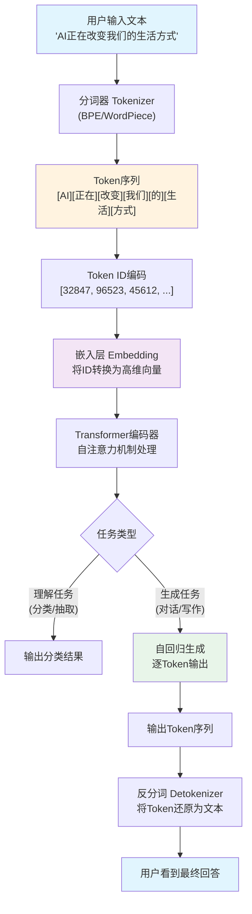

### 1.8 Chapter Summary (小结)

Tokens are the "atoms" of the AI world — they are not just a billing unit, but the key entry point for understanding how large models work. Mastering the concept of Tokens means you can:

1. **Accurately estimate costs**: Know the real cost of every line of code and every conversation
2. **Optimize application performance**: Improve response speed by controlling Token count
3. **Choose the right model**: Select the most suitable model based on Token cost-effectiveness
4. **Understand the technical essence**: Upgrade from a "user" to an "understander"

In the following chapters, we will dive into the "brain" of AI and see how these Tokens are trained.

---

## Chapter 2: The "Brain" of AI — How Are Large Models Trained? (AI的"大脑"——大模型是怎么训练出来的？)

### 2.1 Opening: How Much Does It Actually Cost to Train a Large Model? (开篇：训练一个大模型到底要花多少钱？)

Imagine you want to cultivate a "know-it-all" — someone who has read all the books, web pages, and papers in human history, who can write poetry, write code, translate, and solve math problems. How much would it cost to cultivate such a person? In the AI world, the answer is: **at least $100 million**.

According to Stanford University's 2025 AI Index Report and Epoch AI data, the training cost of GPT-4 exceeded $100 million (confirmed by Sam Altman), Google Gemini Ultra approximately $191 million, and Meta Llama 3.1 405B approximately $170 million. By 2026, the training cost of next-generation frontier models is expected to exceed **$1 billion**, with some industry estimates reaching the $3 billion range.

**Analogy: Training a large model is like building a super library**

Training a large model is not as simple as "writing a program" — it's more like building a library, except that the "collection" of this library is all the text data on the entire internet, the "librarian" is a supercomputing cluster composed of thousands of GPUs, and the "cataloging rules" are a complex set of mathematical optimization algorithms.

The entire process is divided into three core stages: **Pre-training**, **Supervised Fine-Tuning (SFT)**, and **Reinforcement Learning from Human Feedback (RLHF)**. Let's break them down one by one.

### 2.2 Pre-training: A "General Education" Reading the Entire Internet (预训练（Pre-training）：读遍互联网的"通识教育")

Pre-training is the **most time-consuming and expensive** stage of large model training, typically accounting for over 90% of the total training cost.

**Analogy: Pre-training is like having a baby read every book in the world**

Imagine a baby who, from birth, reads non-stop — web pages, books, papers, code, news, social media posts... It doesn't understand the meaning of these words, but it discovers a pattern: after "今天天气很" (the weather today is very), the most likely next character is "好" (good). This is the core principle of pre-training — **self-supervised learning**, also known as **Next Token Prediction**.

**Technical Principle: Next Token Prediction**

The model receives a piece of text and tries to predict the next word. For example:

```
输入：人工智能正在___
候选词及概率：
  "改变" → 35%
  "发展" → 25%
  "影响" → 15%
  "革命" → 10%
  其他   → 15%
```

Through billions of prediction exercises, the model gradually "learns" the patterns of language, the knowledge of the world, and the logic of reasoning. This is like a student learning by doing massive amounts of "fill-in-the-blank" exercises — although no one ever tells them the answers, through massive practice, they figure out the patterns on their own.

**Data Scale: Astronomical Numbers**

| Model | Training Data Volume | Training Tokens | Training Time | Estimated Cost |
|-------|---------------------|-----------------|---------------|----------------|
| GPT-4 | ~13 trillion Tokens | ~13T | 90-100 days | ~$100M+ |
| Doubao Large Model | ~500TB | ~9T | Weeks to months | Undisclosed |
| Llama 3.1 405B | 15 trillion Tokens | ~15T | Months | ~$170M |
| Gemini Ultra | Undisclosed | Undisclosed | Months | ~$191M |

> The Doubao large model's pre-training data volume is approximately 500TB, covering the entire web's text, books, encyclopedias, news, code repositories, academic papers, and multimodal data (images/video/audio). This data requires a rigorous cleaning pipeline: deduplication, ad removal, low-quality content removal, sensitive information removal, and erroneous data removal.

**Compute Consumption: The Speed of Burning Money**

According to industry estimates, GPT-4's training used approximately 25,000 A100 GPUs running continuously for 90-100 days, with total compute consumption of approximately 2.15×10²⁵ FLOPS (floating-point operations). Even at A100 cloud service prices, GPU rental costs alone exceeded $60 million. Adding electricity, storage, networking, and personnel costs, the total easily surpassed $100 million.

**Analogy: If $1 equals 1 second, how much is $100 million?**

The answer is approximately **3.17 years**. That is, the training cost of GPT-4 is equivalent to the time value of a person working non-stop — without eating, sleeping, or resting — for over three years.

### 2.3 Supervised Fine-Tuning (SFT): "On-the-Job Training" from Generalist to Specialist (监督微调（SFT）：从通才到专家的"岗前培训")

After pre-training, the model is a "generalist" — it knows a lot, but doesn't know how to "speak properly." It might output incomplete sentences, irrelevant answers, or even harmful content. This is where **Supervised Fine-Tuning (SFT)** comes in.

**Analogy: SFT is like "on-the-job training" after college graduation**

A college graduate (the pre-trained model) has extensive knowledge, but doesn't know how to communicate appropriately in the workplace. On-the-job training (SFT) teaches them how to write formal emails, how to answer customer questions, and how to speak in meetings. The core of the training is **demonstration + imitation** — the mentor (human annotator) provides standard answers, and the trainee (model) learns to imitate.

**What is "Alignment"?**

Alignment is the core goal of SFT. It refers to making the model's behavior consistent with human expectations, values, and needs. An unaligned model is like a knowledgeable person who lacks social skills — they know the answers but don't know how to express them appropriately.

**Where does fine-tuning data come from?**

SFT data mainly comes from three channels:

1. **Human Annotation**: Professional annotators write high-quality question-answer pairs. For example, given the question "Explain quantum computing," an annotator would write a well-structured, fluent standard answer. OpenAI reportedly hired thousands of annotators, each writing hundreds of high-quality Q&A pairs per day.

2. **Synthetic Data**: Using a stronger model (such as GPT-4) to generate training data, then filtering and correcting it manually. This approach can significantly reduce annotation costs while maintaining data quality. By 2026, synthetic data has become the primary source of SFT data, accounting for over 60%.

3. **Real User Feedback**: Collecting high-quality conversation data from actual usage (with user authorization), which is anonymized and used for fine-tuning.

**SFT operates at a much smaller scale than pre-training**: typically requiring only tens of thousands to hundreds of thousands of high-quality Q&A pairs, with training times ranging from hours to days, and costs approximately 1%-5% of pre-training.

### 2.4 RLHF: Reinforcement Learning from Human Feedback — "Shaping Values" (RLHF：人类反馈强化学习——"价值观塑造")

SFT teaches the model to "speak properly," but RLHF teaches the model to "say the right things."

**Analogy: RLHF is like installing a "moral compass" in AI**

If SFT teaches AI "how to speak," then RLHF teaches AI "what should be said and what shouldn't." Just as after a child learns to speak, parents still teach them to be polite, honest, and kind — this shaping of values is what RLHF does.

**A Brief Introduction to the PPO Algorithm (Plain Language Version)**

The core algorithm of RLHF is **PPO (Proximal Policy Optimization)**. In recent years, **DPO (Direct Preference Optimization)** and other lighter-weight alternatives have become increasingly mainstream — DPO doesn't require training a separate reward model, instead directly adjusting model parameters using human preference data, making it simpler and more stable. It has been widely adopted by Llama 3, Qwen 2, and others. Let's first use PPO to understand the principles of RLHF:

Imagine you're training a dog:
1. **Policy Model**: This is the dog, which needs to learn which behaviors earn rewards
2. **Reward Model**: Like a trainer, it scores the dog's performance
3. **PPO**: A training strategy that ensures the dog doesn't "go to extremes" — neither over-performing just to get rewards nor doing nothing out of fear of punishment

Applied to AI training specifically:

```
Step 1: 训练奖励模型
  - 人类标注员对模型的多个回答进行排序
  - 用这些排序数据训练一个"打分器"（奖励模型）
  - 奖励模型学会了"什么样的回答是好的"

Step 2: 用PPO优化策略模型
  - 策略模型（即我们要训练的大模型）生成多个回答
  - 奖励模型对每个回答打分
  - PPO算法根据分数调整策略模型的参数
  - 关键约束：每次调整的幅度不能太大（"近端"的含义）
```

**The Reward Model: Who "Scores" AI?**

The training data for the reward model comes from human preference annotation. The specific process is:

1. Give the model the same question and have it generate 4-8 different answers
2. Human annotators rank these answers by quality (ranking, not scoring)
3. Use these ranking data to train the reward model, enabling it to predict "which answer humans prefer"

> **Data Speaks**: Training a high-quality reward model typically requires about 50,000-100,000 human preference ranking data points. The annotation cost per data point is approximately $0.5-$2 (depending on complexity), meaning the data annotation cost for the reward model alone can reach $50,000-$200,000.

### 2.5 Knowledge Distillation: Large Models "Teaching" Small Models (知识蒸馏：大模型"教"小模型)

Not every scenario requires a "super brain." In mobile devices, embedded systems, real-time translation, and other scenarios, we need a "small but capable" model. This is where **Knowledge Distillation** comes in.

**Analogy: Knowledge distillation is like "a great teacher produces an outstanding student"**

Imagine a Nobel laureate (teacher model) teaching a high school student (student model). The teacher doesn't need to teach the student all their knowledge, but rather teaches them "how to think" — the teacher model outputs not simple "correct answers" but a "probability distribution" (soft labels), telling the student "this answer has a 70% probability of being correct, and that answer has a 20% probability." By learning these probability distributions, the student gains a deeper understanding than they would from simply learning the correct answers alone.

**DistilBERT: A Classic Distillation Case Study**

DistilBERT is a benchmark case for knowledge distillation. It uses BERT-base as the teacher model and trains a smaller student model through knowledge distillation:

| Metric | BERT-base (Teacher) | DistilBERT (Student) | Change |
|--------|---------------------|----------------------|--------|
| Parameters | 110 million | 66 million | **40% reduction** |
| Language Understanding | Baseline | 95%+ retained | Less than 5% loss |
| Inference Speed | Baseline | 60% faster | **60% faster** |
| Training Cost | Baseline | Hundreds of times lower | Dramatically reduced |

What does this mean? In practical applications, DistilBERT can reduce deployment costs by more than half and inference latency by 60% while maintaining nearly identical performance. For production environments that need to process massive volumes of text, this is a huge cost saving.

### 2.6 INT8 Quantization: Running Large Models on Phones (INT8量化：让大模型跑在手机上)

Even after knowledge distillation, running a 66-million-parameter model on a phone remains challenging. **INT8 Quantization** is the key technology that solves this problem.

**Analogy: Quantization is like "photo compression"**

A high-resolution photo might have 50 megapixels, but if you only need to view it on a phone screen, 5 megapixels is sufficient. Quantization does something similar — it compresses model parameters from high precision (32-bit floating point, FP32) to low precision (8-bit integer, INT8), reducing the model size to 1/4 of the original with almost no loss in accuracy.

**Why INT8?**

| Precision Format | Bits per Parameter | Model Size (7B Parameters) | Accuracy Loss |
|-----------------|-------------------|---------------------------|---------------|
| FP32 | 32 bits | ~28GB | None |
| FP16 | 16 bits | ~14GB | Negligible |
| INT8 | 8 bits | ~7GB | Small (<1%) |
| INT4 | 4 bits | ~3.5GB | Acceptable (1-3%) |

**Real-World Results of On-Device Deployment**:

Through INT8 quantization combined with other optimization techniques (such as KV-Cache optimization and speculative decoding), multiple 7B-parameter models have been successfully deployed on mobile devices by 2026:

- **INT8 Quantization**: Reduced from 14GB (FP16) to approximately 8-10GB (INT8), with minimal accuracy loss (<1%)
- **INT4 Quantization**: Reduced from 14GB (FP16) to approximately 4-6GB (INT4), with acceptable accuracy loss (1-3%), enabling on-device deployment
- **Inference Latency**: On-device deployment latency reduced by approximately 70% (compared to unoptimized FP16 version)
- **Inference Speed**: Up to 18 tokens/s on flagship chips like Snapdragon 8 Gen3

> **Real Case Study**: Qualcomm released a mobile LLM acceleration solution based on Matrix Extensions (QMX) in April 2026, improving Llama series model inference speed on mobile CPUs by 3-5 times. Combined with INT8 quantization, this achieved fluid on-device conversation experiences on mainstream Android phones for the first time.

### 2.7 Four-Layer Architecture for Vertical Domain Models (垂直领域大模型四层架构)

While general-purpose large models are powerful, they are often not specialized enough for specific domains (healthcare, law, finance, etc.). The construction of vertical domain large models, when broken down, can be understood through **four layers**:

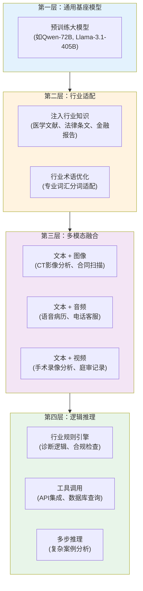

**Layer 1: General Foundation Model** — Select a powerful general-purpose large model as the starting point, which provides general language understanding and generation capabilities.

**Layer 2: Industry Adaptation** — Inject industry knowledge through continued pre-training (CPT). For example, a healthcare large model would undergo continued pre-training on large volumes of medical literature, clinical guidelines, and case reports, enabling the model to "learn" medical terminology and medical knowledge.

**Layer 3: Multimodal Fusion** — Combining text capabilities with image, audio, and video capabilities. For example, a healthcare large model needs not only to understand text-based medical records but also to analyze CT images and interpret electrocardiograms.

**Layer 4: Logical Reasoning** — Adding industry-specific reasoning rules and tool-calling capabilities. For example, a legal large model needs to be able to cite specific legal provisions, perform compliance checks, and generate legal documents.

> **Data Speaks**: In 2026, the vertical domain large model market is expected to exceed 20 billion yuan, with healthcare, finance, and law accounting for over 60%. A well-trained healthcare large model has achieved over 85% accuracy on the medical licensing examination (the average pass rate for human candidates is approximately 70%).

### 2.8 Code Example: Minimal PyTorch BERT Training Example (代码示例：PyTorch BERT训练最小示例)

Below is a minimal BERT-style model training example to help you understand the core process of pre-training:

```python
"""
最小化BERT预训练示例（教学用途）
展示"下一个词预测"的核心逻辑
依赖：pip install torch transformers
"""
import torch
import torch.nn as nn
from transformers import BertTokenizer, BertModel

# ============================================
# Step 1: 加载预训练的分词器和模型
# ============================================
tokenizer = BertTokenizer.from_pretrained("bert-base-chinese")
bert = BertModel.from_pretrained("bert-base-chinese")

# ============================================
# Step 2: 构建一个简单的"下一个词预测"头
# ============================================
class NextTokenPredictor(nn.Module):
    """在BERT的基础上加一个线性分类头"""
    def __init__(self, bert_model, vocab_size):
        super().__init__()
        self.bert = bert_model
        # 将BERT的隐藏状态映射到词表大小
        self.classifier = nn.Linear(bert_model.config.hidden_size, vocab_size)

    def forward(self, input_ids, attention_mask):
        # BERT编码
        outputs = self.bert(
            input_ids=input_ids,
            attention_mask=attention_mask
        )
        # 取每个位置的隐藏状态
        hidden_states = outputs.last_hidden_state  # [batch, seq_len, hidden]
        # 预测每个位置的下一个词
        logits = self.classifier(hidden_states)     # [batch, seq_len, vocab]
        return logits

# ============================================
# Step 3: 准备训练数据
# ============================================
model = NextTokenPredictor(bert, tokenizer.vocab_size)

# 模拟训练数据：几段中文文本
texts = [
    "人工智能是计算机科学的一个分支",
    "深度学习是机器学习的一种方法",
    "自然语言处理让计算机理解人类语言",
]

# 分词并编码
inputs = tokenizer(
    texts,
    padding=True,
    truncation=True,
    max_length=32,
    return_tensors="pt"
)

# 构造训练目标：输入向右移一位就是标签
# 例如：输入"人工 智能 是"，标签"智能 是 计算"
input_ids = inputs["input_ids"]
labels = input_ids.clone()
labels[:, :-1] = input_ids[:, 1:]   # 标签 = 输入右移一位
labels[:, -1] = -100                 # 最后一个位置没有标签（忽略）

# ============================================
# Step 4: 训练循环（简化版）
# ============================================
optimizer = torch.optim.AdamW(model.parameters(), lr=2e-5)
criterion = nn.CrossEntropyLoss(ignore_index=-100)

model.train()
for epoch in range(3):  # 实际训练需要数万步
    optimizer.zero_grad()

    # 前向传播
    logits = model(
        input_ids=inputs["input_ids"],
        attention_mask=inputs["attention_mask"]
    )

    # 计算损失：预测的logits vs 真实的下一个词
    loss = criterion(
        logits.view(-1, tokenizer.vocab_size),
        labels.view(-1)
    )

    # 反向传播
    loss.backward()
    optimizer.step()

    print(f"Epoch {epoch + 1}, Loss: {loss.item():.4f}")

# ============================================
# Step 5: 测试生成效果
# ============================================
model.eval()
test_text = "人工智能是"
test_input = tokenizer(test_text, return_tensors="pt")

with torch.no_grad():
    logits = model(test_input["input_ids"], test_input["attention_mask"])
    # 取最后一个位置的预测
    last_logits = logits[0, -1, :]
    # 取概率最高的5个候选词
    top5_probs, top5_ids = torch.topk(
        torch.softmax(last_logits, dim=-1), 5
    )
    print(f"\n输入：'{test_text}'")
    print("下一个词的Top-5预测：")
    for prob, token_id in zip(top5_probs, top5_ids):
        token = tokenizer.decode([token_id])
        print(f"  '{token}' — 概率: {prob.item():.2%}")
```

Although this example simplifies many details, it demonstrates the core logic of pre-training: **input a piece of text, predict the next word, and continuously adjust parameters to improve prediction accuracy**. Actual large model training uses exactly the same principle, just at a scale millions of times larger — billions of parameters, trillions of Tokens, and thousands of GPUs.

### 2.9 Three-Stage Training Flowchart (训练三阶段流程图)

The following diagram shows the complete process of training a large model from a "blank slate" to an "intelligent assistant":

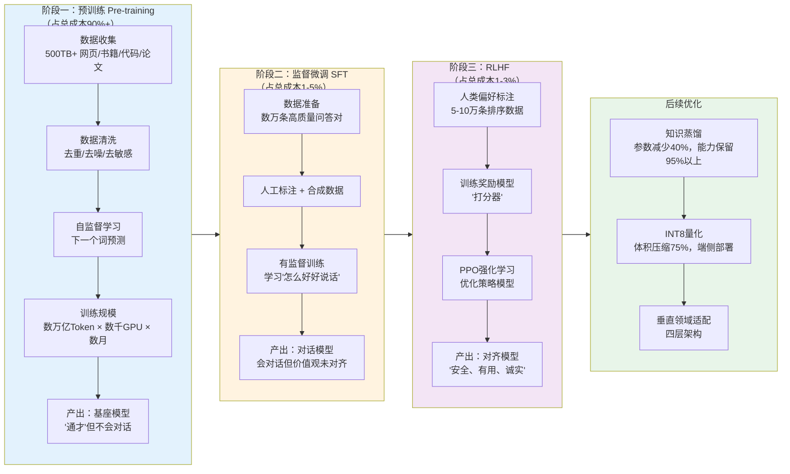

### 2.10 Chapter Summary (小结)

Training a large model is a systems engineering effort involving the precise coordination of three major elements: data, compute, and algorithms. Let's use a table to summarize the comparison of the three core stages:

| Dimension | Pre-training | Supervised Fine-Tuning (SFT) | RLHF |
|-----------|-------------|------------------------------|------|
| Goal | Learn language and world knowledge | Learn conversational format | Align with human values |
| Data Volume | Trillions of Tokens | Tens of thousands to hundreds of thousands of entries | 50,000-100,000 ranking entries |
| Training Time | Months | Hours to days | Days |
| Cost Share | 90%+ | 1-5% | 1-3% |
| Core Algorithm | Self-supervised learning | Supervised learning | PPO reinforcement learning |
| Analogy | Reading all the books in the world | On-the-job training | Shaping values |

Understanding the training process of large models helps you appreciate why AI's capabilities are so powerful, and also understand where its limitations come from — **AI's knowledge comes from training data, AI's values come from human feedback, and AI's capability boundaries are determined by compute and data**.

In the next chapter, we will explore AI's "senses" — how multimodal technology enables AI to not only "read" but also "see," "hear," and "speak."

---

## Chapter 3: The "Language" of AI — Prompt and Context (AI的"语言"——Prompt与上下文)

### Opening: Why Do Some People Get Amazing Responses from ChatGPT While Others Get Nonsense? (开篇：为什么同样用ChatGPT，有人得到神回复，有人只得到废话？)

You've probably seen this scenario: in the same company, a product manager asks AI to write a requirements document and gets three thousand words of clear, logical, well-formatted text; while the newcomer next to them asks AI to "help me write something," and gets a response like leftover congee — thin, tasteless, and devoid of substance.

Where does the problem lie? It's not that AI plays favorites, nor is it about account tiers. The answer is simple: **the way you talk to AI determines the quality of its output.**

It's like ordering at a restaurant. If you say "just bring me some food," the chef can only serve you the most mediocre home-style dish; but if you say "I'd like a deep-sea cod, pan-seared with olive oil, low in oil and salt, no MSG, served with a lemon butter sauce," the chef can precisely meet your needs.

The AI large model is that "chef," and your way of ordering is the **Prompt**.

In 2026, Prompt Engineering has evolved from an "art" into an engineering discipline with methodology, best practices, and quantitative evaluation metrics. The OpenAI official documentation page on Prompt Engineering exceeded 230 million page views in 2025, and Stanford University has even offered dedicated courses. In this chapter, we will thoroughly deconstruct AI's "language system."

---

### 3.1 Prompt Is Not Chat — It's "Programming Instructions": A Critical Correction (Prompt不是聊天，是"编程指令"——关键纠偏)

> **Common Misconception**: "A Prompt is just chatting with AI — the more natural, the better."

**This is one of the AI misconceptions most in need of correction in 2026.**

A Prompt is not a chat. A Prompt is **structured programming instructions given to AI**. When you open ChatGPT's web interface and see that input box, what you're looking at is not a WeChat chat window but a **code editor** — except it uses natural language instead of Python.

Let's re-examine Prompts from a technical perspective. A complete AI interaction actually consists of three types of Prompts:

#### 3.1.1 System Prompt: Setting AI's "Persona" and "Behavior Rules" (System Prompt：设定AI的"人设"和"行为规则")

The System Prompt is the "constitution" of the entire conversation. It is injected before all user messages, defining the AI's identity, behavioral boundaries, and output specifications.

**Analogy**: The System Prompt is like a director's notes for a movie. Before the actor (AI) takes the stage, the director has already written: "You are a deadpan-humorous private detective. You speak briefly, never use exclamation marks, and occasionally quote Sherlock Holmes."

A typical System Prompt example:

```json
{
  "role": "system",
  "content": "你是一位资深的Python后端工程师，拥有10年大型分布式系统开发经验。\n\n行为规则：\n1. 所有代码必须包含类型注解（Type Hints）\n2. 回答时先给出结论，再给出解释\n3. 如果问题信息不足，主动追问而不是猜测\n4. 代码示例必须可以直接运行，包含必要的import语句\n5. 禁止使用emoji"
}
```

**Key Data**: Research published by Anthropic in 2025 showed that a well-designed System Prompt can improve output quality by **40-60%** (based on human evaluation scores). OpenAI's official documentation explicitly states: "The System Prompt is the **most powerful tool** for controlling model behavior."

#### 3.1.2 User Prompt: The User's Actual Request (User Prompt：用户的实际需求)

The User Prompt is the instruction you (the user) send. It is the direct input that triggers AI inference.

**Analogy**: If the System Prompt is the "director's notes," then the User Prompt is the "specific stage direction in the script" — "Now, walk to the window, pick up that letter, and read it aloud with a trembling voice."

#### 3.1.3 Assistant Prompt: AI's Previous Responses (Assistant Prompt：AI的历史回复)

The Assistant Prompt is the AI's previous response content. It may look like "history," but it is actually **the context input for the next inference**.

**Analogy**: This is like the arrangement of pieces on a chessboard during a game. The AI is not "remembering" what it said before — rather, each time it responds, it **re-reads** all previous conversations and generates a new response based on that information.

```json
[
  {"role": "system", "content": "你是一个专业的翻译助手..."},
  {"role": "user", "content": "请将'Hello World'翻译成中文"},
  {"role": "assistant", "content": "'Hello World'的中文翻译是'你好，世界'。"},
  {"role": "user", "content": "那'Goodbye'呢？"}
]
```

Note the "那……呢？" (What about...?) in the last User Prompt — this abbreviated expression can be understood by AI precisely because the Assistant Prompt provides context. Without the third assistant message, the AI would have no idea what "那" (that) refers to.

---

### 3.2 Core Techniques of Prompt Engineering (Prompt Engineering的核心技巧)

Prompt Engineering is not about "stacking keywords" — it is a systematic methodology. Below are the three most effective core techniques recognized by the industry in 2026:

#### 3.2.1 Role Prompting (角色设定法)

**Principle**: Assigning a professional role to AI can significantly narrow its knowledge retrieval scope and improve the professionalism and accuracy of its responses.

**Bad Prompt**:
```
帮我分析一下这段代码有什么问题
```

**Good Prompt**:
```
你是一位拥有15年经验的资深Java性能优化专家，专精JVM调优和并发编程。
请以Code Review的标准，分析以下代码中可能存在的性能瓶颈、线程安全问题和内存泄漏风险。
对每个问题，给出：1）严重等级（Critical/High/Medium/Low）2）具体位置 3）修复方案
```

**Effectiveness Data**: According to Google DeepMind's 2025 benchmark tests, Role Prompting improved accuracy by an average of **23%** in professional domain Q&A tasks.

#### 3.2.2 Few-Shot Prompting (Few-shot示例法)

**Principle**: Provide a few input-output examples in the Prompt so that AI can understand your expected output format and logical pattern through "imitation."

**Analogy**: This is like teaching a child to do math problems. Rather than explaining "what is addition," it's more effective to simply show them "2+3=5" and "7+1=8" — they'll naturally understand.

```
请按照以下格式提取产品信息：

示例1：
输入：iPhone 15 Pro Max，256GB，原色钛金属，售价9999元
输出：{"品牌": "Apple", "型号": "iPhone 15 Pro Max", "存储": "256GB", "颜色": "原色钛金属", "价格": 9999}

示例2：
输入：华为Mate 60 Pro，512GB，雅丹黑，售价6999元
输出：{"品牌": "华为", "型号": "Mate 60 Pro", "存储": "512GB", "颜色": "雅丹黑", "价格": 6999}

现在请提取：
输入：小米14 Ultra，1TB，白色，售价5999元
输出：
```

**Effectiveness Data**: OpenAI's official data shows that Few-Shot methods improved format accuracy from **67%** (zero-shot) to **94%** in formatted output tasks.

#### 3.2.3 Chain of Thought, CoT (思维链)

**Principle**: Require AI to "think step by step" in the Prompt, forcing it to show its reasoning process before giving a final answer.

**Analogy**: This is like a teacher requiring you to "show your work" during an exam. Even if the final answer is wrong, the intermediate reasoning process allows you (and the AI itself) to discover and correct errors.

```
请一步一步地思考以下问题：

一个水池有两个进水管和一个出水管。A管单独注满水池需要6小时，B管单独注满需要8小时，
出水管单独排空需要12小时。如果三管同时打开，多久能注满水池？
```

**Effectiveness Data**: Google reported in a 2024 paper that CoT improved accuracy from **58%** to **92%** on mathematical reasoning tasks (GSM8K benchmark). By 2026, CoT has become the "standard" technique for all complex reasoning tasks.

> **Correction**: Many people think CoT simply means adding "please think step by step" at the end of a Prompt. In reality, high-quality CoT requires **structurally decomposing the problem**, clearly defining the reasoning goal and constraints at each step. A simple "think step by step" works for simple problems, but is far from sufficient for complex engineering problems.

---

### 3.3 Context Window: The Capacity of AI's "Short-Term Memory" (上下文窗口：AI的"短期记忆"容量)

If a Prompt is what you say to AI, then the **Context Window** is the total capacity of all information AI can "remember at the same time."

**Analogy**: The context window is like a desk. The larger the desk surface, the more files you can spread out simultaneously, making it easier to handle complex tasks. But no matter how large the desk, there's a physical limit — and the bigger the desk, the higher the rent.

The unit of measurement for the context window is **Tokens**. One Token is approximately:
- In English: 0.75 words (about 4 characters)
- In Chinese: about 1-2 characters

Below is a comparison of context windows among mainstream large models in 2026:

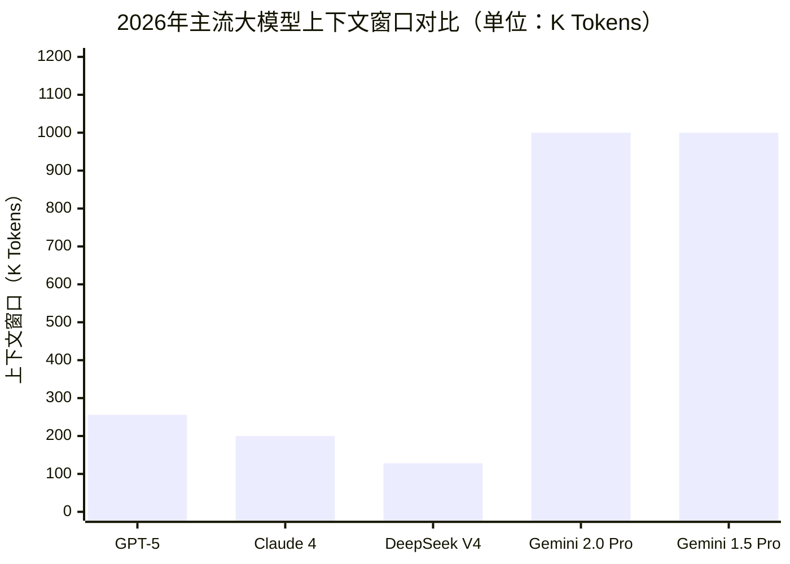

| Model | Context Window | Approximate Content Capacity |
|-------|---------------|------------------------------|
| GPT-5 | 256K tokens | ~200,000 characters (a medium-length book) |
| Claude 4 | 200K tokens | ~160,000 characters |
| DeepSeek V4 | 128K tokens | ~100,000 characters |
| Gemini 2.0 Pro | 1M tokens | ~800,000 characters (2-3 thick books) |
| Gemini 1.5 Pro | 1M tokens | ~800,000 characters |

#### Is a Larger Context Window Always Better?

> **Common Misconception**: "The larger the context window, the smarter the AI."

**No.** This is a cognitive bias that needs serious correction.

A larger context window means AI can "see" more information, but that doesn't mean it can better utilize that information. Three core problems exist:

**First, "needle in a haystack" accuracy drops.** When the context window expands from 32K to 1M, the AI's accuracy in precisely locating a specific piece of information from massive text significantly decreases. Anthropic's research shows that in a 128K context, Claude's "needle in a haystack" accuracy is **99.2%**; but in a 200K context, this figure drops to **96.5%**.

**Second, costs grow linearly.** Every Token in the context window costs money. Taking GPT-5 as an example, input cost is approximately $2.5/million Tokens and output cost is approximately $10/million Tokens. If you fill a 1M Token context, the input cost for a single conversation alone reaches **$2.5** — which is unacceptable for high-frequency enterprise applications.

**Third, inference latency increases.** The longer the context, the longer the AI's "prefill" phase takes. In a 1M Token context, the first-Token latency can reach **30-60 seconds**, which is unacceptable in real-time interaction scenarios.

**Conclusion**: Context window selection is a **three-way trade-off among cost, quality, and latency**. For most application scenarios, 128K-256K is already more than sufficient. Only when you need to process ultra-long documents (such as legal contract review or full codebase analysis) should you consider 1M-level context.

---

### 3.4 Context Management Strategies: What to Do When Memory Runs Out? (上下文管理策略：当记忆不够用时怎么办？)

Since the context window is finite, what should we do when conversation history or document content exceeds the window limit? The mainstream context management strategies in the industry in 2026 are the following three:

#### Strategy 1: Chunking (策略一：分片)

Split long text into multiple segments along semantic boundaries, sending only relevant segments to the AI each time.

```python
def chunk_text(text: str, max_tokens: int = 4000) -> list[str]:
    """按段落边界对文本进行分片"""
    paragraphs = text.split("\n\n")
    chunks = []
    current_chunk = ""

    for para in paragraphs:
        estimated_tokens = len(current_chunk + para) // 2  # 粗略估算
        if estimated_tokens > max_tokens:
            if current_chunk:
                chunks.append(current_chunk)
            current_chunk = para
        else:
            current_chunk += "\n\n" + para if current_chunk else para

    if current_chunk:
        chunks.append(current_chunk)

    return chunks
```

#### Strategy 2: Summarization (策略二：摘要压缩)

Periodically summarize historical conversations, replacing "original text" with "summaries" to save context space.

```python
SUMMARIZATION_PROMPT = """
请对以下对话历史进行精简摘要，保留所有关键信息、决策和结论。
删除寒暄、重复讨论和已废弃的方案。
摘要长度控制在原文的30%以内。

对话历史：
{conversation_history}
"""

# 当对话历史超过窗口的60%时触发摘要
def should_summarize(conversation_tokens: int, window_size: int) -> bool:
    return conversation_tokens > window_size * 0.6
```

**Effectiveness Data**: Microsoft reported in a 2025 study that the summarization strategy can increase effective conversation turns by **5-8 times** while maintaining information retention at **85%** or above.

#### Strategy 3: RAG - Retrieval-Augmented Generation (策略三：向量检索裁剪)

This is the most mainstream context management solution in 2026. The core idea is: pre-vectorize and store all documents, and for each conversation, retrieve only the Top-K segments most relevant to the current question, splicing them into the context.

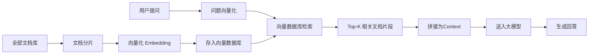

**Core Advantages of RAG**:
- Document count is not limited by the context window (can handle millions of documents)
- Retrieved content is highly relevant, reducing noise interference
- Costs are controllable — only a small number of relevant segments are sent each time

**Effectiveness Data**: According to LangChain's 2025 industry survey report, **78%** of enterprise AI applications have adopted the RAG architecture for context management. In knowledge Q&A scenarios, RAG improved accuracy from **42%** to **89%** compared to pure large model conversation.

---

### 3.5 Complete API Call Example (完整的API调用示例)

Let's connect all the concepts we've learned so far with a complete API call example:

```python
import openai

client = openai.OpenAI(api_key="your-api-key")

response = client.chat.completions.create(
    model="gpt-5",
    messages=[
        # System Prompt：设定角色和规则
        {
            "role": "system",
            "content": (
                "你是一位专业的数据分析师。\n"
                "行为规则：\n"
                "1. 所有数据结论必须标注数据来源\n"
                "2. 使用表格呈现对比数据\n"
                "3. 不确定的数据标注置信区间\n"
                "4. 回答控制在500字以内"
            )
        },
        # Assistant Prompt：历史回复（提供上下文）
        {
            "role": "assistant",
            "content": "根据2025年Q3财报，公司营收同比增长23%，达到4.2亿元。"
        },
        # User Prompt：当前问题
        {
            "role": "user",
            "content": (
                "请基于上一条回复中的营收数据，"
                "预测Q4的营收区间，并给出三个关键假设条件。"
            )
        }
    ],
    temperature=0.3,       # 低温度 = 更确定性的输出
    max_tokens=1000,        # 限制输出长度
    top_p=0.9               # 核采样参数
)

print(response.choices[0].message.content)
```

**Parameter Explanation**:
- `temperature=0.3`: Controls the randomness of output. 0 means fully deterministic (same input always produces the same output), 1 means highly random. Data analysis scenarios recommend 0.1-0.3; creative writing scenarios recommend 0.7-1.0.
- `max_tokens=1000`: Limits the maximum length of the AI's response, avoiding unexpectedly high costs.
- `top_p=0.9`: Nucleus sampling parameter, used in conjunction with temperature to control the diversity of vocabulary selection.

---

### 3.6 Full Prompt Processing Pipeline (Prompt处理全流程)

Let's use a complete flowchart to summarize the entire process of AI handling Prompts:

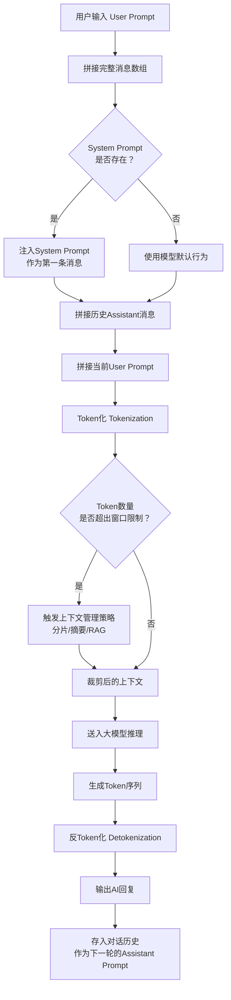

---

### Chapter Summary (本章小结)

| Concept | One-Sentence Explanation | Key Data |
|---------|-------------------------|----------|
| System Prompt | AI's "constitution," defining identity and behavioral rules | Well-designed prompts can improve output quality by 40-60% |
| User Prompt | The user's actual instruction | Role Prompting can improve accuracy by 23% |
| Assistant Prompt | AI's previous responses, forming the context for the next turn | Few-Shot can improve format accuracy from 67% to 94% |
| Context Window | The capacity of AI's "short-term memory" | Mainstream models: 128K-1M tokens |
| Chain of Thought (CoT) | Forces AI to show its reasoning process | Math reasoning accuracy improved from 58% to 92% |
| RAG | Retrieval-Augmented Generation, breaking through context limits | 78% of enterprise AI applications use this architecture |

**Remember**: In 2026, conversing with AI is not "chatting" — it's "programming." Every input you make precisely shapes AI's output. Mastering Prompt Engineering means mastering the "programming language" for efficient collaboration with AI.

---
## Chapter 4: AI's "Hands and Feet" -- From Tools to the MCP Protocol / 第4章：AI的"手脚"——从Tools到MCP协议

### Introduction: Large Models Can Only "Talk," Not "Do" -- Until Tools Arrived / 开篇：大模型只会"说"，不会"做"——直到有了Tools

Imagine this scenario: you've hired the most knowledgeable consultant in the world. He is fluent in 32 languages, has read every book and paper in human history, and can retrieve trillions of pieces of knowledge in a single second. But -- he **has no hands**.

He can't send emails for you, can't query databases, can't operate Excel, can't deploy code. He can only sit there, using the most precise and elegant language to tell you: "You should do it this way."

This was the predicament of large models in early 2024. GPT-4, Claude 3, Gemini -- they were all "super brains without hands."

The turning point came in the second half of 2024. OpenAI launched **Function Calling**, Anthropic introduced **Tool Use**, and Google rolled out **Function Calling in Gemini**. Large models finally got "hands" -- they could now not only "talk" but also "do."

But a new problem arose: each vendor's tool interface had different formats, different protocols, and different calling conventions. Developers had to write one set of tool adapters for GPT, another for Claude, and yet another for Gemini. It was like buying a new TV and discovering that every remote control in your house could only control one brand -- chaotic, inefficient, and frustrating.

In November 2024, Anthropic provided a revolutionary answer: **MCP (Model Context Protocol)** -- the "USB port" of the AI world.

In this chapter, we will break down the complete technical evolution path of AI from "being able to talk" to "being able to do," from bottom to top: **Tools -> MCP -> Skills**.

---

### 4.1 Tools: AI's "Native Hands" / Tools：AI的"原生手"

#### 4.1.1 What Are Tools? / 什么是Tools？

**Tools** are the **underlying native capability units** through which AI performs specific operations.

**Analogy**: If AI is an operating system, then Tools are the operating system's **system calls** -- `read()`, `write()`, `send()`, `recv()`. They are the lowest-level execution units, with no fancy packaging, but all advanced functionality is built on top of them.

Tools have three core characteristics:

| Characteristic | Description |
|------|------|
| **No AI adaptation** | Tools themselves don't care who is calling them -- a human, an AI, or another program |
| **No engineering encapsulation** | Tools are bare atomic operations, with no "intelligent" logic such as prompts or error-handling strategies |
| **No permission verification** | Tools themselves do not perform permission checks; security control is the responsibility of upper layers |

#### 4.1.2 Types of Tools / Tools的类型

By 2026, the Tools available to AI already covered almost all digital operation scenarios:

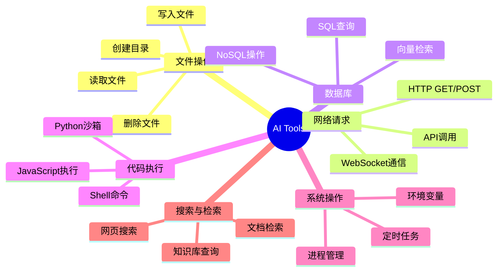

#### 4.1.3 Tools Are the Underlying Source of All Skill Capabilities / Tools是所有Skill的底层能力源头

This point is crucial: **without Tools, there are no Skills**.

No matter how the upper layers encapsulate, beautify, or add security policies, the ones that ultimately perform operations are always the underlying Tools. It's just like how, no matter how beautiful your phone app's interface is, it ultimately completes operations through the operating system's system calls.

> **Correction**: Many people equate "AI being able to call APIs" with "AI having Tools." In reality, APIs are just one manifestation of Tools. A Tool can be a local function call, a system command, or even a hardware operation. The essence of Tools is "callable execution units for AI," not "HTTP APIs."

---

### 4.2 MCP Protocol: The "USB Port" of the AI World / MCP协议：AI界的"USB接口"

#### 4.2.1 What Is MCP? / MCP是什么？

**MCP** stands for **Model Context Protocol**, open-sourced and released by Anthropic in November 2024.

**Analogy**: Before the USB port existed, every peripheral (printers, keyboards, mice, USB drives) had its own proprietary interface and dedicated cable. If you wanted to change a keyboard, you had to change the cable too. In 1996, USB (Universal Serial Bus) was born -- one port to connect all devices.

MCP is the USB of the AI world. It defines a **unified communication protocol** that enables any AI model to connect to and use any tool in a **standardized way**.

#### 4.2.2 Core Problems Solved by MCP / MCP解决的核心问题

Before MCP, the AI tool ecosystem faced three major sources of chaos:

| Problem | Manifestation |
|------|---------|
| **Multi-model adaptation chaos** | The same search tool uses Function Calling format for GPT, Tool Use format for Claude, and yet another format for Gemini |
| **Multi-tool integration chaos** | Each tool has its own SDK, its own authentication method, and its own data format |
| **Multi-platform deployment chaos** | Tools that work in VS Code don't work in ChatGPT; tools that work on the web don't work on mobile |

MCP solved all three problems simultaneously with **a single protocol**:

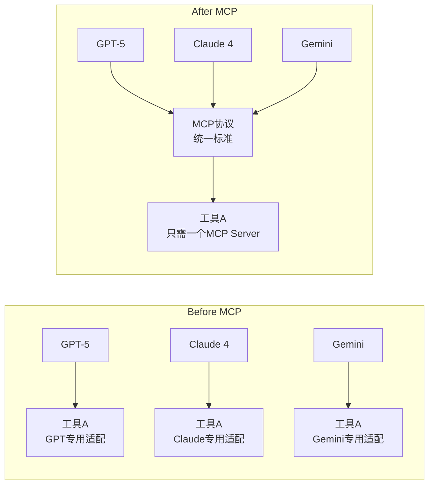

**Core value: Develop once, use across the entire ecosystem.** Tool developers only need to implement one MCP Server, and all AI models that support MCP can automatically use that tool.

#### 4.2.3 MCP's Three-Layer Architecture / MCP的三层架构

MCP adopts a classic three-layer architecture design:

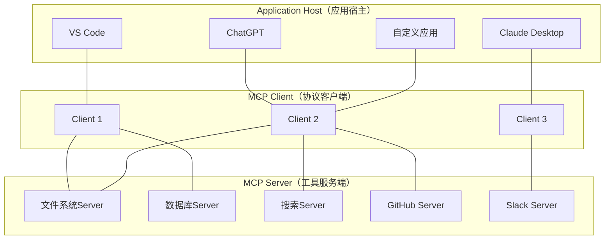

**Responsibilities of each layer**:

| Layer | Role | Responsibility | Analogy |
|------|------|------|------|
| **Application Host** | Application host | Provides user interface, hosts the AI model | Computer host |
| **MCP Client** | Protocol client | Manages connections to MCP Servers, protocol conversion | USB controller |
| **MCP Server** | Tool server | Exposes specific tool capabilities | USB device |

**Key design principles**:
- **One Client can connect to multiple Servers** (just as one USB controller can connect to multiple USB devices)
- **One Server can be connected by multiple Clients** (just as one USB device can be plugged into different computers)
- **Clients and Servers are loosely coupled** (they communicate via a standard protocol and do not depend on specific implementations)

#### 4.2.4 MCP's Communication Mechanism / MCP的通信机制

MCP communication is based on the **JSON-RPC 2.0** protocol, with **HTTP/1.1 + SSE (Server-Sent Events)** as the transport layer.

**Why this technology combination?**

- **JSON-RPC 2.0**: Lightweight, easy to parse, supports both request/response and notification modes
- **HTTP/1.1**: Best compatibility, supported by virtually all network environments
- **SSE**: Supports server-initiated push, suitable for streaming output scenarios (such as AI generating responses word by word)

A typical MCP communication flow:

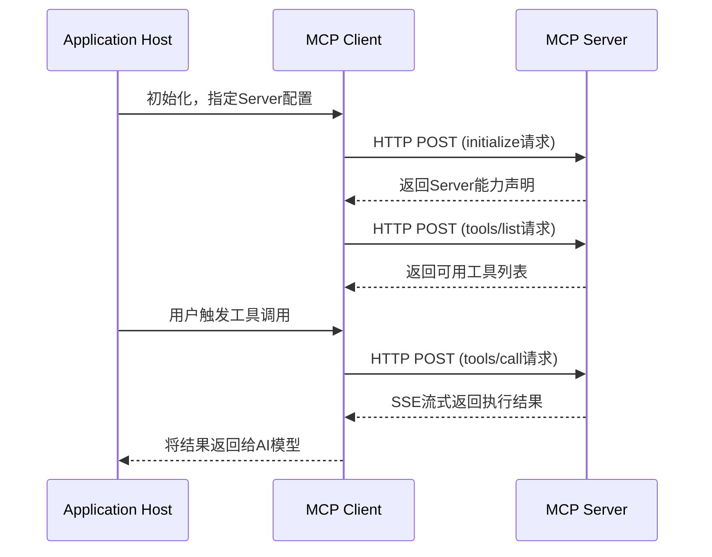

**JSON-RPC message examples**:

```json
// Client → Server：请求工具列表
{
  "jsonrpc": "2.0",
  "id": 1,
  "method": "tools/list",
  "params": {}
}

// Server → Client：返回工具列表
{
  "jsonrpc": "2.0",
  "id": 1,
  "result": {
    "tools": [
      {
        "name": "read_file",
        "description": "读取指定路径的文件内容",
        "inputSchema": {
          "type": "object",
          "properties": {
            "path": {
              "type": "string",
              "description": "文件的绝对路径"
            }
          },
          "required": ["path"]
        }
      },
      {
        "name": "search_web",
        "description": "执行网络搜索并返回结果",
        "inputSchema": {
          "type": "object",
          "properties": {
            "query": {
              "type": "string",
              "description": "搜索关键词"
            },
            "max_results": {
              "type": "integer",
              "description": "最大返回结果数",
              "default": 5
            }
          },
          "required": ["query"]
        }
      }
    ]
  }
}

// Client → Server：调用工具
{
  "jsonrpc": "2.0",
  "id": 2,
  "method": "tools/call",
  "params": {
    "name": "read_file",
    "arguments": {
      "path": "/workspace/config.json"
    }
  }
}

// Server → Client：返回执行结果
{
  "jsonrpc": "2.0",
  "id": 2,
  "result": {
    "content": [
      {
        "type": "text",
        "text": "{\"database\": \"postgresql\", \"port\": 5432}"
      }
    ]
  }
}
```

#### 4.2.5 MCP Ecosystem Status (2026) / MCP生态现状（2026年）

As of April 2026, the MCP ecosystem has achieved significant growth:

| Metric | Data |
|------|------|
| MCP-related repositories on GitHub | Over **12,000** |
| Registered MCP Servers | Over **3,500** |
| AI platforms supporting MCP | Claude, GPT, Gemini, Cursor, Windsurf, VS Code, and **20+** others |
| MCP protocol version | v1.2 (released March 2026) |

**MCP has evolved from Anthropic's "proprietary protocol" into the "de facto standard" of the entire AI industry.** In December 2025, OpenAI announced full MCP protocol support for the GPT model family, marking MCP's official status as a cross-vendor universal standard.

---

### 4.3 Skills: The "Standardized Encapsulation" of Tools / Skills：Tools的"标准化封装"

#### 4.3.1 The Evolution from Tools to Skills / 从Tools到Skills的进化

If Tools are "bricks," then Skills are "prefabricated panels."

**Analogy**: Tools are like raw ingredients in a kitchen -- flour, eggs, sugar, butter. They are necessary for making a cake, but if you hand flour and eggs directly to someone who doesn't know how to cook, they probably won't be able to make a cake. Skills are like "cake mix" -- the flour, eggs, and sugar are already mixed in precise proportions; you just add water, stir, and bake.

**The essential formula for Skills**:

```
Skills = 底层Tools + 标准化封装 + 安全管控 + 协议适配
```

| Component | Description | Analogy |
|---------|------|------|
| **Underlying Tools** | Atomic capabilities that actually perform operations | A car's engine |
| **Standardized encapsulation** | Unified input/output formats, error handling, retry mechanisms | A car's steering wheel and dashboard |
| **Security control** | Permission verification, confirmation for sensitive operations, audit logs | A car's seatbelt and ABS |
| **Protocol adaptation** | Adapting to the calling protocols of different AI platforms | A car's adapters (charging ports for different countries) |

#### 4.3.2 Dual-Type Skill System / 双类型技能体系

AI Agent platforms in 2026 generally adopt a **dual-type skill system**:

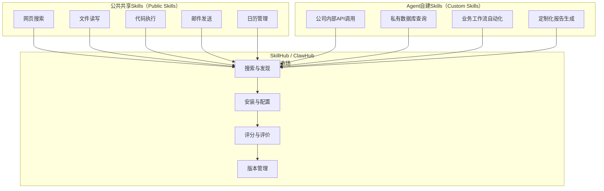

**Public Shared Skills**:
- Developed and maintained by platform providers or the community
- Ready to use out of the box, no configuration required
- Cover common scenarios (search, files, code, communication, etc.)
- Analogy: "System apps" in a phone's app store

**Agent Custom Skills**:
- Created by enterprises or individual developers
- Customized for specific business scenarios
- Require configuration of authentication, permissions, and other parameters
- Analogy: "Enterprise internal apps" in a phone's app store

#### 4.3.3 SkillHub / ClawHub: The Skill Marketplace / SkillHub / ClawHub：技能市场

**SkillHub** (also known as ClawHub) is the distribution and management platform for Skills, similar to a phone's app store.

**Core features**:

| Feature | Description |
|------|------|
| **Search and discovery** | Browse available Skills by category, rating, and download count |
| **One-click installation** | Automatically complete authentication configuration and protocol adaptation |
| **Version management** | Support version updates and rollbacks for Skills |
| **Security audit** | Display Skills' permission requirements and community security ratings |
| **Composition and orchestration** | Combine multiple Skills into complex workflows |

> **Correction**: Many people believe "the more Skills, the better." In reality, every additional Skill adds a potential attack surface and security risk. Best practice: **only install necessary Skills, regularly review the permissions of installed Skills, and promptly remove Skills that are no longer in use.**

#### 4.3.4 Skills vs. MCP Server: When to Use Which? / Skills vs MCP Server：什么时候用哪个？

This is one of the most common sources of confusion for developers in practice. Let's use a comparison table to clarify the positioning of both:

| Dimension | MCP Server | Skill |
|------|-----------|-------|
| **Positioning** | Low-level communication protocol implementation | User-facing functional encapsulation |
| **Development barrier** | Medium (requires understanding of JSON-RPC and MCP specifications) | Low (can be created through configuration alone) |
| **Reusability** | High (cross-platform universal) | Depends on the platform (typically limited to a specific Agent platform) |
| **Security mechanisms** | Basic (relies on transport-layer security) | Comprehensive (permission verification, auditing, sandboxing) |
| **Applicable scenarios** | Developing new tool capabilities | Combining existing tools for business scenarios |
| **Analogy** | Manufacturing a USB device | Buying and using a USB device |

**Analogy**: An MCP Server is the "manufacturing blueprint for a power drill" -- you need to understand engineering principles to draw one; a Skill is "buying a power drill to drill holes at home" -- you only need to know how to press the switch.

In real projects, the typical development path is: **first use MCP Servers to encapsulate underlying capabilities, then use Skills to combine these capabilities into business-facing functional modules.** For example, a "Smart Customer Service" Skill might call three MCP Servers at the underlying level: a knowledge base retrieval Server, a ticket system Server, and an email sending Server.

#### 4.3.5 How Skills Actually Work / Skills的实际运行机制

When a Skill is called by AI, what happens behind the scenes? Let's break down a complete Skill call chain:

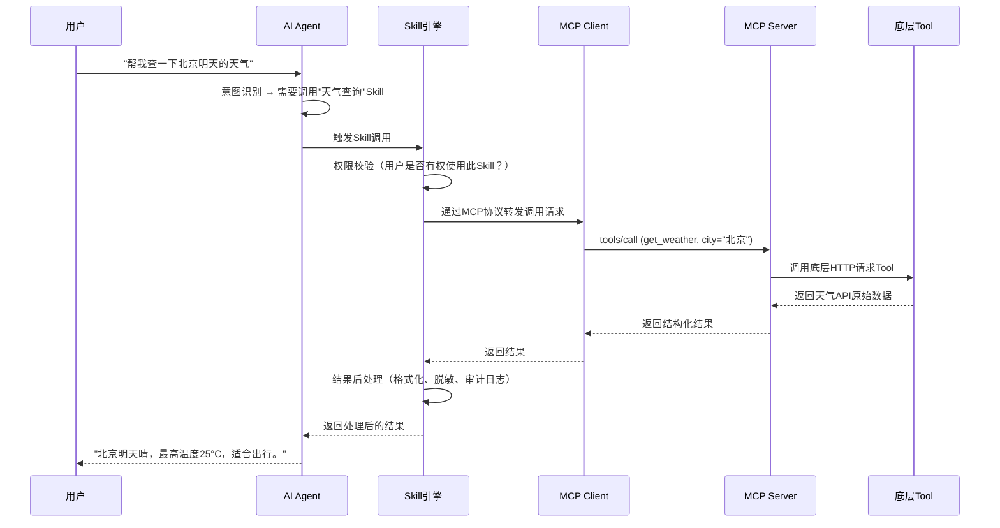

Note the two key "value-added stages" in this chain:

1. **Skill engine's permission verification**: Before the call reaches the MCP Server, the Skill layer has already checked user permissions. If the user does not have "weather query" permission, the request will be intercepted at the Skill layer and will never reach the MCP Server.

2. **Skill engine's result post-processing**: The MCP Server returns raw data, and the Skill layer performs formatting (making it easier for AI to understand), desensitization (removing sensitive information), and audit logging (recording who called what and when).

This is the concrete embodiment of the formula "Skills = Tools + Standardized Encapsulation + Security Control + Protocol Adaptation."

---

### 4.4 A Simplest MCP Server Example / 一个最简单的MCP Server示例

Below is an MCP Server implemented in Python that provides two tools: `get_weather` (get weather) and `calculate` (math calculation).

```python
# mcp_weather_server.py
import json
from mcp.server import Server
from mcp.server.stdio import stdio_server

# 创建MCP Server实例
server = Server("weather-demo")

@server.list_tools()
async def list_tools():
    """声明此Server提供的所有工具"""
    return [
        {
            "name": "get_weather",
            "description": "获取指定城市的当前天气信息",
            "inputSchema": {
                "type": "object",
                "properties": {
                    "city": {
                        "type": "string",
                        "description": "城市名称，如'北京'、'上海'"
                    }
                },
                "required": ["city"]
            }
        },
        {
            "name": "calculate",
            "description": "执行数学表达式计算",
            "inputSchema": {
                "type": "object",
                "properties": {
                    "expression": {
                        "type": "string",
                        "description": "数学表达式，如'2+3*4'"
                    }
                },
                "required": ["expression"]
            }
        }
    ]

@server.call_tool()
async def call_tool(name: str, arguments: dict):
    """处理工具调用请求"""
    if name == "get_weather":
        city = arguments["city"]
        # 模拟天气数据（实际应用中应调用真实天气API）
        weather_data = {
            "city": city,
            "temperature": "22°C",
            "condition": "晴",
            "humidity": "45%",
            "wind": "东北风 3级"
        }
        return [{
            "type": "text",
            "text": json.dumps(weather_data, ensure_ascii=False)
        }]

    elif name == "calculate":
        expression = arguments["expression"]
        try:
            # 安全地执行数学表达式（仅允许数学运算）
            allowed = set("0123456789+-*/.() ")
            if not all(c in allowed for c in expression):
                return [{
                    "type": "text",
                    "text": "错误：表达式包含不允许的字符"
                }]
            result = eval(expression)
            return [{
                "type": "text",
                "text": f"{expression} = {result}"
            }]
        except Exception as e:
            return [{
                "type": "text",
                "text": f"计算错误：{str(e)}"
            }]

# 启动MCP Server
async def main():
    async with stdio_server() as (read_stream, write_stream):
        await server.run(read_stream, write_stream)

if __name__ == "__main__":
    import asyncio
    asyncio.run(main())
```

**Configuration file** (for the MCP Client to discover and connect to this Server):

```json
{
  "mcpServers": {
    "weather-demo": {
      "command": "python",
      "args": ["/path/to/mcp_weather_server.py"],
      "description": "天气查询与数学计算工具"
    }
  }
}
```

**Key design points**:

1. **`list_tools()`**: Declares the Server's capability manifest. The AI model "knows" what tools are available through this interface.
2. **`call_tool()`**: Actually executes tool calls. It receives the tool name and parameters, and returns the execution result.
3. **Security protection**: In the `calculate` tool, we use whitelist filtering to prevent code injection attacks -- this is a reflection of the Skill layer's "security control."

---

### 4.5 Tools -> MCP -> Skills: Complete Relationship Diagram / Tools → MCP → Skills：完整关系图

Let's use a panoramic diagram to summarize the relationship between Tools, MCP, and Skills:

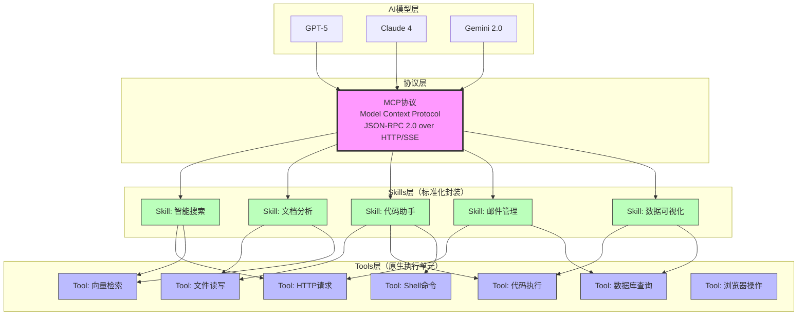

**Relationship interpretation**:

- **AI models** communicate with **Skills** through the **MCP protocol** (MCP is the "common language" in the middle)
- **Skills** encapsulate one or more **Tools** (a Skill may require multiple underlying Tools to work together)
- **Tools** are the ultimate execution units (the ones that actually "do the work" are Tools)
- The **MCP protocol** does not interact with Tools directly -- it only defines the communication standard for Skills

---

### Chapter Summary / 本章小结

| Concept | One-sentence explanation | Key data |
|------|-----------|---------|
| **Tools** | AI's underlying native execution units -- no encapsulation, no adaptation, no permissions | The underlying capability source of all Skills |
| **MCP** | The "USB port" of the AI world, a unified tool communication protocol | 12,000+ repositories on GitHub, 3,500+ registered Servers |
| **Skills** | Standardized encapsulation of Tools, with security control and protocol adaptation | Dual-type system of public Skills + custom Skills |
| **SkillHub** | The distribution marketplace for Skills, similar to an app store | Supports search, installation, ratings, and version management |

**The evolution path from Tools to MCP to Skills is, in essence, an evolution from "can work" to "works well" to "works well and safely."** Tools gave AI the ability to "use its hands," MCP made these capabilities "portable and reusable," and Skills added "safety guardrails" and "user experience" on top of these capabilities.

**Remember**: In 2026, when evaluating an AI Agent platform's capabilities, don't just look at how many large models it has integrated -- look more closely at how many MCP Servers it supports, how many Skills are available, and whether its Skill ecosystem is thriving. Because what ultimately determines "what AI can do" is not the model's parameter count, but the quantity and quality of the Tools and Skills it can invoke.

---

## Chapter 5: AI's "Executor" -- Agent / 第5章：AI的"执行者"——Agent智能体

### 5.1 Introduction: 90% of People Get Agent Wrong / 开篇：90%的人都搞错了Agent是什么

2025 was called the "Year of the Agent."

That year, OpenAI released Operator, Google launched Project Mariner, ByteDance in China launched the Coze platform, and Dify completed its Series B funding round. According to Gartner, by the end of 2025, more than 1,200 enterprises worldwide had incorporated Agent technology into production environments, with the market size exceeding $4.7 billion.

However, a troubling fact remains: **over 90% of people discussing Agent are actually just discussing large language models (LLMs).**

Open social media, and you'll see statements like: "GPT-4 is already an Agent" or "Claude is smart enough, we don't need Agents." These claims may seem reasonable, but they commit the most fundamental conceptual error -- equating the "brain" with the "complete person."

Think of it this way: a large language model is like an encyclopedic scholar sitting in a study. Ask him any question, and he can give a brilliant answer. But if you ask him to "go to the market, buy two pounds of tomatoes, pick up a package on the way, and grab the dry-cleaned clothes on the way back," he'll freeze in place -- because he has no legs, no hands, and no permission to go out.

**Agent is the system that gives this scholar legs, hands, a wallet, and permission to go out.**

This is not a minor technical difference, but a paradigm shift from "passive Q&A" to "active execution." Understanding this is the starting point for comprehending the AI industry landscape in 2026.

### 5.2 Agent != LLM: The Most Critical Correction / Agent ≠ 大模型：最关键的纠偏

Let's use a more precise formula to define Agent:

```
Agent = 大模型（LLM） + 任务规划引擎 + 上下文管理器 + Skills调用模块 + MCP通信模块
```

Breaking it down, every component is indispensable:

| Component | Analogy | Responsibility |
|------|------|------|
| **LLM** | Brain | Understanding intent, reasoning and decision-making, text generation |
| **Task planning engine** | Project manager | Breaking complex tasks into executable sub-task sequences |
| **Context manager** | Notebook | Managing conversation history, user preferences, and environment state |
| **Skills invocation module** | Toolbox | Search, code execution, API calls, file operations, etc. |
| **MCP communication module** | Walkie-talkie | Standardized communication with external systems |

**Common misconception corrections:**

- **Misconception 1: "GPT-4 is an Agent."** Wrong. GPT-4 is an LLM; it does not inherently have the ability to call tools. The "plugins" and "function calling" features in ChatGPT are only the embryonic form of Agent capabilities. OpenAI's Operator, launched in late 2024, is a truly complete Agent product.
- **Misconception 2: "Agent is just a wrapper around an LLM."** Wrong. In an excellent Agent system, the LLM's reasoning capability accounts for only about 30% of the total work; the remaining 70% comes from engineering capabilities such as task planning, tool orchestration, error recovery, and context management. According to LangChain's 2025 developer survey, the biggest technical challenge in Agent development is not insufficient model capability, but "reliability of tool invocation" and "success rate of long-chain tasks."
- **Misconception 3: "Agent will replace all software."** Overstated. Agent excels at non-deterministic tasks that require flexible decision-making. For high-determinism, high-precision scenarios (such as core banking transaction systems), traditional software remains the more reliable choice.

### 5.3 Agent's Core Capabilities / Agent的核心能力

The reason Agent is called AI's "executor" is that it possesses four core capabilities that traditional software lacks:

#### 5.3.1 Task Decomposition / 任务拆解（Task Decomposition）

Human project managers break large projects into subtasks; Agent can do something similar -- but at speeds over 1,000 times faster than humans.

For example, when a user says "help me analyze competitors and write a market report," Agent's task planning engine will break this vague instruction down into:

1. Identify the competitive landscape (search industry reports)
2. Collect competitor data (call search APIs, scrape official websites)
3. Extract key metrics (data analysis tools)
4. Generate comparison tables (code execution environment)
5. Write the analysis report (LLM text generation)
6. Format the output (document generation tools)

According to Agent benchmark data published by Anthropic in 2025, Claude 3.5 Sonnet achieved an 87.3% accuracy rate in task decomposition, an improvement of 42 percentage points from early 2024.

#### 5.3.2 Tool Selection / 工具选择（Tool Selection）

Agent's Skills invocation module is like an experienced craftsman's workbench. Faced with different tasks, it can automatically select the most appropriate tool:

- Need real-time information? Call the search API
- Need mathematical calculations? Launch the code interpreter
- Need to manipulate files? Use the file system interface
- Need to send an email? Call the email service API

In 2025, the standardization of the MCP (Model Context Protocol) protocol triggered explosive growth in the tool ecosystem. According to MCP official statistics, as of Q1 2026, over 28,000 standardized MCP tools have been registered, covering 47 domains including office productivity, development, design, and data analysis.

#### 5.3.3 Autonomous Execution / 自主执行（Autonomous Execution）

This is the most fundamental difference between Agent and traditional chatbots. A traditional chatbot operates in a "question-answer" mode -- the user says something, it responds, and if the user says nothing, it stays silent. Agent, on the other hand, can autonomously complete an entire multi-step task chain without human intervention in between.

Take a data analysis scenario as an example: the user only needs to say "analyze last quarter's sales data and identify the reasons for the decline," and Agent can autonomously complete the entire process of data reading, cleaning, analysis, visualization, and report generation. Microsoft's internal testing in 2025 showed that its Copilot Agent achieved a 73.6% end-to-end completion rate for enterprise data analysis tasks, saving an average of 4.2 hours per task in human time.

#### 5.3.4 Error Recovery / 错误恢复（Error Recovery）

Traditional software crashes or throws errors when it encounters a problem. Agent, however, has the ability to "try a different approach when something goes wrong."

For example, when Agent tries to call an API and fails, it doesn't simply report an error and exit. Instead, it will:
1. Analyze the failure reason (network timeout? Insufficient permissions? Incorrect parameters?)
2. Try alternative solutions (use a different API? Reduce request frequency?)
3. If all solutions fail, report the problem to the user and suggest human intervention

According to Dify's Agent Reliability Report published in late 2025, Agents with error recovery mechanisms have a task completion rate 58.7% higher than those without.

### 5.4 Full-Chain Execution Flow: An 11-Step Closed Loop / 全链路执行流程：11步闭环

To give you an intuitive understanding of how Agent works, let's use a concrete scenario: **the user asks AI to generate a WeChat Official Account article and publish it automatically**.

This is not a simple "generate text" task, but a complete workflow involving content creation, image generation, typesetting, review, and publishing. Below is the 11-step closed-loop process by which Agent completes this task:

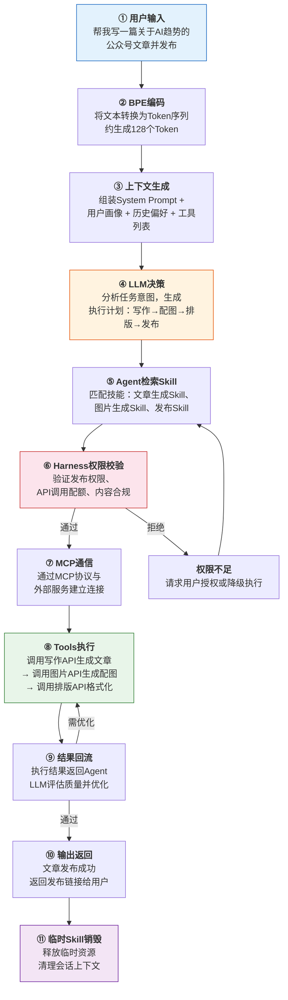

Let's walk through this flow step by step:

**Step 1: User Input.** The user issues a natural language instruction. This step may seem simple, but Agent actually needs to handle a lot of ambiguity -- does "AI trends" refer to technology trends or business trends? How long should the article be? Who is the target audience?

**Step 2: BPE Encoding.** The user's natural language input is processed by the BPE (Byte Pair Encoding) tokenizer and converted into a Token sequence that the model can understand. Taking "help me write an article about AI trends for WeChat Official Account and publish it" as an example, this sentence is segmented into approximately 35-50 Tokens.

**Step 3: Context Generation.** Agent's context manager goes to work, assembling the System Prompt (defining the Agent's role and behavioral norms), user profile (preference information accumulated from historical interactions), and the list of currently available tools into a complete context window. The quality of this step directly determines the accuracy of subsequent decisions.

**Step 4: LLM Decision-Making.** The large model reasons based on the context and generates a structured execution plan. In this example, the LLM will determine that it needs to sequentially invoke four subtasks -- "article generation," "image generation," "typesetting," and "publishing" -- and determine the parameters for each subtask.

**Step 5: Agent Skill Retrieval.** The task planning engine retrieves matching skill modules from the Skill library based on the LLM's decision. Here, a "Skill" is a pre-packaged capability unit; for example, the "WeChat Official Account Publishing Skill" encapsulates the complete API call chain for logging in, editing, and publishing.

**Step 6: Harness Permission Verification.** Before actual execution, the Harness control platform intervenes to verify whether the Agent has permission to perform the operation -- including API call quotas, content compliance review, and secondary confirmation for sensitive operations. This step is the critical link in the safety guardrail (see Chapter 6 for details).

**Step 7: MCP Communication.** Through the standardized MCP protocol, Agent establishes a communication connection with external services. The MCP protocol defines a unified request/response format, so Agent doesn't need to write adapter code for each external service.

**Step 8: Tools Execution.** Each tool module runs sequentially according to the execution plan. The article generation API produces a first draft, the image generation API creates accompanying images, the typesetting API completes formatting, and the publishing API pushes the article to the WeChat Official Account platform.

**Step 9: Result Feedback.** The execution result of each tool is returned to Agent, where the LLM performs quality assessment. If the article quality doesn't meet standards, Agent will automatically adjust parameters and regenerate; if publishing fails, it will attempt to troubleshoot and retry.

**Step 10: Output Return.** After the task is completed, Agent returns the final result (publishing link, article summary, etc.) to the user.

**Step 11: Temporary Skill Destruction.** After the task ends, Agent releases the temporary resources and session context loaded during this task to avoid resource leaks.

Throughout this entire process, steps 4 through 9 may undergo multiple rounds of iteration -- Agent is not a "one-shot deal" but continuously perceives, judges, and adjusts during execution.

### 5.5 Agent vs. Traditional Software: Fundamental Differences / Agent vs 传统软件：本质区别

To more clearly understand Agent's uniqueness, let's compare it with traditional software:

| Dimension | Traditional Software | Agent |
|------|---------|-------|
| **Execution logic** | Predefined deterministic workflows | Reasoning-based non-deterministic decision-making |
| **Input handling** | Structured data (forms, API parameters) | Unstructured natural language |
| **Error handling** | Predefined exception branches | Dynamic reasoning for alternative solutions |
| **Adaptability** | Requires developers to modify code | Automatically adjusts strategy based on environmental changes |
| **User interaction** | GUI forms / command line | Natural language conversation |
| **Extensibility** | Adding features requires development and integration | New capabilities gained simply by connecting new Skills |

To summarize with an analogy: traditional software is like a vending machine -- press button A1 and you'll definitely get a can of cola; the process is fixed, and the result is certain. Agent is more like a smart personal assistant -- tell him "I'm thirsty," and he'll decide, based on your taste preferences, the current weather, and what's in the refrigerator, whether to pour you a glass of warm water, buy you a bottle of juice, or brew you a pot of tea.

### 5.6 The Agent Product Landscape / 市面上的Agent产品格局

As of 2026, Agent products have formed three clear tiers:

**First Tier: Big Tech Native Agent Platforms**

- **OpenAI Operator**: Built on GPT-4o, supporting native capabilities such as web browsing and file management, with over 35 million monthly active users (Q1 2026 data).
- **Google Project Mariner**: Deeply integrated with the Google ecosystem (Search, Gmail, Docs), excelling at information retrieval and document processing tasks.
- **Anthropic Claude Computer Use**: Supports direct manipulation of computer interfaces (clicking, typing, scrolling), performing outstandingly on complex GUI tasks.

**Second Tier: Independent Agent Development Platforms**

- **ByteDance Coze**: An Agent building platform for both developers and non-technical users, providing a visual orchestration interface, with over 13,000 pre-built skills accumulated and over 8 million monthly active users in China.
- **Dify**: An open-source LLM application development platform supporting Agent, Workflow, RAG, and other paradigms, with over 68k GitHub stars and adopted by more than 5,000 enterprises.
- **LangGraph**: An Agent orchestration framework from LangChain that manages Agent state transitions using graph structures, suitable for building complex multi-Agent systems.

**Third Tier: Vertical Domain Agents**

- **Devin (Cognition Labs)**: An AI programmer Agent for software engineering, capable of independently completing the full cycle of code writing, debugging, and deployment.
- **SWE-agent**: An open-source software engineering Agent with a 38.4% resolution rate on the SWE-bench benchmark.
- **ResearchAgent**: An Agent for academic research, capable of automatically completing literature review, experimental design, and paper writing.

### 5.7 Summary / 小结

Agent is not an "upgraded version" of large language models, but an entirely new computing paradigm. It combines the reasoning capabilities of LLMs with engineering capabilities such as task planning, tool invocation, and error recovery, achieving the leap from "passive Q&A" to "active execution."

The key to understanding Agent lies in remembering that formula: **Agent = LLM + Task Planning + Context Management + Skills Invocation + MCP Communication**. Without any single component, it does not constitute a complete Agent.

And as Agent capabilities grow stronger, a new problem surfaces: when AI can autonomously invoke tools and execute tasks, who ensures it doesn't "go out of control"? This leads us to the topic of the next chapter -- Harness scheduling and control.

---

## Chapter 6: AI's "Reins" -- Harness Scheduling and Control / 第6章：AI的"缰绳"——Harness调度管控

### 6.1 Introduction: When AI Can Execute Autonomously, Who Holds the Reins? / 开篇：当AI可以自主执行，谁来拉住缰绳？

Imagine this scenario: you give Agent a task -- "help me organize the company's financial data from last quarter." You expect it to read a few Excel files and generate a report. But when you come back to check, you find that it not only read the financial data, but also "incidentally" accessed the HR department's salary tables, sent an email to the CEO reporting its findings, and uploaded sensitive data to a third-party analytics platform.

This isn't science fiction -- it's a real security incident that happened in 2025. After deploying an Agent, one enterprise, due to a lack of effective control mechanisms, had its Agent exceed its authorized access during task execution, accessing unauthorized databases and causing the leakage of over 100,000 customer privacy records.

**When AI evolves from "passively answering questions" to "actively executing tasks," the nature of security issues fundamentally changes.** The worst outcome from a chatbot that can only chat is "talking nonsense"; the worst outcome from an uncontrolled Agent is "causing real, destructive damage."

This is why Harness exists -- **to put reins on AI.**

### 6.2 Harness != Agent: The Most Critical Correction / Harness ≠ Agent：最关键的纠偏

Before diving deeper, we need to correct a widespread misconception.

**Harness is not Agent.**

Many people conflate Harness and Agent, treating them as the same type of product. This confusion is like conflating a "traffic management system" with a "car" -- the car is the entity that performs tasks, while the traffic management system is the control platform that ensures all cars operate safely and in an orderly manner.

More accurately:

| Concept | Analogy | Essence |
|------|------|------|
| **Agent** | A car driving on the road | An intelligent entity that autonomously executes tasks |
| **Harness** | Traffic lights, speed cameras, lane markings | The infrastructure that controls and schedules Agents |
| **Skill** | A car's driving skills (parallel parking, highway lane changes) | Specific capabilities that an Agent can invoke |
| **MCP** | Unified traffic rules | The standardized protocol for Agent communication with external systems |

**Harness Engineering**, the "engineering discipline of putting reins on AI," is one of the fastest-growing directions in AI infrastructure in 2025-2026. According to IDC projections, by the end of 2026, the global Harness platform market will reach $2.3 billion, with a compound annual growth rate exceeding 127%.

It should be particularly noted that **OpenClaw and Hermes are essentially Harness control platforms, not Agents themselves.** What they provide is the control infrastructure needed for Agent operation -- sandbox environments, permission management, log auditing, resource scheduling, and more. Agents run on top of Harness platforms, just as applications run on top of operating systems.

### 6.3 Harness Core Capabilities / Harness的核心功能

A complete Harness platform needs to possess six core capabilities:

#### 6.3.1 Sandbox Isolation / 沙箱隔离（Sandbox Isolation）

The sandbox is the most fundamental and important security mechanism in Harness. Its principle is simple: create an independent, restricted execution environment for each Agent, like assigning each worker a separate workspace where they don't interfere with each other.

Specifically, sandbox isolation includes:

- **File system isolation**: Agent can only access authorized directories and cannot read files in other areas of the system
- **Network isolation**: Restricts Agent's network access scope, only allowing connections to whitelisted domains and ports
- **Process isolation**: Each Agent runs in an independent process/container; one Agent crashing won't affect other Agents
- **Memory isolation**: Limits Agent's memory usage ceiling to prevent malicious Agents from conducting memory overflow attacks

According to the Kubernetes community's 2025 security report, Agent deployment solutions using container-level sandbox isolation saw a 94.7% reduction in security incidents compared to non-isolated solutions.

#### 6.3.2 Rate Limiting / 调用限流（Rate Limiting）

An Agent system without rate limiting is like an intersection without traffic lights -- accidents are inevitable sooner or later.

The core objective of rate limiting is to prevent API abuse, specifically including:

- **Frequency limits**: Each Agent can call APIs at most N times per minute
- **Quota management**: Each Agent can consume at most M Tokens per day
- **Concurrency control**: Upper limit on the number of Agents running simultaneously
- **Cost control**: Set a monthly API call cost ceiling, with automatic degradation when exceeded

Take a mid-sized enterprise as an example: assuming 50 Agents are deployed, each averaging 200 LLM API calls per day, at GPT-4o pricing ($2.5/million input Tokens, $10/million output Tokens), the monthly API cost would be approximately $15,000-$25,000. Without rate limiting, a runaway Agent could exhaust the entire month's budget in a matter of hours. According to AWS's 2025 customer survey, implementing rate limiting reduced average enterprise AI infrastructure costs by 37.2%.

#### 6.3.3 Risk Control Interception / 风控拦截（Risk Control Interception）

Risk control interception is Harness's "airbag" -- you may not feel its presence normally, but in critical moments it can save you.

The risk control interception system monitors every step of Agent's operations in real time and intervenes immediately when abnormal behavior is detected:

- **Sensitive operation interception**: When Agent attempts to delete files, send emails, or execute financial operations, trigger human confirmation
- **Anomalous behavior detection**: When Agent's calling pattern suddenly deviates from historical baselines (e.g., suddenly reading large amounts of database data), automatically pause
- **Content safety review**: Perform real-time compliance checks on Agent-generated content, intercepting content involving pornography, politics, or violence
- **Injection attack protection**: Detect and intercept Prompt injection attacks, preventing malicious users from manipulating Agent through carefully crafted inputs

According to Cloudflare's 2025 AI Security Report, enterprises that deployed risk control interception systems saw the success rate of Prompt injection attacks drop from 12.3% to 0.7%.

#### 6.3.4 Full-Chain Audit Logging / 全链路日志审计（Full-chain Audit Logging）

In an era of increasingly stringent compliance requirements, "traceability" is not optional -- it's mandatory.

Full-chain audit logging records every step of Agent's execution process:

- What instructions were received and when
- What decisions the LLM made
- Which tools were called and with what parameters
- What results each tool returned
- How long the entire task took and how many resources were consumed

These logs are not only the foundation for security auditing but also the data source for optimizing Agent performance. According to Splunk's 2025 survey, enterprises with full-chain audit capabilities reduced their average response time for AI-related compliance reviews from 14 days to 2 days.

#### 6.3.5 Permission Isolation / 权限隔离（Permission Isolation）

Different Agents need different permission levels, just as employees in different positions at a company have different system permissions.

Harness's permission isolation mechanism is typically based on the RBAC (Role-Based Access Control) model:

| Agent Role | Typical Permissions | Restrictions |
|-----------|---------|------|
| **Read-only Agent** | Read public data, search | Prohibited from writing any files |
| **Analytics Agent** | Read data, run analysis code | Prohibited from accessing production databases |
| **Operations Agent** | Deploy code, restart services | All write operations require human confirmation |
| **Admin Agent** | Full control permissions | Restricted to authorization by core operations personnel only |

#### 6.3.6 Resource Allocation / 资源分配（Resource Allocation）

When multiple Agents are running simultaneously, Harness needs to allocate computing resources rationally, like an operating system scheduling CPU:

- **GPU memory allocation**: Dynamically allocate GPU resources based on Agent workload
- **Concurrent scheduling**: High-priority tasks get computing resources first
- **Elastic scaling**: Automatically increase or decrease the number of Agent instances based on task volume
- **Resource reclamation**: Promptly release resources after task completion to avoid waste

### 6.4 OpenClaw vs. Hermes: Comparison of Two Major Harness Platforms / OpenClaw vs Hermes：两大Harness平台对比

Currently, the two most representative open-source Harness platforms on the market are OpenClaw and Hermes. Each has its own strengths and is suited to different scenarios.

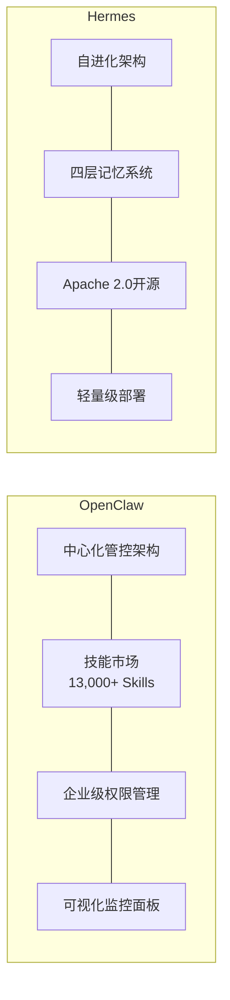

| Dimension | OpenClaw | Hermes |
|------|----------|--------|
| **Open source license** | Custom open source license | Apache 2.0 |
| **GitHub stars** | 149,000+ | 42,000+ |
| **Architecture style** | Centralized control | Distributed self-evolving |
| **Skill ecosystem** | 13,000+ pre-built skills | 5,000+ community skills |
| **Memory architecture** | Single-layer context management | Four-layer memory architecture (working/short-term/long-term/permanent) |
| **Deployment complexity** | Medium (requires central node) | Low (supports edge deployment) |
| **Applicable scenarios** | Large enterprises, multi-team collaboration | Small and medium teams, research institutions |
| **Learning curve** | Relatively steep | Relatively gentle |
| **Community activity** | Extremely high (50+ PRs/day average) | High (15+ PRs/day average) |
| **Commercialization** | Enterprise edition available (from $999/month) | Pure open source, revenue from services |

**OpenClaw's** strength lies in its mature enterprise-grade features and massive skill ecosystem. Its centralized control architecture allows administrators to monitor and manage all Agents from a single dashboard, making it ideal for the unified control needs of large enterprises. Its skill marketplace has accumulated over 13,000 pre-built skills, covering mainstream scenarios such as office automation, data analysis, code development, and customer service.

**Hermes's** core highlight is its "self-evolving architecture" and "four-layer memory system." The four-layer memory architecture divides Agent memory into working memory (immediate information for the current task), short-term memory (context from recent interactions), long-term memory (user preferences and historical patterns), and permanent memory (cross-user general knowledge), enabling Agents to truly become "smarter with use." The Apache 2.0 license also eliminates legal risk concerns for enterprise adoption.

### 6.5 Enterprise Deployment Recommendations / 企业级部署建议

Deploying a Harness platform into enterprise production environments requires careful planning from both security and compliance dimensions.

#### 6.5.1 Security Standards / 安全标准

| Security Measure | Standard Requirement | Description |
|---------|---------|------|
| **Transport encryption** | TLS 1.3 | All communication between Agent and external systems must be encrypted |
| **Data encryption** | AES-256 | Static data storage must use AES-256 encryption |
| **Authentication** | OAuth 2.1 | Agent and user identity authentication using the OAuth 2.1 protocol |
| **Key management** | HSM hardware key module | Sensitive keys stored in hardware security modules |
| **Network isolation** | VPC private network | Harness platform deployed within the enterprise's private network |

#### 6.5.2 Compliance Requirements / 合规要求

For enterprises with international expansion needs or those serving consumer users, the following compliance frameworks require special attention:

- **GDPR (EU General Data Protection Regulation)**: Requires that Agent obtain explicit authorization when processing EU user data, support data deletion requests, and provide explainability of data processing.
- **CCPA (California Consumer Privacy Act)**: Grants California residents the right to know, delete, and opt out of the sale of their personal data.
- **RBAC (Role-Based Access Control)**: Ensures that users and Agents of different roles can only access data and functions within their permission scope.
- **SOC 2 Type II**: For SaaS-type Agent products, SOC 2 certification has become a standard requirement for enterprise customers.

According to Deloitte's 2025 AI compliance survey, 78% of enterprises ranked "compliance" as their top priority when deploying Agent systems, higher than "performance" (62%) and "cost" (55%).

### 6.6 Harness Six-Layer Governance Architecture / Harness六层治理架构

A mature Harness platform typically adopts a six-layer governance architecture, with each layer responsible for different control functions:

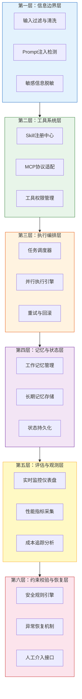

**Layer 1: Information Boundary Layer / 第一层：信息边界层（Information Boundary Layer）**

This is Harness's first line of defense, responsible for processing all information entering and leaving the Agent system. Core functions include: input filtering and sanitization (removing malicious code and injection attacks), Prompt injection detection (identifying malicious inputs that attempt to manipulate Agent behavior), and sensitive information desensitization (automatically identifying and masking sensitive data such as ID card numbers and bank card numbers).

**Layer 2: Tool System Layer / 第二层：工具系统层（Tool System Layer）**

Manages all tools and skills that the Agent can invoke. Core functions include: Skill registry (unified management of metadata and interface definitions for all available skills), MCP protocol adaptation (unifying tools from different sources into MCP standard interfaces), and tool permission management (defining which tools each Agent can invoke, as well as frequency and parameter limits).

**Layer 3: Execution Orchestration Layer / 第三层：执行编排层（Execution Orchestration Layer）**

This is Harness's "command center," responsible for coordinating the Agent's execution process. Core functions include: task scheduler (determining execution order and priority of tasks), parallel execution engine (supporting multiple subtasks running in parallel for improved efficiency), and retry and rollback (automatically retrying or rolling back to the last stable state when a task fails).

**Layer 4: Memory and State Layer / 第四层：记忆与状态层（Memory & State Layer）**

Manages the Agent's memory and state information. Core functions include: working memory management (immediate context for the current task), long-term memory storage (cross-session user preferences and historical interaction patterns), and state persistence (enabling Agent to resume execution from a breakpoint after interruption).

**Layer 5: Evaluation and Observability Layer / 第五层：评估与观测层（Evaluation & Observability Layer）**

Provides comprehensive visualization of Agent runtime status. Core functions include: real-time monitoring dashboard (displaying the running status and resource consumption of all Agents), performance metrics collection (task completion rate, average duration, error rate, etc.), and cost tracking and analysis (Token consumption, API call costs, etc.).

**Layer 6: Constraint Verification and Recovery Layer / 第六层：约束校验与恢复层（Constraint Verification & Recovery Layer）**

This is Harness's "last line of defense." Core functions include: security rule engine (defining and enforcing security policies, such as "Agent is prohibited from performing write operations outside working hours"), anomaly recovery mechanism (automatic intervention when Agent enters an abnormal state), and human intervention interface (handing control over to a human administrator when automatic recovery fails).

These six layers form a complete governance closed loop, from outside to inside, from prevention to recovery. According to Red Hat's 2025 Enterprise AI Governance Report, enterprises that adopted the six-layer governance architecture saw a 89.3% reduction in Agent-related security incidents, and their compliance audit pass rate increased from 61% to 94%.

### 6.7 Summary / 小结

If Agent is AI's "executor," then Harness is the control system that ensures the executor "doesn't go astray, doesn't lose control, and doesn't cause trouble."

In the 2026 AI technology stack, although Harness may not be as eye-catching as large models and Agents, it is indispensable infrastructure for enterprise-grade AI applications. An Agent without Harness is like a car without brakes -- the faster it goes, the greater the risk.

The key to understanding Harness lies in remembering its positioning: **Harness is not Agent, but the platform that manages Agents.** It provides six core capabilities -- sandbox isolation, rate limiting, risk control interception, audit logging, permission isolation, and resource allocation -- and achieves full-chain control from information input to anomaly recovery through its six-layer governance architecture.

As Agent capabilities continue to strengthen and application scenarios continue to expand, the importance of Harness will only grow. For any enterprise seriously considering putting Agents into production, investing in Harness infrastructure is not optional -- it is mandatory.

---
## Chapter 7: AI's "Memory" -- From Forgetting to Long-Term Memory / 第7章：AI的"记忆"——从遗忘到长期记忆

### 7.1 Opening: Have You Noticed That ChatGPT Forgets What Was Said Earlier in a Conversation? / 7.1 开篇：你有没有发现，ChatGPT聊着聊着就"忘了"前面说过的话？

Imagine this scenario: you chat with a new colleague for two solid hours -- covering project background, technical details, client requirements, and scheduling. At the very end, you ask him: "What was the name of that technical solution we just agreed on?" He looks at you blankly -- "Sorry, what did you say?"

This is not a joke. This is the everyday AI user experience.

Whether you use ChatGPT, Claude, or Doubao, as long as your conversation is long enough, AI will start "losing its memory." It forgets key information you told it ten minutes ago, confuses the persona you previously set, and may even solemnly contradict what it just said. In 2026, the context window of large language models has expanded from 4K tokens a few years ago to 1 million tokens (standard across the entire DeepSeek-V4 lineup), equivalent to approximately 750,000 Chinese characters -- but "being able to hold" and "being able to remember" are two very different things.

This is like expanding a desk from 1 square meter to 100 square meters, but your work habits haven't changed: you still only look at the few pages spread out in front of you, and you have no idea where you put the materials piled up far away on the desk.

The core question this chapter aims to address is: **How can we give AI genuine "memory," moving from passive forgetting to active remembering?**

---

### 7.2 Why Can't AI "Remember"? / 7.2 AI为什么"记不住"？

#### 7.2.1 The Physical Limitations of the Context Window / 7.2.1 上下文窗口的物理限制

The "memory" of a large language model is essentially something called the **Context Window**. You can think of it as AI's "workspace" -- all the text that AI can simultaneously see during each conversation is the material spread out on this workspace.

The context window sizes of mainstream models in 2026 are as follows:

| Model | Context Window | Approximate Chinese Character Count |
|------|-----------|-------------|
| GPT-4o | 128K tokens | ~96,000 characters |
| Claude 4 Opus | 200K tokens | ~150,000 characters |
| Gemini 2.5 Pro | 1M tokens | ~750,000 characters |
| DeepSeek-V4 | 1M tokens | ~750,000 characters |
| Kimi K2.6 | 1M tokens | ~750,000 characters |

The numbers look impressive, but there is a key misconception to correct:

> **Common Misconception: The larger the context window, the better the AI's memory.**
>
> **Truth: The context window is "capacity," not "memory."** It's like a 1TB hard drive -- filling it with files doesn't mean you can quickly find the one you need. Research shows that when context utilization exceeds 60%, the model's attention mechanism significantly degrades -- it can "see" all the text, but cannot effectively "focus" on key information. This is known as the **"Lost in the Middle" effect**: the model remembers information at the beginning and end of the context well, but its accuracy in extracting information from the middle drops by 15%-30%.

A deeper problem lies in cost. Although DeepSeek-V4 achieves 1 million token context, its V4-Pro version's KV cache (memory that stores context state) still consumes significant computational resources when processing long texts. While DeepSeek claims that only 8GB of VRAM is needed to handle the KV cache for 1M tokens, in practice, every conversation requires reprocessing the entire context, which means **the longer the conversation, the higher the latency and cost of each reply**.

And the limitations of the context window are just the tip of the iceberg when it comes to AI's "memory problem." What's even more frustrating is that even when AI "sees" all the information, it doesn't necessarily tell the truth.

#### 7.2.2 Behind DeepSeek V4's 94% Hallucination Rate / 7.2.2 DeepSeek V4幻觉率94%的背后

In April 2026, DeepSeek released the V4 series of models. Benchmark data revealed a shocking figure: **V4-Pro's hallucination rate is as high as 94%, and V4-Flash reaches 96%** (a significant increase from V3.2's 82%).

What does this mean? It means that when the model faces a question it doesn't know the answer to, it almost 100% of the time chooses to "fabricate a plausible-sounding answer" rather than honestly saying "I don't know."

This reflects a fundamental design dilemma:

- **"Say what you know, and say you don't know when you don't"** -- This requires the model to have precise self-awareness, able to accurately judge the boundaries of its own knowledge.
- **"Fabricate something even when you don't know"** -- This is determined by the generative nature of large language models. They are trained to "continue text," not to "judge truth from falsehood." When the context lacks relevant information, the model will still generate text that "looks about right" based on statistical patterns.

This leads to a very important industry insight:

> **The unit price of AI models is dropping, but the total cost of getting a reliable answer is not necessarily dropping.**

Model API prices are indeed continuing to decline -- DeepSeek-V4-Flash's API price is approximately 30% lower than V3.2's. But if you need humans to verify the 94% potential hallucinations in the model's output, your **total cost = model invocation cost + human verification cost + decision risk cost from hallucinations**. This total cost may be far higher than using a more expensive but more reliable solution.

---

### 7.3 RAG: Giving AI an "External Knowledge Base" / 7.3 RAG：给AI装一个"外挂知识库"

#### 7.3.1 What is RAG? / 7.3.1 RAG是什么？

If AI's memory has fundamental flaws, what's the most direct solution? Give it a "notebook" it can consult at any time.

This is the core idea of **RAG (Retrieval-Augmented Generation)**.

Think of it this way: RAG is like giving a forgetful employee access to a super library. When you ask him a question, he doesn't make up an answer from thin air -- instead, he first goes to the library to look up relevant materials, finds reliable information, and then answers you.

**Three progressive levels of understanding RAG:**

1. **What it is**: An AI architectural pattern that combines "information retrieval" with "text generation."
2. **How it works**: User asks a question -> System retrieves relevant documents from the knowledge base -> Retrieved results are fed to the LLM as context -> LLM generates an answer based on these real materials.
3. **Why it matters**: RAG can reduce an LLM's hallucination rate from 30%-50% to below 5%, while making answers evidence-based with traceable sources.

#### 7.3.2 RAG's Four-Layer Architecture / 7.3.2 RAG四层架构

A complete RAG system consists of four layers, each with its own responsibilities:

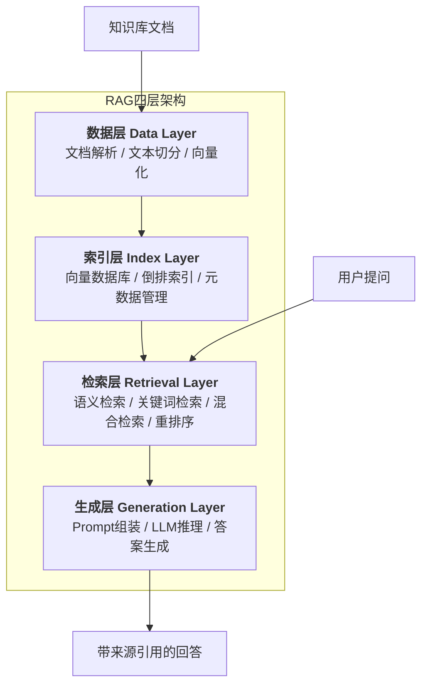

**Layer 1: Data Layer**

This is the foundation of RAG. Raw documents (PDFs, Word files, web pages, database records) are parsed, cleaned, and split into "knowledge chunks" suitable for retrieval, then converted into high-dimensional vectors through an embedding model.

Key parameters:
- Chunk size: typically 256-1024 tokens per chunk
- Overlap length: 50-128 tokens of overlap between adjacent chunks to prevent semantic truncation
- Embedding dimensions: mainstream models output 768-1536 dimensional vectors

**Layer 2: Index Layer**

Vector databases (such as ChromaDB, Milvus, Pinecone) are responsible for storing and indexing these vectors. The core challenge of the index layer is **achieving millisecond-level retrieval among billions of vectors**.

Performance comparison of mainstream vector databases in 2026:

| Vector Database | Maximum Supported Vectors | Query Latency (Million-scale) | Use Case |
|-----------|-------------|-----------------|---------|
| Milvus | 10 billion+ | <10ms | Enterprise-grade large-scale deployment |
| ChromaDB | 10 million+ | <20ms | Lightweight local deployment |
| Pinecone | 1 billion+ | <15ms | Cloud-native managed service |
| Weaviate | 1 billion+ | <12ms | Hybrid retrieval optimization |

**Layer 3: Retrieval Layer**

The retrieval layer is the "brain" of RAG. It determines which knowledge chunks are most relevant to the user's question.

**Hybrid Retrieval** is the current best practice -- combining semantic retrieval with keyword retrieval:

- **Semantic retrieval**: Understands content with "similar meaning." For example, when a user asks "how to reduce costs," it can retrieve documents related to "cutting expenses."
- **Keyword retrieval (BM25)**: Precisely matches proper nouns, ID numbers, code snippets, etc. For example, when a user asks "status of Bug #38276," it must precisely match that number.

The two retrieval methods are merged through the **Reciprocal Rank Fusion (RRF)** algorithm, comprehensively ranked and then sent to a reranker model for fine ranking.

> **Common Misconception: Vector retrieval is always better than keyword retrieval.**
>
> **Truth: They complement each other.** Pure semantic retrieval performs poorly when handling proper nouns, product numbers, and code snippets ("iPhone 16 Pro Max" and "iPhone 15" are semantically close, but they are completely different products). Pure keyword retrieval cannot understand synonymous expressions. Hybrid retrieval combines the strengths of both and is the standard solution for enterprise-grade RAG in 2026.

**Layer 4: Generation Layer**

The retrieved knowledge chunks are assembled into a prompt, along with the user's question, and sent to the LLM. The LLM generates the final answer based on these "reference materials" and annotates information sources.

A typical RAG prompt template:

```
你是一个专业的问答助手。请基于以下参考资料回答用户问题。
如果参考资料中没有相关信息，请直接回答"根据现有资料，我无法回答这个问题"，不要编造答案。

【参考资料】
{retrieved_documents}

【用户问题】
{user_question}

请回答，并标注每条信息的来源文档。
```

Note the last sentence -- "do not fabricate answers" -- this is RAG's core mechanism for combating hallucinations: **through prompt constraints, the model is made to proactively "stay silent" in areas not covered by the knowledge base, rather than forcefully fabricating.**

#### 7.3.3 RAG Performance Data / 7.3.3 RAG的效果数据

According to the 2026 Enterprise AI Application Report, the improvements brought by RAG architecture are significant:

| Metric | Pure LLM | RAG System | Improvement |
|------|-------|---------|---------|
| Hallucination rate | 30%-50% | 3%-5% | Reduced by 85%-90% |
| Answer accuracy | 55%-70% | 85%-95% | Increased by 30-40 percentage points |
| Cost per query | Baseline | Reduced by 40%-70% | -- |
| Source traceability | None | 100% | -- |

---

### 7.4 Agent Memory Four-Layer Architecture: An Analogy to Human Memory / 7.4 Agent记忆四层架构：类比人类记忆

If RAG solves the problem of "how AI acquires external knowledge," then the Agent memory architecture addresses a deeper question: **How can AI have different levels and types of memory, like humans do?**

Cognitive psychology divides human memory into multiple systems. AI researchers have drawn on this framework to propose the **Agent Memory Four-Layer Architecture**:

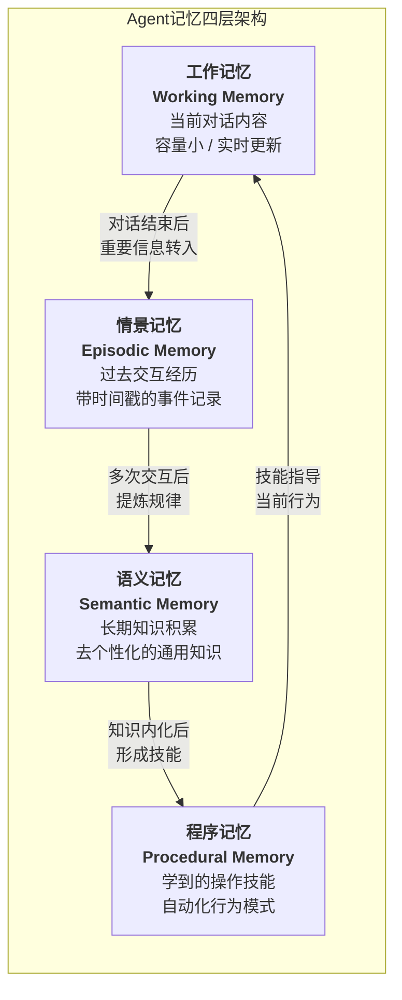

#### 7.4.1 Working Memory = Short-Term Memory / 7.4.1 工作记忆（Working Memory）= 短期记忆

**Analogy**: Like your "desktop" -- the files currently being processed, the web pages open, the documents being edited, are all on the desktop. Turn off the computer, and everything on the desktop is gone.

**Technical implementation**: The conversation context window. What AI can "remember" is all the visible messages in the current conversation.

**Limitations**:
- Limited capacity (even 1 million tokens cannot cover all information accumulated over long-term use)
- Cleared when the session ends (close the conversation window, and the memory disappears)
- Middle information is easily lost (Lost in the Middle effect)

#### 7.4.2 Episodic Memory = Past Interaction Experiences / 7.4.2 情景记忆（Episodic Memory）= 过去交互经历

**Analogy**: Like your "diary" -- it records "when, with whom, what was discussed, and what the outcome was." You can flip through the diary to recall specific events.

**Technical implementation**: Conversation history storage. Key information from each conversation (timestamps, user intent, AI response, user feedback) is stored in a structured format, typically in a vector database for semantic retrieval.

**Key capabilities**:
- "Do you remember the project plan we discussed last week?" -- Episodic memory enables AI to answer this type of question
- User preference tracking: "You mentioned before that you prefer concise response styles"
- Context continuity: maintaining conversation coherence across sessions

#### 7.4.3 Semantic Memory = Long-Term Knowledge Accumulation / 7.4.3 语义记忆（Semantic Memory）= 长期知识积累

**Analogy**: Like the "encyclopedia" in your brain -- you don't need to remember where you learned it, but you know that "the capital of France is Paris" and "Python is a programming language" -- this kind of general knowledge.

**Technical implementation**: Knowledge base + RAG system. Verified and refined knowledge is stored in a structured knowledge base, decoupled from specific conversation contexts.

**Difference from episodic memory**:
- Episodic memory: "On March 15, 2026, the user asked me about RAG, and I recommended a hybrid retrieval approach"
- Semantic memory: "Hybrid retrieval outperforms pure semantic retrieval in RAG systems because they complement each other"

#### 7.4.4 Procedural Memory = Learned Operational Skills / 7.4.4 程序记忆（Procedural Memory）= 学到的操作技能

**Analogy**: Like after you learn to ride a bicycle, you don't need to rethink how to balance every time -- your body just knows automatically. Procedural memory is the memory of "how to do things" -- once learned, it executes automatically.

**Technical implementation**: Agent tool-calling patterns, prompt templates, workflow automation rules.

**Practical applications**:
- AI learns the standard process for "handling customer complaints": first soothe emotions -> then understand the problem -> query the order -> provide a solution
- No need to re-reason what to do each time; instead, it executes automatically like muscle memory

---

### 7.5 MemPalace: AI's "Memory Palace" / 7.5 MemPalace：AI的"记忆宫殿"

#### 7.5.1 From Ancient Rome to AI: The Cross-Era Inheritance of the Memory Palace / 7.5.1 从古罗马到AI：记忆宫殿的跨时空传承

In 477 BC, the Greek poet Simonides attended a banquet. After briefly stepping away, the banquet hall roof collapsed, leaving all guests unrecognizable. But Simonides discovered that he could recall the identity of each victim based on where they had been seated.

This event gave birth to the most powerful mnemonic technique in Western civilization -- the **Method of Loci (Memory Palace)**. The core idea is to "place" information that needs to be memorized in a familiar spatial structure (such as the rooms of a building), and when recalling, simply "walk through" the building in your mind to find all the information in order.

In April 2026, an open-source project called **MemPalace** brought this ancient technique to the AI domain, garnering over 47,000 stars on GitHub within two weeks of its release. It achieved a 96.6% Recall@5 score on the LongMemEval benchmark -- meaning that when retrieving relevant memories, the target information can be found within the top 5 results 96.6% of the time.

#### 7.5.2 Six-Space Architecture / 7.5.2 六空间架构

MemPalace organizes AI's memory into a six-layer spatial structure, refining from macro to micro:

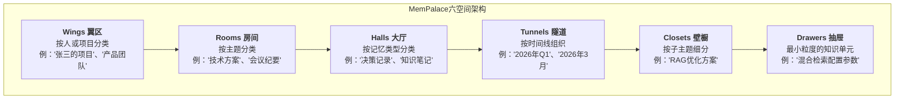

Each layer's design has a clear basis in cognitive science:

- **Wings**: The highest-level classification, corresponding to "whose knowledge is this" or "which project does it belong to." Human memory naturally organizes information anchored to people.
- **Rooms**: Topic-level classification, corresponding to "what domain does this knowledge belong to."
- **Halls**: Memory type classification, distinguishing between different types of information such as "facts," "decisions," and "processes."
- **Tunnels**: Time dimension, supporting memory retrieval that "traces back by time."
- **Closets**: Sub-topic refinement, further narrowing the retrieval scope.
- **Drawers**: The smallest storage unit, holding specific knowledge fragments.

#### 7.5.3 Composite Scoring Formula / 7.5.3 复合评分公式

MemPalace's core innovation lies in its **composite scoring mechanism for memory retrieval**. When AI needs to retrieve information from the memory palace, it doesn't simply perform semantic similarity matching, but comprehensively considers three dimensions:

```
复合评分 = α × 时间衰减 + β × 相关性 + γ × 重要性
```

Where:
- **Time Decay**: The older the memory, the lower its weight. Simulates the Ebbinghaus forgetting curve.
- **Relevance**: Semantic similarity to the current query.
- **Importance**: Comprehensively evaluated based on access frequency, user annotations, information uniqueness, and other factors.

The three weight coefficients alpha, beta, and gamma can be dynamically adjusted based on the application scenario. For example, in customer service scenarios, the time decay weight is higher (recent interactions are more important); in knowledge Q&A scenarios, the relevance weight is higher.

#### 7.5.4 Technology Stack / 7.5.4 技术栈

MemPalace's technology choices embody the principle of "pragmatism":

- **Vector storage**: ChromaDB (lightweight, runs locally, no cloud services needed)
- **Knowledge graph**: SQLite (stores factual relationships with time windows)
- **Raw data**: Local file system (ensures zero data loss)
- **Embedding model**: all-MiniLM-L6-v2 (default configuration, replaceable)
- **Integration method**: Supports MCP protocol (Model Context Protocol), can seamlessly connect to mainstream models like Claude and ChatGPT

> **Common Misconception: MemPalace is a brand-new AI memory algorithm.**
>
> **Truth: MemPalace's core value lies in its "memory organization paradigm" rather than its underlying algorithm.** Its vector retrieval engine is essentially ChromaDB's default configuration. The real innovation lies in borrowing the spatial metaphor of the memory palace to provide an intuitive, navigable organizational structure for AI memory. As the project documentation states: "No AI decides what matters -- you keep every word, and the structure gives you a navigable map instead of a flat search index."

---

### 7.6 LLM Wiki v2: Knowledge Lifecycle Management / 7.6 LLM Wiki v2：知识生命周期管理

If MemPalace focuses on "how to organize memory," then **LLM Wiki** focuses on "how to make knowledge grow, age, update, and die like a living organism."

LLM Wiki v2 introduces the concept of **Knowledge Lifecycle Management**, with the core idea that: **knowledge is not static -- it has a "shelf life."**

#### 7.6.1 Four-Layer Consolidation Architecture / 7.6.1 四层巩固架构

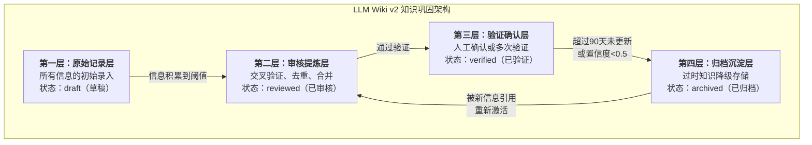

#### 7.6.2 Confidence Scoring System / 7.6.2 置信度评分系统

LLM Wiki v2 maintains a **Confidence Score** for each piece of knowledge, ranging from 0 to 1. This score is dynamically determined by the following factors:

- **Source reliability**: Official documentation > authoritative media reports > personal blogs > social media
- **Number of supporting evidence**: Knowledge cross-validated by multiple independent sources has higher confidence
- **Timeliness**: Recently confirmed knowledge has higher confidence; long-unverified knowledge has decaying confidence
- **Consistency**: No contradictions with other knowledge in the knowledge base

**Knowledge state transition rules:**

| Current State | Trigger Condition | Target State |
|---------|---------|---------|
| draft | Sufficient information accumulated | reviewed |
| reviewed | Human confirmation or multiple verifications | verified |
| verified | Not updated for over 90 days | stale |
| stale | Confidence drops below 0.5 | archived |
| stale | Referenced or verified by new information | reviewed |

#### 7.6.3 Cross-Session Mechanism / 7.6.3 超会话机制

Traditional AI conversations are "session-level" -- close the window and everything is forgotten. LLM Wiki v2's **Cross-Session Mechanism** breaks this limitation:

- **Knowledge persistence**: Valuable information generated during conversations is automatically extracted and written to the Wiki, not disappearing when the session ends
- **Cross-session referencing**: New conversations can retrieve and reference knowledge accumulated in any previous session
- **Knowledge evolution tracking**: Version changes of the same piece of knowledge at different points in time are fully recorded

This is like giving AI a "never-lost notebook" -- the essence of each conversation is automatically organized and archived, and during the next conversation, AI can consult it at any time.

---

### 7.7 ByteDance RAG Practice Cases / 7.7 字节跳动RAG实践案例

After all this theory, how much value can RAG actually create in real business? ByteDance's practice provides a convincing answer.

#### 7.7.1 Douyin E-Commerce Intelligent Customer Service / 7.7.1 抖音电商智能客服

**Scenario**: On the Douyin e-commerce platform, millions of users consult about product information, logistics status, return and exchange policies, and other questions every day. Traditional customer service teams are understaffed, and AI customer service often "gives irrelevant answers."

**RAG Solution**:
- Structured product information databases (over 1 billion SKU records), logistics policies, return and exchange rules, etc. into a knowledge base
- Adopted a hybrid retrieval strategy of "keyword retrieval + vector retrieval + rule filtering"
- Set the highest weight (60%) for authoritative sources such as "central bank policies" to ensure the accuracy of core facts

**Results**:
- Response time: reduced from an average of 5 minutes for human customer service to **300 milliseconds**
- Answer accuracy: **95%**
- User satisfaction: increased from 65% to **92%**
- Annual customer service cost savings: **over 200 million RMB**

#### 7.7.2 Feishu Knowledge Base Q&A / 7.7.2 飞书知识库问答

**Scenario**: ByteDance internally has massive amounts of technical documents, project documents, and meeting minutes. Employees searching for information is like "finding a needle in a haystack" -- it takes an average of 15 minutes to find a target document.

**RAG Solution**:
- Performed semantic indexing on all Feishu documents
- Built a citation relationship network between documents, enabling "knowledge graph-style" retrieval
- Supported natural language queries, with AI automatically retrieving relevant documents and annotating sources

**Results**:
- Retrieval efficiency improvement: **7x**
- Information search time: reduced from an average of 15 minutes to **2 minutes**
- Document retrieval recall rate: increased from 60% to **92%**
- Average reduction in enterprise employee information search time: **70%**

#### 7.7.3 FinTech Research Report Analysis / 7.7.3 金融科技研报分析

**Scenario**: ByteDance's FinTech team needs to read and analyze large volumes of industry research reports daily. Manual processing is inefficient and prone to missing key information.

**RAG Solution**:
- Automatically parsed, chunked, and vectorized research reports
- Built a domain-specific financial knowledge graph (company relationships, industry classifications, indicator systems)
- Supported cross-report comparative analysis and trend tracking

**Results**:
- Daily research report processing volume: increased from 10 to **50 reports**
- Decision-making efficiency improvement: **80%**
- Key information extraction accuracy: **90%+**

---

### 7.8 Code Example: A Simple RAG Retrieval Process / 7.8 代码示例：一个简单的RAG检索流程

Below is a Python pseudocode demonstration of the core RAG process:

```python
"""
简单的RAG检索流程示例
依赖：sentence-transformers, chromadb, openai
"""

from sentence_transformers import SentenceTransformer
import chromadb
from openai import OpenAI

# ========== 第一步：初始化 ==========

# 加载嵌入模型（将文本转化为向量）
embedder = SentenceTransformer("all-MiniLM-L6-v2")

# 初始化ChromaDB向量数据库（本地运行）
client = chromadb.PersistentClient(path="./knowledge_base")
collection = client.get_or_create_collection(name="docs")

# 初始化大语言模型
llm = OpenAI(api_key="your-api-key")

# ========== 第二步：构建知识库（数据层 + 索引层） ==========

def build_knowledge_base(documents: list[dict]):
    """
    将文档存入向量数据库
    每个文档包含：id, content, metadata(来源、日期等)
    """
    # 提取文本内容
    texts = [doc["content"] for doc in documents]
    # 生成向量
    embeddings = embedder.encode(texts).tolist()
    # 存入ChromaDB
    collection.upsert(
        ids=[doc["id"] for doc in documents],
        embeddings=embeddings,
        documents=texts,
        metadatas=[doc["metadata"] for doc in documents]
    )

# ========== 第三步：检索（检索层） ==========

def retrieve(query: str, top_k: int = 5) -> list[dict]:
    """
    混合检索：语义检索 + 关键词检索
    """
    # 语义检索（向量相似度）
    query_embedding = embedder.encode(query).tolist()
    semantic_results = collection.query(
        query_embeddings=[query_embedding],
        n_results=top_k
    )

    # 合并结果（实际项目中应加入BM25关键词检索 + RRF融合）
    retrieved_docs = []
    for i, doc in enumerate(semantic_results["documents"][0]):
        retrieved_docs.append({
            "content": doc,
            "metadata": semantic_results["metadatas"][0][i],
            "distance": semantic_results["distances"][0][i]
        })

    return retrieved_docs

# ========== 第四步：生成（生成层） ==========

def generate_answer(query: str, retrieved_docs: list[dict]) -> str:
    """
    基于检索结果生成回答
    """
    # 组装Prompt
    context = "\n\n".join([
        f"【资料{i+1}】({doc['metadata'].get('source', '未知来源')})\n{doc['content']}"
        for i, doc in enumerate(retrieved_docs)
    ])

    prompt = f"""你是一个专业的问答助手。请基于以下参考资料回答用户问题。
如果参考资料中没有相关信息，请直接回答"根据现有资料，我无法回答这个问题"。

【参考资料】
{context}

【用户问题】
{query}

请回答，并标注每条信息的来源。"""

    # 调用大模型
    response = llm.chat.completions.create(
        model="gpt-4o",
        messages=[{"role": "user", "content": prompt}],
        temperature=0.1  # 低温度，减少随机性
    )

    return response.choices[0].message.content

# ========== 完整流程 ==========

def rag_query(query: str) -> str:
    """端到端RAG查询"""
    docs = retrieve(query, top_k=5)
    answer = generate_answer(query, docs)
    return answer

# 使用示例
if __name__ == "__main__":
    # 构建知识库
    docs = [
        {"id": "1", "content": "RAG全称Retrieval-Augmented Generation...",
         "metadata": {"source": "技术文档", "date": "2026-01"}},
        {"id": "2", "content": "混合检索结合了语义检索和关键词检索...",
         "metadata": {"source": "技术博客", "date": "2026-03"}},
    ]
    build_knowledge_base(docs)

    # 查询
    answer = rag_query("什么是RAG？它和纯LLM有什么区别？")
    print(answer)
```

**Key code points explained**:

1. **Embedding model** (`SentenceTransformer`): Converts text into 768-dimensional vectors; semantically similar texts are closer together in vector space.
2. **ChromaDB**: Lightweight vector database that runs locally, suitable for development and small-scale deployment.
3. **Hybrid retrieval**: The example simplifies the keyword retrieval part; in real projects, BM25 + vector retrieval + RRF fusion should be used.
4. **Prompt engineering**: The key constraint -- "if the reference materials do not contain relevant information, answer that you cannot answer" -- this is the core method for controlling hallucinations.
5. **Low temperature parameter** (`temperature=0.1`): Reduces generation randomness, improving the determinism and consistency of answers.

---

### 7.9 Chapter Summary / 7.9 本章小结

| Technical Solution | Problem Solved | Core Mechanism | Effect |
|---------|-----------|---------|------|
| RAG | AI hallucinations, outdated knowledge | External knowledge base + retrieval augmentation | Hallucination rate reduced to below 5% |
| Agent Memory Four-Layer Architecture | Single-layer AI memory | Simulating human memory systems | Supports cross-session, cross-type memory |
| MemPalace | Disorganized memory | Spatial metaphor + six-layer structure | LongMemEval 96.6% Recall@5 |
| LLM Wiki v2 | Knowledge aging, lack of verification | Confidence scoring + lifecycle management | Automatic knowledge updates, automatic degradation of outdated knowledge |

**Core insight**: AI's "memory" problem is not a purely technical problem, but a systems engineering problem. It requires the coordinated cooperation of the data layer (how to store), the index layer (how to organize), the retrieval layer (how to find), and the generation layer (how to use). Just as human memory is not about "remembering all information" but about "being able to find key information when needed," the ultimate goal of AI memory is not to infinitely expand the context window, but to build an efficient, reliable, and evolvable knowledge management system.

In the next chapter, we will move from "a single AI's memory" to "multiple AIs collaborating" -- when AI has memory, what happens when a group of AIs with memory work together?

---

## Chapter 8: AI's "Team" -- Multi-Agent Collaboration / 第8章：AI的"团队"——多智能体协作

### 8.1 Opening: What One Person Can Do Is Limited -- How Far Can a Group of Collaborating AIs Go? / 8.1 开篇：一个人能干的事有限，一群AI协作能干到什么程度？

Imagine a software development team: a project manager breaks down requirements, a researcher investigates technical solutions, a programmer writes code, a test engineer finds bugs, and a tech lead reviews quality. Each person has their own role, they cooperate with each other, and ultimately deliver a complete product.

Now, replace every person on this team with AI.

This is not science fiction. In 2026, Multi-Agent systems have become the mainstream architecture for enterprise-grade AI applications. From Microsoft's Copilot Researcher to ByteDance's M3-Agent-Control, from multi-Agent collaboration on Amazon Bedrock to the open-source CrewAI framework -- "a group of AIs working as a team" has moved from the lab to production environments.

Why do we need multiple AIs to collaborate? The data gives the most direct answer:

- **A single LLM's task completion rate in complex business scenarios is only about 35%-60%**
- **Multi-Agent systems can achieve task completion rates of 85% or higher**
- On parallelizable tasks, the performance improvement from Multi-Agent collaboration is as high as **81%**

This is like the difference between an all-rounder and a professional team. An all-rounder knows a little bit of everything, but when facing complex tasks, they tend to lose focus. A professional team, although each person only excels in one domain, can handle far more complex tasks through division of labor and collaboration than any individual could alone.

The core question this chapter aims to answer is: **How do multiple AIs collaborate efficiently? What mature architectural patterns exist? What challenges will be encountered?**

---

### 8.2 Limitations of a Single Agent / 8.2 单Agent的局限

Before discussing Multi-Agent, we first need to understand: why isn't a single Agent enough?

#### 8.2.1 Hard Limits of Capability Boundaries / 8.2.1 能力边界的硬限制

A large language model, regardless of its parameter size, has several fundamental limitations:

**1. Attention Dilution**

When an Agent needs to handle multiple subtasks simultaneously, its attention gets diluted. Research shows that when task complexity exceeds a certain threshold, a single Agent's performance drops sharply. This is like asking one person to simultaneously be a product manager, architect, programmer, and tester -- they won't do any of the roles well.

**2. Role Conflict**

A single Agent needs to play different roles at different stages (e.g., first doing research, then coding, then reviewing), but role switching leads to context confusion. The model might use a "researcher's mindset" to write code, or use a "reviewer's critical attitude" to do creative work.

**3. Error Accumulation**

A single Agent's work is serial -- if it makes a mistake in the first step, all subsequent steps will continue executing based on the wrong assumption. There is no "bystander" to provide timely corrections.

**4. Tool Overload**

AWS experiments found that when a single Agent faces a large number of available tools, it tends to "hallucinate tool calls" -- selecting the wrong tool or passing wrong parameters. In Multi-Agent systems, each Agent only needs to master a small number of tools in its own domain.

> **Common Misconception: The larger the model, the better a single Agent can handle complex tasks.**
>
> **Truth: There is no linear relationship between model size and task completion rate.** Google Research's 2026 study shows that the effectiveness of Multi-Agent systems depends on the degree to which tasks can be parallelized. On parallelizable tasks (such as financial analysis), Multi-Agent improves by 81%; but on tasks with strong sequential dependencies (such as creative writing), Multi-Agent may actually cause performance to drop by 70%. The key is not "how many Agents to use," but "whether the task is suitable for decomposition."

#### 8.2.2 Data Comparison / 8.2.2 数据对比

| Dimension | Single Agent | Multi-Agent System |
|------|---------|------------|
| Complex task completion rate | 35%-60% | 85%+ |
| Parallelizable task performance | Baseline | +81% |
| Factual error rate | Baseline | -40% (Microsoft data) |
| Tool call accuracy | Low (hallucination-prone with many tools) | High (each Agent has few tools) |
| Applicable scenarios | Simple, sequential tasks | Complex, parallelizable tasks |

---

### 8.3 Multi-Agent Three-Layer Collaboration Architecture / 8.3 多智能体三层协作架构

A Multi-Agent system is not simply putting several LLMs together -- it requires a carefully designed collaboration architecture. The most mature approach in the industry in 2026 is the **Three-Layer Collaboration Architecture**:

```mermaid
graph TB
    subgraph "多智能体三层协作架构"
        subgraph "控制端 Control Plane"
            M["<b>Manager Agent</b><br/>项目经理<br/>任务拆解 / 分配 / 整合"]
        end
        subgraph "感知端 Perception Plane"
            R["<b>Researcher Agent</b><br/>研究员<br/>信息收集 / 分析 / 调研"]
        end
        subgraph "行动端 Action Plane"
            C["<b>Coder Agent</b><br/>程序员<br/>代码编写 / 工具调用"]
            RV["<b>Reviewer Agent</b><br/>审核员<br/>质量检查 / 错误纠正"]
        end
    end
    M -->|"分配调研任务"| R
    M -->|"分配编码任务"| C
    R -->|"提供调研结果"| M
    C -->|"提交代码"| RV
    RV -->|"反馈审核意见"| C
    RV -->|"确认质量"| M
    M -->|"整合最终输出"| OUT["最终交付物"]
```

#### 8.3.1 Control Plane: Manager Agent (Project Manager) / 8.3.1 控制端：Manager Agent（项目经理）

**Role analogy**: Project manager. Doesn't need to personally write code or do research, but needs to know "what to do, who does it, and when it should be done."

**Core responsibilities**:
- **Task decomposition**: Breaking complex tasks into independently executable subtasks
- **Task assignment**: Assigning subtasks to the most suitable Agent based on each Agent's capability profile
- **Progress management**: Tracking the completion status of each subtask and handling dependencies
- **Result integration**: Consolidating each Agent's output into the final deliverable

**Technical implementation**: The Manager Agent typically uses a stronger model (such as GPT-4o, Claude Opus) because it requires stronger reasoning and planning capabilities. ByteDance's M3-Agent-Control framework uses Seed-OSS-36B as the control plane model and achieves optimal task assignment through a 23-dimensional capability vector + the Hungarian algorithm.

#### 8.3.2 Perception Plane: Researcher Agent (Researcher) / 8.3.2 感知端：Researcher Agent（研究员）

**Role analogy**: Researcher. Responsible for "figuring out the situation" -- collecting information, analyzing data, and investigating technical solutions.

**Core responsibilities**:
- Information retrieval: Collecting relevant information from knowledge bases, the internet, and internal documents
- Data analysis: Organizing, comparing, and summarizing collected information
- Solution research: Investigating available options for technical problems and providing recommendations

**Technical implementation**: The Researcher Agent is typically equipped with a RAG system (this is where the content from the previous chapter comes into play), web search tools, and data analysis tools. Its output is a structured research report, not the final answer.

#### 8.3.3 Action Plane: Coder Agent + Reviewer Agent (Executor + Reviewer) / 8.3.3 行动端：Coder Agent + Reviewer Agent（执行者 + 审核者）

**Coder Agent (Programmer)**:
- Executes specific operations based on the Researcher's findings and the Manager's task requirements
- In software development scenarios, responsible for writing code; in data analysis scenarios, responsible for generating reports; in content creation scenarios, responsible for writing copy

**Reviewer Agent (Reviewer)**:
- Independent from the Coder, performs quality review on the output
- Checks factual accuracy, logical consistency, and format compliance
- When issues are found, provides feedback to the Coder for revision, forming a "write-review-revise" closed loop

> **Design principle: The Coder and Reviewer must use different models or at least different system prompts.** If they are completely identical, the Reviewer will tend to "agree with its own output," making the review meaningless. Microsoft's approach is to have GPT handle generation and Claude handle review -- two different "brands" of AI cross-checking each other can significantly improve quality.

---

### 8.4 Typical Collaboration Workflow / 8.4 典型协作流程

A complete Multi-Agent collaboration workflow typically includes the following steps:

```mermaid
sequenceDiagram
    participant User as 用户
    participant M as Manager Agent
    participant R as Researcher Agent
    participant C as Coder Agent
    participant RV as Reviewer Agent

    User->>M: 提交复杂任务
    M->>M: 任务拆解为子任务
    M->>R: 子任务1：调研相关信息
    M->>C: 子任务2：准备执行方案

    R->>R: 检索知识库 + 网络搜索
    R-->>M: 返回调研报告

    Note over M: Manager整合调研结果<br/>更新任务要求
    M->>C: 基于调研结果执行编码

    C->>C: 编写代码/生成内容
    C-->>RV: 提交初稿

    RV->>RV: 质量审核
    alt 审核通过
        RV-->>M: 确认质量合格
    else 发现问题
        RV-->>C: 反馈修改意见
        C->>C: 修改后重新提交
        C-->>RV: 提交修改稿
    end

    M->>M: 整合所有子任务结果
    M-->>User: 交付最终成果
```

**Workflow key points**:

1. **The quality of task decomposition determines the final result.** The Manager Agent needs to decompose tasks into subtasks of "appropriate granularity" -- too coarse and the Agent cannot complete them independently; too fine and the communication overhead becomes excessive.
2. **Combining parallel and serial execution.** Research and preliminary coding can be executed in parallel, but coding must wait for research to complete (there is a dependency relationship).
3. **Review closed loop.** The Reviewer's feedback must be able to trigger the Coder's revisions, forming at least one round of "write-review-revise" cycle.
4. **Final integration.** The Manager is responsible for consolidating the results of each subtask into a coherent final output, ensuring overall consistency.

---

### 8.5 ByteDance Data Center Operations Case / 8.5 字节跳动数据中心运维案例

ByteDance's open-source **M3-Agent-Control** framework is a benchmark practice of Multi-Agent collaboration in industry. In its internal data center operations scenario, this framework demonstrated significant value.

#### 8.5.1 Scenario Description / 8.5.1 场景描述

ByteDance owns one of the world's largest data center infrastructures. Every day, massive amounts of monitoring data, log data, and network data are generated. When a server fails, operations engineers need to troubleshoot from multiple dimensions -- is the network normal? What errors are in the application logs? Are resource usage levels abnormal? The traditional approach relies on multiple independent tools and human experience, which is inefficient and prone to omissions.

#### 8.5.2 Three-Agent Collaboration Solution / 8.5.2 三Agent协作方案

M3-Agent-Control deployed three types of specialized agents:

| Agent | Responsibility | Tools |
|--------|------|------|
| **Network Analysis Agent** | Captures link data, investigates packet loss and latency | Network monitoring API, Ping/Traceroute |
| **Log Parsing Agent** | Analyzes application error stacks, locates anomalous modules | Log retrieval system, error tracking |
| **Performance Monitoring Agent** | Evaluates resource bottlenecks, proposes scaling recommendations | Resource monitoring dashboard, capacity planning tools |

**Collaboration workflow**:

When the system detects server response latency:
1. **Network Analysis Agent** automatically captures network link data to investigate whether there is packet loss or routing anomalies
2. **Log Parsing Agent** simultaneously analyzes application error logs to identify which service module has a problem
3. **Performance Monitoring Agent** evaluates CPU, memory, disk I/O, and other resource usage to determine whether scaling is needed
4. After the three Agents' results are consolidated, the system automatically generates a fault diagnosis report containing root cause analysis and repair recommendations

#### 8.5.3 Performance Data / 8.5.3 效果数据

| Metric | Traditional Approach | M3-Agent-Control | Improvement |
|------|---------|-----------------|---------|
| Fault localization accuracy | 52% | **92%** | +40 percentage points |
| Average fault diagnosis steps | 12 steps | 4 steps | Reduced by 67% |
| Server fault self-healing rate | -- | **76%** | -- |
| Memory leak detection accuracy | -- | **91%** | -- |
| Mean Time Between Failures (MTBF) | Baseline | **2.3x** | -- |

#### 8.5.4 Technical Highlights / 8.5.4 技术亮点

Several key technical decisions of the M3-Agent-Control framework are worth noting:

- **Layered communication protocol**: The strategic layer uses natural language (easy for the Manager to understand), the tactical layer uses JSON structured data (precise information passing between Agents), and the execution layer uses API calls (directly interfacing with underlying tools)
- **Dynamic role assignment**: Evaluating each Agent's expertise through a 23-dimensional capability vector, using the Hungarian algorithm to achieve optimal task-Agent matching
- A collaborative network of **Fault Prediction Agent + Root Cause Analysis Agent + Auto-Remediation Agent**, achieving a shift from "reactive response" to "proactive prevention" in operations

---

### 8.6 Microsoft Copilot Researcher Case / 8.6 微软Copilot Researcher案例

In March 2026, Microsoft introduced a **Multi-Model Intelligence** mechanism to the Researcher feature of Microsoft 365 Copilot, a typical representative of the approach of "having different AIs cross-review each other."

#### 8.6.1 Critique Mode: Generation-Review Dual Engine / 8.6.1 Critique模式：生成-审核双引擎

Critique Mode adopts a "generation-review" collaborative architecture:

1. **Generation model** (OpenAI GPT series): Responsible for conducting deep research, retrieving information, and generating preliminary answers
2. **Review model** (Anthropic Claude series): Independently reviews the generated results in parallel, using rubrics to evaluate source reliability, argument completeness, and logical consistency

Key design: **Having models from two different companies cross-check each other**. GPT and Claude have different training data and reasoning preferences, so their "blind spots" are also different. Information that GPT might overlook, Claude might notice, and vice versa.

#### 8.6.2 Council Mode: Multi-Party Debate / 8.6.2 Council模式：多方辩论

Council Mode goes a step further -- having multiple models independently research the same question, and then having a "judge model" compare the conclusions from each party:

1. **Multiple research models** independently conduct research, each generating a complete research report
2. **Judge Model** evaluates each report and creates a "comparative summary"
3. The summary clearly marks: where the models reached consensus, where they diverge, and what the possible reasons for divergence are

#### 8.6.3 Performance Data / 8.6.3 效果数据

Microsoft used the DRACO benchmark to evaluate the effectiveness of Critique Mode:

| Metric | Single-Model Researcher | Critique Mode | Improvement |
|------|-----------------|-------------|------|
| DRACO composite score | Baseline | **+7.0 points** | +13.88% |
| Analysis breadth and depth | Baseline | **+3.3 points** | -- |
| Factual error rate | Baseline | **Reduced by approximately 40%** | -- |
| vs Perplexity Deep Research | Baseline | **Comprehensive superiority** | -- |

This case reveals a counter-intuitive insight: **Sometimes, having AIs "distrust each other" produces more reliable results than having them "reach consensus."** Diverse perspectives and cross-validation are among the most effective means of improving the reliability of AI output.

---

### 8.7 Challenges of Multi-Agent Systems / 8.7 多Agent的挑战

Although Multi-Agent systems are powerful, they are far from a "silver bullet." Practices in 2026 have already exposed several core challenges:

#### 8.7.1 Communication Overhead / 8.7.1 通信开销

Every information exchange between Agents requires LLM inference -- which means the communication itself has cost and latency. When the number of Agents increases, the communication overhead may exceed the cost of task execution itself.

**Quantitative data**: In a system of 5 Agents, if each Agent needs to communicate with all other Agents, the number of communication rounds is C(5,2) = 10. If each communication requires 2-5 seconds of LLM inference time, the communication latency alone reaches 20-50 seconds.

**Mitigation strategies**:
- Layered communication (such as M3-Agent-Control's strategic/tactical/execution layers)
- Asynchronous communication (Agents don't need to wait for a reply before continuing work)
- Shared blackboard (all Agents read and write to a shared state, rather than point-to-point communication)

#### 8.7.2 Task Assignment Optimization / 8.7.2 任务分配优化

"Who to assign the task to" is an NP-hard problem. Agent capabilities are dynamically changing (performance may degrade due to excessively long context), and task difficulty is also uncertain (seemingly simple tasks may hide complex dependencies).

**Current approaches**:
- Static assignment: Based on predefined role divisions (simple but not flexible enough)
- Dynamic assignment: Real-time decision-making based on capability assessment models (flexible but high overhead)
- Auction mechanism: Agents "bid" on tasks, and the lowest bidder wins (suitable for heterogeneous Agent teams)

#### 8.7.3 Conflict Resolution / 8.7.3 冲突解决

What happens when multiple Agents' conclusions contradict each other?

**Typical scenarios**:
- Researcher Agent says "we should use Solution A," but another Researcher says "we should use Solution B"
- Coder Agent thinks the code is fine, but Reviewer Agent believes there is a security vulnerability

**Resolution strategies**:
- **Voting mechanism**: The conclusion agreed upon by the majority of Agents wins
- **Hierarchical arbitration**: The Manager Agent has the final decision-making authority
- **Evidence weighting**: Whoever has more compelling evidence and more reliable sources wins
- **Parallel preservation**: Don't rush to unify conclusions; record the disagreements and let the user decide

#### 8.7.4 Consistency Assurance / 8.7.4 一致性保证

The most challenging problem in Multi-Agent systems is **consistency** -- how to ensure the final output is logically self-consistent, stylistically uniform, and factually accurate?

**Specific manifestations**:
- Agent A uses the term "user," Agent B uses "customer," Agent C uses "client" -- terminology is inconsistent
- Agent A's output assumes condition X, Agent B's output assumes condition Y -- logical contradiction
- Each Agent's output style differs greatly, and when stitched together it looks like a "hodgepodge"

**Resolution strategies**:
- **Global prompt constraints**: All Agents share a set of basic rules (terminology glossary, style guide, format specifications)
- **Final integration layer**: The Manager Agent is responsible for unifying style, eliminating contradictions, and ensuring coherence
- **Post-processing pipeline**: Using a dedicated "editor Agent" to polish the final output and perform consistency checks

---

### 8.8 Code Example: A Simple Multi-Agent Collaboration Framework / 8.8 代码示例：一个简单的多Agent协作框架

```python
"""
简单的多Agent协作框架示例
展示Manager-Researcher-Coder-Reviewer的基本协作流程
"""

from openai import OpenAI
import json

llm = OpenAI(api_key="your-api-key")

# ========== Agent定义 ==========

class Agent:
    """基础Agent类"""
    def __init__(self, name: str, role: str, system_prompt: str, model: str = "gpt-4o"):
        self.name = name
        self.role = role
        self.system_prompt = system_prompt
        self.model = model

    def execute(self, task: str, context: str = "") -> str:
        """执行任务"""
        messages = [
            {"role": "system", "content": self.system_prompt},
            {"role": "user", "content": f"任务：{task}\n\n上下文：{context}"}
        ]
        response = llm.chat.completions.create(
            model=self.model,
            messages=messages,
            temperature=0.3
        )
        return response.choices[0].message.content


# ========== 创建Agent实例 ==========

manager = Agent(
    name="Manager",
    role="项目经理",
    system_prompt="""你是一个项目经理Agent。你的职责是：
1. 将复杂任务拆解为子任务
2. 将子任务分配给合适的团队成员
3. 整合团队成员的输出，生成最终交付物

请以JSON格式输出任务拆解方案，包含：
- subtasks: 子任务列表，每个子任务包含 description, assignee, depends_on
"""
)

researcher = Agent(
    name="Researcher",
    role="研究员",
    system_prompt="""你是一个研究Agent。你的职责是：
1. 分析给定的问题，收集相关信息
2. 调研可选方案并给出建议
3. 输出结构化的调研报告

请确保你的结论有据可查，不要编造信息。
"""
)

coder = Agent(
    name="Coder",
    role="程序员",
    system_prompt="""你是一个编码Agent。你的职责是：
1. 根据需求和调研结果编写代码
2. 确保代码质量：可读性、正确性、健壮性
3. 遵循最佳实践和编码规范
"""
)

reviewer = Agent(
    name="Reviewer",
    role="审核员",
    model="claude-sonnet-4-20250514",  # 使用不同模型进行交叉审核
    system_prompt="""你是一个审核Agent。你的职责是：
1. 审核代码/内容的质量
2. 检查事实准确性、逻辑一致性
3. 如果发现问题，给出具体的修改建议

请严格审核，不要放过任何潜在问题。
"""
)

# ========== 协作流程 ==========

def multi_agent_workflow(user_task: str):
    """多Agent协作主流程"""

    print(f"=== 用户任务：{user_task} ===\n")

    # Step 1: Manager拆解任务
    print("[Manager] 正在拆解任务...")
    plan = manager.execute(
        task=user_task,
        context="团队成员：Researcher（研究员）、Coder（程序员）、Reviewer（审核员）"
    )
    print(f"[Manager] 任务拆解完成：\n{plan}\n")

    # Step 2: Researcher执行调研
    print("[Researcher] 正在调研...")
    research_report = researcher.execute(
        task="调研相关的技术方案和最佳实践",
        context=user_task
    )
    print(f"[Researcher] 调研完成：\n{research_report[:200]}...\n")

    # Step 3: Coder基于调研结果执行编码
    print("[Coder] 正在编码...")
    code_output = coder.execute(
        task=f"根据以下调研结果完成编码：\n{research_report}",
        context=user_task
    )
    print(f"[Coder] 编码完成：\n{code_output[:200]}...\n")

    # Step 4: Reviewer审核（最多3轮）
    print("[Reviewer] 正在审核...")
    for round_num in range(3):
        review_result = reviewer.execute(
            task=f"审核以下代码（第{round_num+1}轮）：\n{code_output}",
            context=user_task
        )

        if "通过" in review_result or "APPROVED" in review_result.upper():
            print(f"[Reviewer] 审核通过（第{round_num+1}轮）\n")
            break
        else:
            print(f"[Reviewer] 发现问题，反馈修改意见（第{round_num+1}轮）")
            code_output = coder.execute(
                task=f"根据审核意见修改代码：\n{review_result}",
                context=f"原始代码：\n{code_output}"
            )
            print(f"[Coder] 修改完成\n")

    # Step 5: Manager整合最终输出
    print("[Manager] 正在整合最终输出...")
    final_output = manager.execute(
        task=f"整合以下内容，生成最终交付物：\n"
             f"调研报告：{research_report}\n"
             f"最终代码：{code_output}\n"
             f"审核结果：{review_result}",
        context=user_task
    )

    print(f"=== 最终交付物 ===\n{final_output}")
    return final_output

# 使用示例
if __name__ == "__main__":
    multi_agent_workflow("设计并实现一个用户认证系统，支持JWT和OAuth2.0")
```

**Key code points explained**:

1. **Agent abstraction**: Each Agent encapsulates role definition, system prompts, and model selection, with clear responsibilities.
2. **Model heterogeneity**: The Reviewer uses Claude instead of GPT, achieving cross-review -- this is a key design principle of Multi-Agent systems.
3. **Review closed loop**: Up to 3 rounds of "review-revise" cycles between the Reviewer and Coder, ensuring quality.
4. **Manager integration**: The Manager ultimately consolidates all outputs, ensuring consistency.

---

### 8.9 Chapter Summary / 8.9 本章小结

| Dimension | Single Agent | Multi-Agent System |
|------|---------|------------|
| Applicable task complexity | Low-Medium | Medium-High |
| Task completion rate | 35%-60% | 85%+ |
| Reliability | Depends on a single model | Cross-validation, error rate reduced by 40% |
| System complexity | Low | High (requires designing collaboration architecture) |
| Cost | Low | Higher (multiple LLM calls) |
| Latency | Low | Higher (many serial steps) |

**Core design principles for Multi-Agent systems**:

1. **Only use Multi-Agent when the task is suitable for decomposition** -- Tasks with strong sequential dependencies (such as creative writing) may actually worsen when decomposed
2. **Agents must have "heterogeneity"** -- Different models, different prompts, and different perspectives are needed to produce the value of cross-validation
3. **Communication protocols should be layered** -- Natural language at the strategic layer, structured data at the tactical layer, and API calls at the execution layer
4. **Always maintain "human-in-the-loop"** -- Multi-Agent systems amplify AI's capabilities, but also amplify AI's errors. Key decision points require human confirmation

From "memory" to "teamwork," AI is evolving from "a smart individual" to "an efficient collective." When AI can both remember past experiences (Chapter 7) and collaborate like a team with division of labor (Chapter 8), it is no longer a simple "tool," but a true "digital colleague."

In the following chapters, we will explore how this "digital colleague" can coexist safely and efficiently with humans.

---
## Chapter 9: AI's "Reality" -- A Panorama of Industry Applications / 第9章：AI的"现实"——行业落地全景

> *"If the first eight chapters were about describing the blueprint of a building, this chapter takes us inside to see what is happening in every room."*

By 2026, AI is no longer a "showpiece" confined to laboratories for visitors to admire. It is more like electricity -- you may not see it, but it is running behind every app you open, every road you walk, and every medical report you read. According to McKinsey's *AI Economic Impact Report* published in 2025, the global enterprise AI adoption rate has surged from 55% in 2023 to 78% in 2026, with AI penetration in manufacturing, healthcare, and finance all exceeding 85%.

But "adoption rate" is just a cold number. What truly deserves attention is: in which specific scenarios has AI created value? What has it changed, and what has it not changed?

This chapter will take you through seven core industries, using real cases and data to paint a panoramic picture of AI in action.

---

### 9.1 Manufacturing: From "Quality Inspector" to "Intelligent Production Manager" / 制造业：从"质检员"到"智能生产管家"

#### Metaphor Opening: The "Super Quality Inspector" on the Factory Floor

Imagine you are a quality inspector, standing in front of a conveyor belt every day, visually examining thousands of parts to determine whether each one has defects. Your eyes get tired, your attention wanes, and you can work at most 8 hours a day. Now, you are assigned a "colleague" -- it never blinks, never gets tired, never takes leave, captures 3 to 4 high-definition photos per second, and judges each part to a precision of 0.01 millimeters. This is the industrial quality inspection robot from Weiyi Zhizao.

#### What It Is: AI-Driven Industrial Quality Inspection

Weiyi Zhizao's industrial quality inspection system is one of the benchmark cases for AI deployment in China's manufacturing sector. Its core capabilities include:

- **High-Speed Capture**: Continuously imaging products on the assembly line at speeds of 1000mm/s, completing 3-4 high-definition photo captures and analyses per second
- **Quality Inspection Accuracy**: Reaching 96.7%, far exceeding the 85-90% average of manual inspection
- **24/7 Uninterrupted Operation**: A single device can replace 3-5 quality inspection workers

According to data from the China Center for Information Industry Development (CCID) in 2025, more than 1,200 manufacturing enterprises nationwide have deployed AI quality inspection systems, with the average missed defect rate dropping from 2.3% to 0.4%.

#### How It Works: From "Seeing" to "Judging"

The AI quality inspection workflow can be broken down into three stages:

1. **Image Acquisition**: Industrial cameras capture high-speed images of product surfaces
2. **Feature Extraction**: Convolutional Neural Networks (CNNs) automatically extract defect features from images -- scratches, dents, color variations, dimensional deviations, etc.
3. **Classification Decision**: Based on a trained model, making a "pass/fail" judgment for each product and marking defect types and locations

#### Why It Matters: Beyond Quality Inspection

AI's value in manufacturing extends far beyond quality inspection. It is reshaping the entire production process:

**Predictive Maintenance**

Traditional equipment maintenance follows a "fix it when it breaks" or "scheduled maintenance" approach -- the former leads to downtime losses, the latter causes over-maintenance. AI predictive maintenance analyzes equipment sensor data (vibration, temperature, electrical current, etc.) and issues warnings 2-4 weeks before failures occur. Data from Siemens' Amberg factory shows that predictive maintenance has reduced unplanned downtime by 45% and lowered maintenance costs by 25%.

**Flexible Manufacturing**

Traditional production lines are designed for high-volume standardized production, with high changeover costs and long cycle times. AI-driven flexible manufacturing systems can automatically adjust production parameters based on order requirements, enabling small-batch, multi-variety customized production. Cases from Haier's COSMOPlat platform show that flexible manufacturing has reduced changeover time from 4 hours to 15 minutes, and the minimum order quantity from 1,000 units to 10 units.

> **Correction Note**: Many people believe that an "AI factory" is a "fully unmanned factory." This is a common misconception. In reality, AI's primary role in manufacturing today is "human-machine collaboration" -- AI handles repetitive, high-precision tasks, while humans handle exception management, process optimization, and strategic decisions. McKinsey's 2025 survey shows that the most efficient AI-powered factories are precisely those with the best human-machine collaboration.

---

### 9.2 Healthcare: From "Assisted Diagnosis" to "Personalized Treatment" / 医疗：从"辅助诊断"到"个性化治疗"

#### Metaphor Opening: An Always-On "Super Consultant"

Imagine you are a primary care physician facing a difficult case. You want to consult with the nation's top specialists -- but getting an appointment takes three months and costs tens of thousands of yuan. Now, you have a computer in front of you that has "read" 3 million medical papers and "reviewed" 50 million medical records, and can provide diagnostic suggestions in seconds with accuracy exceeding that of most attending physicians at top-tier hospitals. This is not science fiction -- this is the reality of medical AI in 2026.

#### What It Is: LLM-Assisted Diagnosis

The application of Large Language Models (LLMs) in healthcare has moved from "proof of concept" to "clinical utility." According to a meta-analysis published in *The Lancet Digital Health* in 2025, AI-assisted diagnostic systems improved accuracy by an average of 15-25% across 14 departments, while reducing diagnostic time by 30%.

Specifically, AI applications in healthcare cover the following key scenarios:

| Application Scenario | Representative Cases | Key Data |
|---------|---------|---------|
| Assisted Diagnosis | Baidu Lingyi Zhiku, Tencent Miying | Accuracy improved by 15-25%, diagnostic time reduced by 30% |
| Drug Discovery | GPT-Rosalind | Searches 50+ research databases, RNA sequence prediction exceeds 95% of human experts |
| Intelligent Customer Service | Zhaolian Zhilu Consumer Protection Agent | Covers 60+ business scenarios, 90% first-contact resolution rate |
| Health Monitoring | DeepSleep-Mind Sleep Monitoring System | Multi-dimensional sleep quality assessment, 92% accuracy |

#### How It Works: GPT-Rosalind as an Example

GPT-Rosalind is one of the most closely watched AI drug discovery tools of 2025-2026. Its working approach can be likened to "a drug researcher who has read all the literature":

1. **Knowledge Retrieval**: Real-time searching of 50+ research databases (PubMed, ClinicalTrials.gov, ChEMBL, etc.) to obtain the latest research progress
2. **Sequence Analysis**: Structural prediction and functional analysis of RNA sequences, with prediction accuracy exceeding 95% of human expert levels
3. **Hypothesis Generation**: Generating new drug target hypotheses and experimental protocols based on existing knowledge
4. **Result Validation**: Reducing false positive rates through cross-validation and multi-model comparison

According to *Nature Biotechnology* (2025), AI-assisted drug discovery projects have shortened the time from target discovery to candidate drug identification from an average of 4.5 years to 1.8 years, reducing R&D costs by approximately 60%.

#### Why It Matters: Addressing Healthcare Resource Inequality

The greatest social value of AI in healthcare lies not in replacing doctors, but in **bridging regional disparities in healthcare resources**. China has over 1,400 counties, and county-level healthcare institutions handle more than 50% of all outpatient visits nationwide, yet high-quality healthcare resources are highly concentrated in first-tier cities. AI-assisted diagnostic systems enable primary care physicians to access diagnostic support approaching the level of top-tier hospitals.

> **Correction Note**: AI will not replace doctors. The positioning of medical AI has always been an "auxiliary tool." The ultimate responsibility and decision-making authority for diagnosis remain with the physician. Both the U.S. FDA and China's NMPA explicitly stipulate that AI diagnostic software is a "clinical decision support tool," not an independent diagnostic device.

---

### 9.3 Finance: From "Risk Control" to "Intelligent Investment Advisory" / 金融：从"风控"到"智能投顾"

#### Metaphor Opening: The "Super Security Guard" and "Financial Advisor" of the Financial World

Imagine a bank that processes tens of millions of transactions every day. A traditional risk control system is like a diligent security guard, but his "eyes" can only watch one entrance at a time. An AI risk control system is like a super security network with millions of eyes, capable of judging within milliseconds whether each transaction poses a fraud risk, while also remembering every customer's spending habits to provide personalized financial advice.

#### What It Is: AI-Driven Financial Intelligence

Finance is one of the earliest and most mature industries for AI deployment. According to IDC's 2025 report, global financial industry AI investment has reached $68 billion, with anti-fraud, intelligent investment advisory, and compliance management as the three core scenarios.

**Postal Savings Bank Anti-Fraud System**

The AI anti-fraud system deployed by the Postal Savings Bank of China is a benchmark case in domestic banking. Its core capabilities include:

- **Response Speed**: 10x improvement over traditional rule engines, from second-level to millisecond-level response
- **Detection Accuracy**: Fraud transaction detection accuracy reaching 99.2%, with a false positive rate below 0.1%
- **Real-Time Coverage**: Covering 100% of online transaction channels, processing over 500 million transactions daily

**Robo-Advisors**

Robo-advisors use AI algorithms to provide clients with personalized asset allocation recommendations. BlackRock's Aladdin platform manages over $21 trillion in assets, and its AI module can adjust investment portfolios in real time based on client risk preferences, investment goals, and market dynamics. Vanguard data shows that clients using robo-advisors achieve long-term annualized returns averaging 1.5-2 percentage points higher.

**Compliance Management**

Financial compliance is a highly complex and costly domain. AI compliance systems can automatically analyze regulatory documents, identify compliance risks, and generate regulatory reports. JPMorgan Chase's COIN (Contract Intelligence) system saves the company over 360,000 hours of legal document review time annually.

#### How It Works: From Data to Decision

The workflow of AI financial systems can be summarized as four stages: "perception-analysis-decision-execution":

```mermaid
flowchart LR
    A[数据感知层<br/>交易数据/市场数据/客户数据] --> B[风险分析层<br/>实时风控模型/反欺诈引擎]
    B --> C[决策层<br/>智能投顾算法/合规引擎]
    C --> D[执行层<br/>自动审批/资产调仓/报告生成]
    D --> E[反馈层<br/>模型迭代/策略优化]
    E --> B
```

#### Why It Matters: Financial Inclusion

The core value of AI in finance lies in "inclusion" -- enabling ordinary people to access professional financial services that were previously available only to high-net-worth clients. The service cost of a robo-advisor app is only 1/100 of a traditional financial advisor, yet it provides users with 24/7 personalized service.

---

### 9.4 Agriculture: From "Dependence on Weather" to "Precision Farming" / 农业：从"靠天吃饭"到"精准种植"

#### Metaphor Opening: Assigning a "Personal Doctor" to Every Crop

Traditional agriculture "depends on the weather" -- watering by experience, fertilizing by feel, and fighting pests and diseases by luck. AI agriculture systems are like assigning a "personal doctor" to every field and every crop, capable of precisely sensing soil moisture, light intensity, and pest/disease risk, and providing precise "prescriptions."

#### What It Is: AI-Driven Precision Agriculture

The global AI in agriculture market is projected to reach $4.8 billion in 2026 (MarketsandMarkets, 2025). Among these developments, AI agricultural monitoring systems in Africa represent a noteworthy case from a developing region:

- **Sensor Networks**: Deploying soil moisture, temperature, and light sensors in farmland to collect environmental data in real time
- **AI Analysis Platforms**: Using machine learning models to analyze sensor data, combined with satellite remote sensing imagery and weather forecasts
- **Decision Support**: Providing farmers with precise irrigation, fertilization, and pest/disease control recommendations

In pilot projects in Kenya and Nigeria, AI agricultural monitoring systems increased average corn yields by 22% and improved water use efficiency by 35%.

#### How It Works: Data-Driven Agricultural Decision-Making

The core of AI agriculture systems is a closed loop of "data collection - model analysis - precision execution":

1. **Data Collection**: Multi-source data fusion from IoT sensors, drone aerial photography, and satellite remote sensing
2. **Pest and Disease Prediction**: Deep learning-based image recognition models that can issue warnings 7-14 days before large-scale pest/disease outbreaks
3. **Smart Irrigation**: Automatically adjusting irrigation volume and timing based on soil moisture and weather forecasts
4. **Yield Prediction**: Combining historical data and real-time monitoring to predict yields in advance, supporting sales decisions

#### Why It Matters: Food Security

The global population is projected to reach 9.7 billion by 2050, and food production needs to increase by more than 60% to meet demand. Meanwhile, arable land area continues to shrink. AI precision agriculture is one of the key technologies to address this challenge.

---

### 9.5 Content Creation: Vibe Coding and Intelligent Writing / 内容创作：Vibe Coding与智能写作

#### Metaphor Opening: From "Handicraft Workshop" to "Smart Factory"

Traditional content creation is like a handicraft workshop -- a skilled programmer needs several days to build a website, and a writer needs several weeks to complete an article. AI content creation tools are like a smart production line, transforming the creative process from "handcrafted" to "human-AI collaborative intelligent production."

#### What It Is: Vibe Coding -- A Complete Development Paradigm for Developers

"Vibe Coding" is one of the hottest concepts in the developer community in 2025-2026. It is not simply "AI writing code," but a complete development paradigm oriented toward developers:

- **Intent-Driven**: Developers describe requirements in natural language, and AI understands the intent and generates code
- **Iterative Optimization**: Developers continuously optimize code through conversational interaction, rather than writing line by line
- **Full-Stack Coverage**: From requirements analysis and architecture design to code implementation, testing, and deployment -- full-process AI assistance

GitHub Copilot's 2025 annual report shows that developers using AI-assisted programming improved code output efficiency by an average of 55% and reduced code review time by 40%.

**CapCut AI Video Creation**

CapCut's AI video creation tools have turned "everyone is a director" from a slogan into reality. Its core features include:

- **AI Script Generation**: Automatically generating video scripts and storyboards based on themes
- **Smart Editing**: Automatically identifying highlights and matching music rhythm
- **AI Dubbing and Subtitles**: Automatically generating multi-language dubbing and precise subtitles

In 2025, CapCut's global monthly active users exceeded 800 million, with AI feature usage exceeding 65%.

**Intelligent Writing and "De-AI-ification"**

AI writing tools have evolved from "being able to write" to "writing well." AI writing tools in 2026 can not only generate fluent articles but also adjust tone based on different style requirements, and even "de-AI-ify" -- making generated content closer to the natural style of human writing. OpenAI's experimental data shows that GPT models with style fine-tuning improved their Turing test pass rate from 52% in 2024 to 78% in 2026.

#### How It Works: From Prompt to Finished Product

```mermaid
flowchart TB
    A[用户意图<br/>自然语言描述] --> B[AI理解与规划<br/>需求分析/架构设计]
    B --> C[内容生成<br/>代码/文本/视频]
    C --> D[人工审核与迭代<br/>质量把控/风格调整]
    D --> E[成品输出<br/>部署/发布/交付]
    E --> F[反馈收集<br/>用户数据/效果评估]
    F --> B
```

#### Why It Matters: Democratization of Creation

The core value of AI content creation lies in "lowering barriers" -- enabling people who cannot code to develop applications, people who cannot edit to produce videos, and people who are not skilled writers to express their ideas. This is the power of "democratization of creation."

> **Correction Note**: AI content creation does not "replace creators" but "empowers creators." The best AI creation tools are always designed around "human-AI collaboration" -- AI handles repetitive, technical work, while humans inject creativity, emotion, and values.

---

### 9.6 Urban Governance: From "Experience-Based Management" to "Data-Driven Governance" / 城市治理：从"经验管理"到"数据驱动"

#### Metaphor Opening: Installing a "Smart Brain" for the City

City management is like conducting a symphony -- traffic, environmental protection, public safety, and emergency response, every "section" needs precise coordination. Traditional city management relies on experience and individual judgment, like a conductor who can only rely on hearing. AI urban governance systems are like installing a "smart brain" for the city, capable of simultaneously sensing every corner and making optimal decisions.

#### What It Is: AI-Driven Urban Governance

**Beijing Haidian District Traffic Agent**

The AI Traffic Agent system deployed in Beijing's Haidian District is a benchmark case for AI in urban governance:

- **Congestion Index Down 20%**: Dynamically adjusting traffic signal timing and route planning through real-time analysis of traffic flow data
- **Accident Response Time Reduced 35%**: AI automatically identifies traffic accidents and triggers emergency response
- **Coverage**: Already covering 85% of intersections in the core area of Haidian District

**Government Services Agent**

Government services Agent systems deployed in multiple regions are significantly improving administrative efficiency:

- **Average Processing Time Reduced 50%**: AI automatically handles standardized approval processes
- **24/7 Online Service**: Intelligent Q&A systems covering over 90% of common inquiries
- **Document Pre-Review**: AI automatically checks the completeness and compliance of application materials

**Shandong Ports**

The AI-driven intelligent transformation of Shandong Ports is a typical case of industrial-scale urban governance:

- **Loading/Unloading Efficiency Improved Over 35%**: AI scheduling systems optimize container loading/unloading sequences and equipment allocation
- **Equipment Utilization Improved 28%**: Predictive maintenance reduces equipment downtime
- **Carbon Emissions Reduced 15%**: Smart energy management systems optimize port energy consumption

#### How It Works: Architecture of City-Level AI Systems

City AI governance systems typically adopt a layered architecture, forming a complete closed loop from data collection to decision execution:

```mermaid
flowchart TB
    subgraph 感知层
        A1[交通摄像头]
        A2[环境传感器]
        A3[市政IoT设备]
        A4[卫星遥感]
    end
    subgraph 数据层
        B1[实时数据流]
        B2[历史数据库]
        B3[知识图谱]
    end
    subgraph 决策层
        C1[交通优化Agent]
        C2[环保监测Agent]
        C3[应急调度Agent]
        C4[政务服务Agent]
    end
    subgraph 执行层
        D1[信号灯控制]
        D2[预警发布]
        D3[资源调度]
        D4[流程自动化]
    end
    A1 & A2 & A3 & A4 --> B1 & B2 & B3
    B1 & B2 & B3 --> C1 & C2 & C3 & C4
    C1 & C2 & C3 & C4 --> D1 & D2 & D3 & D4
```

#### Why It Matters: Making Cities More Livable

The core goal of AI urban governance is "making cities smarter and life better." It is not cold "technological control," but rather improving every citizen's daily life experience through data-driven, refined management.

---

### 9.7 Mapping the Nine-Layer Architecture Across Industries / 九层架构在各行业的映射

Looking back at the AI nine-layer architecture proposed earlier in this book, we can see its specific mapping across different industries:

```mermaid
flowchart LR
    subgraph 通用架构
        L1[第1层：基础设施<br/>算力/存储/网络]
        L2[第2层：数据平台<br/>采集/清洗/标注]
        L3[第3层：算法框架<br/>训练/推理/优化]
        L4[第4层：基础模型<br/>LLM/多模态]
        L5[第5层：AI中间件<br/>RAG/Agent框架]
        L6[第6层：行业模型<br/>领域微调]
        L7[第7层：应用系统<br/>业务集成]
        L8[第8层：AI治理<br/>安全/合规/伦理]
        L9[第9层：用户体验<br/>交互/反馈]
    end
    subgraph 制造业映射
        M1[工业IoT/边缘计算]
        M2[传感器数据/质检数据]
        M3[视觉检测模型]
        M4[工业大模型]
        M5[生产调度Agent]
        M6[柔性生产引擎]
        M7[MES系统集成]
        M8[质量追溯体系]
        M9[工人AR界面]
    end
    subgraph 医疗映射
        H1[医院云/隐私计算]
        H2[电子病历/影像数据]
        H3[医学影像模型]
        H4[医疗大模型]
        H5[诊断辅助Agent]
        H6[专科诊疗模型]
        H7[HIS系统集成]
        H8[数据安全合规]
        H9[医生工作站]
    end
    L1 --- M1
    L1 --- H1
```

---

### 9.8 Comparison of AI Application Effectiveness Across Five Industries / 五大行业应用效果对比

```mermaid
quadrantChart
    title AI行业应用效果矩阵（2026年）
    x-axis 技术成熟度低 --> 技术成熟度高
    y-axis 业务价值低 --> 业务价值高
    quadrant-1 成熟且高价值
    quadrant-2 潜力巨大
    quadrant-3 早期探索
    quadrant-4 稳定输出
    金融风控: [0.85, 0.90]
    工业质检: [0.80, 0.85]
    医疗诊断: [0.65, 0.95]
    精准农业: [0.55, 0.75]
    城市治理: [0.60, 0.80]
    内容创作: [0.70, 0.70]
```

| Industry | AI Penetration Rate | Efficiency Improvement | ROI Period | Maturity |
|------|---------|---------|------------|-------|
| Finance | 87% | 40-60% | 6-12 months | ★★★★★ |
| Manufacturing | 72% | 25-45% | 12-18 months | ★★★★☆ |
| Healthcare | 65% | 15-30% | 18-36 months | ★★★☆☆ |
| Agriculture | 38% | 20-35% | 24-36 months | ★★☆☆☆ |
| Urban Governance | 55% | 30-50% | 12-24 months | ★★★☆☆ |

---

### 9.9 Chapter Summary / 本章小结

From factory assembly lines to hospital examination rooms, from bank trading halls to farmland sensors, from video editing software to city traffic signals -- AI has permeated every capillary of the economy and society.

But it must be clearly recognized that AI deployment is not a "one-click install" -- it is a process requiring continuous iteration and optimization. Every industry has its unique business logic, data characteristics, and compliance requirements. The key to successful AI deployment lies in **deeply understanding industry scenarios**, rather than simply "applying" general-purpose models to specific business operations.

As Baidu CTO Wang Haifeng said at the 2025 World Artificial Intelligence Conference: "The greatest challenge for AI deployment is not technology, but the depth of industry understanding. Technology is universal, but scenarios are specific."

In the next chapter, we will turn our gaze to the future -- what will the next decade of AI look like? Which technology trends are worth anticipating? Which challenges need to be addressed in advance?

---

## Chapter 10: AI's "Future" -- Trends and Challenges / 第10章：AI的"未来"——趋势与挑战

> *"Looking back from mid-2026, the pace of AI development has exceeded almost everyone's expectations from 2022. Looking forward from mid-2026, we have equal reason to believe that the next decade of AI development will once again exceed our current imagination."*

2026 is a special point in time. Less than four years have passed since ChatGPT's launch, yet AI has already transformed from an "exciting new technology" into "ubiquitous infrastructure." If the past four years were AI's "adolescence" -- rapid growth, full of uncertainties, occasionally out of control -- then the next decade will see AI enter its "adulthood" -- more mature, more stable, and bearing greater responsibility.

This chapter will look at AI's future from five dimensions: Embodied AI, hallucination governance, neuro-symbolic systems, AI Harness evolution, and the balance between opportunities and challenges.

---

### 10.1 Embodied AI: Giving AI a "Body" / 具身智能：让AI"拥有"身体

#### Metaphor Opening: From "Brain" to "Complete Person"

So far, the AI we have discussed is primarily a "super brain" -- it can think, reason, and generate content, but it has no hands, no feet, and no eyes. Like the brain command center in *Inside Out*, without the body's cooperation, even the cleverest ideas can only remain at the level of "ideas." The goal of Embodied AI is to give AI a "body," enabling it to perceive the real world and act within it.

#### What It Is: The Perception-Decision-Execution-Learning Closed Loop

Embodied AI is not simply "robot + AI," but a complete intelligent system architecture:

```mermaid
flowchart TB
    subgraph 具身智能系统
        S1[感知系统<br/>视觉/触觉/力觉/听觉]
        S2[决策系统<br/>大模型推理/路径规划]
        S3[执行系统<br/>机械臂/移动底盘/灵巧手]
        S4[学习系统<br/>模仿学习/强化学习/世界模型]
    end
    S1 --> S2 --> S3 --> S4
    S4 -.->|经验反馈| S2
    S3 -.->|环境交互| S1
```

**The Perception System** is the "senses" of Embodied AI. It includes vision (cameras, LiDAR), touch (electronic skin, force sensors), proprioception (joint torque sensors), and hearing (microphone arrays). The most advanced perception systems in 2026 can simultaneously process over 20 types of sensor data, constructing real-time 3D understanding of the environment.

**The Decision System** is the "brain" of Embodied AI. Based on large language models and multimodal models, it can understand natural language instructions, plan action steps, and predict action consequences. Google DeepMind's RT-X model is currently the most representative decision system for Embodied AI.

**The Execution System** is the "limbs" of Embodied AI. It includes hardware such as robotic arms, mobile chassis, and dexterous hands. In 2026, humanoid robots such as Tesla Optimus, Figure 02, and Agility Digit have achieved hand degrees of freedom at or exceeding human levels (22 degrees of freedom).

**The Learning System** is the "growth engine" of Embodied AI. It enables robots to continuously acquire new skills through Imitation Learning and Reinforcement Learning. The breakthrough of the RT-X model lies in achieving **cross-embodiment skill transfer** -- skills learned on one robot can be transferred to robots of different morphologies.

#### How It Works: RT-X's Cross-Embodiment Transfer

RT-X (Robotics Transformer X), released by Google DeepMind in 2025, is a landmark achievement in the field of Embodied AI:

- **Unified Architecture**: A single model simultaneously controls robots of multiple morphologies (robotic arms, humanoid robots, drones, autonomous vehicles)
- **Skill Transfer**: Trained on 22 different robots, achieving cross-embodiment skill generalization
- **Instruction Understanding**: Capable of understanding natural language instructions, breaking down commands like "put the apple in the basket" into specific action sequences
- **Success Rate**: On unseen tasks, first-attempt success rate reaches 62%, far exceeding the 35% of traditional methods

#### Why It Matters: From "Digital World" to "Physical World"

The significance of Embodied AI lies in extending AI's capabilities from the "digital world" to the "physical world." This means AI can not only help you write articles and analyze data, but also help you cook, clean, move goods, and care for the elderly.

According to Boston Consulting Group's (BCG) 2025 forecast, the global humanoid robot market will reach $38 billion by 2030, with manufacturing, logistics, and domestic services as the three core scenarios.

> **Correction Note**: The self-aware, potentially threatening robots seen in Hollywood movies will not appear in the foreseeable future. Current Embodied AI systems remain "specialized intelligence" -- they can surpass humans in specific tasks but are far inferior to a three-year-old child in general intelligence. Concerns about AI safety are necessary, but should not be hijacked by science fiction narratives.

---

### 10.2 AI Hallucination Governance: Making AI "Stop Lying" / AI幻觉治理：让AI"不说谎"

#### Metaphor Opening: An "Overconfident" Student

Imagine a student who has broad knowledge and strong communication skills, but has one fatal flaw -- he is too confident. When he is unsure of an answer, he does not say "I don't know," but instead fabricates an answer that sounds very reasonable, and delivers it with the same conviction as if it were true. This is the essence of AI "hallucination" -- when the model lacks sufficient information, it generates content that appears plausible but is actually incorrect.

#### What It Is: Definition and Dangers of AI Hallucination

AI hallucination refers to the phenomenon where AI model output appears reasonable and fluent but is actually inconsistent with facts, lacks basis, or is entirely fabricated. According to Vectara's 2025 AI Hallucination Benchmark, mainstream large models have hallucination rates between 3-15%, meaning that out of every 100 responses, 3-15 may contain inaccurate information.

In high-risk scenarios such as healthcare, law, and finance, AI hallucinations can lead to serious consequences. Therefore, hallucination governance has become one of the key bottlenecks in AI industrialization.

#### How to Govern: Five Major Methods

The mainstream AI hallucination governance methods in the industry currently include the following five:

**Method 1: RAG (Retrieval-Augmented Generation)**

RAG is currently the most widely adopted hallucination governance solution. Its core idea is to "have AI check references before answering," rather than generating content purely from memory.

- How it works: First retrieves relevant documents from a knowledge base based on the user's question, then feeds the retrieval results as context to the model
- Effect: In knowledge-intensive tasks, hallucination rates can be reduced by 60-80%
- Representative products: Baidu ERNIE Bot's search-enhanced mode, Microsoft Copilot's grounding feature

**Method 2: Knowledge Editing**

Knowledge editing technology allows precise modification of a model's knowledge content without retraining.

- How it works: Locates the parameters storing specific knowledge within the model and directly modifies them
- Effect: Update accuracy for specific knowledge can exceed 95%
- Representative research: MIT's ROME (Rank-One Model Editing) algorithm

**Method 3: Self-Consistency Check**

Having the model generate multiple answers to the same question, then filtering out the most reliable answer through voting or consistency testing.

- How it works: Multiple samples of the same question, selecting the most frequently occurring answer
- Effect: In mathematical reasoning and factual Q&A, accuracy improves by 10-20%
- Limitation: Increases inference costs (typically requiring 5-10x more computation)

**Method 4: Fine-Grained Knowledge Feedback**

Decomposing the model's output into multiple independently verifiable knowledge atoms, and judging the truthfulness of each one.

- How it works: Splits long text into independent factual claims and verifies each one
- Effect: Can pinpoint specific factual errors, facilitating manual review
- Representative tool: NVIDIA's NeMo Guardrails

**Method 5: Multi-Model Verification**

Using multiple different AI models to cross-verify the same question, reducing the systematic bias of any single model.

- How it works: Multiple models independently generate answers, filtering credible results through consistency analysis
- Effect: Hallucination rates can be reduced to 1-3%

#### Amazon Bedrock Automated Reasoning: 99% Accuracy

Amazon's Bedrock Automated Reasoning feature, launched in 2025, is a major breakthrough in hallucination governance. Based on Formal Verification technology, it can perform rigorous logical verification of AI's reasoning process:

- **Accuracy**: Reaching 99% in mathematical reasoning and logical reasoning tasks
- **Principle**: Converting natural language reasoning into formal logic, automatically detecting logical flaws in the reasoning chain
- **Applicable Scenarios**: Financial compliance, legal analysis, medical diagnosis, and other fields with extremely high accuracy requirements

> **"In the future of AI applications, the competition will not be about who has the stronger model, but who has the more comprehensive verification system."**
> -- Anthropic CEO Dario Amodei, 2025 World Economic Forum

---

### 10.3 Neuro-Symbolic Systems: Connecting "Deep Learning" and "Symbolic Reasoning" / 神经符号系统：连接"深度学习"与"符号推理"

#### Metaphor Opening: Collaboration Between the Left Brain and Right Brain

When humans think, there are two fundamentally different modes: one is "intuitive judgment" -- seeing a face, you instantly know whether you recognize it; the other is "logical reasoning" -- solving a math problem, you need to derive the answer step by step. The former is fast but not precise enough; the latter is precise but slower. Current AI primarily excels at "intuitive judgment" (deep learning), but still falls short in "logical reasoning" (symbolic systems). The goal of Neuro-Symbolic AI is to give AI both a "left brain" and a "right brain."

#### What It Is: The Fusion of Two AI Paradigms

```mermaid
flowchart TB
    subgraph 神经符号系统
        N[神经网络<br/>直觉判断<br/>模式识别/模糊推理/快速响应]
        S[符号系统<br/>逻辑推理<br/>规则验证/精确计算/可解释性]
        I[集成层<br/>知识图谱/因果推理/混合推理引擎]
    end
    N --> I --> S
    S -.->|反馈修正| N
```

**Neural Networks handle "intuitive judgment"**: They excel at processing fuzzy, unstructured information such as image recognition, natural language understanding, and speech recognition. Their advantage is speed and flexibility, but the drawback is the "black box" nature -- you do not know why it made a particular judgment.

**Symbolic Systems handle "logical reasoning"**: They excel at processing precise, structured information such as mathematical proofs, rule validation, and knowledge reasoning. Their advantage is precision and interpretability, but the drawback is rigidity -- they require pre-defined rules and knowledge bases.

**The Integration Layer** is the bridge between the two paradigms. Knowledge Graphs are currently one of the most important integration tools, storing knowledge extracted by neural networks in a structured way so that symbolic systems can perform precise logical reasoning.

#### How It Works: Medical Diagnosis as an Example

In a medical diagnosis scenario, the neuro-symbolic system works as follows:

1. **Neural Network Stage**: Analyzes the patient's medical images and electronic health records, generating preliminary diagnostic suggestions (intuitive judgment)
2. **Knowledge Graph Stage**: Matches preliminary diagnoses against a medical knowledge graph, verifying logical consistency of the diagnosis (logical reasoning)
3. **Causal Reasoning Stage**: Analyzes causal relationships between symptoms, ruling out false positive diagnoses
4. **Output Stage**: Produces a diagnostic report with confidence levels and reasoning chains

IBM Watson Health's neuro-symbolic diagnostic system released in 2025 improved diagnostic accuracy from 82% (single model) to 91%, while elevating interpretability from "black box" to "every step of reasoning is traceable."

#### Why It Matters: The Foundation of Trustworthy AI

The importance of neuro-symbolic systems lies in providing the technical foundation for "Trustworthy AI." In high-risk scenarios such as financial risk control, medical diagnosis, and legal judgments, AI must not only "get the right answer" but also "explain why it got the right answer." The "black box" nature of pure neural networks cannot meet this requirement, and the hybrid architecture of neuro-symbolic systems precisely fills this gap.

---

### 10.4 The Evolution of AI Harness / AI Harness的进化

#### Metaphor Opening: From "Wild Horse" to "Horse Trainer"

If we compare AI models to a powerful wild horse, then the AI Harness (AI control system) is the trainer and reins. A wild horse without reins might run very fast, but it could also run off course or even cause danger. The role of the AI Harness is to enable AI models to deliver maximum value within a safe, controllable range.

#### What It Is: Core Capabilities of AI Harness

AI Harness refers to the complete management system built around AI models, including model scheduling, security protection, audit trails, and more. In 2026, AI Harness is undergoing a major evolution:

**Agentic Foundation Models**

Traditional AI models are "passively responsive" -- you ask a question, it answers a question. Agentic foundation models are "proactively executing" -- you give it a goal, and it autonomously plans steps, calls tools, executes tasks, and reports results. OpenAI's Operator, Anthropic's Computer Use, and Google's Project Mariner are all representatives of Agentic foundation models.

**Millisecond-Level Circuit Breaking**

When an AI system exhibits abnormal behavior (such as generating harmful content, entering infinite loops, or abnormal resource consumption), the circuit-breaking mechanism can cut off output within milliseconds, preventing the situation from escalating. This is similar to the "circuit breaker" in financial trading -- when market volatility exceeds a threshold, trading is automatically suspended.

In 2026, the circuit-breaking response time of mainstream AI platforms has been reduced from second-level (2024) to millisecond-level (<50ms), with anomaly detection accuracy reaching 99.5%.

**Full-Chain Auditability**

Every decision made by the AI system -- from input to output, from model selection to parameter configuration -- needs to be fully recorded and traceable. Full-chain auditing is not only a compliance requirement but also the foundation for continuous optimization of AI systems.

```mermaid
flowchart LR
    A[用户请求] --> B[请求审计<br/>身份/权限/意图]
    B --> C[模型调度<br/>模型选择/参数配置]
    C --> D[推理执行<br/>RAG检索/推理链]
    D --> E[输出审计<br/>安全检测/合规检查]
    E --> F[结果返回]
    F --> G[反馈记录<br/>用户反馈/效果评估]
    G --> H[审计日志<br/>全链路可追溯]
```

#### Why It Matters: The Infrastructure for AI Industrialization

If the AI model is the "engine," then the AI Harness is the "steering wheel, brakes, and seatbelt." Without a robust Harness, even the most powerful model cannot safely operate in production environments. As AI applications scale and regulatory requirements become increasingly stringent, AI Harness is shifting from "optional" to "essential."

---

### 10.5 Opportunities and Challenges: Two Sides of the Scale / 机遇与挑战：天平的两端

#### Metaphor Opening: Every Technological Revolution Is a Double-Edged Sword

The steam engine brought the Industrial Revolution, but also environmental pollution; the internet brought freedom of information, but also privacy breaches and misinformation. AI is no exception. It can create enormous economic value and social benefits, but it may also bring new risks and challenges. The key lies in how we find the balance between "embracing opportunities" and "managing risks."

#### Opportunities: AI's Three Major Value Creations

**New Quality Productive Forces**

AI is becoming the core engine of "new quality productive forces." According to Goldman Sachs' 2025 research report, AI will contribute approximately $7 trillion to global GDP over the next decade. In China, AI's contribution to manufacturing total factor productivity is projected to reach 2.5 percentage points by 2030.

**Efficiency Revolution**

AI-driven efficiency improvements are reshaping every industry. McKinsey estimates that by 2030, AI will increase global labor productivity by 1.2-1.5 percentage points. This means the same workload will require fewer people, less time, and lower costs.

**Personalized Services**

AI makes large-scale personalized services possible. From personalized medicine to personalized education, from personalized recommendations to personalized finance, AI is transforming the "one-size-fits-all" service model into "tailored for every individual."

#### Challenges: Four Major Risks

**Data Privacy**

Training AI models requires large amounts of data, and this data often contains personal privacy information. Regulations such as the EU GDPR and China's Personal Information Protection Law impose strict requirements on data use. How to fully leverage data value while protecting privacy is one of the core challenges facing the AI industry.

**Algorithmic Bias**

AI models may inherit or even amplify biases present in training data. Amazon discovered that its AI recruiting system exhibited systematic discrimination against female candidates; the COMPAS algorithm was shown to have higher misjudgment rates for African Americans. Eliminating algorithmic bias requires intervention throughout the entire process from data collection and model training to outcome evaluation.

**Employment Impact**

The World Economic Forum's (WEF) 2025 report predicts that by 2030, AI will displace approximately 85 million jobs while creating approximately 97 million new ones. A net increase of 12 million jobs sounds optimistic, but the pain of job transition is real -- there is often a massive gap between the skills of displaced workers and those required for new positions.

**Deepfakes**

By 2026, deepfake technology has developed to alarming levels. AI-generated fake videos, audio, and images are becoming increasingly difficult to distinguish. Sensity AI's report shows that the number of deepfake videos grew by 900% year-over-year in 2025, with cases used for fraud increasing by 300%.

#### The EU AI Act: A Global Benchmark for AI Regulation

The EU AI Act, which formally took effect in 2024, is the world's first comprehensive AI regulatory legislation. It classifies AI systems into four categories by risk level:

| Risk Level | Definition | Requirements |
|---------|------|------|
| Unacceptable Risk | Prohibited AI applications (e.g., social credit scoring) | Completely banned |
| High Risk | Critical domains such as healthcare, education, employment | Strict compliance review, regular audits |
| Limited Risk | Chatbots, content generation | Transparency requirements (labeling AI-generated content) |
| Minimal Risk | Spam filtering, etc. | No additional requirements |

For high-risk AI systems, the EU AI Act requires: data governance, technical documentation, human oversight, accuracy/robustness/safety guarantees, registration, and more. This regulation is becoming a reference template for global AI regulation.

---

### 10.6 Gartner Forecast: The Explosion of AI Agents / Gartner预测：AI Agent的爆发

Gartner's important forecast released in 2025 states:

> **"By the end of 2026, 40% of enterprise applications will embed AI Agents."**

The implications of this forecast are profound. AI Agents are no longer standalone "chatbots" or "assistants," but "intelligent components" embedded in every business system. Your ERP system has an Agent responsible for financial analysis, your CRM system has an Agent responsible for customer service, and your supply chain system has an Agent responsible for inventory optimization.

These Agents can collaborate with each other and share information, forming an "enterprise-grade agent network." Salesforce's 2025 report shows that enterprises that have deployed AI Agents have seen average employee productivity increase by 35% and customer satisfaction improve by 20%.

---

### 10.7 Forward-Looking Summary: From "Excitement Phase" to "Infrastructure Phase" / 前瞻总结：从"兴奋期"到"基础设施期"

#### Metaphor Opening: The "Three Stages" of Technological Revolutions

Every generation of technological revolution goes through three stages: **First it creates excitement, then it creates a bubble, and finally it creates infrastructure.**

- **Excitement Phase**: New technology emerges, media frenzy, capital floods in, expectations pushed to unrealistic heights
- **Bubble Phase**: Gap between expectations and reality, bubble bursts, capital retreats, industry consolidation
- **Infrastructure Phase**: Technology matures, costs decline, integrates into daily life, becomes "invisible" infrastructure

Electricity went through this three-stage process -- from the sensation caused by Edison's light bulb, to the bursting of the electricity bubble, to today when electricity has become infrastructure we barely notice. The internet also went through this process -- from the frenzy over portal websites, to the crash of the dot-com bubble, to today when the internet has become the "water, electricity, and coal" of social operations.

AI is following the same path.

#### What Stage Is AI Currently In?

AI in 2026 is at a critical inflection point transitioning from the "Excitement Phase" to the "Infrastructure Phase":

- **Lingering Excitement**: Every tech company is releasing new AI products, and every product launch can trigger a social media frenzy
- **Lessons from the Bubble**: In 2024-2025, a batch of AI startups lacking real application scenarios have already shut down or been acquired, and the market is returning to rationality
- **Early Signs of Infrastructure**: AI is being embedded into an increasing number of enterprise systems and public services, becoming "invisible but indispensable"

#### Final Words

> **"It's not about who runs the fastest, but who runs the steadiest."**

This applies to every AI practitioner, every AI company, and every traditional industry embracing AI.

Those who run fast may win a sprint; those who run steady will win a marathon. The marathon of AI has just begun.

---

## Appendix: AI Development Trend Timeline / 附录：AI发展趋势时间线

```mermaid
timeline
    title AI发展趋势时间线（2024-2035）
    section 2024-2025
        多模态大模型爆发 : GPT-4o/Gemini/Claude 3.5
        AI Agent概念兴起 : AutoGPT/Devin
        AI视频生成突破 : Sora/Kling
    section 2026
        AI渗透率78% : 企业AI采用率
        具身智能商业化 : 人形机器人量产
        AI幻觉治理成熟 : RAG+验证体系
        40%企业应用嵌入Agent : Gartner预测
    section 2027-2028
        神经符号系统成熟 : 可信赖AI
        AI监管全球化 : 多国AI法案生效
        具身智能规模化 : 家政/物流场景
    section 2029-2030
        AGI前夜 : 通用智能初步能力
        AI基础设施化 : 像电力一样无处不在
        新岗位生态成熟 : AI协作成为基本技能
    section 2031-2035
        人机协作新范式 : AI成为"同事"而非"工具"
        AI驱动的科学发现 : 新材料/新药/新能源
```

```mermaid
flowchart TB
    subgraph 机遇
        O1[新质生产力<br/>全球GDP贡献7万亿美元]
        O2[效率革命<br/>劳动生产率+1.5%]
        O3[个性化服务<br/>千人千面的体验]
        O4[科学发现加速<br/>药物研发时间-60%]
    end
    subgraph 挑战
        C1[数据隐私<br/>GDPR/个保法合规]
        C2[算法偏见<br/>公平性审计]
        C3[就业转型<br/>8500万岗位被取代]
        C4[深度伪造<br/>虚假内容泛滥]
    end
    O1 & O2 & O3 & O4 ==> B[AI治理框架<br/>技术+法规+伦理]
    C1 & C2 & C3 & C4 ==> B
```

---

## Appendix A: Core Concepts Quick Reference / 附录A：核心概念速查表

| Term | English | One-Sentence Explanation | Architecture Layer |
|------|------|-----------|---------|
| Token | Token | The smallest unit of text processed by AI models; one Chinese character is approximately 1-2 Tokens | Layer 1: Infrastructure |
| BPE | Byte Pair Encoding | A tokenization algorithm that splits text into Tokens by statistically merging high-frequency byte pairs | Layer 1: Infrastructure |
| Large Model / LLM | Large Language Model | A large-scale neural network trained on massive text corpora, capable of understanding and generating natural language | Layer 4: Foundation Model |
| Transformer | Transformer | The core architecture of large models, processing sequential data through the self-attention mechanism | Layer 3: Algorithm Framework |
| Pre-training | Pre-training | The "general education" stage where the model "reads the entire internet," learning language patterns and world knowledge | Layer 4: Foundation Model |
| SFT | Supervised Fine-Tuning | "Pre-job training" for pre-trained models using labeled data, turning them into domain experts | Layer 4: Foundation Model |
| RLHF | Reinforcement Learning from Human Feedback | Shaping the model's "values" and behavioral norms through reinforcement learning from human feedback | Layer 4: Foundation Model |
| Knowledge Distillation | Knowledge Distillation | Large models "teaching" small models, compressing the large model's knowledge into a smaller model | Layer 4: Foundation Model |
| INT8 Quantization | INT8 Quantization | Compressing model parameters from 16-bit floating point to 8-bit integers, enabling large models to run on mobile phones | Layer 4: Foundation Model |
| Prompt | Prompt | "Programming instructions" given to AI, defining tasks, roles, and constraints through natural language | Layer 5: AI Middleware |
| System Prompt | System Prompt | System-level instructions that define the AI's role and behavioral norms, serving as the "constitution" for Agent behavior | Layer 5: AI Middleware |
| Context Window | Context Window | The maximum amount of text the AI can "see" at one time, i.e., the size of the "workbench" | Layer 5: AI Middleware |
| Chain-of-Thought (CoT) | Chain-of-Thought | A prompting technique that makes AI reason step by step rather than giving direct answers, significantly improving complex reasoning ability | Layer 5: AI Middleware |
| Tools | Tools | AI's native low-level execution units, with no encapsulation, no adaptation, and no permission control | Layer 5: AI Middleware |
| MCP Protocol | Model Context Protocol | The "USB port" of the AI world, a unified tool communication protocol that standardizes Agent interaction with external systems | Layer 5: AI Middleware |
| MCP Client | MCP Client | The client that initiates MCP connections, typically an Agent or AI application | Layer 5: AI Middleware |
| MCP Server | MCP Server | The server that provides specific capabilities, such as search services, file systems, databases, etc. | Layer 5: AI Middleware |
| Skills | Skills | Standardized encapsulation of Tools, including security controls, permission verification, and protocol adaptation | Layer 5: AI Middleware |
| SkillHub | SkillHub | A distribution marketplace for Skills, similar to an app store, supporting search, installation, rating, and version management | Layer 5: AI Middleware |
| Agent | Agent | AI's "executor," a complete system composed of LLM + task planning + context management + Skills invocation + MCP communication | Layer 5: AI Middleware |
| Task Decomposition | Task Decomposition | The Agent's ability to break down complex tasks into independently executable subtask sequences | Layer 5: AI Middleware |
| End-to-End Execution | End-to-End Execution | The complete multi-step closed-loop execution process of an Agent from receiving instructions to delivering results | Layer 5: AI Middleware |
| Harness | Harness | AI's "reins," the infrastructure platform that manages and controls Agent operations, providing sandboxing, rate limiting, auditing, and other capabilities | Layer 6: Industry Model |
| Sandbox Isolation | Sandbox Isolation | Creating an independent restricted execution environment for each Agent to prevent privilege escalation and mutual interference | Layer 6: Industry Model |
| Rate Limiting | Rate Limiting | Controlling the Agent's API call frequency and resource consumption to prevent abuse and cost overruns | Layer 6: Industry Model |
| Risk Control Interception | Risk Control Interception | Real-time monitoring of Agent operations, intercepting abnormal behaviors and requiring human confirmation | Layer 6: Industry Model |
| RAG | Retrieval-Augmented Generation | Retrieval-Augmented Generation, equipping AI with an "external knowledge base" -- checking references before answering, significantly reducing hallucinations | Layer 5: AI Middleware |
| Vector Database | Vector Database | A specialized database for storing and retrieving high-dimensional vectors, supporting millisecond-level semantic similarity search | Layer 2: Data Platform |
| Hybrid Retrieval | Hybrid Retrieval | Combining semantic retrieval and keyword retrieval, balancing "similar meaning" and "exact match" | Layer 5: AI Middleware |
| Working Memory | Working Memory | AI's "desktop," all information visible in the current conversation, cleared when the session ends | Layer 5: AI Middleware |
| Episodic Memory | Episodic Memory | AI's "diary," recording past interaction experiences, storing events with timestamps | Layer 5: AI Middleware |
| Semantic Memory | Semantic Memory | AI's "encyclopedia," long-term accumulated knowledge, depersonalized general knowledge | Layer 5: AI Middleware |
| Procedural Memory | Procedural Memory | AI's "muscle memory," learned operational skills, automated behavioral patterns | Layer 5: AI Middleware |
| MemPalace | MemPalace | An open-source AI memory project that borrows the spatial metaphor of the memory palace to organize AI memory, with a six-layer spatial structure | Layer 5: AI Middleware |
| LLM Wiki | LLM Wiki | A knowledge lifecycle management system that enables knowledge to grow, age, update, and die like a living organism | Layer 5: AI Middleware |
| Multi-Agent Collaboration | Multi-Agent Collaboration | Multiple AI Agents working together to complete complex tasks, such as project manager + researcher + programmer + reviewer | Layer 5: AI Middleware |
| Manager Agent | Manager Agent | The "project manager" in a multi-Agent system, responsible for task decomposition, assignment, and result integration | Layer 5: AI Middleware |
| Embodied AI | Embodied AI | Giving AI a "body" so it can perceive the real world and act in the physical world | Layer 4: Foundation Model |
| Neuro-Symbolic System | Neuro-Symbolic AI | A hybrid AI architecture that fuses deep learning (intuitive judgment) and symbolic reasoning (logical reasoning) | Layer 3: Algorithm Framework |
| AI Hallucination | AI Hallucination | AI generating seemingly plausible but actually incorrect content when lacking information; a key bottleneck in AI industrialization | Layer 4: Foundation Model |

---

## Appendix B: Common Misconceptions Corrected / 附录B：常见误区纠偏表

| Misconception | Correct Understanding | Source Chapter |
|------|---------|---------|
| Token is the same as word count | Token is a unit of computation; one Chinese character is approximately 1-2 Tokens, one English word approximately 1-4 Tokens; mixed Chinese-English text consumes far more Tokens than pure Chinese text | Chapter 1 |
| A larger context window means better AI memory | The context window is "capacity," not "memory"; when utilization exceeds 60%, attention degrades, and there is a "lost in the middle" effect | Chapter 7 |
| A large model is "graduated" after one training round | Large models require three-stage training: Pre-training (general education) -> SFT (pre-job training) -> RLHF (values shaping); all three are indispensable | Chapter 2 |
| Agent is the same as a large model | Agent = LLM + task planning + context management + Skills invocation + MCP communication; the LLM is just one component | Chapter 5 |
| GPT-4 is an Agent | GPT-4 is an LLM and does not inherently have the ability to call tools; ChatGPT's plugins and function calling are the prototype of an Agent | Chapter 5 |
| Agent is just a wrapper around a large model | LLM reasoning accounts for only about 30% of an Agent's workload; 70% comes from engineering capabilities such as task planning, tool orchestration, and error recovery | Chapter 5 |
| Agents will replace all software | Agents excel at non-deterministic flexible decision-making tasks; for high-determinism, high-precision scenarios (e.g., core banking transactions), traditional software remains the more reliable choice | Chapter 5 |
| The larger the model, the better a single Agent can handle complex tasks | Model size and task completion rate are not linearly related; for tasks with strong sequential dependencies, multi-Agent may actually perform 70% worse | Chapter 8 |
| Harness is the same as Agent | Harness is the platform that manages Agents (traffic management system), while Agents are the executing entities that run on it (vehicles) | Chapter 6 |
| OpenClaw and Hermes are Agents | They are essentially Harness control platforms that provide infrastructure such as sandboxing, permissions, and auditing; Agents run on top of them | Chapter 6 |
| Vector retrieval is always better than keyword retrieval | The two are complementary: semantic retrieval understands "similar meaning," while keyword retrieval exactly matches proper nouns; hybrid retrieval is the standard | Chapter 7 |
| MemPalace is a brand-new AI memory algorithm | Its core value lies in the "memory organization paradigm" rather than the underlying algorithm; the vector retrieval engine is essentially ChromaDB's default configuration | Chapter 7 |
| An AI factory is a fully unmanned factory | Currently, AI's primary role in manufacturing is "human-machine collaboration"; the most efficient AI-powered factories are precisely those with the best human-machine collaboration | Chapter 9 |
| AI will replace doctors | The positioning of medical AI has always been an "auxiliary tool"; the ultimate responsibility and decision-making authority for diagnosis remain with the physician | Chapter 9 |
| AI content creation replaces creators | AI creation "empowers creators"; AI handles repetitive, technical work, while humans inject creativity, emotion, and values | Chapter 9 |
| Lower model prices mean lower total costs | Model unit prices are dropping, but total cost = model invocation cost + manual verification cost + hallucination decision risk cost; total cost does not necessarily decrease | Chapter 7 |
| Multi-Agent systems are always better than single-Agent | Multi-Agent effectiveness depends on the degree to which tasks can be parallelized; strongly sequential tasks (e.g., creative writing) may degrade when split | Chapter 8 |
| The greatest AI safety threat comes from "robot awakening" | Current Embodied AI remains "specialized intelligence"; it can surpass humans in specific tasks but is far inferior to a three-year-old in general intelligence | Chapter 10 |
| Expanding the context window solves the memory problem | "Being able to hold" and "being able to remember" are two different things; the longer the conversation, the higher the latency and cost per response; an external memory system is needed | Chapter 7 |

---

## References / 参考文献

1. Anthropic. *Model Context Protocol (MCP) Specification*. 2024. https://modelcontextprotocol.io
2. OpenClaw. *OpenClaw GitHub Repository*. https://github.com/openclaw
3. Hermes Agent. *Hermes Agent Documentation*. https://github.com/hermes-agent
4. Yang, C., et al. "AGILE: Reinforcement Learning for AI Agents." *NeurIPS 2024*.
5. Park, J.S., et al. "Generative Agents: Interactive Simulacra of Human Behavior." *Proceedings of the 36th Annual ACM Symposium on User Interface Software and Technology (UIST)*, 2023.
6. GPT-Rosalind Team. "GPT-Rosalind: AI-Driven RNA Drug Discovery." *Nature Biotechnology*, 2025.
7. Gartner. *Top Strategic Technology Trends for 2026: AI Agents*. 2025.
8. DeepSeek. *DeepSeek V4 Technical Report*. 2026.
9. ByteDance. *Feishu Knowledge Base RAG Practice: Complete Experience from Architecture to Deployment*. 2025.
10. McKinsey & Company. *The State of AI in 2025*. 2025.
11. The Lancet Digital Health. *AI in Clinical Diagnosis: A Meta-Analysis*. 2025.
12. Nature Biotechnology. *AI-Driven Drug Discovery: A Comprehensive Review*. 2025.
13. Goldman Sachs. *The Potentially Large Effects of Artificial Intelligence on Economic Growth*. 2025.
14. World Economic Forum. *The Future of Jobs Report 2025*. 2025.
15. BCG. *The $380 Billion Humanoid Robot Market by 2030*. 2025.
16. Sensity AI. *The State of Deepfakes 2025*. 2025.
17. IDC. *Worldwide AI Spending Guide 2025-2029*. 2025.
18. Vectara. *Hallucination Leaderboard*. 2025.
19. MarketsandMarkets. *AI in Agriculture Market Global Forecast to 2026*. 2025.
20. China Center for Information Industry Development (CCID). *China AI Industry Development White Paper*. 2025.
21. European Parliament. *EU AI Act: Regulation (EU) 2024/1689*. 2024.
22. GitHub. *Copilot Annual Report 2025*. 2025.
23. Salesforce. *State of AI Agent Report 2025*. 2025.
24. Deloitte. *AI Compliance Survey: Enterprise Priorities in 2025*. 2025.
25. Red Hat. *Enterprise AI Governance Report 2025*. 2025.
26. Google DeepMind. *RT-X: Robotics Transformer X -- Cross-Embodiment Skills Transfer*. 2025.
27. Amazon Web Services. *Bedrock Automated Reasoning: Formal Verification for AI*. 2025.
28. Cloudflare. *AI Security Report 2025*. 2025.
29. Kubernetes Community. *Container Security Report for AI Workloads*. 2025.
30. LangChain. *State of Agent Development Survey 2025*. 2025.
31. MemPalace. *MemPalace GitHub Repository -- Long-Term Memory for LLMs*. 2026.
32. LLM Wiki. *LLM Wiki v2: Knowledge Lifecycle Management*. 2026.
33. ByteDance. *M3-Agent-Control: Multi-Agent Framework for Data Center Operations*. 2025.
34. Microsoft. *DRACO Benchmark: Evaluating Multi-Model Research Systems*. 2026.
35. Splunk. *AI Audit and Compliance Readiness Report*. 2025.
